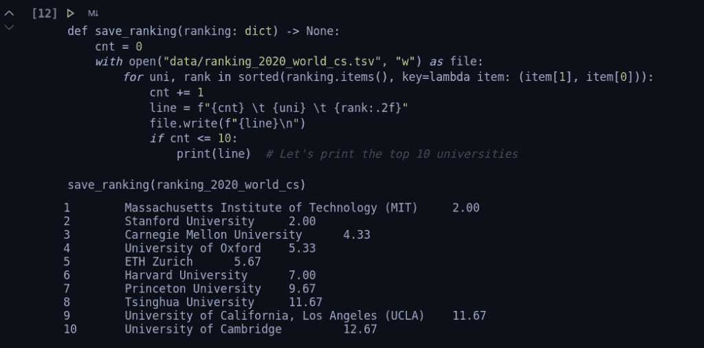

# 来自世界顶尖 CS 大学的 500 门免费计算机科学课程

> 原文：<https://www.freecodecamp.org/news/free-courses-top-cs-universities/>

每年，Class Central 都会发布世界上评分最高、最受欢迎的在线课程排名。

这些排名基于用户评级和总注册人数。你可以在这里看到完整的年度课程评分。

但是在本文中，我将采用一种不同的方法。我不会只显示顶级课程，我会告诉你哪些大学似乎有最好的课程，然后告诉你这些大学为学习计算机科学提供的所有免费在线课程。

## 方法学

我从三所领先的全球大学排名开始，看了他们最新的计算机科学排名:

*   [**QS**:2020 年世界大学排名——计算机科学&信息系统](https://www.topuniversities.com/university-rankings/university-subject-rankings/2020/computer-science-information-systems)
*   [**泰晤士高等教育**:2020 年世界大学排名—计算机科学](https://www.timeshighereducation.com/world-university-rankings/2020/subject-ranking/computer-science)
*   [**上海排名咨询**:2019 年世界大学学术排名——计算机科学&工程](http://www.shanghairanking.com/Shanghairanking-Subject-Rankings/computer-science-engineering.html)

我的方法很简单。首先，我将三个排名合并成一个，对三个排名中的每所大学的排名进行平均。

第二，我把名单限制在提供计算机科学在线课程的前 50 名机构。

第三，我利用 Class Central 的数据库建立了这些课程的列表。

[Combining rankings in Jupyter Notebook](https://github.com/manocormen/ranking-universities-2020-world-cs)

正如你在上面看到的，在综合排名中名列前茅的三所大学分别是第一名麻省理工学院、第二名斯坦福大学和第三名卡内基梅隆大学。如果你想看数据和我得到那个结果的过程，看看我的 [GitHub repo](https://github.com/manocormen/ranking-universities-2020-world-cs) 。

在汇编了每个大学的课程后，最终结果是 2020 年世界 50 所学习计算机科学最好的大学提供的 500 门在线课程的列表。

## 著名课程

不出所料，列表中的一些课程也是中央课堂有史以来最好的在线课程的一部分。你可以在下面找到这些。它们都是很好的选择，尤其是对新手来说，因为它们体现了在线教育所能提供的最好的东西。

*   [人人编程(Python 入门)](https://www.classcentral.com/course/python-4319)来自*密西根大学*★★★★(9662)
*   [机器学习](https://www.classcentral.com/course/machine-learning-835)来自*斯坦福大学*★★★★(358)
*   [计算机科学入门及使用 Python 编程](https://www.classcentral.com/course/edx-introduction-to-computer-science-and-programming-using-python-1341)来自*麻省理工*★★★☆(122)
*   [学习编程:多伦多*大学的基础*](https://www.classcentral.com/course/programming1-385)★★★★(105)
*   [CS50 的计算机科学入门](https://www.classcentral.com/course/edx-cs50-s-introduction-to-computer-science-442)来自*哈佛大学*★★★★(84)
*   [The Analytics Edge](https://www.classcentral.com/course/edx-the-analytics-edge-1623) 来自*麻省理工*★★★★(79)
*   [Python 和面向财务分析的统计](https://www.classcentral.com/course/python-statistics-financial-analysis-12648)来自*香港科技大学* ★★★★☆(71)
*   [Python I 中的计算:基础和过程化编程](https://www.classcentral.com/course/edx-computing-in-python-i-fundamentals-and-procedural-programming-11469)来自*佐治亚理工学院*★★★★(69)
*   [分而治之，排序搜索，随机化算法](https://www.classcentral.com/course/algorithms-divide-conquer-374)来自*斯坦福大学*★★★★(68)
*   [Scala 中的函数式编程原理](https://www.classcentral.com/course/progfun-422)来自*洛桑联邦理工学院*★★★★(66)
*   [密码学我](https://www.classcentral.com/course/crypto-616)来自*斯坦福大学*★★★★(51)
*   [用于数据科学的 Python](https://www.classcentral.com/course/edx-python-for-data-science-8209)来自*加州大学圣地亚哥分校*★★★☆(43)
*   [来自*密西根大学的 HTML5*](https://www.classcentral.com/course/introhtml-4307) 简介★★★☆(42)
*   [互联网历史、技术和安全](https://www.classcentral.com/course/insidetheinternet-335)来自*密西根大学*★★★★(39)

## 完整的课程列表

完整的列表被分成不同的主题。点击一个跳转到相关课程。同样在 [Class Central 的前 100 名排名](https://www.classcentral.com/collection/top-free-online-courses)中的课程标有一颗星(⭐).

*   [AI &机器学习](#ai-machine-learning-65-courses) (65 门课程)
*   [算法&数据结构](#algorithms-data-structures-60-courses) (60 门课程)
*   [生物信息学&医疗保健](#bioinformatics-healthcare-30-courses) (30 门课程)
*   [计算机科学](#computer-science-90-courses) (90 门课程)
*   [网络安全](#cybersecurity-22-courses) (22 门课程)
*   [数据科学](#data-science-109-courses) (109 门课程)
*   [编程语言](#programming-languages-60-courses) (60 门课程)
*   [软件开发](#software-development-57-courses) (57 门课程)
*   [量子计算](#quantum-computing-7-courses) (7 门课程)

有 500 道菜可供选择，希望你能找到自己喜欢的。但是如果这些还不够的话，你可以查看一下超过 15，000 门在线课程的目录。

### 人工智能和机器学习——65 门课程

*   [机器学习](https://www.classcentral.com/course/machine-learning-835)来自*斯坦福大学*★★★★(358)⭐
*   [机器学习基础:案例研究方法](https://www.classcentral.com/course/ml-foundations-4352)来自*华盛顿大学*★★★☆(38)
*   [CS188.1x:来自*加州大学柏克莱分校的人工智能*](https://www.classcentral.com/course/edx-cs188-1x-artificial-intelligence-445)★★★★(31)
*   [实用机器学习](https://www.classcentral.com/course/predmachlearn-1719)来自*约翰·霍普金斯大学* ★★★☆☆(26)
*   [人工智能入门](https://www.classcentral.com/course/udacity-introduction-to-artificial-intelligence-301)来自*斯坦福大学*★★★☆(24)
*   [机器人的人工智能](https://www.classcentral.com/course/udacity-artificial-intelligence-for-robotics-319)来自*史丹福大学*★★★★(23)
*   [机器学习课程简介](https://www.classcentral.com/course/udacity-introduction-to-machine-learning-course-2996)来自*斯坦福大学*★★★☆(19)
*   [机器学习:回归](https://www.classcentral.com/course/ml-regression-4289)来自*华盛顿大学*★★★★(19)
*   [概率图形模型 1:表示法](https://www.classcentral.com/course/probabilistic-graphical-models-309)来自*斯坦福大学*★★★☆(18)
*   [神经网络与深度学习](https://www.classcentral.com/course/neural-networks-deep-learning-9058)来自*Deep Learning . ai*★★★★(15)
*   [数据科学和分析的机器学习](https://www.classcentral.com/course/edx-machine-learning-for-data-science-and-analytics-4912)来自*哥伦比亚大学* ★★★☆☆(15)
*   [加州大学圣地亚哥分校*的大数据机器学习*](https://www.classcentral.com/course/machinelearningwithbigdata-4238)★★☆☆☆(13)
*   [人工智能(AI)](https://www.classcentral.com/course/edx-artificial-intelligence-ai-7230) 来自*哥大*★★★☆(10)
*   [机器学习](https://www.classcentral.com/course/edx-machine-learning-7231)来自*哥大*★★★☆(10)
*   [从数据中学习(机器学习入门课程)](https://www.classcentral.com/course/independent-learning-from-data-introductory-machine-learning-course-366)来自*加州理工*★★★★(10)
*   [机器学习的数学:多元微积分](https://www.classcentral.com/course/multivariate-calculus-machine-learning-10452)来自*伦敦帝国理工学院*★★★★(9)
*   [强化学习](https://www.classcentral.com/course/udacity-reinforcement-learning-1849)来自*布朗大学* ★★★☆☆(8)
*   [机器学习:分类](https://www.classcentral.com/course/ml-classification-4219)来自*华盛顿大学*★★★★(8)
*   [卷积神经网络](https://www.classcentral.com/course/convolutional-neural-networks-9057)来自*deep learning . ai*★★★★(8)
*   [金融领域的机器学习导览](https://www.classcentral.com/course/guided-tour-machine-learning-finance-11231)来自*纽约大学(NYU)*★☆☆☆(7)
*   [计算机视觉入门](https://www.classcentral.com/course/udacity-introduction-to-computer-vision-1022)来自*佐治亚理工学院*★★★★(7)
*   [机器学习](https://www.classcentral.com/course/udacity-machine-learning-1020)来自*佐治亚理工学院*★★★☆(6)
*   [用 Python 应用机器学习](https://www.classcentral.com/course/python-machine-learning-6673)来自*密西根大学*★★★☆(4)
*   [机器学习:聚类&检索](https://www.classcentral.com/course/ml-clustering-and-retrieval-4313)来自*华盛顿大学*★★★★(4)
*   [序列模型](https://www.classcentral.com/course/nlp-sequence-models-9055)来自*deep learning . ai*★★★★(4)
*   [结构化机器学习项目](https://www.classcentral.com/course/machine-learning-projects-9056)来自*deep Learning . ai*★★★★(3)
*   [概率图形模型 2:推论](https://www.classcentral.com/course/probabilistic-graphical-models-2-inferen-7292)来自*斯坦福大学*★★★☆(3)
*   [自主移动机器人](https://www.classcentral.com/course/edx-autonomous-mobile-robots-1564)来自 *ETH Zurich* ★★★☆☆(3)
*   [改进深度神经网络:超参数调优、正则化和优化](https://www.classcentral.com/course/deep-neural-network-9054)来自*Deep learning . ai*★★★★(3)
*   [机器学习:无监督学习](https://www.classcentral.com/course/udacity-machine-learning-unsupervised-learning-1848)来自*布朗大学* ★★★☆☆(3)
*   [加州大学圣地亚哥分校*的机器学习基础*](https://www.classcentral.com/course/edx-machine-learning-fundamentals-8216)★★★☆(3)
*   [实用预测分析:模型和方法](https://www.classcentral.com/course/datasci2-4341)来自*华盛顿大学*★★☆☆(3)
*   [机器学习数学:PCA](https://www.classcentral.com/course/pca-machine-learning-10451) 来自*伦敦帝国理工学院* ★★☆☆☆(3)
*   [机器人:感知](https://www.classcentral.com/course/robotics-perception-5033)来自*宾夕法尼亚大学* ★★★☆☆(3)
*   [基于知识的人工智能:认知系统](https://www.classcentral.com/course/udacity-knowledge-based-ai-cognitive-systems-1025)来自*佐治亚理工学院* ★★★☆☆(2)
*   [金融强化学习](https://www.classcentral.com/course/reinforcement-learning-in-finance-11239)来自*纽约大学(NYU)*★☆☆☆(2)
*   [6。S094:自动驾驶汽车深度学习](https://www.classcentral.com/course/independent-6-s094-deep-learning-for-self-driving-cars-8132)来自*麻省理工*★★★☆(2)
*   [6。S191:深度学习简介](https://www.classcentral.com/course/independent-6-s191-introduction-to-deep-learning-8083)来自*麻省理工*★★★☆(2)
*   [应用 Python 中的文本挖掘](https://www.classcentral.com/course/python-text-mining-6672)来自*密西根大学* ★★☆☆☆(2)
*   [金融学强化学习高级方法概述](https://www.classcentral.com/course/advanced-methods-reinforcement-learning--11240)来自*纽约大学(NYU)*★☆☆☆(1)
*   [金融中的机器学习基础](https://www.classcentral.com/course/fundamentals-machine-learning-in-finance-11226)来自*纽约大学(NYU)*★☆☆☆(1)
*   [自然语言处理深度学习](https://www.classcentral.com/course/independent-deep-learning-for-natural-language-processing-8097)来自*牛津大学*★★★★(1)
*   [来自多伦多*大学*的自动驾驶汽车介绍](https://www.classcentral.com/course/intro-self-driving-cars-13140)
*   [多伦多大学*的*](https://www.classcentral.com/course/state-estimation-localization-self-drivi-13138)自动驾驶汽车的状态估计和定位
*   [自动驾驶汽车的运动规划](https://www.classcentral.com/course/motion-planning-self-driving-cars-13134)来自*多伦多大学*
*   [自动驾驶汽车的视觉感知](https://www.classcentral.com/course/visual-perception-self-driving-cars-13136)来自*多伦多大学*
*   [【新】机器人学:视觉智能和机器学习](https://www.classcentral.com/course/edx-robotics-vision-intelligence-and-machine-learning-8203)来自*宾夕法尼亚大学*
*   [Python 项目:pillow、tesseract 和 opencv](https://www.classcentral.com/course/python-project-12554) 来自*密西根大学*
*   [【新】TensorFlow 2 入门](https://www.classcentral.com/course/getting-started-with-tensor-flow2-19150)来自*伦敦帝国理工学院*
*   [【新】CS50 用 Python 介绍人工智能](https://www.classcentral.com/course/edx-cs50-s-introduction-to-artificial-intelligence-with-python-18122)来自*哈佛大学*
*   [概率图形模型 3:向*斯坦福大学*学习](https://www.classcentral.com/course/probabilistic-graphical-models-3-learnin-7293)
*   [投资技术的创新:来自*密西根大学*的人工智能](https://www.classcentral.com/course/investing-technology-19058)
*   [人工智能](https://www.classcentral.com/course/udacity-artificial-intelligence-8565)来自*佐治亚理工学院*
*   [FA18:机器学习](https://www.classcentral.com/course/edx-fa18-machine-learning-9695)来自*佐治亚理工学院*
*   [计算机辅助翻译原理与实践计算机辅助翻译的原理与实践](https://www.classcentral.com/course/catmooc-2354)来自*北京大学*
*   [用 Python 进行机器学习——从线性模型到深度学习](https://www.classcentral.com/course/edx-machine-learning-with-python-from-linear-models-to-deep-learning-11483)来自*麻省理工*
*   [数据科学基础:预测和机器学习](https://www.classcentral.com/course/edx-foundations-of-data-science-prediction-and-machine-learning-10320)来自*加州大学伯克利分校*
*   [数据产品的设计思维和预测分析](https://www.classcentral.com/course/design-thinking-predictive-analytics-dat-13492)来自*加州大学圣地亚哥分校*
*   [部署机器学习模型](https://www.classcentral.com/course/deploying-machine-learning-models-13493)来自*加州大学圣地亚哥分校*
*   [FA17:机器学习](https://www.classcentral.com/course/edx-fa17-machine-learning-8995)来自*佐治亚理工学院*
*   [用 Python 进行会计机器学习](https://www.classcentral.com/course/machine-learning-accounting-python-18078)来自*伊利诺伊大学厄巴纳-香槟分校*
*   [伊利诺伊大学厄巴纳-香槟分校*的会计数据分析基础 II*](https://www.classcentral.com/course/data-analytics-accountancy-2-10515)
*   [机器学习](https://www.classcentral.com/course/edx-machine-learning-15170)来自*德克萨斯大学奥斯丁分校*
*   [大数据机器学习|大数据机器学习](https://www.classcentral.com/course/edx--big-data-machine-learning-12739)来自*清华*
*   [统计机器学习](https://www.classcentral.com/course/independent-statistical-machine-learning-8509)来自*卡耐基梅隆大学*

### 算法与数据结构——60 门课程

*   [分而治之，排序搜索，随机化算法](https://www.classcentral.com/course/algorithms-divide-conquer-374)出自*斯坦福大学*★★★★(68)⭐
*   [算法，第一部分](https://www.classcentral.com/course/algs4partI-339)来自*普林斯顿大学*★★★★(60)
*   [加州大学圣地亚哥分校*的算法工具箱*](https://www.classcentral.com/course/algorithmic-toolbox-5471)★★★☆(23)
*   [算法，第二部分](https://www.classcentral.com/course/algs4partII-340)来自*普林斯顿大学*★★★★(21)
*   [自动机理论](https://www.classcentral.com/course/stanford-openedx-automata-theory-376)来自*斯坦福大学*★★★☆(20)
*   [文字检索和搜索引擎](https://www.classcentral.com/course/textretrieval-2734)来自*伊利诺伊大学香槟分校* ★★★☆☆(14)
*   [计算机程序设计](https://www.classcentral.com/course/udacity-design-of-computer-programs-323)来自*斯坦福大学*★★★☆(13)
*   [如何编码:简单数据](https://www.classcentral.com/course/edx-how-to-code-simple-data-3465)来自*英属哥伦比亚大学*★★★☆(12)
*   [数据结构](https://www.classcentral.com/course/data-structures-5475)来自*加州大学圣地亚哥分校*★★★☆(8)
*   [数据结构和性能](https://www.classcentral.com/course/data-structures-optimizing-performance-4203)来自*加州大学圣地亚哥分校*★★★☆(6)
*   [数据结构:来自加州大学圣地亚哥分校*的一种主动学习方法*](https://www.classcentral.com/course/edx-data-structures-an-active-learning-approach-10436)★★★★(5)
*   [计算结构 1:数字电路](https://www.classcentral.com/course/edx-computation-structures-1-digital-circuits-3041)来自*麻省理工*★★★☆(5)
*   [字符串上的算法](https://www.classcentral.com/course/algorithms-on-strings-5470)来自*加州大学圣地亚哥分校* ★★★☆☆(4)
*   [算法分析](https://www.classcentral.com/course/aofa-921)来自*普林斯顿大学*★★★★(4)
*   [编程语言，B 部分](https://www.classcentral.com/course/programming-languages-part-b-6920)来自华盛顿*大学*★★★☆(3)
*   [图的算法](https://www.classcentral.com/course/algorithms-on-graphs-5479)来自*加州大学圣地亚哥分校*★★★☆(2)
*   [计算的美丽和快乐——AP CS 原理第 1 部分](https://www.classcentral.com/course/edx-the-beauty-and-joy-of-computing-ap-cs-principles-part-1-2525)来自*加州大学伯克利分校*★★★★(2)
*   [算法设计和技术](https://www.classcentral.com/course/edx-algorithmic-design-and-techniques-10241)来自*加州大学圣地亚哥分校* ★★★☆☆(2)
*   [编程语言，C 部分](https://www.classcentral.com/course/programming-languages-part-c-7187)来自华盛顿*大学*★★★☆(2)
*   [如何编码:复杂数据](https://www.classcentral.com/course/edx-how-to-code-complex-data-3464)来自*英属哥伦比亚大学*★★★★(2)
*   [计算结构 2:计算机架构](https://www.classcentral.com/course/edx-computation-structures-2-computer-architecture-4810)来自*麻省理工*★★★☆(1)
*   [算法设计与分析](https://www.classcentral.com/course/edx-algorithm-design-and-analysis-8520)来自*宾夕法尼亚大学*★★★☆(1)
*   [高级算法和复杂性](https://www.classcentral.com/course/advanced-algorithms-and-complexity-5474)来自*加州大学圣地亚哥分校* ★★★☆☆(1)
*   [可计算性、复杂性&算法](https://www.classcentral.com/course/udacity-computability-complexity-algorithms-1024)来自*佐治亚理工学院*★★★★(1)
*   [数据结构与算法设计（下)|数据结构与算法设计第二部分](https://www.classcentral.com/course/edx---data-structures-and-algorithm-design-part-ii-5720)来自*清华*★★★★(1)
*   [算法:设计和分析，第一部分](https://www.classcentral.com/course/edx-algorithms-design-and-analysis-part-1-8984)来自*史丹福大学*
*   [图搜索、最短路径和数据结构](https://www.classcentral.com/course/algorithms-graphs-data-structures-7354)来自*斯坦福大学*
*   [算法:设计和分析，第二部分](https://www.classcentral.com/course/stanford-openedx-algorithms-design-and-analysis-part-2-9250)来自*斯坦福大学*
*   [贪婪算法、最小生成树和动态规划](https://www.classcentral.com/course/algorithms-greedy-7350)来自*斯坦福大学*
*   [最短路径重访，NP 完全问题及其对策](https://www.classcentral.com/course/algorithms-npcomplete-7351)来自*史丹福大学*
*   [计算结构 3:计算机组织](https://www.classcentral.com/course/edx-computation-structures-3-computer-organization-6245)来自*麻省理工*
*   [数据结构和软件设计](https://www.classcentral.com/course/edx-data-structures-and-software-design-8517)来自*宾夕法尼亚大学*
*   [计算的美丽和快乐(计算机科学原理)，第 4 部分](https://www.classcentral.com/course/edx-the-beauty-and-joy-of-computing-cs-principles-part-4-2543)来自*加州大学柏克莱分校*
*   [计算的美丽和快乐(CS 原理)，第 1 部分](https://www.classcentral.com/course/edx-the-beauty-and-joy-of-computing-cs-principles-part-1-2528)来自*加州大学柏克莱分校*
*   [计算的美丽和快乐(CS 原理)，第 3 部分](https://www.classcentral.com/course/edx-the-beauty-and-joy-of-computing-cs-principles-part-3-2548)来自*加州大学柏克莱分校*
*   [计算的美丽和快乐——AP CS 原理第二部分](https://www.classcentral.com/course/edx-the-beauty-and-joy-of-computing-ap-cs-principles-part-2-2532)来自*加州大学柏克莱分校*
*   [数据结构基础](https://www.classcentral.com/course/edx-data-structures-fundamentals-10246)来自*加州大学圣地亚哥分校*
*   [图算法](https://www.classcentral.com/course/edx-graph-algorithms-10247)来自*加州大学圣地亚哥分校*
*   [字符串处理和模式匹配算法](https://www.classcentral.com/course/edx-string-processing-and-pattern-matching-algorithms-10248)来自*加州大学圣地亚哥分校*
*   [NP-Complete 问题](https://www.classcentral.com/course/edx-np-complete-problems-10275)来自*加州大学圣地亚哥分校*
*   [研究生算法简介](https://www.classcentral.com/course/udacity-introduction-to-graduate-algorithms-10625)来自*佐治亚理工学院*
*   [高性能计算](https://www.classcentral.com/course/udacity-high-performance-computing-1028)来自*佐治亚理工学院*
*   [计算机科学:算法、理论和机器](https://www.classcentral.com/course/computerscience2-10671)来自*普林斯顿大学*
*   [无序数据结构](https://www.classcentral.com/course/cs-fundamentals-3-14487)来自*伊利诺伊大学香槟分校*
*   [c++中面向对象的数据结构](https://www.classcentral.com/course/cs-fundamentals-1-14489)来自*伊利诺伊大学香槟分校*
*   [有序数据结构](https://www.classcentral.com/course/cs-fundamentals-2-14488)来自*伊利诺伊大学香槟分校*
*   [离散优化算法篇离散优化求解算法](https://www.classcentral.com/course/lisan-youhua-suanfapian-11217)来自*香港中文大学*
*   [求解离散优化的算法](https://www.classcentral.com/course/solving-algorithms-discrete-optimization-11219)来自*墨尔本大学*
*   [墨尔本*大学*的](https://www.classcentral.com/course/advancedmodeling-7757)离散优化高级建模
*   [离散优化基础建模](https://www.classcentral.com/course/basic-modeling-7759)来自*墨尔本大学*
*   [数据结构与算法，第二部分](https://www.classcentral.com/course/edx-data-structures-and-algorithms-part-2-2693)来自*北京大学*
*   [数据结构与算法(一)part 1](https://www.classcentral.com/course/edx--a-part-1-2156) 来自*北大*
*   [算法设计与分析算法设计与分析](https://www.classcentral.com/course/algorithms-3230)来自*北京大学*
*   [算法的高级设计和分析算法设计与分析（高级)](https://www.classcentral.com/course/edx-advanced-design-and-analysis-of-algorithms---6364)来自*北大*
*   [算法基础](https://www.classcentral.com/course/suanfa-jichu-4306)来自*北京大学*
*   [算法基础来自*北京大学*的基础算法](https://www.classcentral.com/course/edx--fundamental-algorithms-3244)
*   [Advanced data structure and algorithm](https://www.classcentral.com/course/spdsalgo2-2762) From *Peking University*
*   [理论计算机科学导论理论计算机科学基础](https://www.classcentral.com/course/edx-introduction-to-theoretical-computer-science--2436)来自*北京大学*
*   [数据结构与算法设计（上)|数据结构与算法设计第一部分](https://www.classcentral.com/course/edx---data-structures-and-algorithm-design-part-i-1646)来自*清华*
*   [离散数学](https://www.classcentral.com/course/discrete-mathematics-8133)来自*上海交通大学*

### 生物信息学和医疗保健— 30 门课程

*   [发现 DNA 中隐藏的信息(生物信息学 I)](https://www.classcentral.com/course/hiddenmessages-3289) 来自*加州大学圣地亚哥分校*★★★★(17)
*   [dco 042-Python For Informatics](https://www.classcentral.com/course/independent-dco042-python-for-informatics-1010)来自*密西根大学*★★★★(14)
*   [基因组数据科学的 Python](https://www.classcentral.com/course/genpython-3476)来自*约翰霍普金斯大学* ★★☆☆☆(12)
*   [生物学遇上编程:初学者的生物信息学](https://www.classcentral.com/course/bioinformatics-745)来自*加州大学圣地亚哥分校*★★★☆(8)
*   [基因组测序(生物信息学 II)](https://www.classcentral.com/course/assembly-3290) 来自*加州大学圣地亚哥分校*★★★★(4)
*   [数量生物学工作坊](https://www.classcentral.com/course/edx-quantitative-biology-workshop-1984)来自*麻省理工*★★★★(2)
*   [比较基因、蛋白质和基因组(生物信息学 III)](https://www.classcentral.com/course/comparinggenomes-3291) 来自*加州大学圣地亚哥分校*★★★★(2)
*   [基因组数据科学与聚类(生物信息学 V)](https://www.classcentral.com/course/clustering-3556) 来自*加州大学圣地亚哥分校*★★★☆(2)
*   [HI-FIVE:健康信息学创新，价值&浓缩(临床视角)](https://www.classcentral.com/course/hi-five-clinical-7456)来自*哥大*★☆☆☆(1)
*   [HI-FIVE:健康信息学促进创新，价值&丰富(行政/IT 视角)](https://www.classcentral.com/course/hi-five-admin-it-8099)来自*哥大*★★★★(1)
*   [云中的健康信息学](https://www.classcentral.com/course/udacity-health-informatics-in-the-cloud-3288)来自*佐治亚理工学院*★★★☆(1)
*   [动态编程:在机器学习和基因组学中的应用](https://www.classcentral.com/course/edx-dynamic-programming-applications-in-machine-learning-and-genomics-10249)来自*加州大学圣地亚哥分校*
*   [加州大学圣地亚哥分校*的算法和数据结构顶点*](https://www.classcentral.com/course/edx-algorithms-and-data-structures-capstone-10178)
*   [基因组数据科学简介](https://www.classcentral.com/course/edx-introduction-to-genomic-data-science-8962)来自*加州大学圣地亚哥分校*
*   [基因组测序中的图形算法](https://www.classcentral.com/course/edx-graph-algorithms-in-genome-sequencing-10250)来自*加州大学圣地亚哥分校*
*   [发现 DNA 和蛋白质的突变(生物信息学 VI)](https://www.classcentral.com/course/mutations-3557) 来自*加州大学圣地亚哥分校*
*   [分子进化(生物信息学 IV)](https://www.classcentral.com/course/molecularevolution-3555) 来自*加州大学圣地亚哥分校*
*   [来自多伦多*大学*的植物生物信息学顶点](https://www.classcentral.com/course/plant-bioinformatics-capstone-17158)
*   [植物生物信息学](https://www.classcentral.com/course/plant-bioinformatics-12753)来自*多伦多大学*
*   生物信息学:介绍和方法生物信息学：导论与方法来自*北京大学*
*   [Bioinformatics: Introduction and Methods](https://www.classcentral.com/course/sheng-wu-xin-xi-xue-4361) From *Peking University*
*   [提高医疗质量的全球健康信息学](https://www.classcentral.com/course/edx-global-health-informatics-to-improve-quality-of-care-7886)来自*麻省理工学院*
*   [引领健康信息学的变革](https://www.classcentral.com/course/leading-change-health-informatics-12858)来自*约翰·霍普金斯大学*
*   [健康信息学的社会和技术背景](https://www.classcentral.com/course/the-socio-technical-health-informatics-c-12789)来自*约翰·霍普金斯大学*
*   [健康信息学的数据科学](https://www.classcentral.com/course/the-data-science-of-health-informatics-12856)来自*约翰·霍普金斯大学*
*   [健康信息学的成果和干预](https://www.classcentral.com/course/the-outcomes-and-interventions-of-health-12855)来自*约翰·霍普金斯大学*
*   [HI-FIVE:健康信息促进创新，价值&丰富(社会/同伴视角)](https://www.classcentral.com/course/hi-five-social-peer-8303)来自*哥大*
*   [健康信息学:当前和历史观点](https://www.classcentral.com/course/edx-health-informatics-a-current-and-historical-perspective-13541)来自*佐治亚理工学院*
*   [健康信息学:尖端](https://www.classcentral.com/course/edx-health-informatics-the-cutting-edge-13543)来自*佐治亚理工学院*
*   [健康信息学:数据和互操作性标准](https://www.classcentral.com/course/edx-health-informatics-data-and-interoperability-standards-13542)来自*佐治亚理工学院*

### 计算机科学— 90 门课程

*   [用 Python 使用数据库](https://www.classcentral.com/course/python-databases-4272)来自*密西根大学*★★★★(1570)
*   [计算机科学入门及使用 Python 编程](https://www.classcentral.com/course/edx-introduction-to-computer-science-and-programming-using-python-1341)来自*麻省理工学院*★★★☆(122)⭐
*   [CS50 的计算机科学入门](https://www.classcentral.com/course/edx-cs50-s-introduction-to-computer-science-442)来自*哈佛大学*★★★★(84)⭐
*   [Scala 中的函数式编程原理](https://www.classcentral.com/course/progfun-422)来自*洛桑联邦理工学院*★★★★(66)⭐
*   [互联网历史、技术和安全](https://www.classcentral.com/course/insidetheinternet-335)来自*密执安大学*★★★★(39)⭐
*   [计算机科学 101](https://www.classcentral.com/course/edx-computer-science-101-2175) 来自*斯坦福大学*★★★☆(17)
*   [计算机网络入门](https://www.classcentral.com/course/stanford-openedx-introduction-to-computer-networking-1578)来自*斯坦福大学*★★★★(12)
*   [硬件安全](https://www.classcentral.com/course/hardwaresec-1729)来自*马里兰大学，学院园区* ★★★☆☆(11)
*   [可用证券](https://www.classcentral.com/course/usablesec-1727)来自*马里兰大学，学院公园* ★★★☆☆(9)
*   [云计算应用，第 1 部分:云系统和基础设施](https://www.classcentral.com/course/cloud-applications-part1-2738)来自*伊利诺伊大学香槟分校* ★★★☆☆(8)
*   [软件定义的网络](https://www.classcentral.com/course/sdn-489)来自*普林斯顿大学*★★★☆(7)
*   [计算机图形学](https://www.classcentral.com/course/edx-computer-graphics-548)来自*加州大学圣地亚哥分校*★★★☆(6)
*   [计算机架构](https://www.classcentral.com/course/comparch-342)来自*普林斯顿大学*★★★☆(6)
*   [物联网:我们是如何走到这一步的？](https://www.classcentral.com/course/internet-of-things-history-4276)来自*加州大学圣地亚哥分校* ★★☆☆☆(6)
*   [Ruby on Rails Web 服务和与 MongoDB 的集成](https://www.classcentral.com/course/ruby-on-rails-web-services-mongodb-4321)来自*约翰·霍普金斯大学*★★★★(6)
*   [计算机网络](https://www.classcentral.com/course/udacity-computer-networking-2336)来自*佐治亚理工学院*★★★☆(6)
*   [数据科学和分析的使能技术:物联网](https://www.classcentral.com/course/edx-enabling-technologies-for-data-science-and-analytics-the-internet-of-things-4911)来自*哥伦比亚大学*★☆☆☆(5)
*   [Java 中的软件构造](https://www.classcentral.com/course/edx-software-construction-in-java-6469)来自*麻省理工*★★★★(5)
*   [来自*佐治亚理工学院的高级操作系统*](https://www.classcentral.com/course/udacity-advanced-operating-systems-1016)★★★★(5)
*   [动画和 CGI 动作](https://www.classcentral.com/course/edx-animation-and-cgi-motion-7242)来自*哥大*★★★☆(4)
*   [计算机架构介绍](https://www.classcentral.com/course/independent-introduction-to-computer-architecture-642)来自*卡耐基梅隆大学*★★★★(4)
*   [Rails 有活动记录和动作包](https://www.classcentral.com/course/rails-with-active-record-4197)来自*约翰霍普金斯大学*★★★☆(4)
*   [物联网:建立您的 DragonBoard 开发平台](https://www.classcentral.com/course/internet-of-things-dragonboard-4260)来自*加州大学圣地亚哥分校* ★★★☆☆(4)
*   [物联网:通信技术](https://www.classcentral.com/course/internet-of-things-communication-4173)来自*加州大学圣地亚哥分校* ★★★☆☆(3)
*   [使用 Python 计算入门](https://www.classcentral.com/course/edx-introduction-to-computing-using-python-7622)来自*佐治亚理工学院*★★★★(3)
*   [网络画报:没有微积分的原理](https://www.classcentral.com/course/ni-891)来自*普林斯顿大学*★★★☆(3)
*   [计算概率与推论](https://www.classcentral.com/course/edx-computational-probability-and-inference-6830)来自*麻省理工*★★★☆(3)
*   [编译人员](https://www.classcentral.com/course/edx-compilers-2716)来自*史丹福大学*★★★☆(2)
*   [来自加州大学圣地亚哥分校*的 Java 高级数据结构*](https://www.classcentral.com/course/advanced-data-structures-4346)★★★☆(2)
*   [软件架构&设计](https://www.classcentral.com/course/udacity-software-architecture-design-3418)来自*佐治亚理工学院*★★★★(2)
*   [操作系统介绍](https://www.classcentral.com/course/udacity-introduction-to-operating-systems-3419)来自*佐治亚理工学院*★★★★(2)
*   [网络:朋友、金钱和字节](https://www.classcentral.com/course/friendsmoneybytes-359)来自*普林斯顿大学*★★★☆(2)
*   [软件开发顶点项目](https://www.classcentral.com/course/edx-software-development-capstone-project-8198)来自*不列颠哥伦比亚大学*★☆☆☆(2)
*   [Unix 工作台](https://www.classcentral.com/course/unix-8866)来自*约翰·霍普金斯大学*★★★☆(2)
*   [CS50 的 AP 计算机科学原理](https://www.classcentral.com/course/edx-cs50-s-ap-computer-science-principles-7017)来自*哈佛大学*★★★★(1)
*   [CS50 的理解技术](https://www.classcentral.com/course/edx-cs50-s-understanding-technology-10142)来自*哈佛大学*★★★★(1)
*   [CS50 的商业人士计算机科学](https://www.classcentral.com/course/edx-cs50-s-computer-science-for-business-professionals-10143)来自*哈佛大学*★★★★(1)
*   [建模与仿真的计算思维](https://www.classcentral.com/course/edx-computational-thinking-for-modeling-and-simulation-12764)来自*麻省理工* ★★☆☆☆(1)
*   [高性能计算机架构](https://www.classcentral.com/course/udacity-high-performance-computer-architecture-1018)来自*佐治亚理工学院*★★★★(1)
*   [计算摄影](https://www.classcentral.com/course/udacity-computational-photography-1023)来自*佐治亚理工学院*★★★☆(1)
*   [软件工程:简介](https://www.classcentral.com/course/edx-software-engineering-introduction-8205)来自*英属哥伦比亚大学*★★★★(1)
*   [软件构造:面向对象设计](https://www.classcentral.com/course/edx-software-construction-object-oriented-design-8201)来自*不列颠哥伦比亚大学* ★★☆☆☆(1)
*   [软件构建:数据抽象](https://www.classcentral.com/course/edx-software-construction-data-abstraction-8200)来自*英属哥伦比亚大学* ★★★☆☆(1)
*   [自然，编码:JavaScript 中的生物学](https://www.classcentral.com/course/edx-nature-in-code-biology-in-javascript-6881)【来自洛桑联邦理工学院】【1】
*   [计算:艺术、魔法、科学](https://www.classcentral.com/course/edx-computing-art-magic-science-2195)来自*ETH Zurich*★★★☆(1)
*   [结构化查询语言(SQL)简介](https://www.classcentral.com/course/intro-sql-9567)来自*密西根大学*★★★★(1)
*   [数据库系统概念&设计](https://www.classcentral.com/course/udacity-database-systems-concepts-design-8573)来自*佐治亚理工学院*★★★☆(1)
*   [数据库系统概念和设计](https://www.classcentral.com/course/edx-database-systems-concepts-and-design-8994)来自*佐治亚理工学院*
*   [嵌入式系统](https://www.classcentral.com/course/udacity-embedded-systems-8571)来自*佐治亚理工学院*
*   [CS50 给律师](https://www.classcentral.com/course/edx-cs50-for-lawyers-16857)来自*哈佛大学*
*   [计算原理](https://www.classcentral.com/course/stanford-openedx-principles-of-computing-6114)来自*斯坦福大学*
*   [黑客工具](https://www.classcentral.com/course/independent-hacker-tools-13160)来自*麻省理工*
*   [Java 高级软件构造](https://www.classcentral.com/course/edx-advanced-software-construction-in-java-6475)来自*麻省理工*
*   [解决问题的计算思维](https://www.classcentral.com/course/computational-thinking-problem-solving-12278)来自*宾夕法尼亚大学*
*   [编者:理论与实践](https://www.classcentral.com/course/udacity-compilers-theory-and-practice-8572)来自*佐治亚理工学院*
*   [人机交互 I:基础&设计原理](https://www.classcentral.com/course/edx-human-computer-interaction-i-fundamentals-design-principles-14444)来自*佐治亚理工学院*
*   [无障碍游戏化](https://www.classcentral.com/course/edx-accessible-gamification-9485)来自*佐治亚理工学院*
*   [人机交互 II:认知、语境&文化](https://www.classcentral.com/course/edx-human-computer-interaction-ii-cognition-context-culture-14445)来自*佐治亚理工学院*
*   [人机交互 III:伦理，需求发现&原型](https://www.classcentral.com/course/edx-human-computer-interaction-iii-ethics-needfinding-prototyping-14446)来自*佐治亚理工学院*
*   [GT -进修-高级操作系统](https://www.classcentral.com/course/udacity-gt-refresher-advanced-os-4734)来自*佐治亚理工学院*
*   [人机交互 IV:评估，敏捷方法&超越](https://www.classcentral.com/course/edx-human-computer-interaction-iv-evaluation-agile-methods-beyond-14447)来自*佐治亚理工学院*
*   [计算机科学:有目的的编程](https://www.classcentral.com/course/cs-programming-java-13151)来自*普林斯顿大学*
*   [离散优化建模基础篇离散优化基础建模](https://www.classcentral.com/course/lisan-youhua-jianmo-jichupian-7772)来自*香港中文大学*
*   [离散优化建模高阶篇离散优化高级建模](https://www.classcentral.com/course/lisan-youhua-jianmo-gaojiepian-7775)来自*香港中文大学*
*   [Operating system and virtualization security](https://www.classcentral.com/course/osvirtsecurity-2348) from *Peking University*
*   [操作系统原理(操作系统)](https://www.classcentral.com/course/os-3229)来自*北大*
*   [计算机组成来自*北京大学*的计算机组织](https://www.classcentral.com/course/pkuco-2351)
*   [数据结构基础](https://www.classcentral.com/course/spdsalgo-2761)来自*北京大学*
*   [LAFF——关于高性能编程](https://www.classcentral.com/course/edx-laff-on-programming-for-high-performance-13675)来自*德克萨斯大学奥斯丁分校*
*   [LAFF——关于正确性编程](https://www.classcentral.com/course/edx-laff-on-programming-for-correctness-7852)来自*德克萨斯大学奥斯丁分校*
*   [计算几何|计算几何](https://www.classcentral.com/course/edx--computational-geometry-5434)来自*清华*
*   [【新】生成造型](https://www.classcentral.com/course/edx-generative-modelling-17216)来自*新加坡国立大学*
*   [【新】表演造型](https://www.classcentral.com/course/edx-performative-modelling-17217)来自*新加坡国立大学*
*   [程序建模](https://www.classcentral.com/course/edx-procedural-modelling-17212)来自*新加坡国立大学*
*   [来自*纽约大学(NYU)* 的计算和编程基础](https://www.classcentral.com/course/edx-basics-of-computing-and-programming-17997)
*   [电脑硬件和操作系统](https://www.classcentral.com/course/edx-computer-hardware-and-operating-systems-17998)来自*纽大(NYU)*
*   [计算:艺术、魔法、科学——第二部分](https://www.classcentral.com/course/edx-computing-art-magic-science-part-ii-4084)来自*苏黎世联邦理工学院*
*   [物联网 V2:设置和使用云服务](https://www.classcentral.com/course/internet-of-things-cloud-services-versio-10378)来自*加州大学圣地亚哥分校*
*   [物联网:设备的感应和驱动](https://www.classcentral.com/course/internet-of-things-sensing-actuation-4182)来自*加州大学圣地亚哥分校*
*   [物联网:设备的感应和驱动](https://www.classcentral.com/course/internet-of-things-sensing-actuation-4182)来自*加州大学圣地亚哥分校*
*   [V2 物联网:DragonBoard 培养和社区生态系统](https://www.classcentral.com/course/internet-of-things-dragonboard-version2-10379)来自*加州大学圣地亚哥分校*
*   [物联网:多媒体技术](https://www.classcentral.com/course/internet-of-things-multimedia-4237)来自*加州大学圣地亚哥分校*
*   [信息物理系统设计&分析](https://www.classcentral.com/course/udacity-cyber-physical-systems-design-analysis-10473)来自*佐治亚理工学院*
*   [信息和通信技术(ICT)无障碍](https://www.classcentral.com/course/edx-information-and-communication-technology-ict-accessibility-5898)来自*佐治亚理工学院*
*   [投资组合管理，治理，&*华盛顿大学*的项目管理办公室](https://www.classcentral.com/course/edx-portfolio-management-governance-the-pmo-8590)
*   [IT 行业 PM 从业者的领导和管理](https://www.classcentral.com/course/edx-leadership-and-management-for-pm-practitioners-in-it-8589)来自*华盛顿大学*
*   [信息系统审计、控制和保证](https://www.classcentral.com/course/information-systems-audit-17979)来自*香港科技大学*
*   T0T 网络管理:从理论到实践 t1from T2T singhua university T3
*   [网络入门](https://www.classcentral.com/course/edx-introduction-to-networking-17999)来自*纽大(NYU)*
*   [iLabX——来自*慕尼黑工业大学*的互联网大师班](https://www.classcentral.com/course/edx-ilabx-the-internet-masterclass-13734)

### 网络安全——22 门课程

*   [密码学我](https://www.classcentral.com/course/crypto-616)来自*斯坦福大学*★★★★(51)⭐
*   [软件安全](https://www.classcentral.com/course/software-security-1728)来自*马里兰大学，学院公园*★★★☆(27)
*   [比特币和加密货币技术](https://www.classcentral.com/course/bitcointech-3655)来自*普林斯顿大学*★★★☆(18)
*   [密码学](https://www.classcentral.com/course/cryptography-1730)来自*马里兰大学，学院公园*★★★☆(8)
*   [信息安全简介](https://www.classcentral.com/course/udacity-intro-to-information-security-3420)来自*佐治亚理工学院*★★☆☆(2)
*   [比特币和加密货币](https://www.classcentral.com/course/edx-bitcoin-and-cryptocurrencies-11417)来自*加州大学伯克利分校*★★★★(1)
*   [网络物理系统安全](https://www.classcentral.com/course/udacity-cyber-physical-systems-security-8569)来自*佐治亚理工学院*
*   [寻找你的网络安全职业道路](https://www.classcentral.com/course/edx-finding-your-cybersecurity-career-path-8654)来自*华盛顿大学*
*   [构建网络安全工具包](https://www.classcentral.com/course/edx-building-a-cybersecurity-toolkit-8653)来自*华府大学*
*   [网络安全:CISO 的观点](https://www.classcentral.com/course/edx-cybersecurity-the-ciso-s-view-8652)来自*华盛顿大学*
*   [网络安全介绍](https://www.classcentral.com/course/edx-introduction-to-cybersecurity-8651)来自*华府大学*
*   [网络攻击对策](https://www.classcentral.com/course/cyber-attack-countermeasures-9666)来自*纽约大学(NYU)*
*   [网络攻击简介](https://www.classcentral.com/course/intro-cyber-attacks-9667)来自*纽约大学(NYU)*
*   [企业和基础设施安全](https://www.classcentral.com/course/enterprise-infrastructure-security-9861)来自*纽约大学(NYU)*
*   [加密货币和区块链:数字货币简介](https://www.classcentral.com/course/wharton-cryptocurrency-blockchain-introd-13733)来自*宾夕法尼亚大学*
*   [加密货币和区块链技术讲解](https://www.classcentral.com/course/blockchain-cryptocurrencies-19056)来自*密西根大学*
*   [区块链和加密货币讲解](https://www.classcentral.com/course/crypto-finance-18184)来自*密西根大学*
*   [区块链技术](https://www.classcentral.com/course/edx-blockchain-technology-11428)来自*加州大学柏克莱分校*
*   [数论和密码学](https://www.classcentral.com/course/number-theory-cryptography-9210)来自*加州大学圣地亚哥分校*
*   [量子密码术](https://www.classcentral.com/course/edx-quantum-cryptography-6334)来自*加州理工学院*
*   [网络安全](https://www.classcentral.com/course/udacity-network-security-8570)来自*佐治亚理工学院*
*   [实时网络威胁检测和缓解](https://www.classcentral.com/course/real-time-cyber-threat-detection-9668)来自*纽约大学(NYU)*

### 数据科学— 109 门课程

*   [R 编程](https://www.classcentral.com/course/rprog-1713)来自*约翰·霍普金斯大学* ★★★☆☆(241)
*   [数据科学家的工具箱](https://www.classcentral.com/course/datascitoolbox-1712)来自*约翰·霍普金斯大学* ★★★☆☆(162)
*   [The Analytics Edge](https://www.classcentral.com/course/edx-the-analytics-edge-1623) 来自*麻省理工学院*★★★★(79)⭐
*   [从*约翰·霍普金斯大学获取并清理数据*](https://www.classcentral.com/course/getdata-1714)★★★☆☆(56)
*   [用 Python 介绍数据科学](https://www.classcentral.com/course/python-data-analysis-6671)来自*密西根大学*★★☆☆(44)
*   [Python for Data Science](https://www.classcentral.com/course/edx-python-for-data-science-8209) 来自*加州大学圣地亚哥分校*★★★☆(43)⭐
*   [探索性数据分析](https://www.classcentral.com/course/exdata-1715)来自*约翰·霍普金斯大学*★★★☆(38)
*   [大数据简介](https://www.classcentral.com/course/intro-to-big-data-4164)来自*加州大学圣地亚哥分校* ★★★☆☆(35)
*   [回归模型](https://www.classcentral.com/course/regmods-1718)来自*约翰·霍普金斯大学* ★★★☆☆(33)
*   [统计推断](https://www.classcentral.com/course/statinference-1717)来自*约翰·霍普金斯大学* ★★★☆☆(32)
*   [计算思维与数据科学导论](https://www.classcentral.com/course/edx-introduction-to-computational-thinking-and-data-science-1779)来自*麻省理工*★★★☆(30)
*   [可重复研究](https://www.classcentral.com/course/repdata-1716)来自*约翰·霍普金斯大学*★★★☆(26)
*   [Hadoop 平台和应用框架](https://www.classcentral.com/course/hadoop-4269)来自*加州大学圣地亚哥分校*★★☆☆(25)
*   [挖掘海量数据集](https://www.classcentral.com/course/edx-mining-massive-datasets-2406)来自*斯坦福大学*★★★★(25)
*   [统计和 R](https://www.classcentral.com/course/edx-statistics-and-r-2960) 来自*哈佛大学*★★★☆(21)
*   [数据挖掘中的模式发现](https://www.classcentral.com/course/patterndiscovery-2733)来自*伊利诺伊大学香槟分校* ★★☆☆☆(21)
*   [数据科学速成班](https://www.classcentral.com/course/data-science-crash-course-4392)来自*约翰·霍普金斯大学* ★★★☆☆(20)
*   [数据可视化](https://www.classcentral.com/course/datavisualization-2737)来自*伊利诺伊大学香槟分校* ★★★☆☆(20)
*   [数据科学和分析的统计思维](https://www.classcentral.com/course/edx-statistical-thinking-for-data-science-and-analytics-4913)来自*哥伦比亚大学* ★★☆☆☆(19)
*   [开发数据产品](https://www.classcentral.com/course/devdataprod-1720)来自*约翰·霍普金斯大学*★★★☆(18)
*   [打造数据科学团队](https://www.classcentral.com/course/build-data-science-team-4391)来自*约翰·霍普金斯大学*★★★☆(12)
*   [数据科学中的概率和统计使用 Python](https://www.classcentral.com/course/edx-probability-and-statistics-in-data-science-using-python-8213) 来自*加州大学圣地亚哥分校* ★★☆☆☆(11)
*   [社会科学家的数据分析](https://www.classcentral.com/course/edx-data-analysis-for-social-scientists-6842)来自*麻省理工学院* ★★★☆☆(11)
*   [文本挖掘和分析](https://www.classcentral.com/course/textanalytics-2736)来自*伊利诺伊大学香槟分校* ★★★★☆(10)
*   [现实生活中的数据科学](https://www.classcentral.com/course/real-life-data-science-4389)来自*约翰·霍普金斯大学* ★★★☆☆(10)
*   [数据科学:R 基础知识](https://www.classcentral.com/course/edx-data-science-r-basics-9253)来自*哈佛大学*★★★★(8)
*   [管理数据分析](https://www.classcentral.com/course/managing-data-analysis-4388)来自*约翰·霍普金斯大学*★★☆☆(7)
*   [应用绘图、制图&来自*密西根大学的 Python*](https://www.classcentral.com/course/python-plotting-6670) 数据表示 ★★★☆☆(7)
*   [数据挖掘中的聚类分析](https://www.classcentral.com/course/clusteranalysis-2735)来自*伊利诺伊大学香槟分校* ★★★☆☆(7)
*   [数据分析的基础——第 1 部分:使用来自*德克萨斯大学奥斯汀分校的 R*](https://www.classcentral.com/course/edx-foundations-of-data-analysis-part-1-statistics-using-r-4805) 的统计数据★★★☆(6)
*   [来自加州大学圣地亚哥分校*的大数据图表分析*](https://www.classcentral.com/course/graph-analytics-4249)★★★☆☆(6)
*   [人物分析](https://www.classcentral.com/course/wharton-people-analytics-4264)来自*宾夕法尼亚大学*★★★☆(5)
*   [SP20:数据分析计算](https://www.classcentral.com/course/edx-sp20-computing-for-data-analysis-8223)来自*佐治亚理工学院* ★★★☆☆(5)
*   [R 编程环境](https://www.classcentral.com/course/r-programming-environment-7170)来自*约翰霍普金斯大学* ★★★☆☆(4)
*   [FA19:确定性优化](https://www.classcentral.com/course/edx-fa19-deterministic-optimization-9947)来自*佐治亚理工学院*★★★☆(4)
*   [分析建模简介](https://www.classcentral.com/course/edx-introduction-to-analytics-modeling-8217)来自*佐治亚理工学院*★★★☆(4)
*   [大规模数据操作:系统和算法](https://www.classcentral.com/course/data-manipulation-4473)来自*华盛顿大学* ★★★☆☆(4)
*   [数据科学:可视化](https://www.classcentral.com/course/edx-data-science-visualization-10347)来自*哈佛大学*★★★★(3)
*   [高维数据分析](https://www.classcentral.com/course/edx-high-dimensional-data-analysis-2949)来自*哈佛大学*★★★☆(3)
*   [系统综述和荟萃分析介绍](https://www.classcentral.com/course/systematicreview-3480)来自*约翰·霍普金斯大学*★★★★(3)
*   [大数据建模和管理系统](https://www.classcentral.com/course/big-data-management-6466)来自*加州大学圣地亚哥分校* ★★★☆☆(3)
*   [大数据整合与处理](https://www.classcentral.com/course/big-data-integration-processing-6467)来自*加州大学圣地亚哥分校*★★★☆(3)
*   [数据科学:线性回归](https://www.classcentral.com/course/edx-data-science-linear-regression-10352)来自*哈佛大学* ★★★☆☆(2)
*   [数据科学:机器学习](https://www.classcentral.com/course/edx-data-science-machine-learning-10353)来自*哈佛大学*★★★☆(2)
*   [用 Python 应用社交网络分析](https://www.classcentral.com/course/python-social-network-analysis-6674)来自*密西根大学*★★★★(2)
*   [建筑 R 套餐](https://www.classcentral.com/course/r-packages-7175)来自*约翰·霍普金斯大学* ★★★☆☆(2)
*   [数据科学基础:用 Python 进行计算思维](https://www.classcentral.com/course/edx-foundations-of-data-science-computational-thinking-with-python-10319)来自*加州大学伯克利分校*★★★★(2)
*   [交流华盛顿大学*的数据科学成果*](https://www.classcentral.com/course/data-results-5028)★☆☆☆(2)
*   [因果图:得出结论前先得出假设](https://www.classcentral.com/course/edx-causal-diagrams-draw-your-assumptions-before-your-conclusions-9097)来自*哈佛大学*★★★★(2)
*   [案例研究:DNA 甲基化数据分析](https://www.classcentral.com/course/edx-case-study-dna-methylation-data-analysis-2980)来自*哈佛大学*★★★★(2)
*   [数据分析基础——第二部分:推断统计学](https://www.classcentral.com/course/edx-foundations-of-data-analysis-part-2-inferential-statistics-4804)来自*德克萨斯大学奥斯丁分校*★★★☆(2)
*   [数据收集和分析框架](https://www.classcentral.com/course/data-collection-framework-6085)来自*马里兰大学，学院公园*★★★☆(2)
*   [数据挖掘：理论与算法|数据挖掘:处理大数据的理论和算法](https://www.classcentral.com/course/edx---data-mining-theories-and-algorithms-for-tackling-big-data-8130)来自*清华大学* ★★★☆☆(2)
*   [伊利诺伊大学厄巴纳-香槟分校*的会计数据分析基础 I*](https://www.classcentral.com/course/data-analytics-accountancy-1-9051)
*   [成功评估预测模型](https://www.classcentral.com/course/edx-successfully-evaluating-predictive-modelling-14421)来自*爱丁堡大学* ★★☆☆☆(1)
*   [硅光子学设计、制造和数据分析](https://www.classcentral.com/course/edx-silicon-photonics-design-fabrication-and-data-analysis-3532)来自*不列颠哥伦比亚大学*★★★★(1)
*   [数据科学:推理与建模](https://www.classcentral.com/course/edx-data-science-inference-and-modeling-10349)来自*哈佛大学*★★★☆(1)
*   [数据科学:概率](https://www.classcentral.com/course/edx-data-science-probability-10348)来自*哈佛大学* ★★★☆☆(1)
*   [数据科学:生产力工具](https://www.classcentral.com/course/edx-data-science-productivity-tools-10350)来自*哈佛大学*★★★★(1)
*   [数据科学:扯皮](https://www.classcentral.com/course/edx-data-science-wrangling-10351)来自*哈佛大学*★★★★(1)
*   [数据科学高级线性模型 1:最小二乘](https://www.classcentral.com/course/linear-models-6180)来自*约翰·霍普金斯大学*★★★★(1)
*   [数据科学的高级线性模型 2:统计线性模型](https://www.classcentral.com/course/linear-models-2-7476)来自*约翰·霍普金斯大学*★★★★(1)
*   [研究数据管理和共享](https://www.classcentral.com/course/research-data-management-and-sharing-5758)来自*北卡罗来纳大学教堂山分校* ★★★☆☆(1)
*   [大数据与教育](https://www.classcentral.com/course/edx-big-data-and-education-968)来自*哥大* ★★★☆☆(1)
*   [利用 Scala 和 Spark 进行大数据分析](https://www.classcentral.com/course/big-data-analysys-6288)来自*洛桑联邦理工学院* ★★★☆☆(1)
*   [基础数据处理和可视化](https://www.classcentral.com/course/basic-data-processing-visualization-pyth-13494)来自*加州大学圣地亚哥分校* ★★★☆☆(1)
*   [信息可视化:应用感知](https://www.classcentral.com/course/information-visualization-applied-percep-11820)来自*纽约大学(NYU)*★★★★(1)
*   [信息可视化:基金会](https://www.classcentral.com/course/information-visualization-fundamentals-11819)来自*纽约大学(NYU)*★★★★(1)
*   [信息可视化:用来自*纽大(NYU)的 D3.js*](https://www.classcentral.com/course/information-visualization-programming-d3-11817) 编程★★★★(1)
*   [信息可视化:来自*纽约大学(NYU)的先进技术*](https://www.classcentral.com/course/information-visualization-advanced-techn-11818)★★★★(1)
*   [数据科学:来自*哈佛大学*的顶点](https://www.classcentral.com/course/edx-data-science-capstone-10354)
*   [麻省理工学院*的*](https://www.classcentral.com/course/edx-capstone-exam-for-statistics-and-data-science-11484)统计与数据科学顶点考试
*   [高级 R 编程](https://www.classcentral.com/course/advanced-r-7174)来自*约翰·霍普金斯大学*
*   [数据科学基础:通过重采样进行推理思考](https://www.classcentral.com/course/edx-foundations-of-data-science-inferential-thinking-by-resampling-10321)来自*加州大学伯克利分校*
*   [商业分析中的数据、模型和决策](https://www.classcentral.com/course/edx-data-models-and-decisions-in-business-analytics-8218)来自*哥伦比亚大学*
*   [加州大学圣地亚哥分校*的*](https://www.classcentral.com/course/code-free-data-science-13380)无代码数据科学
*   [SP20:商业数据分析](https://www.classcentral.com/course/edx-sp20-data-analytics-for-business-8222)来自*佐治亚理工学院*
*   [分层医疗保健和精准医疗中的数据科学](https://www.classcentral.com/course/datascimed-10645)来自*爱丁堡大学*
*   [使用机器学习的预测分析](https://www.classcentral.com/course/edx-predictive-analytics-using-machine-learning-14423)来自*爱丁堡大学*
*   [统计预测模型和应用](https://www.classcentral.com/course/edx-statistical-predictive-modelling-and-applications-14422)来自*爱丁堡大学*
*   [人群与网络](https://www.classcentral.com/course/renqun-wangluo-4189)来自*北京大学*
*   [Medical Statistics and SPSS Software (Basic)](https://www.classcentral.com/course/spss-ruanjian-3226) From *Peking University*
*   [组合和分析来自*马里兰大学学院公园*的复杂数据](https://www.classcentral.com/course/data-collection-analytics-project-6083)
*   [处理来自*马里兰大学帕克分校*的缺失数据](https://www.classcentral.com/course/missing-data-6086)
*   [数据科学导论|数据科学:新思维](https://www.classcentral.com/course/edx--data-science-a-new-way-of-thinking-12731)来自*清华*
*   [【新】新加坡国立大学*的*](https://www.classcentral.com/course/edx-data-science-for-construction-architecture-and-engineering-19193)建筑、建筑和工程数据科学
*   [R-a 统计计算](https://www.classcentral.com/course/independent-statistical-computing-with-r-a-gentle-introduction-4545)来自*伦敦大学学院*
*   [可再生数据科学的原理、统计和计算工具](https://www.classcentral.com/course/edx-principles-statistical-and-computational-tools-for-reproducible-data-science-9489)来自*哈佛大学*
*   [社会科学中的数据分析——评估你的知识](https://www.classcentral.com/course/edx-data-analysis-in-social-science-assessing-your-knowledge-11481)来自*麻省理工学院*
*   [从*密执安大学*取样人、网络和记录](https://www.classcentral.com/course/sampling-methods-6084)
*   T0“数据世界工具包”T1“来自”T2“约翰·霍普金斯大学”T3“数据世界工具包”
*   [有意义的预测建模](https://www.classcentral.com/course/meaningful-predictive-modeling-13495)来自*加州大学圣地亚哥分校*
*   [会计数据分析和可视化简介](https://www.classcentral.com/course/intro-accounting-data-analytics-visual-14477)来自*伊利诺伊大学香槟分校*
*   [商业中的数据建模和回归分析](https://www.classcentral.com/course/data-modeling-regression-analysis-busine-13713)来自*伊利诺伊大学香槟分校*
*   [爱丁堡大学*的 Python 预测分析简介*](https://www.classcentral.com/course/edx-introduction-to-predictive-analytics-using-python-14420)
*   [提供研究数据管理服务](https://www.classcentral.com/course/delivering-research-data-management-services-13856)来自*爱丁堡大学*
*   [来自*洛桑联邦理工学院*的生命科学家的图像处理和分析](https://www.classcentral.com/course/edx-image-processing-and-analysis-for-life-scientists-12066)
*   [数据分析要点](https://www.classcentral.com/course/edx-data-analysis-essentials-6858)来自*伦敦帝国理工*
*   [加州大学圣地亚哥分校*的 Spark*](https://www.classcentral.com/course/edx-big-data-analytics-using-spark-8221) 大数据分析
*   关于海量数据的介绍“T1”、“T2”、“加利福尼亚大学圣地亚哥分校”、“T3”
*   [医疗保健领域的大数据分析](https://www.classcentral.com/course/edx-big-data-analytics-in-healthcare-9045)来自*佐治亚理工学院*
*   [医疗保健领域的大数据分析](https://www.classcentral.com/course/udacity-big-data-analytics-in-healthcare-1027)来自*佐治亚理工学院*
*   [高级大数据系统|来自*清华大学*的先进大数据系统](https://www.classcentral.com/course/edx--advanced-big-data-systems-12738)
*   [【新】大数据与语言 1](https://www.classcentral.com/course/big-data-language-1-19191) 来自*韩国高等科技学院*
*   [【新】大数据与语言 2](https://www.classcentral.com/course/big-data-language-2-19190) 来自*韩国高等科技学院*
*   [构建数据可视化工具](https://www.classcentral.com/course/r-data-visualization-7176)来自*约翰·霍普金斯大学*
*   [数据分析和可视化](https://www.classcentral.com/course/udacity-data-analysis-and-visualization-8566)来自*佐治亚理工学院*
*   [科学传播的 3D 数据可视化](https://www.classcentral.com/course/data-visualization-science-communication-14502)来自*伊利诺伊大学厄巴纳-香槟分校*
*   [【新】数据可视化|数据可视化](https://www.classcentral.com/course/edx--data-visualization-12741)来自*清华*

### 编程语言— 60 门课程

*   [编程为大家(Python 入门)](https://www.classcentral.com/course/python-4319)来自*密西根大学*★★★★(9662)⭐
*   [Python 数据结构](https://www.classcentral.com/course/python-data-4174)来自*密西根大学*★★★★(4369)
*   [使用 Python 访问 Web 数据](https://www.classcentral.com/course/python-network-data-4343)来自*密西根大学*★★★★(1903)
*   [学习编程:多伦多大学*的基础*](https://www.classcentral.com/course/programming1-385)★★★★(105)⭐
*   [Python 与金融分析统计](https://www.classcentral.com/course/python-statistics-financial-analysis-12648)出自*香港科技大学* ★★★★☆(71) ⭐
*   [python 中的计算 I:基础和过程化编程](https://www.classcentral.com/course/edx-computing-in-python-i-fundamentals-and-procedural-programming-11469)来自*佐治亚理工学院*★★★★(69)⭐
*   [功能程序设计规模](https://www.classcentral.com/course/progfun2-1186)来自*洛桑联邦理工学院*【40】
*   [Python IV 中的计算:对象&算法](https://www.classcentral.com/course/edx-computing-in-python-iv-objects-algorithms-11472)来自*佐治亚理工学院*★★★★(36)
*   [Python II 中的计算:控制结构](https://www.classcentral.com/course/edx-computing-in-python-ii-control-structures-11470)来自*佐治亚理工学院*★★★★(27)
*   [编程语言，A 部分](https://www.classcentral.com/course/programming-languages-452)来自华盛顿*大学*★★★★(22)
*   [Python III 中的计算:数据结构](https://www.classcentral.com/course/edx-computing-in-python-iii-data-structures-11471)来自*佐治亚理工学院*★★★★(21)
*   [Java 面向对象编程](https://www.classcentral.com/course/object-oriented-java-4212)来自*加州大学圣地亚哥分校*★★★★(15)
*   [加州大学洛杉矶分校*的 p5.js*](https://www.classcentral.com/course/kadenze-introduction-to-programming-for-the-visual-arts-with-p5-js-3770) 视觉艺术编程入门★★★★(10)
*   [使用 Python 进行研究](https://www.classcentral.com/course/edx-using-python-for-research-7204)来自*哈佛大学* ★★★☆☆(9)
*   [学习编程:来自多伦多*大学的*](https://www.classcentral.com/course/programming2-390)★★★☆(9)
*   [自己编码！爱丁堡*大学*★★★★(8)编程入门](https://www.classcentral.com/course/codeyourself-2938)
*   [Swift 编程简介](https://www.classcentral.com/course/swiftprogramming-4248)来自*多伦多大学*★☆☆☆(7)
*   [并行编程](https://www.classcentral.com/course/parprog1-5960)来自*洛桑联邦理工学院*⑹
*   [MATLAB & octave for begins](https://www.classcentral.com/course/edx-matlab-and-octave-for-beginners-7376)from*洛桑联邦理工学院*【6)
*   [Java 编程入门-第一部分](https://www.classcentral.com/course/edx-introduction-to-java-programming-part-1-1983)来自*香港科技大学* ★★★☆☆(6)
*   [用 JavaScript 为网络编程](https://www.classcentral.com/course/edx-programming-for-the-web-with-javascript-8518)来自*宾夕法尼亚大学*★★★★(4)
*   [Web 编码基础:HTML、CSS、Javascript](https://www.classcentral.com/course/kadenze-web-coding-fundamentals-html-css-and-javascript-3781) 来自*新加坡国立大学*★★★★(3)
*   *洛桑联邦理工学院*面向对象编程导论(c++【3)
*   [编程入门(c++】](https://www.classcentral.com/course/initprogcpp-644)来自*【洛桑联邦理工学院】*【3】
*   [语言、证明和逻辑](https://www.classcentral.com/course/stanford-openedx-language-proof-and-logic-2340)来自*斯坦福大学*★★★★(2)
*   [编程！来自爱丁堡大学*的*](https://www.classcentral.com/course/aprogramar-2939)编程简介⑴
*   [计算导论与 C 语言基础](https://www.classcentral.com/course/jisuanji-biancheng-4254)来自*北大*★★★☆(1)
*   [面向对象编程简介(Java)](https://www.classcentral.com/course/intropoojava-441) 来自*洛桑联邦理工学院*【1)
*   [创意编码](https://www.classcentral.com/course/edx-creative-coding-13438)来自*纽约大学(NYU)*★★★☆(1)
*   [学习面向对象的编程](https://www.classcentral.com/course/edx-lernen-objekt-orientierter-programmierung-8772)【来自慕尼黑技术大学】【1】
*   [编程入门(Java)](https://www.classcentral.com/course/initprogjava-643) 来自*洛桑联邦理工学院*【1)
*   [MATLAB 中的 einführung](https://www.classcentral.com/course/edx-einfuhrung-in-matlab-6510)来自*慕尼黑工业大学*
*   [生物定量方法](https://www.classcentral.com/course/edx-quantitative-methods-for-biology-17849)来自*哈佛大学*
*   [全民节目(以 Python 开头)](https://www.classcentral.com/course/edx-programacion-para-todos-empezando-con-python-14379)来自*密歇根大学*
*   [来自*约翰·霍普金斯大学*的 R](https://www.classcentral.com/course/neurohacking-6420) 神经黑客入门
*   [《我的世界》，编码和教学](https://www.classcentral.com/course/edx-minecraft-coding-and-teaching-7480)来自*加州大学圣地亚哥分校*
*   T0 是你自己设计的！关于方案编制的介绍±t1±T2±edn burg 大学
*   [程序设计基础](https://www.classcentral.com/course/edx--2143)来自*北京大学*
*   [面向对象技术高级课程(先进的面向对象技术)](https://www.classcentral.com/course/aoo-1737)来自*北京大学*
*   [MATLAB & octave 用于初学者](https://www.classcentral.com/course/edx-matlab-et-octave-pour-debutants-4759)来自*洛桑联邦理工学院*
*   [Python 数据结构](https://www.classcentral.com/course/edx-python-data-structures-13097)来自*密西根大学*
*   [人人编程(Python 入门)](https://www.classcentral.com/course/edx-programming-for-everybody-getting-started-with-python-13096)来自*密西根大学*
*   [密歇根大学*的 Python 基础知识*](https://www.classcentral.com/course/python-basics-12555)
*   [用 Python 理解和可视化数据](https://www.classcentral.com/course/understanding-visualization-data-12647)来自*密西根大学*
*   [Python 函数、文件和字典](https://www.classcentral.com/course/python-functions-files-dictionaries-12553)来自*密西根大学*
*   t0±全民方案编制-采用 python±t1±T2±密执安大学±T3±3
*   [用 Python 进行数据采集和处理](https://www.classcentral.com/course/data-collection-processing-python-12556)来自*密西根大学*
*   [Python 类和继承](https://www.classcentral.com/course/python-classes-inheritance-12552)来自*密西根大学*
*   [用 Python 进行推断统计分析](https://www.classcentral.com/course/inferential-statistical-analysis-python-12646)来自*密执安大学*
*   [人人编程(Python 入门)](https://www.classcentral.com/course/programming-for-everybody-python-16934)来自*密西根大学*
*   [用 Python 将统计模型拟合到数据](https://www.classcentral.com/course/fitting-statistical-models-data-python-12633)来自*密执安大学*
*   [编程反应系统](https://www.classcentral.com/course/edx-programming-reactive-systems-12571)来自*洛桑联邦理工学院*
*   [浮士德中的实时音频信号处理](https://www.classcentral.com/course/kadenze-real-time-audio-signal-processing-in-faust-10144)来自*斯坦福大学*
*   [Java 程序设计 Java 编程](https://www.classcentral.com/course/edx-java--java-programming-4904)来自*北大*
*   [Java 编程入门-第二部分](https://www.classcentral.com/course/edx-introduction-to-java-programming-part-2-3486)来自*香港科技大学*
*   [编程项目(Java)](https://www.classcentral.com/course/projet-programmation-java-12186) 来自*洛桑联邦理工学院*
*   [C++程序设计](https://www.classcentral.com/course/spcpp-2763)来自*北京大学*
*   [C++程序设计](https://www.classcentral.com/course/edx-c--3243)来自*北京大学*
*   [C 程序设计进阶](https://www.classcentral.com/course/c-chengxu-sheji-4282)来自*北京大学*
*   [C#程序设计](https://www.classcentral.com/course/sheng-c-biancheng-6294)来自*北京大学*

### 软件开发— 57 门课程

*   [Ruby on Rails:简介](https://www.classcentral.com/course/ruby-on-rails-intro-4258)来自*约翰霍普金斯大学* ★★★☆☆(56)
*   [来自*密西根大学的 HTML5*](https://www.classcentral.com/course/introhtml-4307) 简介★★★☆(42)⭐
*   为 Android 手持系统编写移动应用程序:第 1 部分来自*马里兰大学，学院公园*★★★☆(38)
*   [云计算概念，第 1 部分](https://www.classcentral.com/course/cloud-computing-2717)来自伊利诺伊大学厄巴纳-香槟分校*★★★☆☆(21)*
*   *[使用 Ruby on Rails 的敏捷开发-基础知识](https://www.classcentral.com/course/edx-agile-development-using-ruby-on-rails-the-basics-443)来自*加州大学伯克利分校*★★★☆(19)*
*   *为 Android 手持系统编写移动应用程序:第二部分来自*马里兰大学，学院公园*★★★☆(15)*
*   *[HTML，CSS，和网页开发人员的 Javascript】来自*约翰·霍普金斯大学*★★★★(14)](https://www.classcentral.com/course/html-css-javascript-for-web-developers-4270)*
*   *[来自*密西根大学的 CSS3*](https://www.classcentral.com/course/introcss-4294) 简介★★★★(13)*
*   *[与来自密歇根大学*的 JavaScript*](https://www.classcentral.com/course/javascript-4295) 的互动★★★☆(11)*
*   *[采用响应式设计的高级造型](https://www.classcentral.com/course/responsivedesign-4190)来自*密西根大学*★★★☆(8)*
*   *[软件开发流程](https://www.classcentral.com/course/udacity-software-development-process-2335)来自*佐治亚理工学院*★★★☆(5)*
*   *[云联网](https://www.classcentral.com/course/cloudnetworking-2732)来自*伊利诺伊大学香槟分校*★★★☆(5)*
*   *[CS50 用 Python 和 JavaScript 的 Web 编程](https://www.classcentral.com/course/edx-cs50-s-web-programming-with-python-and-javascript-11506)来自*哈佛大学*★★★★(4)*
*   *[来自*约翰·霍普金斯大学*★★★★(4)的单页面 Web 应用](https://www.classcentral.com/course/single-page-web-apps-with-angularjs-4283)*
*   *[云计算概念:第二部分](https://www.classcentral.com/course/cloudcomputing2-2942)来自*伊利诺伊大学香槟分校*★★★★(4)*
*   *[使用 Ruby on Rails 的敏捷开发——来自加州大学伯克利分校*的高级*](https://www.classcentral.com/course/edx-agile-development-using-ruby-on-rails-advanced-558)★★★★(4)*
*   *[敏捷软件开发](https://www.classcentral.com/course/edx-agile-software-development-6878)来自*苏黎世联邦理工学院*★★★☆(3)*
*   *[精通软件工程面试](https://www.classcentral.com/course/cs-tech-interview-4261)来自*加州大学圣地亚哥分校*★★★☆(3)*
*   *[软件工程基础](https://www.classcentral.com/course/edx-software-engineering-essentials-8527)来自*慕尼黑工业大学*★★★☆(2)*
*   *[移动应用体验第一部分:从一个领域到一个 App 创意](https://www.classcentral.com/course/edx-mobile-application-experiences-part-1-from-a-domain-to-an-app-idea-1523)来自*麻省理工学院*★★★★(2)*
*   *[智能手机内部的计算技术](https://www.classcentral.com/course/edx-the-computing-technology-inside-your-smartphone-2809)来自*康乃尔大学*★★★★(2)*
*   *【Android 手机应用开发简介来自*香港科技大学*★★★☆(2)*
*   *[iOS 应用开发基础知识](https://www.classcentral.com/course/iosappdevelopmentbasics-4348)来自*多伦多大学*★★★☆(2)*
*   *[多伦多大学*的 iOS 应用程序设计与开发*](https://www.classcentral.com/course/iosappdesigndevelopment-4175)★★★☆☆(2)*
*   *[云计算应用，第 2 部分:云中的大数据和应用](https://www.classcentral.com/course/cloud-applications-2-6309)伊利诺伊大学厄巴纳-香槟分校 ★★★☆☆(2)*
*   *[CS50 用 React Native 开发的手机 App](https://www.classcentral.com/course/edx-cs50-s-mobile-app-development-with-react-native-11505)来自*哈佛大学*★★★☆(1)*
*   *[宾夕法尼亚大学*的软件开发基础*](https://www.classcentral.com/course/edx-software-development-fundamentals-8516)★★★☆☆(1)*
*   *[用 PHP 构建 Web 应用](https://www.classcentral.com/course/web-applications-php-9566)来自*密西根大学*★★★★(1)*
*   *[用 PHP 构建数据库应用](https://www.classcentral.com/course/database-applications-php-9570)来自*密西根大学*★★★★(1)*
*   *[服务器端开发用 NodeJS，Express 和 MongoDB](https://www.classcentral.com/course/server-side-nodejs-8888) 来自*港科大*★★★★(1)*
*   *[制作自己的 App](https://www.classcentral.com/course/edx-make-your-own-app-10258) 来自*慕尼黑工业大学*★★★★(1)*
*   *[CS50 的游戏开发入门](https://www.classcentral.com/course/edx-cs50-s-introduction-to-game-development-11504)来自*哈佛大学*★★★★(1)*
*   *[软件分析&测试](https://www.classcentral.com/course/udacity-software-analysis-testing-8568)来自*佐治亚理工学院**
*   *[国际化和本地化介绍](https://www.classcentral.com/course/edx-introduction-to-internationalization-and-localization-14385)来自*华盛顿大学**
*   *[Java 程序设计](https://www.classcentral.com/course/java-chengxu-sheji-8692)来自*北京大学**
*   *[移动应用体验第三部分:构建移动应用](https://www.classcentral.com/course/edx-mobile-application-experiences-part-3-building-mobile-apps-5633)来自*麻省理工学院**
*   *[移动应用体验第四部分:理解使用](https://www.classcentral.com/course/edx-mobile-application-experiences-part-4-understanding-use-5631)来自*麻省理工学院**
*   *[移动应用体验第五部分:报告来自*麻省理工学院*的研究成果](https://www.classcentral.com/course/edx-mobile-application-experiences-part-5-reporting-research-findings-5632)*
*   *[移动应用体验](https://www.classcentral.com/course/edx-mobile-application-experiences-7840)来自*麻省理工**
*   *[用来自*的应用发明者*](https://www.classcentral.com/course/app-inventor-android-8687)开发安卓应用*
*   *[使用 React Native 开发多平台移动应用](https://www.classcentral.com/course/react-native-11687)来自*香港科技大学**
*   *[使用本地脚本开发多平台移动应用](https://www.classcentral.com/course/nativescript-8684)来自*香港科技大学**
*   *[利用 Web 技术开发多平台移动应用程序:Ionic 和 Cordova](https://www.classcentral.com/course/ionic-cordova-8683) 来自*香港科技大学**
*   *[Android 中的 3D 图形:传感器和虚拟现实](https://www.classcentral.com/course/3d-graphics-android-sensors-vr-16941)来自*伦敦帝国理工学院**
*   *[来自*伦敦帝国理工学院*的 Android 图形和 OpenGL ES](https://www.classcentral.com/course/android-graphics-opengl-es-16942)*
*   *[安卓图形介绍](https://www.classcentral.com/course/intro-android-graphics-16943)来自*伦敦帝国理工**
*   *[安卓顶点的高级应用开发](https://www.classcentral.com/course/aada-capstone-17094)来自*伦敦帝国理工**
*   *[打造自己的 iOS 应用](https://www.classcentral.com/course/build-app-6235)来自*多伦多大学**
*   *[来自*密西根大学*的 JavaScript、jQuery 和 JSON](https://www.classcentral.com/course/javascript-jquery-json-9568)*
*   *[前端 Web UI 框架和工具:Bootstrap 4](https://www.classcentral.com/course/bootstrap-4-8682) 来自*香港科技大学**
*   *[利用 Node.js 的力量开发 Web 应用](https://www.classcentral.com/course/edx-web-app-development-with-the-power-of-node-js-10245)来自*慕尼黑工业大学**
*   *[网络制图简介:第一部分](https://www.classcentral.com/course/edx-introduction-to-web-cartography-part-1-10345)来自*苏黎世联邦理工学院**
*   *[前端 JavaScript 框架:Angular](https://www.classcentral.com/course/angular-8681) 来自*香港科技大学**
*   *[前端 Web 开发与 React](https://www.classcentral.com/course/front-end-react-11322) 来自*香港科技大学**
*   *[语义建模](https://www.classcentral.com/course/edx-semantic-modelling-17215)来自*新加坡国立大学**
*   *[虚拟现实如何工作](https://www.classcentral.com/course/edx-how-virtual-reality-works-8514)来自*加州大学圣地亚哥分校**
*   *[创建虚拟现实(VR)应用](https://www.classcentral.com/course/edx-creating-virtual-reality-vr-apps-8515)来自*加州大学圣地亚哥分校**

### *量子计算— 7 门课程*

*   *[量子信息科学 I，Part 1](https://www.classcentral.com/course/edx-quantum-information-science-i-part-1-10087) 来自*麻省理工* ★★☆☆☆(2)*
*   *[量子机器学习](https://www.classcentral.com/course/edx-quantum-machine-learning-12860)来自*多伦多大学*★★★★(1)*
*   *[量子信息科学 I，Part 2](https://www.classcentral.com/course/edx-quantum-information-science-i-part-2-10259) 来自*麻省理工学院**
*   *[量子信息科学 II，第 3 部分——高级量子算法和信息论](https://www.classcentral.com/course/edx-quantum-information-science-ii-part-3-advanced-quantum-algorithms-and-information-theory-11411)来自*麻省理工学院**
*   *[量子信息科学 II，第 1 部分——量子态、噪声和纠错](https://www.classcentral.com/course/edx-quantum-information-science-ii-part-1-quantum-states-noise-and-error-correction-11367)来自*麻省理工学院**
*   *[量子信息科学 I，Part 3](https://www.classcentral.com/course/edx-quantum-information-science-i-part-3-10276) 来自*麻省理工**
*   *[量子信息科学 II，第 2 部分——高效量子计算——容错和复杂性](https://www.classcentral.com/course/edx-quantum-information-science-ii-part-2-efficient-quantum-computing-fault-tolerance-and-complexity-11410)来自*麻省理工学院**