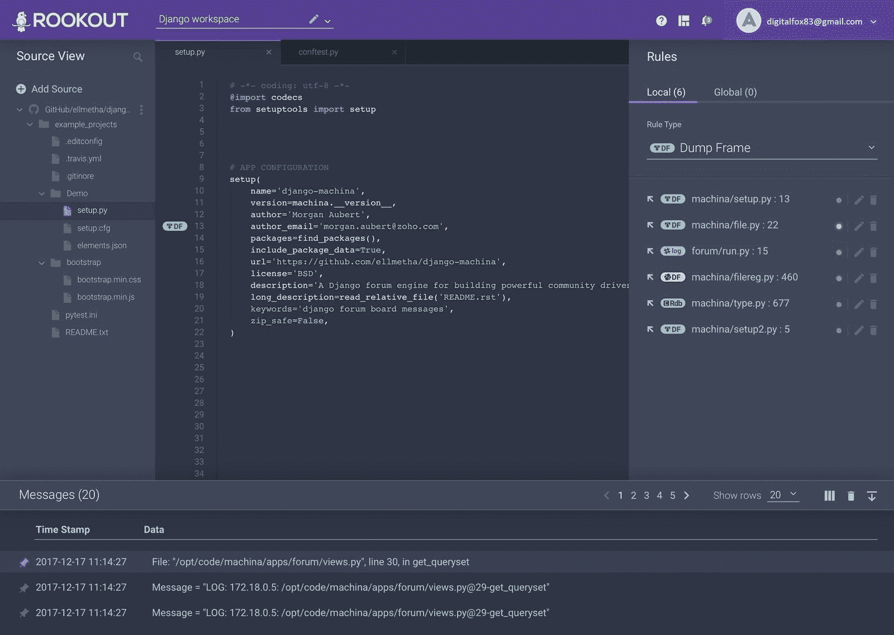
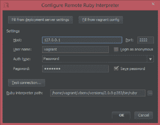
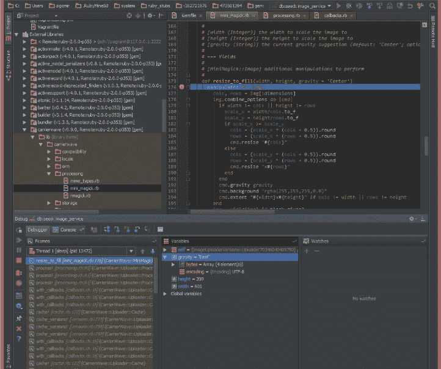
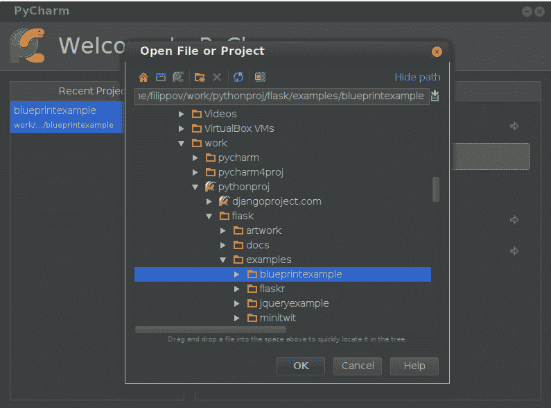
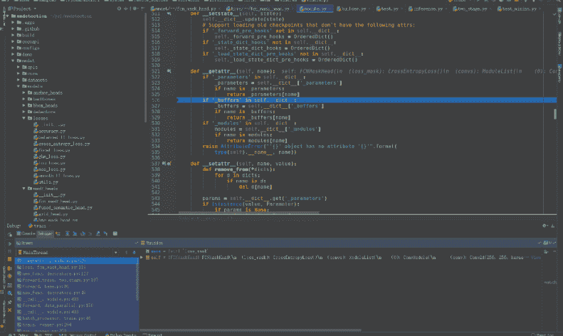
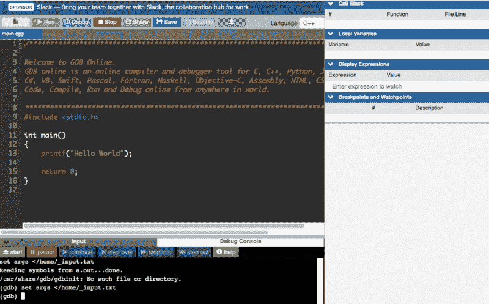
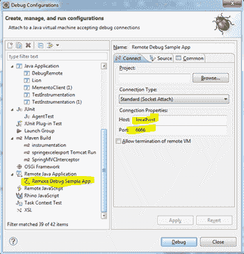
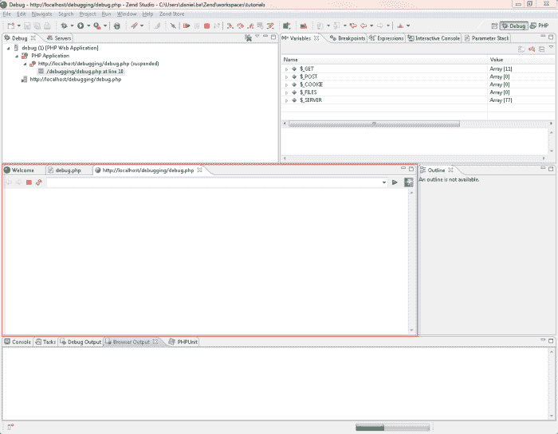
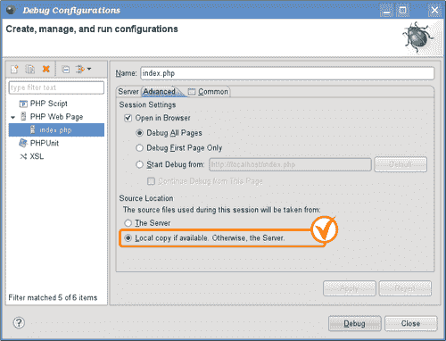
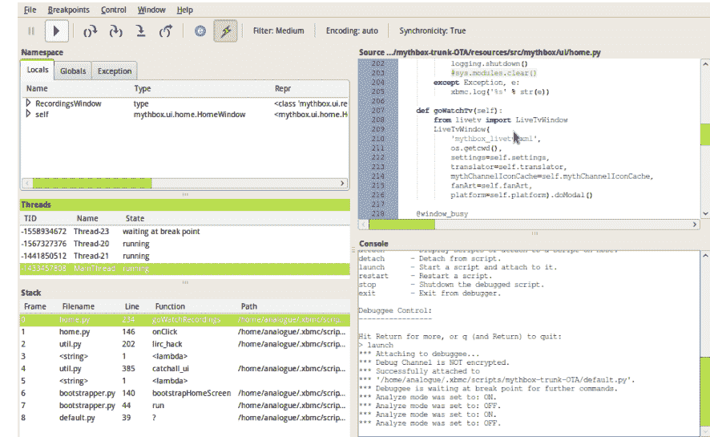

# 2020 年顶级远程调试工具

> 原文：<https://www.freecodecamp.org/news/remote-debugging-tools/>

谈到调试，您使用的工具极其重要，它可以决定修复代码中的问题有多容易。

在早期，调试过程是一个相当大的挑战。由于明显缺乏可靠的调试器，开发人员转向了一些黑客。

例如，当调试移动应用程序或网站时，您会在桌面上重现问题，然后使用 Chrome 开发工具和类似的工具包。不幸的是，这些黑客并不那么有效——你必须不断地在你的桌面浏览器和移动设备之间来回切换。

快进到今天，我们有一套强大的工具，允许您调试运行在不同设备上的有缺陷的代码，就像它是本地代码一样。最重要的是，这些远程调试工具不仅解决了调试挑战，还增强了开发团队之间的协作。

在这篇文章中，我整理了十大远程调试工具，可以可靠地用于远程调试您的代码。

## 前景

Rookout 是一个为调试过程带来灵活性的工具。它可以用来调试 JVM，节点。JS 和 Python 代码在无服务器和容器化的应用程序中。Rookout 的魅力在于它能够让用户快速安全地调试试运行和生产应用程序。它通过在几秒钟内提供所有需要的数据，消除了冗长而复杂的调试过程。

rook out 提供的随需应变数据确保开发者无需编码、重新部署或重启应用程序就能理解并调试代码中的问题。

使用 Rookout，您可以远程调试实时电子应用程序。Rookout 的可共享界面允许开发者在麻烦的电子应用中设置不间断断点。该工具可让您全面了解应用的性能，因此您可以跟踪问题并制定适当的修复措施。Rookout 使这一切成为可能，而不需要在最终用户身上安装另一个软件

### 突出

*   易于上手
*   无缝 Git 集成
*   集成了一系列工具，包括 Slack、Datadog、Sentry、Sumologic 等等
*   交互跟踪和屏幕共享功能
*   实时提供全面的调试数据

## Visual Studio 代码

Visual Studio 代码总是每个使用. NET 的开发人员的首选。它有大量的特性来促进本地和远程调试。使用这个工具，您可以设置条件断点和日志点。

它还允许你考察变量。远程调试需要安装 [VS 代码远程开发扩展包](https://marketplace.visualstudio.com/items?itemName=ms-vscode-remote.vscode-remote-extensionpack)。这个包有三个扩展，提供启动、监控和加速远程调试循环所需的一切。

### 突出

*   免费使用，跨平台操作
*   由微软支持的高度活跃的开发社区
*   集成 Git 控制
*   支持各种扩展和定制选项来增强工作流
*   自动错误检查和颜色编码是伟大的

## 橡胶吗

RubyMine 是一个强大而智能的跨平台 IDE，允许你调试 Ruby on Rails、CoffeeScript、JavaScript、CSS、ERB 和 HAML 等等。它的高级内置调试器允许您轻松设置断点和定义命中条件。

JetBrains 的 RubyMine 提供了两种方法来调试运行在远程设备上的应用程序。首先，您可以添加[远程 Ruby 解释器](https://www.jetbrains.com/help/ruby/configuring-language-interpreter.html#add_remote_ruby_interpreter)并配置本地和远程项目文件之间的映射，然后启动您的调试会话。

或者，你可以在远程设备上运行应用程序，然后添加 Ruby 解释器。

一旦完成，配置文件之间的映射并绑定到一个正在运行的进程。当调试不能直接从 IDE 启动的应用程序时，后者尤其有用。

这个工具的另一个优点是它允许您同时启动多个调试过程。

### 突出

*   RubyMine 基于坚实的 intelliJ IDEA 平台
*   对 ruby 相关框架和技术的良好支持
*   自动完成功能非常好
*   良好的 Git 集成。
*   支持多个插件
*   与 rails 无缝集成

## 皮查姆

PyCharm 是 JetBrains 为 Python 开发的另一个健壮的 IDE。这种智能代码编辑器配备了远程开发功能，包括在虚拟机和远程主机上运行、测试、调试、部署和应用程序。

调试器提供了几个断点、框架视图、观察器、步进模式、远程解释器和一个调试控制台。

PyCharm 的一些令人惊叹的功能包括复杂的自动完成、出色的重构支持以及与 Django、IPython、Docker、vagger 和 Pytest 等工具的无缝集成。另外，PyCharm 是一个非常棒的跨平台开发工具。除了 Python，它还支持 JavaScript、Cython、CoffeeScript、TypeScript SQL、HTML/CSS、Node.js、AngularJS 等等。

### 突出

*   与多个数据库的强大连接，可在 IDE 中进行查询
*   搜索和安装软件包很容易
*   自动代码完成
*   Git 可视化
*   即时显示代码错误，便于轻松修复

## 基因组数据库

GDB 可以有效地用于调试另一台计算机上的程序。要执行远程调试，您需要在主机系统中运行 GDB 实用程序。此外，您必须在目标系统上运行 gdbserver，以便这两个实用程序能够使用 GDB 远程串行协议通过网络或串行线进行通信。

使用 GDB/gdbserver 进行远程调试有两个配置选项。第一种是使用远程 GDB 服务器自动构建应用程序代码并上传到远程机器。

第二个选项是使用 GDB 远程调试你应该有的可执行文件。

### 突出

*   易于使用和跟踪代码中的错误
*   跨平台和广泛的语言支持
*   对核心转储分析有效

## 黯然失色

Eclipse 是一个著名的 Java 开发 IDE，它也支持 Python、Ruby、C#和 PHP 等语言。Eclipse IDE 配备了用于开发和调试的高级特性，使其成为一个全能的工具。Eclipse 上最令人印象深刻的特性之一是平台的调试透视图，它并排显示详细的调试信息，如断点、变量、调用堆栈和线程。

使用 Eclipse，你可以单步执行程序，暂停和恢复线程，计算表达式和检查值。在 Eclipse 上管理[远程调试配置非常简单明了，这使得该工具在开发人员中更受欢迎。](https://www.eclipse.org/jetty/documentation/current/debugging-with-eclipse.html)

### 突出

*   自动代码完成
*   良好的重构支持
*   卓越的导航能力
*   帮助进行语法检查，以获得干净高效的代码
*   Git 集成

## Zend Studio 调试器

Zend Studio 是一个专业的 IDE，支持 PHP 代码编辑、测试、调试等等。

它与 [Zend 服务器](https://en.wikipedia.org/wiki/Zend_Server)紧密集成，从而创建了一个完整的 PHP 环境，便于更容易地分析在试运行和生产环境中检测到的问题。

Zend 还提供了一个 PHP 扩展，用户可以安装在 web 服务器上调试 PHP 脚本。使用 Zend 进行调试相对容易——您只需要打开源代码，在项目中设置断点，然后运行一个调试会话。

Zend 上的远程调试可以通过三种方式完成。第一个选项是使用 Zend Studio 上的调试 URL 功能。

其次，你可以在 Zend Studio 内使用 Debug as 网页功能。最后，在 Firefox 或 Chrome 上使用 Zend 浏览器工具栏。

### 突出

*   只需几次击键就能筛选项目文件
*   高效快速的平台
*   大型社区支持
*   非常适合构建和调试 PHP 应用程序
*   这个框架非常灵活

## WinPdb

WinPdb 是一个优秀的 Python 调试器，可以在 Windows、Mac OS 和 Linux 系统上很好地工作。兼容 Python 2.x 和 Python 3.x 两种版本
这个调试工具支持智能断点、命名空间修改、多线程、嵌入式调试、加密通信。对于远程调试，您需要将 rpdb2.py (Winpdb 的命令行调试器)复制到远程机器上。

一旦完成，用远程机器上的调试器启动 Python 脚本。从您的本地设备，启动 GUI 并附加要调试的脚本。此时，您可以使用脚本在远程设备上的基本名称或完整路径。你可以在这里了解更多关于用 Win PDB [调试 Python 脚本的信息。](http://winpdb.org/tutorial/WinpdbTutorial.html)

### 突出

*   支持多线程调试
*   用于远程调试的加密通信
*   比 PDB 还快
*   具有断点、堆栈/变量检查等功能的易用 GUI

**使用以上工具，让你的远程调试体验好很多。编码快乐！**