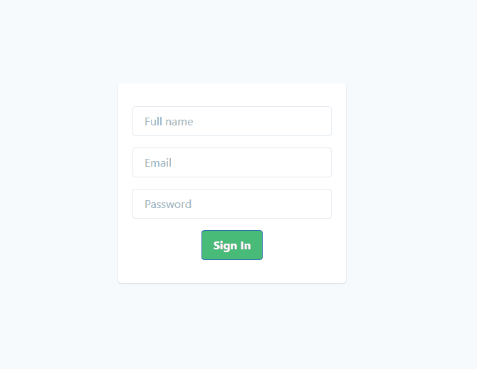

# 如何使用 Tailwind CSS、样式化组件和 Twin 宏，用更少的代码对 React 应用进行样式化

> 原文：<https://www.freecodecamp.org/news/how-to-style-your-react-apps-with-less-code-using-tailwind-css-and-styled-components/>

Tailwind 是一个实用至上的 CSS 框架，用于快速构建定制设计。它可以单独用于设计 React 应用程序。但是，它可以更好地与样式化组件结合。这种结合给 CSS-in-JS 带来了顺风的魔力。

在本指南中，我们将使用 Tailwind CSS、样式化组件和 Twin 宏构建一个表单组件，而无需编写任何 CSS 代码。

让我们开始吧！

*   [为什么要用？](#why-use-it)
*   [设置](#setting-up)
*   [配置顺风 CSS](#configuring-tailwind-css)
*   [顺风 CSS 和样式组件](#tailwind-css-and-styled-components)
*   [结论](#conclusion)
*   [资源](#resources)

## 为什么要用？

“为什么”是相当合法和重要的，因为我们可以使用顺风 CSS 或样式组件。那么，为什么要将它们结合起来，同时使用两者呢？

嗯，顺风类可能很长，这导致我们的组件有一些可读性问题。维护它们可能会很困难。

在样式化组件的情况下，除了我们必须编写样式这一事实之外，没有任何问题。这没什么问题——但是我们为什么要写一些 Tailwind 已经提供的东西呢？

所以结合样式化组件使用 Tailwind CSS 是有意义的。Tailwind CSS 有助于实用程序类，而 Styled Components 在 CSS-in-JS 的帮助下保持了组件的整洁。

## 安装

在本指南中，我们将构建一个简单的表单作为示例。为此，我们需要一款全新的 React 应用。

因此，让我们在终端中运行以下命令。

```
 npx create-react-app react-styled-tailwind 
```

接下来，按如下方式构建您的文件夹:

```
├── src
|  ├── App.js
|  ├── App.test.js
|  ├── assets
|  |  └── tailwind.css
|  ├── index.js
|  ├── serviceWorker.js
|  ├── setupTests.js
|  ├── tailwind.config.js
|  └── styles
|     └── index.js
├── babel.plugin.js
├── package.json
├── postcss.config.js
├── README.md
├── yarn-error.log
└── yarn.lock 
```

随着我们的进展，我将解释每个文件，但是现在，让我们安装依赖项。

```
 yarn add -D tailwindcss twin.macro autoprefixer babel-plugin-macros postcss-cli 
```

接下来，通过运行以下命令安装样式化组件:

```
 yarn add styled-components 
```

一旦安装了这些库，我们现在就可以开始配置 Tailwind CSS 了

## 配置顺风 CSS

要配置它，我们必须手动添加一个配置文件，或者运行以下命令来生成一个新文件:

```
 npx tailwind init src/tailwind.config.js 
```

这里，不是在根目录下生成配置文件，而是将它放在`src`文件夹中——否则 Tailwind 宏会抛出一个错误。

生成的文件如下所示:

*   `tailwind.config.js`

```
module.exports = {
  theme: {
    extend: {},
  },
  variants: {},
  plugins: [],
} 
```

如您所见，配置文件是“空的”,因为没有配置。对于本教程，我们不需要在这里配置任何东西。但是你可以定制它来满足你的需求，或者运行带有`--full`选项的命令来获得完整的顺风配置。

接下来，我们需要在根目录下创建一个新文件`postcss.config.js`。

*   `postcss.config.js`

```
module.exports = {
  plugins: [
    require("tailwindcss")("./src/tailwind.config.js"),
    require("autoprefixer"),
  ],
} 
```

这个配置告诉`postcss.config.js`文件在编译时使用 Tailwind CSS 库和`tailwind.config.js`文件。在`autoprefixer`的帮助下，它跟踪哪些属性需要加前缀。

有了这个设置，我们现在可以转移到`babel.plugin.js`文件，它有助于将 Tailwind 类转换成 CSS-in-JS 代码。

*   `babel.plugin.js`

```
module.exports = {
  tailwind: {
    plugins: ["macros"],
    config: "./src/tailwind.config.js",
    format: "auto",
  },
} 
```

稍后我们将看到这个文件的作用。但是现在，请记住，它是 Tailwind CSS 和样式化组件之间的粘合剂。

完成设置只需要最后三个步骤。


首先，在`tailwind.css`文件中，我们需要从 Tailwind 库导入一些实用程序。

*   `src/assets/tailwind.css`

```
@tailwind base;

@tailwind components;

@tailwind utilities; 
```

正如您所看到的，这里没有什么特别的，只是一些允许我们使用 Tailwind 实用程序类的导入。

第二步是将我们的 React 应用程序与 Tailwind CSS 连接起来。

*   `index.js`

```
import React from "react"
import ReactDOM from "react-dom"
import App from "./App"
import "./assets/styles.css"
import * as serviceWorker from "./serviceWorker"

ReactDOM.render(
  <React.StrictMode>
    <App />
  </React.StrictMode>,
  document.getElementById("root")
)

serviceWorker.unregister() 
```

这里，我们导入包含 CSS 样式的`assets/styles.css`。稍后，我们将稍微调整默认脚本来构建 CSS，并在编译期间将其添加到`assets/styles.css`文件中。

最后但同样重要的是，我们必须更新`package.json`文件。

*   `package.json`

```
"scripts": {
    "build:css": "postcss src/assets/tailwind.css -o src/assets/styles.css",
    "watch:css": "postcss src/assets/tailwind.css -o src/assets/styles.css",
    "start": "npm run watch:css & react-scripts start",
    "build": "npm run build:css react-scripts build",
    "test": "react-scripts test",
    "eject": "react-scripts eject"
 } 
```

这两个脚本`build:css`和`watch:css`将分别构建 CSS，并观察变化，如果需要的话重新构建它。正如我前面所说，输出文件将位于`assets`文件夹中。

有了这个改变，我们现在可以在我们的应用程序中使用 Tailwind 了。现在让我们将它与样式化的组件结合起来。

## 顺风 CSS 和样式组件

之前，在我们的结构文件夹中，我们有一个`styles`文件夹。是时候用下面的代码来调整它了。

*   `styles/index.js`

```
import styled from "styled-components"
import tw from "twin.macro"

const StyledForm = styled.main.attrs({
  className: "flex flex-col h-screen justify-center items-center bg-gray-100",
})`
  & {
    form {
      ${tw`bg-white text-center rounded py-8 px-5 shadow max-w-xs`}
    }
    input {
      ${tw`border-gray-300 mb-4 w-full border-solid border rounded py-2 px-4`}
    }
    button {
      ${tw`bg-green-500 hover:bg-green-700 text-white font-bold py-2 px-4 border border-blue-700 rounded`}
    }
  }
`
export default StyledForm 
```

我们从导入`tw`开始，这允许我们在嵌套属性中使用 Tailwind 类。使用带有`className`属性的实用程序类是非常好的，但是如果你想嵌套属性，你必须使用`twin.macro`库。

这个库将使用 babel plugin macros config ( `babel.plugin.js`)将嵌套选择器使用的 Tailwind CSS 实用程序类转换成样式化组件可以理解的可读代码。

您可以在下面的示例中看到转换是如何完成的。

```
// input
const test = ${tw`text-center bg-red w-full`}
// output
const test = {
    background: 'red',
    textAlign: 'center',
    width: '100%'
} 
```

太好了！既然我们已经将 Tailwind 与样式化组件结合起来，那么让我们将样式化组件添加到`App.js`文件中。

*   `App.js`

```
import React from "react"
import StyledForm from "./styles"

function App() {
  return (
    <StyledForm>
      <form>
        <input type="text" placeholder="Full name" />
        <input type="text" placeholder="Email" />
        <input type="text" placeholder="Password" />
        <button>Sign In</button>
      </form>
    </StyledForm>
  )
}

export default App 
```

在这里，我们只是导入了样式化的组件，并用它包装了所有东西，使我们的表单看起来更好。



太好了！你已经可以看到这个组合有多强大了。我们不用写一行 CSS 就构建了一个表单组件，而且这个组件仍然是可读的。

## 结论

设置 Tailwind CSS 有点麻烦。但是一旦完成并与 CSS-in-JS 结合，它真的非常强大和灵活。这部分是因为我们可以定制`tailwind.config.js`文件来满足我们的需求，或者就像我们通常对样式化组件所做的那样编写普通的 CSS。这绝对是你下一个 React 应用要考虑的事情。

感谢阅读！

你可以在这里找到[的源代码。](https://github.com/ibrahima92/react-styled-tailwind)

[阅读更多我的文章](https://www.ibrahima-ndaw.com/)

[订阅我的简讯](https://ibrahima-ndaw.us5.list-manage.com/subscribe?u=8dedf5d07c7326802dd81a866&id=5d7bcd5b75)

[在 twitter 上关注我](https://twitter.com/ibrahima92_)

## 资源

[顺风 CSS 文档](https://tailwindcss.com/docs/installation/)

[顺风 CSS 备忘单](https://nerdcave.com/tailwind-cheat-sheet)

[双宏文档](https://github.com/ben-rogerson/twin.macro)

[样式组件文档](https://styled-components.com/docs)