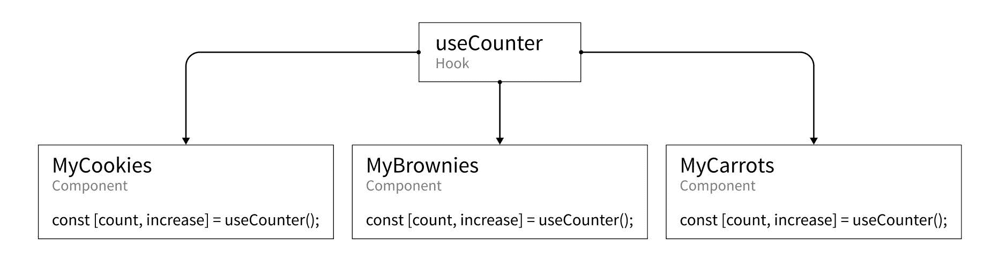
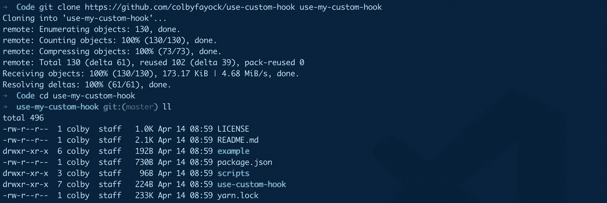
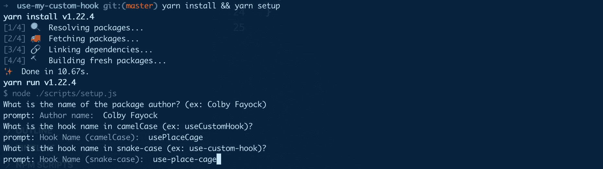
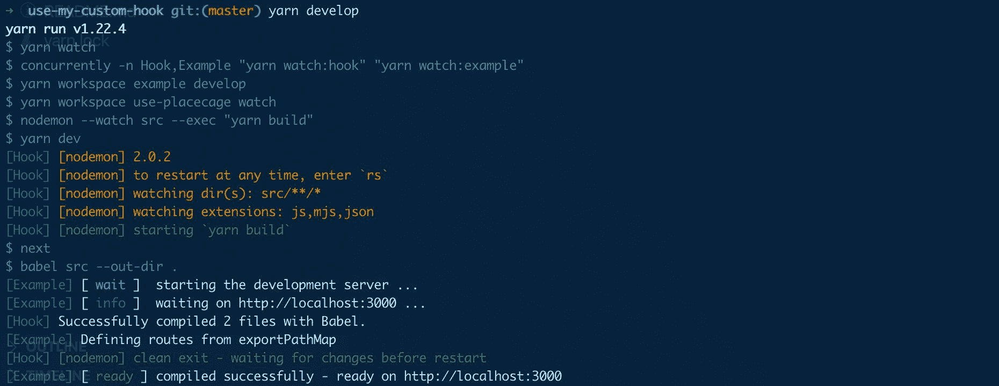
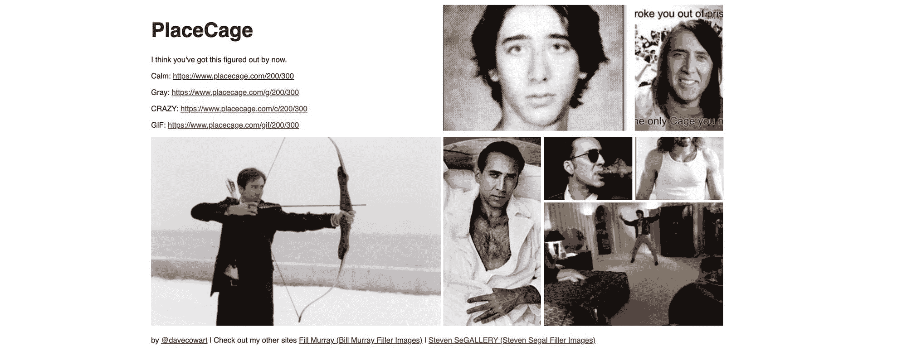
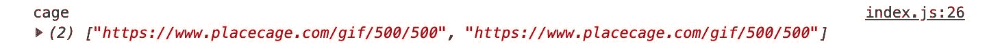
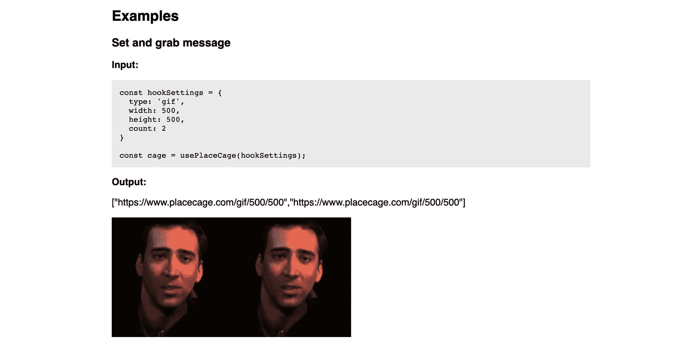
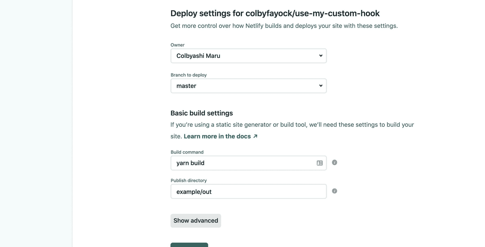
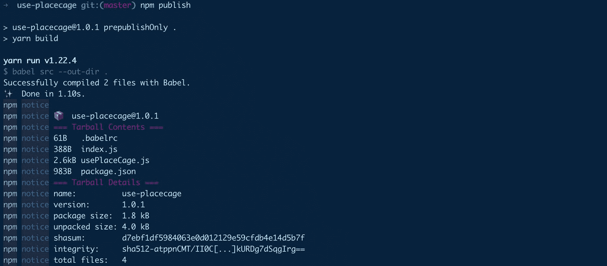

# 如何创建自定义 React 挂钩并将其发布到 npm

> 原文：<https://www.freecodecamp.org/news/how-to-create-a-custom-react-hook-and-publish-it-to-npm/>

钩子是 React API 的一个方便的补充，它允许我们在函数组件中组织一些逻辑和状态。我们如何构建一个自定义的钩子并与世界其他地方共享呢？

*   [什么是钩子？](#what-are-hooks)
*   [为什么定制挂钩很酷？](#why-are-custom-hooks-cool)
*   我们要做什么？
*   第 0 步:命名你的钩子
*   [步骤 1:设置您的项目](#step-1-setting-up-your-project)
*   [第二步:编写新的 React 钩子](#step-2-writing-your-new-react-hook)
*   [步骤 3:在示例中使用 React 钩子](#step-3-using-your-react-hook-in-an-example)
*   [步骤 4:编译你的 React 钩子和例子](#step-4-compiling-your-react-hook-and-example)
*   [步骤 5:将 React 挂钩发布到 npm](#step-5-publishing-your-react-hook-to-npm)
*   [关于钩子的更多资源](#more-resources-about-hooks)

[https://www.youtube.com/embed/Q0xVnRanXVk?feature=oembed](https://www.youtube.com/embed/Q0xVnRanXVk?feature=oembed)

## 什么是钩子？

反应[钩子](https://reactjs.org/docs/hooks-intro.html)简单来说就是函数。当您将它们包含在您的组件或另一个钩子中时，它们允许您通过像`useState`和`useEffect`这样的本机钩子来利用 React 内部和部分 React 生命周期。

我不打算深入研究钩子，但是你可以[查看一个快速介绍](https://www.freecodecamp.org/news/how-to-destructure-the-fundamentals-of-react-hooks-d13ff6ea6871/)的例子`useState`以及[来自 React 团队](https://reactjs.org/docs/hooks-intro.html)的介绍。

## 为什么定制挂钩很酷？

创建定制钩子的好处在于，它们允许你抽象组件的逻辑，使得在你的应用中跨多个组件重用变得更加容易。



Hook diagram example for useCounter

例如，如果您想创建一个简单的计数器，使用 React 的状态来管理当前计数。您可以在一个`useCounter`钩子中创建一次该逻辑，而不是在每个组件文件中都有相同的`useState`钩子，这样更容易维护、扩展和消除出现的 bug。

## 我们要做什么？

出于本文的目的，我们将用一个基本的钩子来简化它。通常，您可能会使用一个钩子，因为您使用的不是一个典型的函数，而是 React 函数组件中需要使用的其他本机钩子。我们将坚持使用一些基本的输入和输出来保持事情的简单。

我们将重新创建我制作的这个定制的 [Placecage 钩子](https://github.com/colbyfayock/use-placecage)，它允许你轻松地生成图片 URL，你可以用它作为占位符图片。


Nic Cage excited

如果你不熟悉， [Placecage](https://www.placecage.com/) 是一个 API，它允许你为你的网站生成 Nic Cage 的图片作为占位符图片。傻？是的。好玩？绝对的！

但是如果你不是 Nic 作品的粉丝，你可以很容易地把 URL 换成使用比利·穆雷图片的 [Fill Murray](https://placeholder.com/) 或使用 placeholder.com 图片的[T3，后者生成简单的纯色背景和显示图像大小的文本。](https://placeholder.com/)

## 步骤 0:命名钩子

在我们开始实际的代码之前，我们的最终目标是发布这个钩子。如果这不是你的目标，你可以跳过这一步，但是为了发布，我们想为我们的钩子创建一个名字。

在我们的例子中，我们的钩子名称将是`usePlaceCage`。考虑到这一点，我们的名字有两种格式——一种是驼色格式，另一种是蛇纹格式。

*   **茶包:**使用 PlaceCage
*   **蛇盒:**用途-放置笼子

camelCase 格式将用于实际的钩子函数，其中 snake-case 名称将用于包名和一些文件夹。创建名称时，请记住包名必须是唯一的。如果在[npmjs.com](https://www.npmjs.com/)上已经存在同名的软件包，您将无法使用它。

如果你还没有名字，没关系！你可以用你自己的名字或你能想到的东西，这真的没有太大关系，因为我们真的只是在努力学习如何做到这一点。如果是我，我会用:

*   **骆驼案:**uscolbycool hook
*   **蛇案:**用途——colbyscoullhook

但是为了澄清，对于我们例子的其余部分，我们将坚持使用`usePlaceCage`和`use-placecage`。

## 步骤 1:设置您的项目

虽然你可以按照你喜欢的方式设置你的项目，但是我们将从我创建的这个模板开始构建一个新的钩子。

这里的希望是，我们可以去掉这个过程中一些令人痛苦的部分，并立即用我们的定制钩子提高效率。不过不要担心，我会解释一路上发生的事情。

这里的需求是 [git](https://git-scm.com/) 和 [yarn](https://yarnpkg.com/) ，因为它有助于提供一些工具来简化这个模板，比如使用 workspaces 特性来允许简单的 npm 脚本从项目的根管理代码。如果其中任何一个是交易破坏者，你可以尝试通过下载链接下载回购，并根据需要进行更新。

### 从 git 克隆钩子模板

首先，让我们从 Github 克隆存储库。在下面的命令中，你应该把`use-my-custom-hook`替换成你的钩子的名字，比如`use-cookies`或者`use-mooncake`。

```
git clone https://github.com/colbyfayock/use-custom-hook use-my-custom-hook
cd use-my-custom-hook 
```

克隆并导航到该文件夹后，您现在应该会看到两个目录——一个`example`目录和一个`use-custom-hook`目录。



Cloning use-custom-hook

这将为您提供一些入门信息:

*   一个钩子目录，它将包含我们钩子的源代码
*   构建脚本，用[巴别塔](https://babeljs.io/)编译我们的钩子
*   一个示例页面，它导入了我们的钩子，并用 [next.js](https://nextjs.org/) 创建了一个简单的演示页面

### 运行挂钩设置脚本

在我们成功地克隆了 repo 之后，我们希望运行安装依赖项的安装脚本，并将挂钩更新为我们想要的名称。

```
yarn install && yarn setup 
```



Setting up a new hook from the use-custom-hook template

当安装脚本运行时，它将做一些事情:

*   它会询问你的名字——这是用来更新许可证和软件包作者的名字
*   它会要求你输入两种不同的钩子名称——camel case 和 snake-case——这将用于更新整个模板中钩子的名称，并将具有该名称的文件移动到正确的位置
*   它将重置 git——它将首先删除本地。git 文件夹，其中包含来自我的模板的历史记录，并使用一个新的提交来重新初始化 git，以便在
*   最后，它将删除安装脚本目录，并删除仅由这些脚本使用的包依赖项

### 启动开发服务器

一旦安装脚本运行完毕，您将需要运行:

```
yarn develop 
```

这将在钩子源代码上运行一个监视过程，每次源文件发生变化时在本地构建钩子，并运行示例应用服务器，在这里您可以测试钩子并对示例页面进行更改。



Starting up the use-custom-hook development server

这些都准备好了，我们可以开始了！

[跟随提交！](https://github.com/colbyfayock/use-my-custom-hook/commits/master)

## 步骤 2:编写新的 React 钩子

现在，您应该有了一个新的定制钩子，您可以让它做您想做的任何事情。但是，既然我们要重新构建 [usePlaceCage](https://github.com/colbyfayock/use-placecage) 钩子，就从这里开始吧。

usePlaceCage 钩子从高层次的角度做了一件简单的事情——它接受一个配置对象并返回一些图像 URL，然后您可以将它们用于您的应用程序。

提醒一下，每当我提到`usePlaceCage`或者`use-placecage`的时候，你应该使用你之前设置的钩子名称。

### 关于 placecage.com 的一点点

Placecage.com 是一个占位符图像服务，它只做一件事。它接受一个简单配置的 URL 并返回一个图像...尼克·凯奇。



placecage.com

从最简单的用途来看，该服务使用如下 URL 模式:

```
https://www.placecage.com/200/300 
```

这将返回宽度为 200、高度为 300 的图像。

或者，您可以传递一个定义图像类型的附加 URL 参数:

```
https://www.placecage.com/gif/200/300 
```

在这个特殊的例子中，我们的类型是`gif`，所以我们将收到一个 gif。

可供使用的不同类型有:

*   没什么:冷静
*   `g`:灰色
*   `c`:疯狂
*   `gif` : gif

我们将用它来定义如何为钩子设置配置。

### 定义我们的核心发电机功能

首先，我们将复制一个位于`use-placecage/src/usePlaceCage.js`文件底部的函数，它允许我们生成一个图像 URL，以及一些我们将在该函数中使用的常量定义。

首先，让我们将常量复制到我们的`usePlaceCage.js`文件的顶部:

```
const PLACECAGE_HOST = 'https://www.placecage.com/';
const TYPES = {
  calm: null,
  gray: 'g',
  crazy: 'c',
  gif: 'gif'
};
const DEFAULT_TYPE = 'calm';
const ERROR_BASE = 'Failed to place Nick'; 
```

在这里我们:

*   定义一个主机，这是我们的图像服务的基本 URL。
*   定义可用的类型，我们将在配置 API 中使用它们。我们将`calm`设置为`null`，因为这是你根本不包含它而得到的默认值
*   我们的默认类型将是`calm`
*   我们设置了一个错误库，当抛出一个错误时，它是一个一致的消息

然后对于我们的函数，让我们把它复制到我们的`usePlaceCage.js`文件的底部:

```
function generateCage(settings) {
  const { type = DEFAULT_TYPE, width = 200, height = 200, count = 1 } = settings;
  const config = [];

  if ( type !== DEFAULT_TYPE && TYPES[type] ) {
    config.push(TYPES[type]);
  }

  config.push(width, height);

  if ( isNaN(count) ) {
    throw new Error(`${ERROR_BASE}: Invalid count ${count}`);
  }

  return [...new Array(count)].map(() => `${PLACECAGE_HOST}${config.join('/')}`);
} 
```

浏览这段代码:

*   我们定义了一个`generateCage`函数，我们将使用它来生成我们的图像 URL
*   我们接受一个设置对象作为参数，它定义了图像 URL 的配置。我们将使用与我们在 placecage.com 网址中看到的相同的参数
*   我们破坏这些设置，使它们可供我们使用
*   为了方便起见，我们在这里设置了一些默认值。我们的缺省值`type`将由`DEFAULT_TYPE`连同我们想要返回的结果的缺省宽度、高度和数量一起定义
*   我们创建一个`config`数组。我们将使用它将所有不同的配置对象添加到我们的 URL 中，最后用一个`/`将它们连接在一起，从而形成一个 URL
*   在我们将配置推送到那个数组之前，我们检查它是否是一个有效的参数，通过使用`TYPES`对象来检查它。如果它是有效的，我们把它推到我们的配置数组
*   然后我们推动我们的宽度和高度
*   我们做一些类型检查，如果我们没有一个有效的数字作为`count`，我们抛出一个错误，否则我们会得到不正确的结果
*   最后，我们返回一个新的数组，其中包含请求的结果数，映射到一个 URL 创建者，它使用`PLACECAGE_HOST`作为我们定义的基本 URL，并且我们的配置数组由`/`连接

如果我们要测试这个函数，它会是这样的:

```
const cage = generateCage({
  type: 'gif',
  width: 500,
  height: 500,
  count: 2
});

console.log(cage); // ['https://www.placecage.com/gif/500/500', 'https://www.placecage.com/gif/500/500']
```

### 在钩子中使用我们的函数

现在我们有了生成器函数，让我们在钩子中使用它！

在`use-placecage/src/usePlaceCage.js`文件中的`usePlaceCage`函数内部，我们可以添加:

```
export default function usePlaceCage (settings = {}) {
  return generateCage(settings);
} 
```

它使用我们的生成器函数，接受传入钩子的设置，并从钩子返回那个值。

类似于我们之前的使用示例，如果我们使用钩子，它看起来会像这样:

```
const cage = usePlaceCage({
  type: 'gif',
  width: 500,
  height: 500,
  count: 2
});

console.log(cage); // ['https://www.placecage.com/gif/500/500', 'https://www.placecage.com/gif/500/500'] 
```

在这一点上，它做同样的事情！

现在我们有了钩子，它作为一个函数为 placecage.com 服务生成图像 URL。我们实际上如何使用它？

[跟随提交！](https://github.com/colbyfayock/use-my-custom-hook/commit/a4d4d3c3565759031c29d00faf731ac4c236a1fd)

## 步骤 3:在一个例子中使用 React 钩子

关于我们的模板的好消息是，它已经包含了一个示例应用程序，我们可以更新它，以便轻松地使用我们的钩子来测试和为那些想要使用它的人提供文档。

### 设置挂钩

首先，让我们打开我们的`example/pages/index.js`文件。在这个文件中，您将看到以下内容:

```
const hookSettings = {
  message: 'Hello, custom hook!'
}

const { message } = usePlaceCage(hookSettings); 
```

这个片段是模板中默认使用的，只是为了验证概念，所以让我们更新一下。我们将使用与步骤 2 中完全相同的配置:

```
const hookSettings = {
  type: 'gif',
  width: 500,
  height: 500,
  count: 2
}

const cage = usePlaceCage(hookSettings); 
```

同样，我们用钩子的配置来设置我们的 settings 对象，并调用钩子，将值设置为常量`cage`。

如果我们现在控制台记录我们的开发工具的值，我们可以看到它的工作！

```
console.log('cage', cage); 
```



Using console.log to show the cage value

*注意:如果您在这里得到一个关于`message`的错误，您可以在 Examples 部分下注释我们的或者删除它。*

### 用我们新的钩子配置更新例子

如果您向下滚动到 Examples 部分，您会注意到我们有与上面相同的缺省值`hookSettings`，所以让我们再次更新它以确保我们的例子是准确的。

```
{`const hookSettings = {
  type: 'gif',
  width: 500,
  height: 500,
  count: 2
}

const cage = usePlaceCage(hookSettings);`} 
```

您还会注意到我们不再使用`message`变量。如果您在上一步中没有删除它，我们现在可以在输出标题下将其替换为:

```
<p>
  { JSON.stringify(cage) }
</p>
<p>
  { cage.map((img, i) => )}
</p> 
```

我们在这里做两件事:

*   我们没有显示变量本身，而是用`JSON.stringify`将它包装起来，这样我们就可以显示数组的内容
*   我们还使用`map`函数在`cage`常量中循环遍历我们的图像 URL，并为每个 URL 创建一个新的图像元素。这让我们预览输出，而不仅仅是看到值

保存并打开浏览器后，您应该可以看到更新后的示例和输出！



Custom hook example page

### 您可以在该页面上做的其他事情

在继续之前，您还可以更新一些对您的 hooks 页面很重要的其他内容:

*   用说明更新**如何使用**部分
*   添加额外的例子，让人们更容易知道该怎么做

一些东西也从`use-placecage/package.json`文件中自动提取。您可以在那里更新它们以便于维护，也可以在示例页面中替换它们:

*   `name`:用于页面的`<h1>`
*   `description`:用于`<h1>`下的描述
*   `repository.url`:用于包含到存储库的链接
*   `author`:`name`和`url`用于在页面底部包含一个链接

[跟随提交！](https://github.com/colbyfayock/use-my-custom-hook/commit/71ae57b562ad814d0ce862c22e247aa8c450b6cf)

## 步骤 4:编译 React 钩子和例子

让我们的钩子作为 npm 模块轻松工作的方法是编译它供其他人使用。我们用巴别塔来做这个。

虽然发布过程已经用`use-placecage/package.json`中的`prepublishOnly`脚本自动为我们完成了这项工作，但是我们可以使用项目根目录中的`yarn build`命令手动编译我们的钩子。

在编译钩子的同时，运行`yarn build`也将编译示例页面，允许您将它上传到任何您想上传的地方。运行该命令后，您应该会在`example/out`目录中看到静态 HTML 文件的输出。

如果你在寻找建议， [Netlify](https://www.netlify.com/) 可以让你轻松连接你的 [Github](https://github.com/) 账户并部署静态站点。



Deployment setup in Netlify

查看部署到 Netlify 的演示站点！

## 步骤 5:将 React 挂钩发布到 npm

最后，如果你对你的钩子满意，是时候发表了！

npm 让这部分变得非常简单。你需要有一个 npm 帐户的唯一先决条件。使用该帐户，让我们登录:

```
npm login 
```

这将提示您输入登录凭证。

接下来，让我们导航到我们的钩子目录，因为我们的包配置在那里的`use-placecage/package.json`下:

```
cd use-placecage 
```

然后，我们可以简单地发布！

```
npm publish 
```

请记住，每个包名需要是唯一的。如果你用了`use-placecage`，它已经被占用了...被我。？

但是如果你成功了，npm 应该构建你的钩子并把它上传到包注册中心！



Publishing an npm package

然后，它将通过以下模式在 npm 上提供:

```
https://www.npmjs.com/package/[package-name] 
```

所以对于`use-placeage`，这里有:[https://www.npmjs.com/package/use-placecage](https://www.npmjs.com/package/use-placecage)

## 我们现在有一个自定义挂钩！

耶。如果您已经完成了，那么您现在应该已经创建了一个自定义挂钩，并将其发布到 npm。

虽然这是一个使用 placecage.com 的愚蠢例子，但它给了我们一个很好的想法，让我们可以很容易地设置它。

您还会注意到，这个具体的例子并不是钩子的最佳用例，在这里我们可以简单地使用一个函数。通常，我们希望使用定制钩子来包装只能存在于 React 组件中的功能，比如`useState`。要了解更多，你可以阅读我的另一篇关于定制钩子的文章。

然而，这给了我们一个很好的基础来讨论我们的新钩子的创建和配置！

## 关于钩子的更多资源

*   如何破坏反应钩的基本原理(freecodecamp.org)
*   [引入挂钩](https://reactjs.org/docs/hooks-intro.html)(reactjs.org)
*   [钩子 API 参考](https://reactjs.org/docs/hooks-reference.html)(reactjs.org)

[](https://twitter.com/colbyfayock)

*   [？在 Twitter 上关注我](https://twitter.com/colbyfayock)
*   [？️订阅我的 Youtube](https://youtube.com/colbyfayock)
*   [✉️注册我的简讯](https://www.colbyfayock.com/newsletter/)