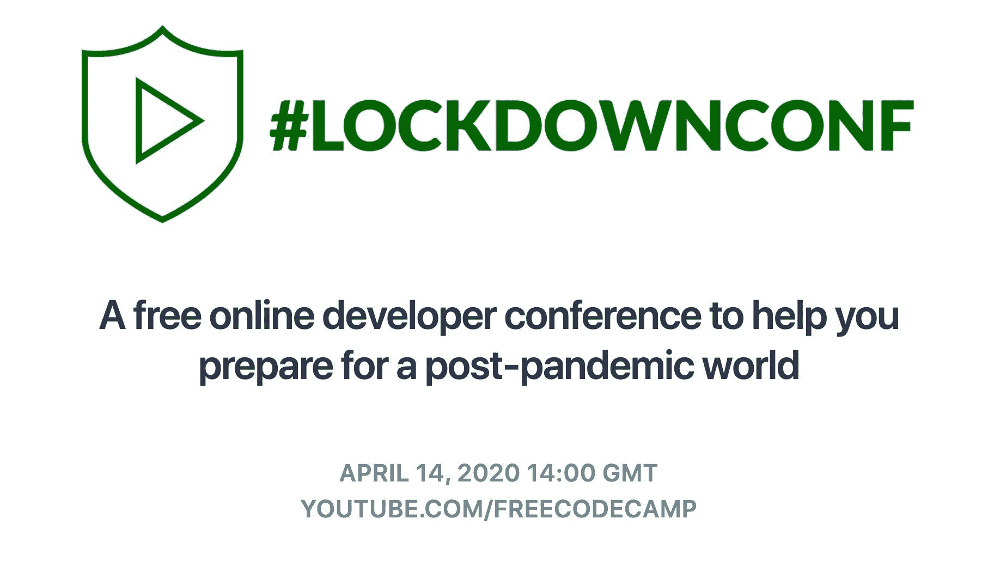
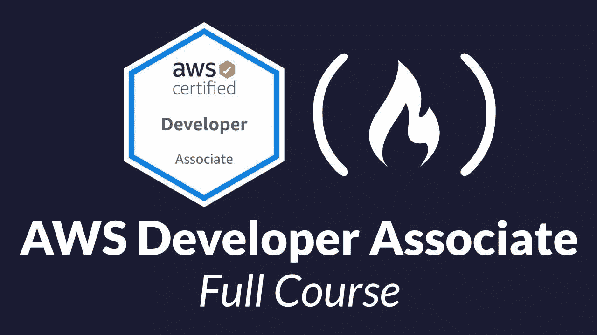

# 四月免费代码营更新:一个免费的在线会议，一个不和谐的聊天室，一个新的 AWS 课程，等等

> 原文：<https://www.freecodecamp.org/news/april-freecodecamp-update/>

嘿，朋友们，三月是一个漫长的月份。四月可能更长。

我希望你和你的家人在疫情期间平安无事。

我意识到，在未来的几个月里，我们中的许多人都面临着因这种疾病而失去亲人的前景。我们中的许多人自己也会感染这种疾病，并努力战胜它。

医生、护士、科学家和其他前线人员正在做紧急工作，帮助我们以尽可能少的死亡通过疫情。

我们 freeCodeCamp 的老师们正在做着不那么紧急的工作。我们正在创建免费的在线资源，这样你可以扩展你的技能，改善你的职业选择，并为你的家人提供。

所以，我想再次承认，这是一个艰难的时期。专注于你的家庭和你自己的幸福是可以的。

但是如果你确实想学习一些新的技术技能，并且更牢固地掌握理论，我们可以在这里提供帮助。

为了实现这一目标，我今天宣布三件大事来帮助你们实现这一目标。

# 公告#1: #LockdownConf -一个免费的在线开发者大会

freeCodeCamp 将于 4 月 14 日在我们的 YouTube 频道上举办一场免费的在线开发者大会。没错——只有几天了。

以下是我们将在这个 4 小时的会议中讨论的主题:

1.  如何在保持社交距离的同时学习新技能
2.  如何在家高效工作并保持理智
3.  如何找到仍在招聘的公司并申请开发人员职位
4.  如何在疫情期间找到自由职业

我的朋友法兹勒(Hashnode.com 的联合创始人)和我将主持这次会议。我们将邀请来自世界各地的开发人员组成小组，分享他们的见解并回答您的问题。

您可以[了解关于此次会议的更多信息，并在此](https://www.freecodecamp.org/news/lockdownconf-free-developer-conference/)将其添加到您的日历中。

# 公告#2:我们新的 AWS 开发人员助理认证课程现已上线

一月份，我们宣布了我们的# AWS 认证挑战。从那时起，成千上万的开发人员致力于学习并获得 AWS 云认证。

本周，我们推出了第三个关于 AWS 认证考试的免费课程。这是最难的助理级考试:开发人员助理认证。

这个 16 小时的免费课程包括:

*   DynamoDB
*   弹性豆茎
*   带 AWS Lambda 的无服务器
*   以及更多的话题。

您可以[了解更多关于开发人员助理认证课程的信息，并点击此处](https://www.freecodecamp.org/news/pass-the-aws-developer-associate-exam-with-this-free-16-hour-course/)。

# 公告#3:新的 freeCodeCamp Discord 聊天室服务器上线了

freeCodeCamp 的论坛在三月份急剧增长。我们必须升级到更大的服务器。两次。

这个论坛非常适合提问和回答问题。也就是说，许多人要求一种“饮水机”类型的聊天室，在那里他们可以社交，同时保持社交距离。

因此，我们创建了一个 Discord 服务器，您可以在白天工作和学习新技能的时候在这里闲逛。

这是一个友好、包容的开发者社区聊天室，我们现在比以往任何时候都更需要正能量。

你可以在这里了解如何加入 freeCodeCamp 的 Discord 聊天室服务器。

# 我希望这一切能让你的四月更明亮一点。

我们在扩展课程方面取得了稳步进展，并发布了许多其他免费课程——比如这个由开发者艾纳·库博教授的 2 小时课程《T2 》,在这里你可以构建 7 个极简的 JavaScript 游戏，包括俄罗斯方块。

我们将继续提供这些课程。

我个人的人生目标是确保你永远不会缺乏良好的、及时的、免费的学习资源。

一如既往，你可以通过捐赠来支持我们的非营利组织的努力(并帮助我们支付服务器的费用)[。一点一滴都有帮助。](https://www.freecodecamp.org/donate)

祝你和你的家人安全度过这个混乱的时刻，当我们都从这个困境中走出来的时候，前方的日子会更好。

–[昆西](https://www.twitter.com/ossia)