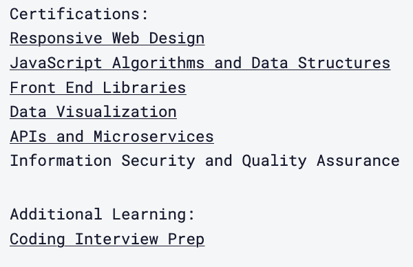
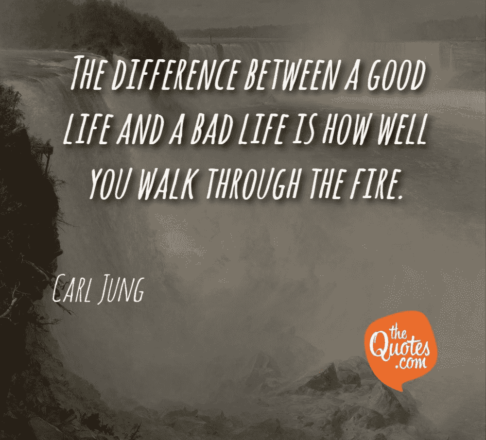

# 作为自由开发者如何生存

> 原文：<https://www.freecodecamp.org/news/how-to-survive-as-a-freelancer/>

自从我们开始经历新冠肺炎疫情的巨大冲击以来，已经过去了 8 周。在那段时间里，我们都见证了这种病毒如何影响我们的家庭、社区和生计。

失业率正在上升——劳工部报告称，上周又有 660 万人申请失业救济。大多数城市居民没有为这种灾难性事件做好准备。

所以这篇文章是我为我的开发人员和设计人员同事做公共服务的方式。

关于 web 和移动应用程序开发的计算机编程语言和技术的文章太多了。但是很少有人谈到房间里的大象:网页开发人员和设计人员在现实生活中的斗争。

每当我去参加黑客马拉松，我都会遇到失业或者自由职业的人。我也遇到过一些有抱负的程序员，他们刚从编码训练营毕业，正在找工作。可悲的是，有些人参加这个活动是为了免费的食物和临时住所，因为他们可以在会场睡觉。

许多设计师和开发人员的工作是可有可无的。世界末日并不需要一个圣经比例的事件——它所需要的只是失去一个客户，或者被解雇。

如果你住在加州，我们州有劳动法叫做“随意雇佣”这是合同关系的一个术语，在这种关系中，雇员可以被雇主以任何理由解雇(也就是说，不必为解雇建立“正当理由”)，并且无需警告，只要该理由不是非法的(例如，因为种族或宗教而解雇某人)。

雇主可以将网络和软件开发外包给其他国家的程序员，只需支付一小部分费用。对于那些更愿意雇佣仍在美国本地工作的人的公司(无论是在本地还是异地)，有些公司更愿意雇佣你作为个体承包商。这意味着没有公司福利(带薪病假或假期)，没有医疗保险，401K，以及永久员工获得的额外津贴。

下面是自由职业者可以做的一些事情，以便在这个不确定的时期生存下来，同时等待他们的重大突破或永久就业。

## 健康保险

这是我最想做的事。我是吃了苦头才知道的。

几年前我的阑尾破裂了，由于我没有医疗保险，医生不想做手术。

他的原话是，“你没钱付给我。回家就是了！”

我疼得厉害，护士给我打了一针吗啡。弄得我头晕目眩，呕吐不止。

如果不是这位好心的撒玛利亚人为我和我作为病人的权利而战，我就不会接受手术。

我告诉你这些是为了强调在美国拥有健康保险是多么重要。不管你有没有工作，都要把这作为你的首要任务。

即使你需要去不同的诊所，研究如何获得免费或低成本的保险，也要去做。不要在这个问题上拖延。

弄清楚如何获得健康保险不会花你一分钱，但如果你最终躺在医院的病床上，你和你的家人将会付出更多。

## 一些省钱的基本方法

### 需要与想要

你们中的一些人可能会说，你的钱只够支付账单，没有更多的钱可以存起来。我听到了，我也去过那里。

削减不必要的开支怎么样？就我而言，我减少垃圾食品。我喜欢在工作的时候吃一些松脆的东西，但是我把它换成了杏仁奶油香蕉。对我来说，它很有效，因为两者的结合很美味，它很容易让我吃饱，并抑制我对垃圾食品的渴望。

一根香蕉要 10-29 美分，如果我每天都吃的话，杏仁黄油够我吃两周。我还试着把芹菜杆和胡萝卜当零食吃——我从没想过我会喜欢它们，它们给我的感觉和我吃薯条一样(松脆)。现在，每当我想吃甜食时，我喜欢吃甜菜和水果作为零食。

当我去购物时，我会在购买之前问自己这个问题:“这是一种需要还是一种想要？”如果答案是需要的，我会买的。如果没有，我会通过。

### 智能会员资格

我能从中得到什么呢？有一次我的轮胎被一个大钉子扎破了，因为我把车停在一个建筑工地旁边。如果我没有减少不必要的东西，我就没有钱买两个新的前轮胎。

我让我爸送我一张 AAA 汽车俱乐部会员卡作为生日礼物，而不是钱包或衣服。所以我没花一分钱就把我的车一直拖到了汽车修理店。一家拖车公司根据位置的不同收费大约 200-300 美元，所以我买了一张 AAA 卡并享受了附属商店的折扣，省了一大笔钱。

### 预付费手机

换成预付费手机。我以前每月支付 100 美元的手机费用，所以我改用预付费方式，节省了 40%的费用。另外，我没有被一份 2 年的合同束缚住，如果你付不起账单，手机供应商将你的账户收账，这将严重影响你的信用评分。

当大公司管理你的信用时，低 FICO 分数可能会影响你的就业机会。当你买车或进行其他大额购买时，你也必须支付更高的利息。而且通常情况下，如果你决定买自己的房子，你会被收取更高的租金。

你买房的机会也会受到负面影响，因为债务拖欠对银行和抵押贷款经纪人来说是一个危险信号。即使你全额支付现金，风险也很大，因为他们会向联邦调查局举报你持有数十万美元的现金。

我是不是太过分了？我认为这是一件好事，对吗？计算机科学学校不会教这个。

### 额外服务

如果你订阅了 Netlifx、Amazon Prime、Hulu 或 YouTube Red，你有多少时间观看所有这些平台的电影？除非他们被要求做你的工作，否则想想哪一个(哪些)你用得少，然后停用他们，直到你赚更多的钱。

省钱的方法有很多。这里的关键因素是寻找其他选择，减少你的过剩。

## 准备妥当

手术后，我花了 6 个月时间恢复。前面说过，我的工作是可有可无的。手术后一周，我被替换了，因为我正在做一个有严格截止日期的项目。

我在那份工作上只工作了几个月，然后就出现了医疗紧急情况。在我康复期间，我从两个月的自由职业工作中省下的钱用来支付我的房租。我教会的朋友给了我维持一周的食物。但我不想滥用他们的善意，因为他们也有自己的家庭要支持。我做了我该做的——我去了食物银行。

我在那里排了几个月的队。食物银行的问题是，在创造食谱时，你没有太多的选择。我去的第一家给了我一罐苹果酱，四季豆，一盒燕麦片，腌墨西哥胡椒和花生酱。所以我从一元店买了一盒饼干，头几天就吃花生酱和饼干。

第二次去的时候，我可以和其他排队的人聊天。他们告诉我，在一天内，他们通常会访问 3-4 个食物银行，想出一个好的食谱。

我有一辆车，所以我自愿开车带他们四处转转，因为他们是老年人，我同情他们每周为获得食物而经历的苦难。他们找不到工作，因为他们的年龄和从事艰苦劳动的能力有限，被认为无法就业。他们不得不和同样在挣扎的孩子住在一起。

我从这次经历中学到的是在食物充足的时候准备食物。我现在每次去杂货店都会多买些保质期长的罐头和干货。我不会过量购买，因为只有到了保质期，我吃不到或者忘记吃的时候，才会浪费掉。

例如，我会买两罐金枪鱼罐头，这不是多余的东西。一个是即时消费，另一个是以备不时之需。如果你每周都去市场，那么一个月内你就能攒下四罐。一年之内，你将能够存下 48 件物品。这意味着如果你失去工作或收入，你肯定知道你有食物吃 48 天。这就是我所说的生命线——它会给你营养，直到你找到另一份工作。

一个项目是一个基数或开始的东西。为了更现实，一日三餐多买三样东西。如果你有空，剪一些优惠券或者去有促销活动的地方购物。如果你稍加努力，这是可行的。

## 试试禁食

禁食有许多好处——它通过减少胰岛素抵抗来促进血糖控制，有助于对抗炎症，并改善血压。你会有健康的皮肤，也会减轻体重。

禁食也让我意识到，如果我三天或更长时间不吃固体食物，我是不会死的。这将消除你对餐桌上没有食物的焦虑。因此，在这个饥荒时期，你会有清晰的头脑去思考一个新的游戏计划。

当你的食物供应越来越少时，你也应该放慢你的消费速度。一旦你经历了禁食，你就会学会控制自己对食物的渴望。

如果你还没有准备好进行三天的禁食，你可以进行间歇性禁食来代替。我在吃生酮饮食的时候试过，两周内我瘦了 5 磅。这也让我有更多的精力花在我需要处理的重要事情上。

## 得到一张公共汽车通行证

找新工作意味着你需要去职业介绍所或工作面试。根据我的经验，停车费是很常见的，特别是如果办公室在附近有餐馆和商店的大楼里。

根据位置的不同，最便宜的停车费通常是每小时每米 2 美元，而在停车场内，停车费可能从 10 美元到 30 美元不等。并非所有公司都提供停车验证。

有一段时间，我只剩下 20 美元，在一次求职面试中，我通过支付停车费把它花光了。但是我没有得到那份工作。这很痛苦，如果你没有经历过同样的情况，这很难解释。

所以办个公交卡，有闲钱的时候装上。即使我有车，我也只会用它去公共交通无法到达的地方。我在为更重要的事情节省汽油。

有一年，我向我的朋友暗示，我想要一张圣诞公共汽车票，而不是闪闪发光的东西。我所要求的是实际和必要的。如果你住在有这种交通系统的地方，这是适用的。

我在这里的观点是优先考虑什么是务实的。

## 如果你需要，你可以睡在你的车里

这听起来可能很荒谬，但是培训是有回报的。如果你有一辆车，清空后备箱，折叠后座(如果可以的话)。看看你是否适合那里。如果没有，也将前排座椅向后折叠，直到您感觉最舒适为止。但是除非你有一辆卡车、货车或 SUV，否则不会那么舒适。

根据你的车的大小，买一个低高度的充气床垫，泡沫床垫，枕头或任何可以作为垫子保护你的背部免受坚硬表面伤害的东西。

与你的卧室相比，你的汽车会冷或热两倍。所以，如果是冬天，带上你最厚的毯子。准备一个小行李箱或者任何一个包，可以装下一周的日常衣物，尤其是你去上班的时候。我认识每天在车里睡一觉就去上班的人。我是其中之一。

只要你的车停在家里或私人领地内，就睡在车里。如果你停在街上而没有检查你居住的地方的法规，不要在你的车里睡觉。你的车可能会被没收，在院子里取回它会花掉你一大笔钱。在加州，在公共场所的车里睡觉是违法的。

所以问问你的教堂或邻居，你是否可以把车停在他们的房子里。在网上找找无家可归者停车睡觉的地方。今天你可能不需要这些信息，但是当你的房东把你赶出去或者换了你门上的锁的时候，这就是黄金时刻。

如果你有足够的资源，这些都是基本的必需品。你的情况可能会更复杂。一些人睡在无家可归者收容所、帐篷、公园和任何可能的地方。

在我生命中的某个时刻，我住在一个过渡之家或清醒之家(尽管我不喝酒)。社工向我推荐了它，因为它是一所房子，是一个安全的地方。尽管它不是免费的。我每个月都付房租和账单。

唯一的好处是你不必拿出押金，这增加了你的搬家费用。不太好的事情是，我对与从毒品、犯罪、精神健康和身体虐待中康复的人一起生活的知识和经验一无所知。所以这是一个充满挑战和混乱的环境，我必须忍受才能生存。我生命中的这一章是一个伟大的救赎故事，如果你感兴趣，你可以在这里阅读。

知道自己能够在金融危机中生存下来将有助于减轻你的恐惧。因为恐惧阻碍我们追求梦想，削弱我们茁壮成长的能力。记住，这篇文章的主题是“生存”。

我希望雨天不要来，但是任何类型的工作都没有安全感。我很理解你为什么选择这个自由职业者的生活。

*   你想要一份压力较小的工作。
*   你想要自己和家人的时间。
*   你想远离办公室政治。
*   长时间的通勤让你筋疲力尽
*   最重要的是，你厌倦了有毒的人在工作中吸干你的生命。

但生活有时会扔给我们一个曲线球。我们在这里学习彼此的经验，并为我们自己的起伏做好准备。

## 呆在家里，保持安全，并提高水平

由于新冠肺炎疫情，我加入的公司最近停止了运营。所以我利用这段空闲时间在[**【Lynda.com】**](https://www.lynda.com/)学习 WordPress REST API，在**[【freeCodeCamp.org】](https://www.freecodecamp.org)**学习 API 和微服务。

我用 freeCodeCamp 的课程来参加我的咖啡和代码聚会以及[编码训练营](https://solacodes.wordpress.com/)。我的学生(孩子和成人)喜欢**响应式网页设计**课程。每次你正确地完成代码，你都会得到表扬和荣誉，这是一种激励。

我喜欢 freeCodeCamp 的一点是，你可以学习构建现实生活中的项目，并将其添加到你的投资组合中。你还可以获得认证，这有助于你准备编码面试。世界上成千上万的程序员正在使用 freeCodeCamp，我建议你也试一试。

freeCodeCamp Courses

## 读书

《软技能:软件开发人员生活手册》这本书为专业软件开发人员提供了更令人满意的生活技巧和实践。在这本书中，开发人员和生活教练 John Sonmez 从以开发人员为中心的角度，讲述了广泛的重要“软”话题，从职业和生产力到个人理财和投资，甚至健身和人际关系。

在**的《干净的程序员:职业程序员的行为准则》** ***，*** 中，传奇软件专家 Robert C. Martin 介绍了真正软件工艺的规程、技术、工具和实践。Martin 展示了如何带着荣誉、自尊和自豪进行软件开发。他谈到如何做好工作并保持干净，如何忠实地沟通和评估，如何清晰诚实地面对困难的决定，以及如何理解深刻的知识伴随着行动的责任。

我想分享的最后一件事是，阅读在我的黑暗时期帮助了我。除了编程书籍，我还阅读了存在主义、斯多葛主义和心理学。

最近，我读了阿尔贝·加缪的《瘟疫》、弗朗兹·卡夫卡的《T2》【变形记】和马库斯·奥勒留的《T4》沉思集。在过去的两年里，我花了数百个小时阅读荣格的文集。如果你在设计或电影制作等创意行业工作，他的书会触及你的心灵和潜意识。而我最喜欢的是 **Liber Novus，**红宝书。

最后，我认为作为一个人，为了生存和发展，你能做的最好的事情之一就是练习勇敢。

感谢你的阅读，希望这个故事对你有所启发。

*【上图:我和我的团队在 NASA 太空应用黑客马拉松上】*

