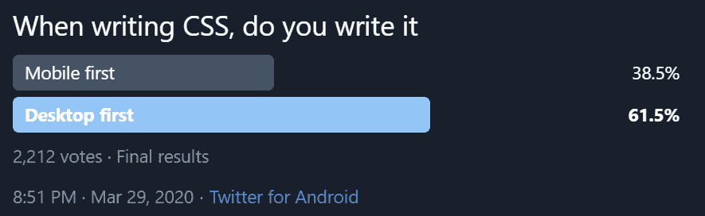
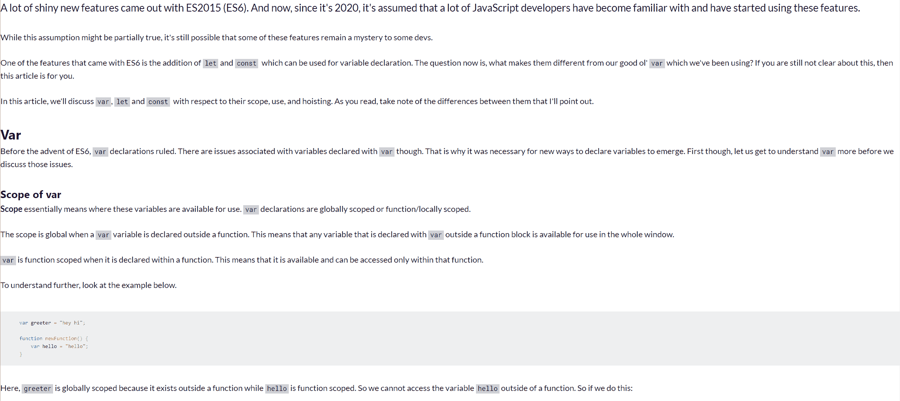

# 如何采取正确的方法进行响应式网页设计

> 原文：<https://www.freecodecamp.org/news/taking-the-right-approach-to-responsive-web-design/>

不久前，我在 Twitter 上做了一项民意调查，结果让我大吃一惊。

我不仅预计结果会是相反的，**我认为移动优先将获得至少 80%的选票**。



Desktop-first wins with more than 61% of the vote!

在回复中，一些人解释了为什么他们首先写桌面。这些原因的一般主题:

*   这就是设计师提供的全部内容
*   这就是他们团队的运作方式
*   他们只学习在桌面上编写 CSS，所以这看起来是自然的进展
*   客户希望看到桌面版本

## 什么是移动优先

Mobile-first 是指我们开始为移动设备编写 CSS，然后使用媒体查询为更大的屏幕尺寸添加样式。

通常，这意味着媒体查询使用一个`min-width`。我们使用媒体查询来添加或覆盖设置断点和更大断点的样式，如下例所示:

```
.sales-points {
  padding: 3em 0;
}

@media (min-width: 600px) {
  .sales-points {
    display: flex;
    justify-content: space-between;
  }
}
```

在这个例子中，对于小屏幕，我们只是应用一些填充。假设站点的这一部分有子元素，我们将这些子元素转换成最小宽度为`600px`的列。

所以当视窗大于或等于`600px`时，我们将拥有列。其余时间，事情堆积如山。

正如你可能已经猜到的，**桌面优先的方法是反过来的**。我们的 CSS 是为大屏幕编写的，然后我们使用媒体查询对较小的尺寸进行更改，一般使用`max-width`媒体查询。

## 为什么移动优先更容易

甚至在我们写一行 CSS 之前，网站自然会有反应。

如果你去掉互联网上任何页面的 CSS，甚至是一些 2001 年为特定屏幕尺寸制作的网站，你现在就有了一个响应迅速、移动友好的网站！

### 桌面风格往往更复杂

当我们为桌面优先设计风格时，我们增加了宽度、栏数，并四处移动东西。我们增加了复杂性。我们这样做是有充分理由的，因为我们有更多的房地产可以利用。

我们不仅想利用这一点让事情看起来更有趣，而且如果我们不在大屏幕上让事情变得更复杂，事情看起来就不会很好。即使你有一个*非常*简单的网站，你也不希望它的文本从一边延伸到另一边。

看看 FCC 新闻上的一篇文章从一边到另一边会是什么样子。



我们都同意你从来没有读过这样的东西，是吗？我不得不把我的头从左向右移动一点来阅读我屏幕上的一整行。太可怕了。

### 移动布局往往非常简单，使得从那里开始非常容易

所有回复我的人都说他们的客户更喜欢看到桌面版本，或者他们的设计师只给了他们桌面排版，我认为首先从移动开始更容易。

对于许多网站来说，一旦你设置好了你的版式，你就已经成功了 70%。比如:

*   `font-family`
*   `font-size`
*   `font-weight`
*   `margin`(在你的文本元素上)

接下来，您可以对布局元素进行一些非常基本的布局样式设计，例如:

*   `padding`
*   `background-color`
*   `color`
*   也许还有一些关于`margin`的调整

在那个阶段，从小屏幕的布局角度来看，事情会变得非常好。这意味着，无需编写任何媒体查询，你就拥有了一个功能齐全的移动网站。

如果你觉得特别懒，或者有一个非常简单的站点，你可以在你的容器上贴一个`max-width`来完成整个事情，甚至根本不用担心媒体的询问！

大多数时候，我们确实希望在更大的屏幕上玩游戏，这就是为什么我觉得移动优先是一条出路。这是向上发展的自然过程。

## 移动优先与桌面优先的比较

下面是一个 CodePen，它有一个非常简单的布局，使用了桌面优先和移动优先的方法。

[https://codepen.io/kevinpowell/embed/preview/ZEGdQgN?height=300&slug-hash=ZEGdQgN&default-tabs=html,result&host=https://codepen.io](https://codepen.io/kevinpowell/embed/preview/ZEGdQgN?height=300&slug-hash=ZEGdQgN&default-tabs=html,result&host=https://codepen.io)

如果你打开笔，调整视窗大小，你会发现最终结果是完全一样的。

但是，如果使用任何一种方法的最终结果都是完全一样的，那么您采用哪种方法又有什么关系呢？

### 桌面优先会导致冗余代码

在上面的笔中，桌面优先的方法使用以下代码:

```
/*  desktop-first */
.desktop-first .sales-points {
  display: flex;
  justify-content: space-between;
}

.desktop-first .sales-point {
  width: 30%;
}

@media (max-width: 600px) {
  .desktop-first .sales-points {
    display: block;
  }

  .desktop-first .sales-point {
    width: 100%;
  }
}
```

正如你在 CodePen 中看到的，它工作得非常好，但是当我们使用桌面优先的方法时，这里有一堆代码是多余的。

请注意，我们首先声明了一个`display: flex`,然后在媒体查询中将它放回默认的`display: block`。此外，对于我们的列，我们更改了`width`，然后，再一次，稍后回到缺省值。

移动优先的方法有更少的冗余代码。因为没有文本或背景颜色的样式，所以除了我在媒体查询中需要的样式之外，没有其他样式！

```
/*  mobile-first */
@media (min-width: 600px) {
  .mobile-first .sales-points {
    display: flex;
    justify-content: space-between;
  }

  .mobile-first .sales-point {
    width: 30%;
  }
}
```

## 回到默认值应该是一个危险信号

我意识到有些事情比这更复杂(我们很快就会明白)，但是我在这里担心的大部分是从布局的角度。

对于我在上面创建的布局，我没有为移动优先的方法编写一行代码。我只是从一开始就依赖文档是如何流动的。在桌面优先的方法中，我必须解决这两个问题，因为我需要将事物重置回它们的默认状态。

对我来说，我将像`display`和`width`这样的东西重置为默认状态，这是一个危险信号。意思是我在写本可以避免的东西。那意味着我在浪费时间。

## 有些事情没那么简单

有些组件在不同的屏幕尺寸下看起来完全不同，比如导航菜单。其他时候，移动设备上的**样式需要被桌面覆盖，最终变成多余的**。

在下面的视频中，我遇到了这个问题，我需要使用`position: absolute`为较小的屏幕移动一个元素。与其必须定位它，然后在更大的屏幕尺寸下将位置重置回默认位置，它看起来像是一个`max-width`媒体查询的逻辑选择。

如果你点击视频上的播放，它应该从我处理这个问题的地方开始，如果你想看它的运行(17:41，以防它没有在正确的地方开始)。

[https://www.youtube.com/embed/_kF3k0vDMNA?start=1061&feature=oembed](https://www.youtube.com/embed/_kF3k0vDMNA?start=1061&feature=oembed)

所以有时候会有例外，这没什么不好。我的观点不是我们应该是用一种方式做事的机器人。有时候不同的方法是有意义的，但是我相信有一个通用的经验法则会有所帮助。

所以下次你设计网站的时候，即使你只有一个桌面模型，也要试着先从手机开始。这根本不需要做更多的工作，从长远来看，我敢打赌这将为您节省大量多余的代码。这也很简单！

1.  从排版开始
2.  添加颜色和填充
3.  将任何布局相关的内容放入`min-width`媒体查询

当你完成了你的布局，你不仅完成了你的客户渴望看到的桌面版本，而且你 90%的时候也完成了你的移动版本，甚至没有真正考虑过它。

## 你是否在努力让事情变得有反应？

让网站具有响应性是很多人告诉我他们很纠结的一个话题。为了提供帮助，**我创建了一个名为[征服响应式布局](https://courses.kevinpowell.co/conquering-responsive-layouts)** 的免费课程。这是一个为期 21 天的挑战，在这个挑战中，我们将每周讨论一个话题，每个话题都会增加我们已经学到的东西。

我意识到我们都忙于孩子、家庭、工作等等，所以每天只有 10-30 分钟的课，一周 2-3 节课。在这期间，你会有一些小的挑战要完成，慢慢地，你就可以轻松地做出响应性的布局了。

该课程将于 4 月 13 日推出，因为这是一个为期 21 天的课程，所以当天关门。[点击此处报名](https://courses.kevinpowell.co/conquering-responsive-layouts)开始征服响应式布局！

如果你是在事后读到这篇文章的，你可以去报名参加下一次的发布会，但它几个月内不会再次开放。