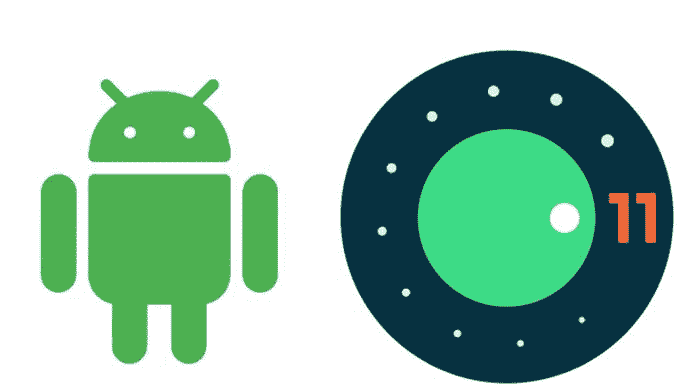

# 最新的安卓版本是什么？以及如何更新到现在的 Android OS？

> 原文：<https://www.freecodecamp.org/news/how-to-update-to-the-current-android-version/>

在过去的几年里，Android 操作系统已经主导了移动操作系统的格局，截至 2019 年，其市场份额超过 86%。该系统提供了高性能和安全的使用，并带有新功能的定期版本更新。

正因为如此，很多安卓用户都想知道如何查看自己当前的安卓版本，并更新到最新版本。

因此，在本文中，我们将学习如何确定您的智能手机运行的是哪个版本，以及如何安装 Android 操作系统更新。但在此之前，让我们快速了解一下 Android 版本的历史。

## **安卓操作系统简史**

谷歌在 2008 年末首次推出革命性的安卓操作系统，作为苹果 iOS 的替代产品。

自诞生以来，Android 已经有了 12 个版本，有时甚至一年发布不止一个版本。

谷歌开发者的持续支持使该系统成为 Play Store 中拥有近 300 万个应用的顶级操作系统。这有助于将 Android 应用程序开发从 Java 转移到 Kotlin，并确保了 Android 开发人员的高薪和市场需求。

在这里，我收集了一个简短的列表来展示操作系统是如何变化和发展来为用户提供高级功能的。在其生命周期的大部分时间里，操作系统版本由一个数字和一个代号来指定。

*   Android 1.0 到 1.1——谷歌最初的移动操作系统提供了基本的功能，集成了 Gmail、地图、日历和 YouTube 等应用。
*   Android 1.5 或纸杯蛋糕(Cupcake)于 2009 年初发布，这是该操作系统的第一个命名版本。它包括一个屏幕键盘，并引入了第三方应用程序在移动设备上运行的框架。
*   Android 2.0-2.1 或艾克蕾尔 2.0 版本为操作系统增加了实时交通信息、语音导航和缩放功能。
*   Android 2.3 或姜饼-2010 年发布的这款操作系统专注于黑色和绿色界面，因为 Android 开始开发出独特的外观。
*   Android 3.0-3.2 或 Honeycomb -发布于 2011 年，这一版本的操作系统专门针对平板设备，并引入了屏幕按钮。
*   **Android 4.0 或冰激凌三明治**——这是一个 2011 年发布的手机和平板电脑统一操作系统，具有全息外观，在使用系统时大量使用滑动功能。
*   **Android 4.4 或 Kit-Kat**-2013 年末，这一更新减轻了界面的配色方案，并向世界介绍了“好的，谷歌”支持。
*   **安卓 5.0-5.1 或棒棒糖**-2014 年的升级做出了重大改变。谷歌引入了基于卡片的材料设计标准，用来统一操作系统显示的项目的外观。
*   Android 6.0 或棉花糖(Marshmallow)——2015 年这一相对较小的更新是谷歌每年发布一个新的编号版本模式的开始。
*   **Android 7.0-7.1 或者牛轧糖** - 2016 在 Android OS 词库中的词条增加了原生分屏模式，推出了 Google Assistant。
*   **Android 9 或 Pie**——谷歌在 2018 年 8 月发布了这个最新命名的 Android 版本。对用户来说，这个版本最明显的更新是用户界面的大 Home 和小 Back 按钮以及[新的安全特性](https://www.freecodecamp.org/news/the-new-security-features-in-android-pie-and-why-im-excited-about-them-4a2f45be61fe/)。
*   Android 10 是 OS 的最后一个实时版本，我们将在下面详细介绍。

## **Android 10 的主要特性**

Android 10 于 2019 年 9 月 3 日发布。它有许多新的和改进的功能，如果你还在使用版本 9，这是升级你的 Android 操作系统的好理由。

下面是当前 Android 版本的一些亮点。

*   **实时字幕**让用户能够自动为设备上播放的媒体添加字幕。
*   **智能回复**通过建议回复和行动来帮助简化沟通。
*   **声音放大器**让您微调手机的音频设置，让您听得更清楚。
*   **手势导航**引入了更直观的滑动和拉动方式，为 Android 界面提供了更大的灵活性。
*   **黑暗主题**使用真黑节省电池电量，让眼睛得到休息。一些用户可能更喜欢它而不是 Android 的正常外观。
*   **增强的安全设置**让您更好地控制数据隐私。您可以控制如何从同一设置区域共享数据和位置信息。
*   **数字福利**是一种工具，致力于帮助用户在工作和生活之间找到正确的平衡。它的功能可以帮助你更有效率，或者摆脱一些急需的放松。
*   **聚焦模式**旨在通过最大限度地减少干扰，帮助用户专注于特定任务。它可以让你通过简单的点击来暂停那些可能让你分心的应用程序。
*   **Family Link** 能够设定数字基本规则，帮助父母引导孩子的在线活动。为您的家人设置屏幕时间限制、内容限制和应用管理。

如果你最近购买了一个新的 Android 可比设备，它可能安装了 Android 10。如果不是这样，这些功能可能会说服你需要更新手机或平板电脑上的 Android 操作系统。

## **检查您当前的 Android 操作系统并更新到版本 10**

当你准备升级你的移动设备时，你需要知道你的机器上可以运行的最新的 Android OS 版本是什么。一些较旧的设备可能在它们能够处理的版本方面受到限制。

根据设备的类型和年龄，获取 Android 操作系统下载的方法可能会有所不同。新设备将更快地接收更新，谷歌设备的用户将在更新可用时收到通知。

以下是如何更新你的 Android 操作系统。在执行实际更新之前，应该采取一些预备步骤。

### 检查您的 Android 版本

执行版本检查所需的确切步骤将由您的设备类型决定。你想得到关于手机的**信息，这可以在设备的**设置**中找到。您也可以在此处找到型号，并在开始更新前记下。**

1.  进入**设置**，向下滚动找到**系统**类别。

2.在**系统设置**部分点击**关于设备**

3.在这里向下滚动到列表的末尾，直到你看到 **Android 版本**，这意味着你的手机正在运行的版本。

如果您决定手动更新您的操作系统，在此之前，请记住以下一些提示:

**备份你的数据** -你应该定期备份你的数据。操作系统升级之前总是备份的好时机。你永远不知道会发生什么，所以不要拿你的重要数据冒险。许多备份应用程序可用。弄一个来用吧。

**验证您的可用空间** -升级将详细说明您的升级需要多少空间。请确保您有足够的空间，或者从设备上移走一些东西，以便为更新释放足够的空间。

**更新操作系统** -如果您收到了无线(OTA)通知，您只需打开它并点击更新按钮。您也可以前往**查看**设置**中的**更新来启动升级。

**注意:**一些用户可能更喜欢将他们的设备根化，以便在有更新时立即获取更新，并且能够对设备和设备上运行的应用程序进行更多控制。

## **Android 11 有什么值得期待的**

尽管版本 10 有相当大的技术进步，但谷歌计划在 2020 年的某个时候发布最新的 Android 操作系统。你可能已经注意到了，公司不喜欢停滞不前。

Android 11 将重点关注隐私和安全、应用程序行为以及包括 API 在内的新功能的变化。该操作系统将为 5G 和可折叠设备提供支持，使其能够利用向更快网络的移动。一些具体特征是:

*   生物认证功能，更安全地保护您的设备；
*   限制可重复的权限请求，以使应用程序更加用户友好；
*   允许向摄像机、麦克风和定位服务授予临时权限。
*   应用程序可以自动运行身份验证，并连接到可用的安全 WiFi 热点；
*   扩展的摄像头支持；
*   聊天气泡可以为单个应用程序打开和关闭。

这些只是用户所期待的 Android 11 新功能中的一小部分。应用程序设计人员也将享受到他们可以为自己的作品带来的扩展功能。

## 包扎

除了极少数情况，你应该在新版本发布时升级你的 Android 设备。谷歌一直为新版本的 Android 操作系统的功能和性能提供了许多有用的改进。如果你的设备可以处理它，你可能只是想检查一下。