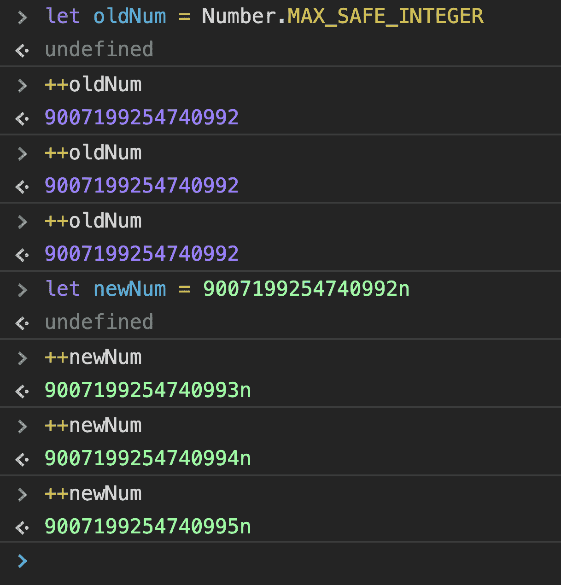
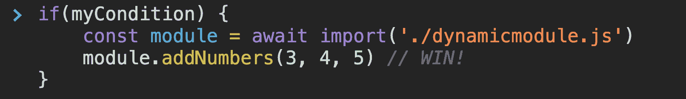
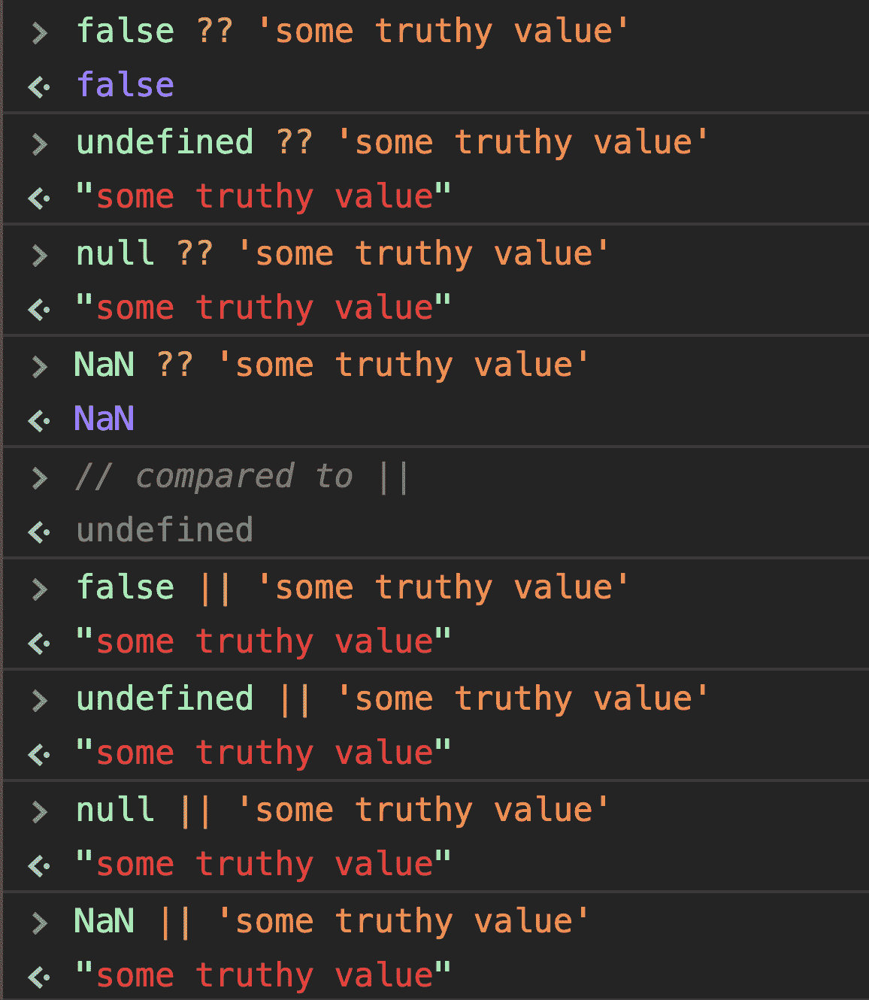
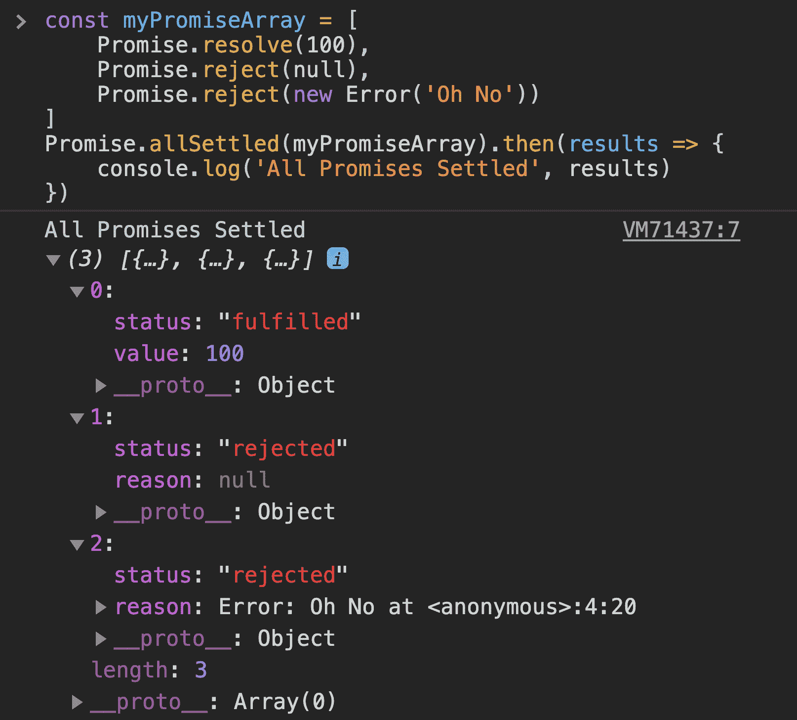
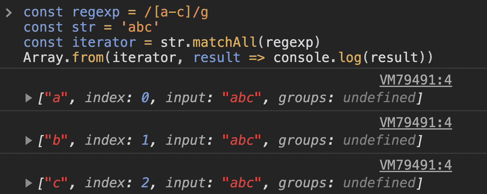
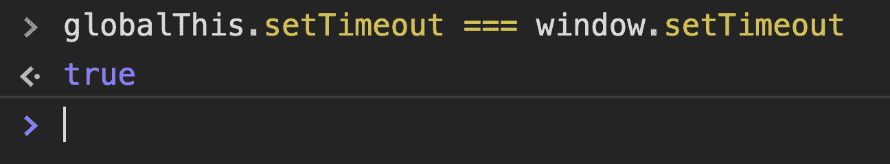

# 您应该知道的 ES2020 中的 10 个新 JavaScript 特性

> 原文：<https://www.freecodecamp.org/news/javascript-new-features-es2020/>

好消息 ES2020 新功能现已完成！这意味着我们现在对 ES2020 中发生的变化有了完整的了解，这是 JavaScript 的新的改进规范。让我们来看看这些变化是什么。

# 第一:重口味

JavaScript 中最令人期待的特性之一 BigInt 终于出现了。它实际上允许开发人员在他们的数据处理 JS 代码中有更多的整数表示。

目前，JavaScript 中可以存储的最大整数是`pow(2, 53) - 1`。但是 BigInt 实际上允许你做得更好。



然而，正如您在上面看到的，您需要在数字的最后追加一个`n`。这个`n`表示这是一个 BigInt，应该被 JavaScript 引擎区别对待(被 v8 引擎或它使用的任何引擎区别对待)。

这种改进不是向后兼容的，因为传统的数字系统是 IEEE754(它不能支持这种大小的数字)。

# #2:动态导入

JavaScript 中的动态导入为您提供了将 JS 文件作为模块动态导入应用程序的选项。这就像你现在用 Webpack 和 Babel 做的一样。

这个特性将帮助您发布按需请求代码，更好地称为代码分割，而没有 webpack 或其他模块捆绑器的开销。如果愿意，还可以有条件地在 if-else 块中加载代码。

好的一面是，您实际上导入了一个模块，因此它永远不会污染全局名称空间。



# #3:无效合并

Nullish 合并增加了真正检查`nullish`值而不是`falsey`值的能力。你可能会问，`nullish`和`falsey`值有什么区别？

在 JavaScript 中，很多值都是`falsey`，比如空字符串，数字 0、`undefined`、`null`、`false`、`NaN`等等。

然而，很多时候你可能想检查一个变量是否为空——也就是说，它是`undefined`还是`null`,比如当一个变量可以有一个空字符串，甚至一个假值时。

在这种情况下，您将使用新的 nullish 合并运算符，`??`



您可以清楚地看到 OR 运算符总是返回 true 值，而 nullish 运算符返回非 nulllish 值。

# #4:可选链接

可选的链接语法允许您访问深度嵌套的对象属性，而不用担心该属性是否存在。如果存在，太好了！如果不是，将返回`undefined`。

这不仅适用于对象属性，也适用于函数调用和数组。超级方便！这里有一个例子:


# #5:承诺。全部解决

`Promise.allSettled`方法接受一组承诺，并且只在所有承诺都解决时才解决——解决或拒绝。

这在以前是不可用的，尽管一些类似于`race`和`all`的实现是可用的。这给 JavaScript 带来了“只运行所有承诺——我不关心结果”。



# #6:字符串#匹配

`matchAll`是添加到`String`原型中的一个新方法，与正则表达式相关。这将返回一个迭代器，它将一个接一个地返回所有匹配的组。让我们看一个简单的例子:



# #7:全球 This

如果你写了一些跨平台的 JS 代码，这些代码可以在 Node 上运行，可以在浏览器环境中运行，也可以在 web workers 内部运行，你将很难获得全局对象。

这是因为对于浏览器来说是`window`，对于 Node 来说是`global`，对于 web 工作者来说是`self`。如果有更多的运行时，它们的全局对象也会不同。

所以你必须有自己的检测运行时的实现，然后使用正确的全局变量——也就是说，直到现在。

ES2020 带给我们的`globalThis`总是指全局对象，无论您在哪里执行代码:



# #8:模块名称空间导出

在 JavaScript 模块中，已经可以使用以下语法:

```
import * as utils from './utils.mjs'
```

然而，对称的`export`语法并不存在，直到现在:

```
export * as utils from './utils.mjs'
```

这相当于以下内容:

```
import * as utils from './utils.mjs'
export { utils }
```

# #9:定义良好，按顺序排列

ECMA 规范没有规定`for (x in y)`应该以什么顺序运行。尽管在此之前，浏览器自己实现了一致的顺序，但这在 ES2020 中已被正式标准化。

# #10: import.meta

这个`import.meta`对象是由 ECMAScript 实现创建的，带有一个 [`null`](https://developer.mozilla.org/en-US/docs/Web/JavaScript/Reference/Global_Objects/null) 原型。

考虑一个模块，`module.js`:

```
<script type="module" src="module.js"></script> 
```

您可以使用`import.meta`对象访问模块的元信息:

```
console.log(import.meta); // { url: "file:///home/user/module.js" }
```

它返回一个带有`url`属性的对象，指示模块的基本 URL。这可以是从中获取脚本的 URL(对于外部脚本)，也可以是包含文档的文档基 URL(对于内联脚本)。

# 结论

我喜欢 JavaScript 社区已经发展和正在发展的一致性和速度。看到 JavaScript 是如何从一种被嘘了 10 年的语言发展成为今天最强大、最灵活和最通用的语言之一，真是令人惊讶和不可思议。

你希望以一种全新的方式学习 JavaScript 和其他编程语言吗？前往一个[面向开发者的新平台](https://codedamn.com)我今天正在尝试它！

你最喜欢 ES2020 的什么功能？请在推特 [Twitter](https://twitter.com/mehulmpt) 和 [Instagram](https://instagram.com/mehulmpt) 上发推文并与我联系，告诉我吧！

这是一篇由我的视频组成的关于同一主题的博文。如果你能给它一些爱，它对我来说就是整个世界！

[https://www.youtube.com/embed/Fag_8QjBwtY?feature=oembed](https://www.youtube.com/embed/Fag_8QjBwtY?feature=oembed)