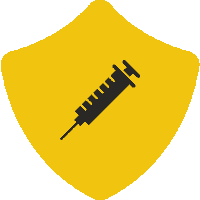
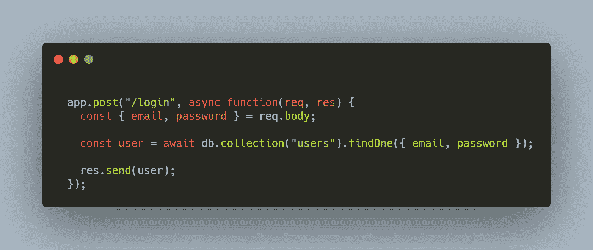
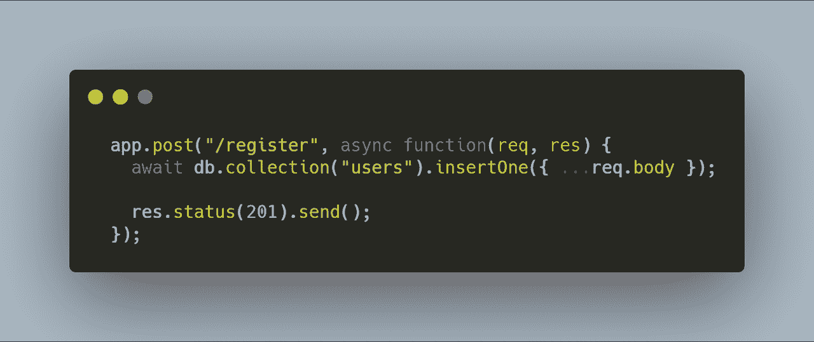
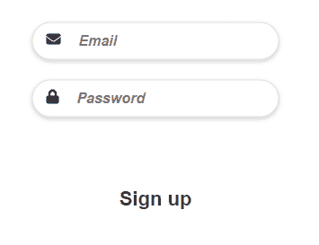
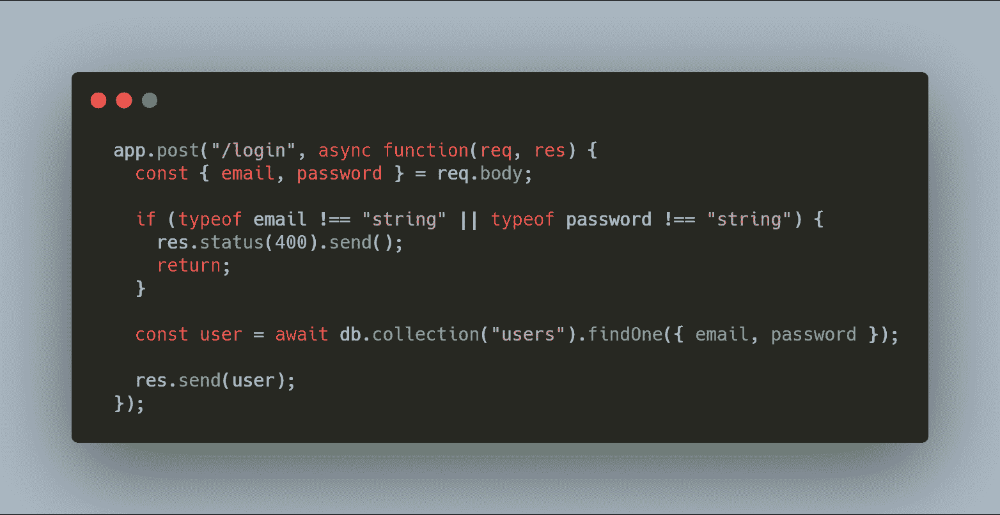
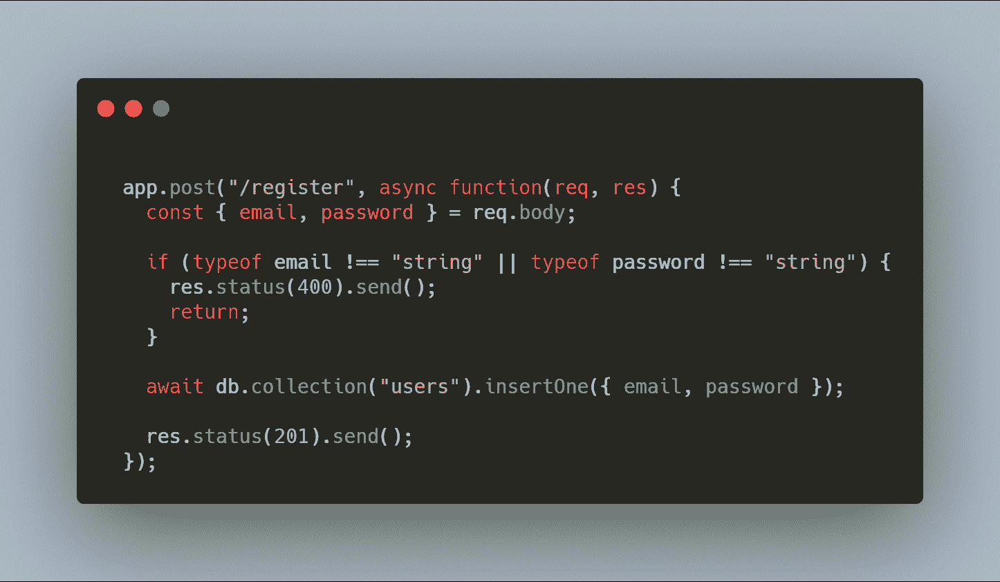
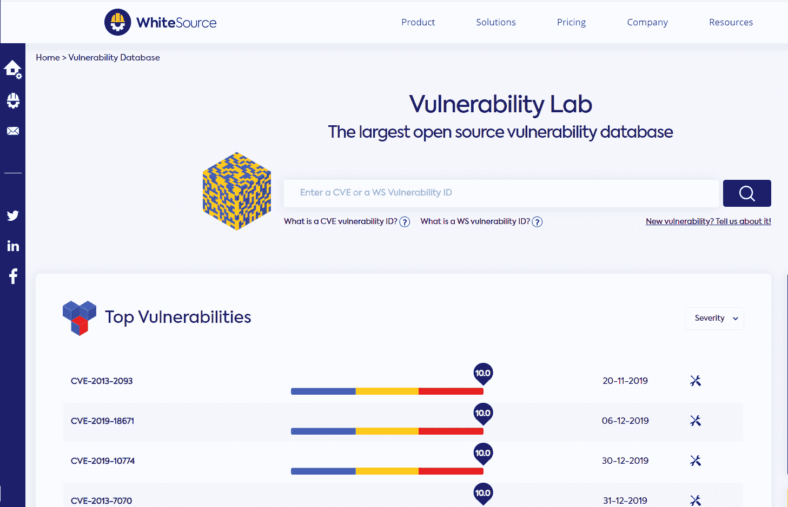
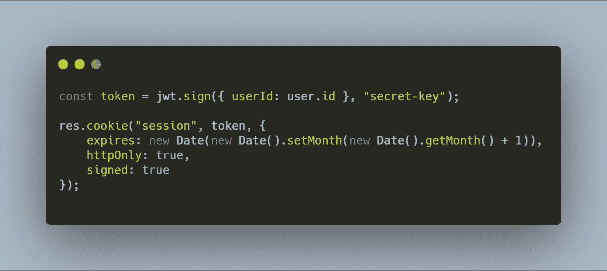

# OWASP 十大技术——对网络安全的技术深度探究

> 原文：<https://www.freecodecamp.org/news/technical-dive-into-owasp/>

在安全性方面，有许多漏洞需要处理和预防，但有些漏洞比其他漏洞更需要关注。毫无疑问，帮助您解决这些安全问题的最佳指南是开放 Web 应用程序安全项目。

OWASP 最初只是一个简单的项目，旨在提高开发者和管理者对最常见的网络安全问题的认识。如今，它已经成为应用程序安全性的标准。

在本文中，我们将对 OWASP 项目中列出的一些漏洞以及如何减少这些漏洞进行更深入的技术概述。我们将把坏代码和好代码的例子放在一起，帮助你更好地理解和防止这些类型的攻击，并提高你的 web 应用程序的安全性。

## 注射



当程序允许攻击者提供不可信/恶意的输入数据时，就会出现这种类型的漏洞。这会导致解释器执行意外的命令，通常会泄露原本不可访问的数据，或者绕过某些安全实现。

注入漏洞最常见的原因是软件未能对用户的输入进行过滤、验证或净化。

让我们来看两个允许注入攻击发生的“错误代码实现”。

### 错误代码示例 1:

假设您有一个接收电子邮件的登录路由，不管出于什么原因，它接收的是已经散列的密码。



Bad code example 1

如果我们知道一个用户的电子邮件地址，例如*myemail@email.com*，那么我们可以通过发送下面的 JSON 对象毫不费力地绕过这个登录系统，这将创建一个 NoSQL 注入。

```
 {
        "email": "myemail@email.com",
        "password": { "$ne": "" }
}
```

这个对象将指示 MongoDb 查找一个电子邮件为“myemail@email.com”的用户，其密码不同于空字符串。

这个例子可能有点牵强，但是看看下面的代码，看看是否能发现问题。

### 错误代码示例 2:

对于此示例，我们在界面上有一个注册表单，在后端有以下代码:



Bad example 2



Sign up view

我们如何利用这些代码？非常简单:假设这个例子中的用户模式是这样的:

```
export const UserSchema = new mongoose.Schema({
    email: {
        type: String,
        required: true,
        unique: true
    },
    password: {
        type: String,
        required: true
    },
    admin: {
        type: Boolean,
        default: false
    },
    accountConfirmed: {
        type: Boolean,
        default: false
    },
}, 
);
```

现在，只需使用 Postman 或您喜欢使用的任何其他工具发送以下 POST 请求:

```
{
    "email": "my-email",
    "password": "123321",
    "admin": "true",
    "accountConfirmed": "true"
}
```

现在你已经成功地在这个网站上注册了——不是一个简单的用户，而是一个确认的管理员帐户。

这里的问题是，如果我们只是简单地使用:

```
{ ...req.body }
```

然后，我们将创建一个新的用户对象，它包含了对象主体*和*中的所有属性，因此我们可以在这里注入任何我们想要的东西。

### 重构

让我们重构两个例子中的代码来防止这种攻击。

对于第一个示例，我们可以检查电子邮件和密码的预期类型。在我们的例子中，我们在两个字段中都等待一个字符串:



如果我们再次提供相同的参数:

```
{
	"email": "myemail@email.com",
	"password": { "$ne": "" }
}
```

我们将收到一个 **400 错误请求**响应。我们可以更进一步，检查电子邮件是否实际上是一封电子邮件，而不仅仅是一个简单的字符串，但这已经超出了我们的范围。

对于第二种情况，我们可以通过去除不需要的属性来使用“白名单”服务器端输入验证:



这些例子是针对 NoSQL 注射的，但是这种技术也可以扩展到 SQL 注入。

## 使用具有已知漏洞的组件


上面我们看到了一些由于我们的错误而导致的执行不佳的安全标准。然而，有些情况下，问题不是来自我们编写的代码，而是来自我们在项目中使用的开源代码。

攻击者可以利用这些组件的漏洞来执行恶意代码或使程序以不希望的方式运行。

尽管这看起来不在你的掌控之中，但事实并非如此。我们可以采取一些措施来防止这种问题。

例如，我们可以对客户端和服务器端的组件版本进行连续清点，并删除未使用的依赖项和/或功能。

我们可以监控组件中漏洞的来源。



White Source Dashboard

为了确保您的组件是安全的，您应该定期检查漏洞数据库并及时应用安全补丁。这将有助于你保持安全。

## 身份验证被破坏


当 web 应用程序没有很好地实现身份验证/会话管理技术时，这个漏洞就会出现。这是因为它让攻击者能够访问他们本来无权访问的帐户。

这种安全问题以暴力攻击的形式最为普遍，当会话 id/令牌以容易被窃取的形式暴露时，这种安全问题尤为普遍。

### 错误代码示例 1:

让我们以前面的代码片段为例。我们对它做了一点调整，当没有用户使用给定的电子邮件和密码时，我们会发送一个 **401** (未授权)响应。


即使这是重构后的代码，它仍然容易受到身份验证失败的攻击。在这里，如果我们使用错误的密码，我们会得到 401 响应。但是，如果密码很弱，我们可以暴力破解，直到我们猜出它。

### 重构

我们可以通过简单地在我们的路由上使用速率限制来防止暴力攻击。现在，用户有 3 次机会进行身份验证，在此之后，在接下来的 15 分钟内，他们将无法再在此路由上发送请求(并将得到一个响应 **429 太多请求**)。


关于这个主题的下一种类型的漏洞尤其与 JSON web 令牌管理不佳有关。

### 错误代码示例 2:

下一个例子在登录系统中非常常见:


大多数情况下，使用 JWT 的登录系统都是以这种方式实现的。在用户发送正确的凭证后，使用他们的 **id** 或另一个**唯一值**生成一个令牌。然后，令牌被发送到前端，并保存在应用程序中。或者，如果需要持久认证，它将被保存在 cookies 或本地存储中。

这种方法的问题是，应该受到保护的令牌现在可以通过前端代码访问，因此容易受到攻击。注入前端 JavaScript 的恶意代码可以访问 cookies 或本地存储并窃取该令牌。

### 重构

这个问题可以通过下一个实现来解决。



这次令牌也保存在 cookies 中，但它是从后端代码中用 **httpOnly** 属性保存的。这意味着不能从前端运行的任何代码访问它。

为了使其更加安全，令牌与**签名的**属性一起保存，这使得 cookies 用秘密密钥签名。

你可以更进一步，用**安全标志**阻止 **http** 协议，强制 cookie 通过 **https** 发送。

## 敏感数据暴露


顾名思义，当 web 应用程序未能充分保护敏感数据时，就会引发此漏洞。

虽然最近的法律变化，如 [GDPR](https://www.ncsc.gov.uk/information/GDPR) 应该确保敏感数据不被暴露，但很大比例的 web 应用程序未能满足这些要求。

当使用 HTTP、SMTP 和 FTP 以明文传输数据时，或者当使用弱/旧的加密算法时，通常会发生这种情况。

一种可能的情况如下:

网站不会对所有页面都使用或强制使用 TLS。攻击者监控网络流量，将 HTTPS 连接降级为 HTTP，拦截请求，并窃取发送的信息。也许他们甚至窃取用户的会话 cookie，从而访问或修改用户的私人数据。

另一种情况可能是:

密码存储在数据库中，不加盐或者作为简单的弱散列。文件上传缺陷或任何其他攻击使得攻击者能够检索密码数据库。之后，所有的散列都可以用一个预先计算好的值的彩虹表暴露出来，这样就给了攻击者用户实际的普通密码。