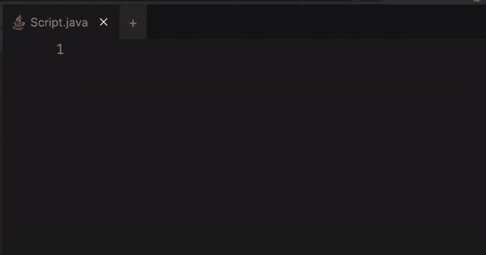
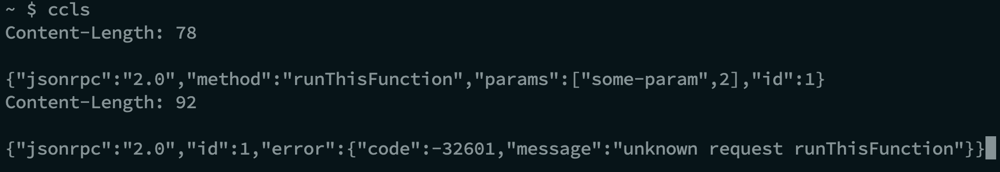
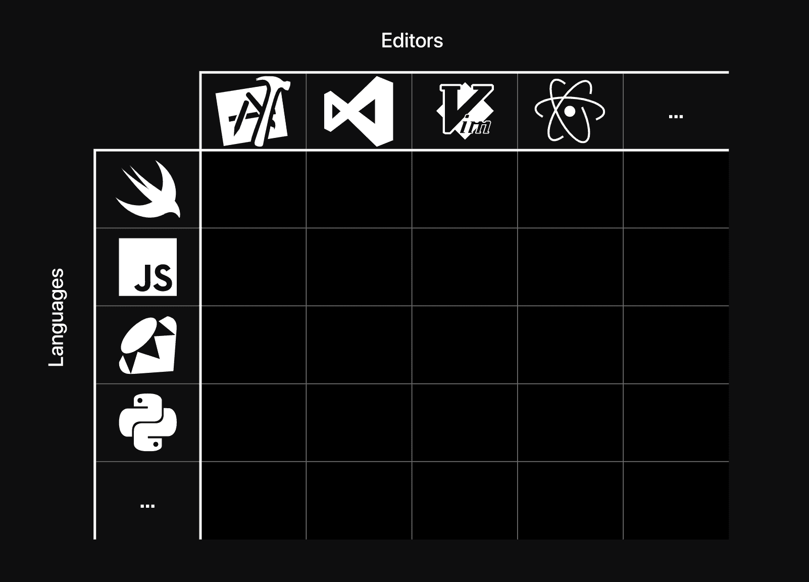

# 语言服务器协议如何影响 ide 的未来

> 原文：<https://www.freecodecamp.org/news/language-server-protocol-and-the-future-of-ide/>

Visual Studio 代码的发布以一种不可逆转的方式影响了开发者生态系统。它是开源的，免费的，最重要的是，它是一个超级强大的工具。

但是通过 VSCode，微软在 2016 年赋予了另一个超级重要的东西以生命，这个东西不太为人所知。它被称为语言服务器协议。

# 什么是语言服务器协议？

语言服务器协议(LSP)是一种与语言服务器对话的协议或方式(就像 HTTP 或 FTP 一样)。

语言服务器是在普通服务器上运行的特殊程序。它们接受您正在编码的编辑器的元状态(例如，您的光标当前在编辑器中的什么位置，您现在正停留在哪个标记上)，并返回一组操作/指令——接下来应该出现什么标记，当您用 CMD/Ctrl 键单击该标记时应该发生什么，等等。

这种通信使用协议定义的一组规则进行。语言服务器协议可以被认为是 HTTP 的精简版本，只在 JSON-RPC 上通信。

# 为什么需要 LSP？

你看到那些花哨的自动建议和错误信息总是在 VSCode 中弹出吗？仅仅通过从 VSCode marketplace 中添加一个简单的扩展，您如何获得针对 C、Python、Java 等完全不同的语言的所有智能感知能力？那来自 LSP。

对 HTML/CSS/JavaScript 的自动完成和智能感知的支持被嵌入到 VSCode 中(就像 PyCharm 嵌入 Python 支持一样)。但是，对其他语言的相同支持可以使用这些语言的语言服务器协议来实现。



# JSON-RPC 是什么？

JSON-RPC 代表 JSON 远程过程调用。它是一个架构(类似于 REST 是一个架构)，但是在 REST 中，基本单元是一个过程调用，而不是一个 API 端点。

以下是 JSON-RPC 的一个简单负载:

```
// Request
curl -X POST —data '{
  "jsonrpc": "2.0",
  "method": "runThisFunction",
  "params": [ "some-param", 2 ],
  "id": 1
}'
// Response
{
  "jsonrpc": "2.0",
  "result": "codedamn",
  "id": 1
} 
```

在这个例子中，我们按照 RPC 规范发送一个 JSON 编码的有效载荷。如果服务器被配置为正确处理 JSON-RPC，它将使用传递的参数执行方法`runThisFunction`,并以如下所示的形式返回结果。

# LSP + JSON-RPC

LSP 使用 JSON-RPC 与远程服务器通信。它是这样的:

```
Content-Length: <bytes of JSON>\r\n\r\n<json-payload> 
```

要写一个例子，应该是这样的:

```
Content-Length: 78

{"jsonrpc":"2.0","method":"runThisFunction","params":["some-param",2],"id":1} 
```

LSP 要求您通过`Content-Length`报头，然后是 2 个`CRLF`令牌`\r\n`。当运行的语言服务器如`ccls`收到这个消息时，它们会用一个适当的消息来响应:



当然，在上面的例子中，你可以看到`ccls`说没有叫`runThisFunction`的方法。但是您可以看到远程服务器也用一个带有 JSON-RPC 规范的`Content-Length`头来响应。

# 为什么所有这些都很重要？

随着正式协议 LSP 的引入，微软将著名的`M x N`问题简化为`M + N`问题。

M =不同语言(C，C++，PHP，Python，Node，Swift，Go 等。)
N =不同的编辑器(VSCode，Eclipse，Notepad++，Sublime Text 等。)



以前 M 个编辑器支持 N 种语言，需要 M*N 个解决方案。也就是说，每个编辑器必须以不同的方式实现对每种语言的本机支持。

随着 LSP 的引入，编辑器只需要实现对语言服务器协议的支持。一旦实现了，任何制作语言服务器(遵循 LSP 标准)的人都可以与编辑器无缝集成，而无需编辑器智能地“知道”它使用的是什么语言！

# ide 的未来

随着越来越多的语言推出它们的语言服务器，人们将有更多的能力来选择他们最喜欢的编辑器。

您将不再需要坚持只使用 XCode 进行快速开发，或者使用 PyCharm 进行 Python 开发。不仅如此，LSP 还可以直接实现到 JavaScript 中，以支持浏览器中的智能感知，就像我在 [codedamn](https://codedamn.com) 所做的那样，这是一个供开发人员学习和成长的平台！活着是一个激动人心的时刻！

和平，
Mehul