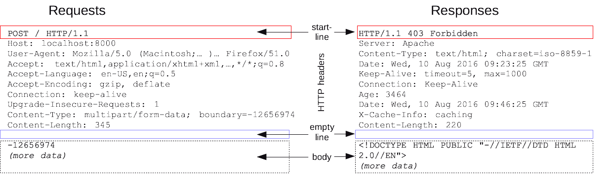
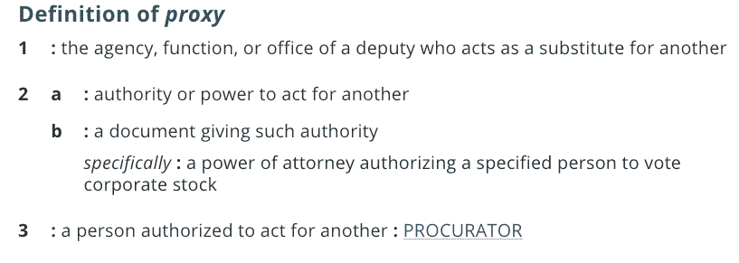
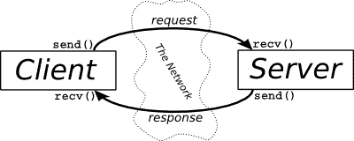
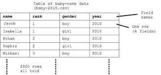
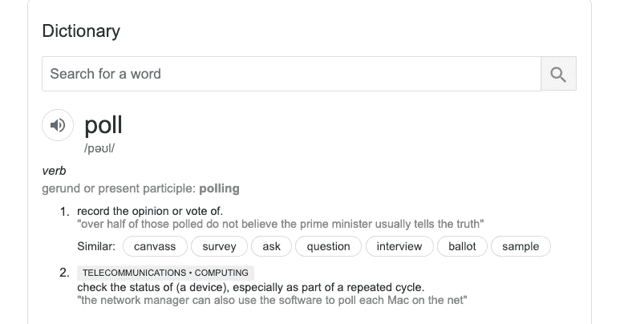

# 系统设计面试问题——你应该知道的概念

> 原文：<https://www.freecodecamp.org/news/systems-design-for-interviews/>

您可能听说过“架构”或“系统设计”这两个术语这些在开发人员的面试中会经常出现——尤其是在大型科技公司。

我在准备 FAANG 软件工程面试时写了这篇深入的指南。它涵盖了你在分布式系统中推理所需的基本软件系统设计概念，它帮助我在做了超过 15 年的公司律师后，以一名工程师的身份进入了谷歌。

这不是一个详尽的论述，因为系统设计是一个庞大的主题。但是如果你是一个初级或中级开发人员，这应该给你一个强大的基础。

从那里，您可以使用其他资源进行更深入的挖掘。我在这篇文章的底部列出了一些我最喜欢的资源。

我已经按照主题把这个指南分成了小块，所以我建议你把它收藏起来。我发现[间隔学习和重复](https://www.freecodecamp.org/news/use-spaced-repetition-with-anki-to-learn-to-code-faster-7c334d448c3c/)是学习和保留信息的非常有价值的工具。我把这个指南分成了几个小块，很容易进行间隔重复。

1.  [第一部分:网络&协议(IP、DNS、HTTP、TCP 等)](#section-1-networks-and-protocols)
2.  [第二部分:存储、延迟&吞吐量](#section-2-storage-latency-throughput)
3.  [第三部分:可用性](#section-3-system-availability)
4.  [第 4 部分:缓存](#section-4-caching)
5.  第五部分:代理人
6.  [第六部分:负载均衡](#section-6-load-balancing)
7.  [第 7 节:一致散列法](#section-7-consistent-hashing)
8.  第八部分:数据库
9.  [第九节:领导人选举](#section-9-leader-election)
10.  [第 10 部分:轮询、流式传输、套接字](#section-10-polling-streaming-sockets)
11.  [第 11 节:端点保护](#section-11-endpoint-protection)
12.  第 12 部分:消息&发布订阅
13.  [第 13 节:更小的必需品](#section-13-smaller-essentials)

我们开始吧！

## 第 1 部分:网络和协议

“协议”是一个奇特的词，在英语中有着完全独立于计算机科学的含义。它的意思是管理某事物的一套规章制度。一种“官方程序”或“必须做某事的官方方式”。

为了让人们连接到相互通信的机器和代码，他们需要一个能够进行这种通信的网络。但是交流也需要一些规则、结构和商定的程序。

因此，网络协议是管理机器和软件如何在给定网络上通信的协议。网络的一个例子是我们所钟爱的万维网。

你可能听说过互联网时代最常见的网络协议，如 HTTP、TCP/IP 等。让我们把它们分成几个基本部分。

### IP - [互联网协议](https://en.wikipedia.org/wiki/Internet_Protocol)

请将此视为协议的基础层。它是指导我们如何实现几乎所有互联网通信的基本协议。

IP 上的消息通常以“包”的形式传递，这些包是小束信息(2^16 字节)。每个数据包都有一个由两部分组成的基本结构:报头和数据。

报头包含关于数据包及其数据的“元”数据。该元数据包括源 IP 地址(数据包来源)和目的 IP 地址(数据包目的地)等信息。显然，这是能够将信息从一个点发送到另一个点的基础——您需要“从”和“到”地址。

而 [IP 地址](https://en.wikipedia.org/wiki/IP_address)是分配给连接到[计算机网络](https://en.wikipedia.org/wiki/Computer_network)的每个设备的数字标签，该网络使用互联网协议进行通信。有公有和私有 IP 地址，目前有两个版本。新版本被称为 IPv6，并且越来越多地被采用，因为 IPv4 正在耗尽数字地址。

我们将在本文中考虑的其他协议都是建立在 IP 之上的，就像你最喜欢的软件语言有建立在它之上的库和框架一样。

### TCP - [传输控制协议](https://en.wikipedia.org/wiki/Transmission_Control_Protocol)

TCP 是建立在 IP 之上的实用程序。正如你从阅读我的帖子中可能知道的，我坚信你需要理解*为什么*某样东西被发明，才能真正理解*它做什么*。

TCP 是为解决 IP 问题而创建的。IP 上的数据通常以多个包的形式发送，因为每个包都相当小(2^16 字节)。多个分组会导致(A)丢失或丢弃分组，以及(B)分组混乱，从而破坏传输的数据。TCP 通过以一种*有序*的方式保证数据包的*传输*来解决这两个问题。

由于建立在 IP 之上，除了 IP 报头之外，数据包还有一个称为 TCP 报头的报头。这个 TCP 报头包含关于分组顺序、分组数量等等的信息。这确保了数据在另一端被可靠地接收。它通常被称为 TCP/IP，因为它建立在 IP 之上。

在传输数据包之前，TCP 需要在源和目的地之间建立连接，这是通过“握手”来实现的。这个连接本身是使用数据包建立的，其中源通知目的地它想要打开一个连接，目的地说 OK，然后连接被打开。

实际上，这就是服务器在端口“监听”时发生的情况——就在它开始监听之前有一个握手，然后连接被打开(监听开始)。类似地，一个向另一个发送将要关闭连接的消息，从而结束连接。

### HTTP - [超文本传输协议](https://en.wikipedia.org/wiki/Hypertext_Transfer_Protocol)

HTTP 是建立在 TCP/IP 之上的抽象协议。它引入了一个非常重要的模式，称为请求-响应模式，专门用于客户端-服务器交互。

客户机只是一台请求信息的机器或系统，而服务器是一台响应信息的机器或系统。浏览器是客户端，网络服务器是服务器。当一个服务器向另一个服务器请求数据时，第一个服务器也是客户机，第二个服务器是服务器(我知道，这是同义反复)。

因此，这种请求-响应循环在 HTTP 下有自己的规则，这标准化了信息在互联网上的传输方式。

在这个抽象层次上，我们通常不需要太担心 IP 和 TCP。然而，在 HTTP 中，请求和响应也有消息头和消息体，它们包含可以由开发人员设置的数据。

HTTP 请求和响应可以被认为是具有键值对的消息，非常类似于 JavaScript 中的对象和 Python 中的字典，但又不相同。

下面是 HTTP 请求和响应消息中的内容和键值对的图示。



source: [https://developer.mozilla.org/en-US/docs/Web/HTTP/Messages](https://developer.mozilla.org/en-US/docs/Web/HTTP/Messages)

HTTP 还附带了一些“动词”或“方法”,它们是一些命令，可以让您了解打算执行什么样的操作。比如常见的 HTTP 方法有“GET”、“POST”、“PUT”、“DELETE”和“PATCH”，但还有更多。在上图中，在起始行中查找 HTTP 动词。

## 第 2 部分:存储、延迟和吞吐量

### 储存；储备

存储就是保存信息。您编写的任何应用程序、系统或服务都需要存储和检索数据，这是存储的两个基本目的。

但这不仅仅是存储数据，还包括获取数据。我们使用数据库来实现这一点。数据库是帮助我们存储和检索数据的软件层。

这两种主要类型的操作，存储和检索，也被不同地称为“设置、获取”、“存储、获取”、“写入、读取”等等。要与存储交互，您需要通过数据库，数据库充当您执行这些基本操作的中介。

“存储”这个词有时会愚弄我们，让我们从物理角度去思考它。如果我把自行车“存放”在车棚里，我可以期待下次打开车棚时它还在那里。

但是这在计算机世界中并不总是发生。存储大致可以分为两种类型:“内存”存储和“磁盘”存储。

在这两者中，磁盘存储往往是更健壮和“永久的”(不是真正永久的，所以我们经常用“持久”存储来代替)。磁盘存储是持久存储。这意味着当你保存一些东西到磁盘，关闭电源，或者重启服务器，这些数据将会“持续存在”。不会丢的。

然而，如果您将数据留在“内存”中，那么当您关机或重启，或者断电时，这些数据通常会被清除。

你日常使用的电脑，这两种存储类型都有。你的硬盘是
“持久”磁盘存储器，而你的 RAM 是短暂的内存存储器。

在服务器上，如果您跟踪的数据只在该服务器的会话期间有用，那么将它保存在内存中是有意义的。这比向持久数据库写东西要快得多，也便宜得多。

例如，单个会话可能意味着用户登录并使用您的站点。在他们注销后，您可能不需要保留您在会话期间收集的一些数据。

但是无论你想保留什么(比如购物车历史)，你都要把它放在持久磁盘存储器中。这样，您可以在用户下次登录时访问这些数据，他们将获得无缝的体验。

好了，这看起来很简单，也很基本，这是命中注定的。这是一本入门书。存储会变得非常复杂。如果你看一下储物产品和解决方案的范围，你会感到头晕目眩。

这是因为不同的使用情形需要不同类型的存储。为您的系统选择正确的存储类型取决于许多因素和应用程序的需求，以及用户与应用程序的交互方式。其他因素包括:

*   数据的形状(结构),或者
*   它需要什么样的可用性(什么样的停机时间适合您的存储)，或者
*   可伸缩性(读写数据的速度需要多快，这些读写是同时发生还是顺序发生)等，或者
*   一致性-如果您使用分布式存储来防止停机，那么您的存储中的数据一致性如何？

这些问题和结论要求你仔细考虑你的取舍。一致性比速度更重要吗？您需要数据库为每分钟数百万次操作提供服务，还是仅用于夜间更新？我将在后面的章节中讨论这些概念，所以如果您不知道它们是什么，请不要担心。

### 潜伏

随着您对设计支持应用前端的系统越来越有经验，您将会经常听到“延迟”和“吞吐量”这两个术语。它们对于您的应用程序和整个系统的体验和性能非常重要。人们往往倾向于在比预期更广泛的意义上使用这些术语，或者脱离上下文，但是让我们来解决这个问题。

**延迟**是对持续时间的简单衡量。多长时间？完成某事或产生结果的持续时间。例如:将数据从系统中的一个地方移动到另一个地方。你可能认为这是一个滞后，或者仅仅是完成一个操作所花费的时间。

最常见的延迟是“往返”网络请求——您的前端网站(客户端)向您的服务器发送查询并从服务器获得响应需要多长时间。

当你加载一个网站时，你希望它尽可能的快和流畅。换句话说，你希望*低*延迟。快速查找意味着低延迟。因此，在元素数组中查找值比在哈希表中查找值要慢(延迟较高，因为需要遍历数组中的每个元素才能找到想要的元素)(延迟较低，因为只需使用键在“固定”时间内查找数据。不需要迭代。).

同样，从内存中读取要比从磁盘中读取快得多(此处 *阅读更多[)。](https://stackoverflow.com/questions/1371400/how-much-faster-is-the-memory-usually-than-the-disk)*但两者都有延迟，您的需求将决定您为哪些数据选择哪种类型的存储。

从这个意义上说，延迟是速度的反义词。你想要更高的速度，你想要更低的延迟。速度(尤其是通过 HTTP 的网络呼叫)也取决于距离。因此，[从伦敦到另一个城市](https://wondernetwork.com/pings/London)的延迟，将受到与伦敦的距离的影响。

可以想象，您希望设计一个系统来避免 ping 远程服务器，但是将内容存储在内存中对您的系统来说可能不可行。这些权衡使得系统设计变得复杂、具有挑战性并且非常有趣！

例如，显示新闻文章的网站可能更喜欢正常运行时间和可用性而不是加载速度，而在线多人游戏可能需要可用性*和*超低延迟。这些要求将决定基础设施的设计和投资，以支持系统的特殊要求。

### 吞吐量

这可以理解为机器或系统的最大容量。它经常被工厂用来计算一条装配线在一小时或一天内可以完成的工作量，或者其他时间计量单位。

例如，一条装配线每小时可以装配 20 辆汽车，这就是它的生产能力。在计算中，它是指单位时间内可以传递的数据量。因此，512 Mbps 的互联网连接是吞吐量的一种度量——每秒 512 Mb(兆位)。

现在想象一下 freeCodeCamp 的网络服务器。如果它每秒接收 100 万个请求，而只能处理 80 万个请求，那么它的吞吐量是每秒 80 万个。您可能最终会以比特而不是请求来度量吞吐量，因此它将是每秒 N 比特。

在这个例子中，有一个*瓶颈*,因为服务器每秒不能处理超过 N 位，但是请求比这个多。因此，瓶颈是对系统的约束。一个系统的速度取决于它的*最慢的瓶颈。*

如果一台服务器每秒能处理 100 位，另一台每秒能处理 120 位，第三台每秒只能处理 50 位，那么整个系统将以 50 位/秒的速度运行，因为这是一个限制因素——它阻碍了给定系统中其他服务器的速度。

因此，在瓶颈之外的任何地方增加吞吐量都可能是一种浪费——您可能想先在*最低瓶颈*处增加*吞吐量*。

您可以通过购买更多硬件(水平扩展)或增加现有硬件的容量和性能(垂直扩展)或其他一些方法来增加吞吐量。

增加吞吐量有时可能是一个短期的解决方案，因此一个好的系统设计者会考虑如何最好地扩展给定系统的吞吐量，包括通过拆分请求(或任何其他形式的“负载”)，以及将它们分布到其他资源等等。要记住的关键点是什么是吞吐量，什么是约束或瓶颈，以及它如何影响系统。

修复延迟和吞吐量本身并不是孤立的通用解决方案，它们也不相互关联。它们会对整个系统产生影响和影响，因此了解整个系统以及随着时间的推移将对系统提出的需求的性质非常重要。

## 第 3 部分:系统可用性

软件工程师的目标是构建可靠的系统。一个可靠的系统是一个始终满足用户需求的系统，无论用户何时寻求满足其需求。可靠性的一个关键组成部分是可用性。

将可用性视为系统的弹性是有帮助的。如果一个系统足够健壮，能够处理网络、数据库、服务器等的故障，那么它通常可以被认为是一个容错系统——这使得它成为一个可用的系统。

当然，一个系统在很多意义上是其各个部分的总和，如果可用性与网站或应用的最终用户体验相关，每个部分都需要[高度可用](https://en.wikipedia.org/wiki/High_availability)。

### 量化可用性

为了量化系统的可用性，我们计算系统的主要功能和操作在给定时间窗口内可用的时间百分比(正常运行时间)。

最关键的业务系统需要近乎完美的可用性。支持高度可变的需求和负载的系统可能能够在非高峰时间稍微降低可用性。

这完全取决于系统的用途和性质。但是一般来说，即使是需求低但稳定的东西，或者系统“随需应变”的隐含保证，也需要具有高可用性。

想一个你备份照片的网站。你并不总是需要访问和检索数据——它主要是供你存储东西的。你仍然希望它在你登录下载哪怕只是一张图片的任何时候都是可用的。

在黑色星期五或网络星期一大减价等大型电子商务购物日的背景下，可以理解另一种不同的可用性。在这些特殊的日子里，需求会飙升，数百万人会试图同时访问这些交易。这将需要极其可靠和高可用性的系统设计来支持这些负载。

高可用性的商业原因很简单，站点上的任何停机都会导致站点赔钱。此外，这可能对声誉非常不利，例如，当服务被其他企业用来提供服务时。如果 AWS S3 关闭，很多公司都会受到影响，包括网飞，那就是*不好*。

因此正常运行时间对成功极其重要。值得记住的是，商业可用性数字是根据年可用性计算的，因此 0.1%的停机时间(即 99.9%的可用性)是一年 [8.77 小时](https://en.wikipedia.org/wiki/High_availability)！

因此，正常运行时间听起来非常高调。通常会看到 99.99%的正常运行时间(每年 52.6 分钟的停机时间)。这就是为什么现在通常用“九”来指代正常运行时间，即正常运行时间保证中“九”的数量。

在当今世界，这对于大规模或任务关键型服务来说是不可接受的。这就是为什么现在“五个九”被认为是理想的可用性标准，因为这意味着每年停机时间*略多于 5 分钟。*

### SLA

为了使在线服务具有竞争力并满足市场的期望，在线服务提供商通常提供服务水平协议/保证。这些是一组有保证的服务级别指标。99.999%的正常运行时间就是这样一个指标，通常作为高级订阅的一部分提供。

对于数据库和云服务提供商来说，如果客户对该产品的核心使用证明了此类指标的期望，甚至可以在试用或免费层提供。

在许多情况下，未能满足 SLA 将使客户有权获得信用或其他形式的补偿，以弥补提供商未能满足该保证。举例来说，这里是谷歌地图应用编程接口的 SLA。

因此，在设计系统时，SLA 是整体商业和技术考虑的关键部分。尤其重要的是，要考虑可用性实际上是否是系统一部分的关键需求，以及哪些部分需要高可用性。

### 设计 HA

在设计高可用性(HA)系统时，您需要减少或消除“单点故障”。单点故障是系统中的一个元素，它是唯一会导致不良可用性损失的*元素。*

您通过在系统中设计“冗余”来消除单点故障。冗余基本上是对高可用性至关重要的元素进行一个或多个替代(即备份)。

因此，如果您的应用程序需要用户进行身份验证才能使用，而只有一个身份验证服务和后端，并且失败了，那么，因为这是单点故障，您的系统不再可用。通过拥有两个或更多可以处理身份验证的服务，您增加了冗余并消除(或减少)了单点故障。

因此，您需要理解您的系统并将其分解成各个部分。标出哪些可能导致单点故障，哪些不能容忍这种故障，以及哪些部件可以容忍这种故障。因为工程 HA 需要权衡，其中一些权衡在时间、金钱和资源方面可能是昂贵的。

## 第 4 部分:缓存

缓存！这是提高系统性能的一项非常基本且易于理解的技术。因此，缓存有助于减少系统中的[【延迟】](#storage-latency-throughput)。

在我们的日常生活中，我们将缓存作为一种常识来使用(大多数时候...).如果我们住在超市的隔壁，我们仍然想买一些基本的东西，放在冰箱和食品柜里。这就是缓存。每当我们想要食物的时候，我们总是可以走出去，去隔壁，买这些东西——但是如果它们在储藏室或冰箱里，我们就减少了制作食物的时间。这就是缓存。

### 缓存的常见场景

同样，在软件方面，如果我们最终经常依赖某些数据，我们可能希望缓存这些数据，以便我们的应用程序执行得更快。

当从内存中检索数据比从[磁盘](#storage-latency-throughput)中检索数据更快时，这通常是正确的，因为发出网络请求会有延迟。事实上，许多网站都被缓存在 [CDNs](https://www.cloudflare.com/learning/cdn/what-is-caching/) 中(尤其是如果内容不经常改变的话),这样就可以更快地提供给最终用户，并减少后端服务器的负载。

缓存有帮助的另一种情况可能是后端必须做一些计算密集型和耗时的工作。缓存以前的结果，将查找时间从线性的 O(N)时间转换为常数 O(1)时间可能非常有利。

同样，如果您的服务器必须发出多个网络请求和 API 调用，以便组合发送回请求者的数据，那么缓存数据可以减少网络调用的数量，从而减少延迟。

如果您的系统有一个客户端(前端)、一个服务器和数据库(后端)，那么可以在客户端(例如浏览器存储)、客户端和服务器之间(例如 CDNs)或服务器本身插入缓存。这将减少通过网络对数据库的调用。

因此，缓存可以发生在系统中的多个点或级别，包括硬件(CPU)级别。

### 处理陈旧数据

您可能已经注意到，上面的例子对于“读取”操作来说非常方便。在主要原则上，写操作并没有太大的不同，只是增加了以下注意事项:

*   写操作需要保持缓存和数据库同步
*   这可能会增加复杂性，因为需要执行更多操作，并且需要仔细分析处理不同步或“陈旧”数据的新考虑事项
*   可能需要实现新的设计原则来处理同步——应该同步进行，还是异步进行？如果是异步的，那么时间间隔是多少？同时，数据是从哪里获得的？缓存需要多久刷新一次，等等...
*   数据“驱逐”或数据周转和刷新，以保持缓存数据的新鲜和最新。这些技术包括后进先出法、先进先出法、T2、T4、LRU 和 LFU。

所以，让我们以一些高层次的、非约束性的结论来结束吧。通常，当用于存储静态或不经常更改的数据时，以及当更改的来源可能是单个操作而不是用户生成的操作时，缓存效果最佳。

在数据的一致性和新鲜度至关重要的情况下，缓存可能不是最佳解决方案，除非系统中有另一种元素可以在不会对应用程序的用途和用户体验产生负面影响的时间间隔内有效地刷新缓存。

## 第 5 节:代理人

代理。什么？我们很多人都听说过代理服务器。我们可能在我们的一些 PC 或 Mac 软件上看到过配置选项，这些选项谈论添加和配置代理服务器，或者“通过代理”访问。

因此，让我们来了解一下这项相对简单、应用广泛且重要的技术。这是一个完全独立于计算机科学存在于英语中的词，所以让我们从那个[定义](https://www.merriam-webster.com/dictionary/proxy)开始。



Source: [https://www.merriam-webster.com/dictionary/proxy](https://www.merriam-webster.com/dictionary/proxy)

现在你可以把大部分这些抛到脑后，抓住一个关键词:“替代”。

在计算中，代理通常是一个服务器，它是一个充当客户机和另一个服务器之间的中间人的服务器。它实际上是位于客户机和服务器之间的一点代码。这就是代理的症结所在。

如果您需要复习一下，或者不确定客户机和服务器的定义，“客户机”是一个从另一个进程或机器(“服务器”)请求数据的进程(代码)或机器。当浏览器从后端服务器请求数据时，它就是一个客户端。

服务器为客户机服务，但当它从数据库中检索数据时，它也可以是客户机。那么数据库就是服务器，服务器就是(数据库的)客户端，*也是*前端客户端(浏览器)的服务器。



Source: [https://teoriadeisegnali.it/appint/html/altro/bgnet/clientserver.html#figure2](https://teoriadeisegnali.it/appint/html/altro/bgnet/clientserver.html#figure2)

从上面可以看出，客户机-服务器关系是双向的。所以一个东西可以既是客户端又是服务器。如果有一个中间人服务器接收请求，然后将它们发送到另一个服务，然后将从那个服务得到的响应转发回发起方客户端，这将是一个代理服务器。

展望未来，我们将把客户机称为客户机，把服务器称为服务器，把代理称为它们之间的东西。

因此，当客户端通过代理向服务器发送请求时，代理有时可能会掩盖客户端的身份——对于服务器来说，请求中的 IP 地址可能是代理，而不是原始客户端。

对于那些访问网站或下载内容受到限制的人(例如，从 torrent 网络，或在你的国家被禁止的网站)，你可能认识这种模式——这是 VPN 建立的原则。

在我们更深入一点之前，我想强调一下——通常使用的术语代理指的是“向前”代理。前向代理是在客户端和服务器之间的交互中代理代表(代替)客户端的一种代理。

这与反向代理不同，在反向代理中，代理代表服务器。在图上看起来是一样的——代理位于客户机和服务器之间，数据流是同一个客户机代理服务器。

关键的区别在于反向代理被设计成代替服务器。通常，客户端甚至不知道网络请求是通过代理路由的，代理将它传递给了目标服务器(并对服务器的响应做了同样的事情)。

因此，在正向代理中，服务器不知道客户机的请求和响应是通过代理传输的，而在反向代理中，客户机不知道请求和响应是通过代理路由的。

代理感觉有点鬼鬼祟祟:)

但是在系统设计中，特别是对于复杂系统，代理是有用的，反向代理尤其有用。你的反向代理可以被委派很多你不想让你的主服务器处理的任务——它可以是一个看门人、一个筛选者、一个负载平衡器和一个全能的助手。

所以代理是有用的，但是你可能不知道为什么。同样，如果你读过我的其他东西，你会知道我坚信只有当你知道*为什么*它们存在时，你才能正确理解事物——知道*它们做什么*是不够的。

## 第 6 部分:负载平衡

如果你想一想负载和平衡这两个词，你会开始对它在计算世界中的作用有一个直觉。当服务器同时接收大量请求时，它会变慢(吞吐量降低，延迟增加)。在某个时间点之后，它甚至可能会失败(不可用)。

您可以给服务器更多的力量(垂直扩展)或者您可以添加更多的服务器(水平扩展)。但是现在您必须解决如何将传入的请求分发到不同的服务器——哪些请求被路由到哪些服务器，以及如何确保它们不会过载？换句话说，您如何平衡和分配请求负载？

输入负载平衡器。因为这篇文章是对原理和概念的介绍，它们必然是非常简单的解释。负载平衡器的工作是位于客户机和服务器之间(但也可以在其他地方插入它),并解决如何在多个服务器之间分配传入的请求负载，以便最终用户(客户机)的体验始终是快速、流畅和可靠的。

所以负载平衡器就像是指挥流量的流量管理者。他们这样做是为了维护[可用性](#system-availability)和[吞吐量](#storage-latency-throughput)。

当理解负载平衡器在系统架构中的位置时，您可以看到负载平衡器可以被认为是[反向代理](#proxies)。但是负载平衡器也可以插入到其他地方——在其他交换机之间——例如，在您的服务器和数据库之间。

### 平衡之举-服务器选择策略

那么负载平衡器如何决定如何路由和分配请求流量呢？首先，每次添加服务器时，您都需要让您的负载平衡器知道还有一个候选服务器可以将流量路由到它。

如果您删除一个服务器，负载平衡器也需要知道。该配置确保负载均衡器知道它的目标列表中有多少服务器，以及哪些是可用的。负载平衡器甚至可以随时了解每台服务器的负载水平、状态、可用性、当前任务等等。

一旦负载平衡器被配置为知道它可以重定向到哪些服务器，我们就需要制定出最佳的路由策略，以确保在可用的服务器之间有适当的分配。

一种简单的方法是让负载均衡器随机选择一个服务器，并将每个传入的请求指向那个方向。但是正如您所想象的，随机性可能会导致问题和“不平衡”的分配，其中一些服务器比其他服务器负载更多，这可能会对整个系统的性能产生负面影响。

### 循环赛和加权循环赛

另一种可以直观理解的方法叫做“循环法”。这是许多人处理循环列表的方式。你从列表中的第一个项目开始，按顺序向下移动，当你完成最后一个项目时，你循环回到顶部，并再次开始在列表中向下移动。

负载平衡器也可以做到这一点，只需以固定的顺序遍历可用的服务器。这样，负载以一种易于理解和可预测的模式均匀地分布在您的服务器上。

通过对一些服务进行“加权”,您可以让循环法变得更“花哨”。在正常的标准循环中，每台服务器的权重相等(假设所有服务器的权重为 1)。但是，当您对服务器进行不同的加权时，您可能会有一些权重较低的服务器(比如说 0.5，如果它们功能较弱)，而其他服务器可能会更高，如 0.7 或 0.9，甚至 1。

然后，总流量将按这些权重的比例分割，并相应地分配给具有与请求量成比例的功率的服务器。

### 基于负载的服务器选择

更复杂的负载平衡器可以计算出它们的目标列表中的服务器的当前容量、性能和负载，并根据当前负载和关于哪个将具有最高吞吐量、最低延迟等的计算来动态分配。它将通过监控每台服务器的性能并决定哪些服务器可以处理新请求，哪些不可以。

### 基于 IP 哈希的选择

您可以配置您的负载平衡器来[散列](https://www.cs.cmu.edu/~adamchik/15-121/lectures/Hashing/hashing.html)传入请求的 IP 地址，并使用散列值来确定将请求定向到哪个服务器。如果我有 5 个可用的服务器，那么散列函数将被设计为返回 5 个散列值中的一个，因此其中一个服务器肯定会被指定来处理请求。

当您希望来自某个国家或地区的请求从最适合满足该地区需求的服务器获取数据时，或者当您的服务器缓存请求以便快速处理请求时，基于 IP 哈希的路由非常有用。

在后一种情况下，您希望确保请求发送到之前缓存了相同请求的服务器，因为这将提高处理和响应该请求的速度和性能。

如果您的每台服务器都维护独立的缓存，并且您的负载平衡器没有一致地向同一台服务器发送相同的请求，那么您最终将会看到服务器重复以前向另一台服务器发送请求时已经完成的工作，并且您会失去缓存数据所带来的优化。

### 基于路径或服务的选择

您还可以让负载平衡器根据请求的“路径”或所提供的功能或服务来路由请求。例如，如果你从网上花店买花，加载“特价花束”的请求可能被发送到一个服务器，而信用卡付款可能被发送到另一个服务器。

如果只有二十分之一的访问者真的买了花，那么你可以用一个较小的服务器处理支付，用一个较大的服务器处理所有的浏览流量。

### 混合体

和所有事情一样，你可以达到更高和更详细的复杂程度。您可以拥有多个负载平衡器，每个都有不同的服务器选择策略！如果你的系统是一个非常大且高流量的系统，那么你可能需要*负载平衡器...*

最终，您向系统添加部件，直到您的性能符合您的需求(您的需求可能看起来很平坦，或者随着时间的推移缓慢上升，或者容易出现峰值！).

我们已经讨论了 VPN(对于正向代理)和负载平衡(对于反向代理)，但是这里还有更多例子。

## 第 7 节:一致性散列

需要理解的稍微复杂一点的概念是负载平衡上下文中的散列。所以它有自己的部分。

为了理解这一点，请首先理解[哈希在概念层面上如何工作](https://www.cs.cmu.edu/~guna/15-123S11/Lectures/Lecture17.pdf)。TL；DR 是哈希将输入转换为固定大小的值，通常是整数值(哈希)。

一个好的哈希算法或函数的关键原则之一是函数必须是[确定性的](https://en.wikipedia.org/wiki/Hash_function#Deterministic)，这是一种有趣的说法，即当传递给函数时，相同的输入将生成相同的输出。因此，确定性意味着——如果我传入字符串“Code”(区分大小写)，并且函数生成 11002 的散列，那么每次我传入“Code”时，它都必须生成整数“11002”。如果我传入“code ”,它将生成一个不同的数字(始终如一)。

有时候，散列函数可以为多个输入生成相同的散列——这并不是世界末日，有很多方法可以解决这个问题。事实上，唯一输入的范围越大，可能性就越大。但是当一个以上的输入确定性地产生相同的输出时，这就叫做“冲突”。

牢记这一点，让我们将它应用于路由和定向请求到服务器。假设您有 5 台服务器来分配负载。一个容易理解的方法是散列传入的请求(可能是通过 IP 地址，或者一些客户端细节)，然后为每个请求生成散列。然后对这个散列应用模操作符，其中右边的操作数是服务器的数量。

例如，负载平衡器的伪代码可能是这样的:

```
 request#1 => hashes to 34
request#2 => hashes to 23
request#3 => hashes to 30
request#4 => hashes to 14

// You have 5 servers => [Server A, Server B ,Server C ,Server D ,Server E]

// so modulo 5 for each request...

request#1 => hashes to 34 => 34 % 5 = 4 => send this request to servers[4] => Server E

request#2 => hashes to 23 => 23 % 5 = 3 => send this request to servers[3] => Server D

request#3 => hashes to 30 => 30 % 5 = 0 => send this request to  servers[0] => Server A

request#4 => hashes to 14 => 14 % 5 = 4 => send this request to servers[4] => Server E
```

如您所见，哈希函数生成了一系列可能的值，当应用模运算符时，它会产生一个较小范围的映射到服务器号的数字。

您肯定会得到映射到同一个服务器的不同请求，这很好，只要在所有服务器的整体分配中存在“[一致性](https://en.wikipedia.org/wiki/Hash_function#Uniformity)”。

### 添加服务器和处理故障服务器

那么，如果我们向其发送流量的服务器中有一台死机了，会发生什么呢？哈希函数(参考上面的伪代码片段)还是认为有 5 台服务器，mod 运算符生成的范围是 0-4。但我们现在只有 4 台服务器，其中一台出现故障，我们仍在向它发送流量。哎呀。

相反，我们可以添加第六个服务器，但这将*永远不会*获得任何流量，因为我们的 mod 运算符是 5，它永远不会产生一个包含新添加的第六个服务器的数字。双重哎呀。

```
// Let's add a 6th server
servers => [Server A, Server B ,Server C ,Server D ,Server E, Server F]

// let's change the modulo operand to 6
request#1 => hashes to 34 => 34 % 6 = 4 => send this request to servers[4] => Server E

request#2 => hashes to 23 => 23 % 6 = 5 => send this request to servers[5] => Server F

request#3 => hashes to 30 => 30 % 6 = 0 => send this request to  servers[0] => Server A

request#4 => hashes to 14 => 14 % 6 = 2 => send this request to servers[2] => Server C
```

我们注意到，在应用 mod 之后，服务器号发生了变化(尽管在这个例子中，对于请求#1 和请求#3，是*而不是*——但这仅仅是因为在这个特定的例子中，数字是这样计算出来的)。

实际上，结果是一半的请求(在其他示例中可能更多！)现在被一起路由到新的服务器，我们失去了以前在服务器上缓存数据的好处。

例如，请求#4 过去发送到服务器 E，但现在发送到服务器 c。由于请求现在发送到服务器 c，因此服务器 E 上与请求#4 相关的所有缓存数据都没有用。您可以计算一个类似的问题，如果您的一个服务器停止运行，但 mod 函数继续向它发送请求。

在这个微小的系统中，这听起来微不足道。但是在非常大规模的系统中，这是一个很差的结果。#系统设计失败。

很明显，一个简单的散列分配系统不能很好地伸缩或处理故障。

### 一种流行的解决方案——一致性散列

不幸的是，这是我觉得文字描述还不够的部分。一致散列最好用视觉来理解。但到目前为止，这篇文章的目的是给你一个关于问题的直觉，它是什么，为什么会出现，以及基本解决方案中的缺点可能是什么。请牢牢记住这一点。

正如我们所讨论的，简单散列的关键问题是，当(A)一个服务器发生故障时，流量仍然会被路由到该服务器，以及(B)您添加了一个新的服务器，分配可能会发生实质性的变化，从而失去了以前缓存的优势。

在深入研究一致性哈希时，有两件非常重要的事情需要记住:

1.  一致散列法*不能消除问题*，尤其是 b。但是它确实减少了很多问题。起初你可能想知道一致性散列有什么大不了的，因为潜在的缺点仍然存在——是的，但程度要小得多，这本身就是对超大规模系统的一个有价值的改进。
2.  一致散列将散列函数应用于传入的请求*和服务器*。因此，结果输出落在设定的值范围(连续体)内。这个细节很重要。

当你观看下面推荐的解释一致散列的视频时，请记住这些，否则它的好处可能不明显。

我强烈推荐这个视频，因为它嵌入了这些原则，而不会给你带来太多的细节负担。

[https://www.youtube.com/embed/tHEyzVbl4bg?feature=oembed](https://www.youtube.com/embed/tHEyzVbl4bg?feature=oembed)

A brief intro to consistent hashing by Hannah Barton

如果你真的不明白为什么这个策略在负载平衡中很重要，我建议你休息一下，然后回到[负载平衡部分](#load-balancing)，然后再读一遍。除非你在工作中直接遇到了这个问题，否则这一切感觉非常抽象并不罕见！

## 第 8 节:数据库

我们简要地[考虑了](#storage-latency-throughput)有不同类型的存储解决方案(数据库)被设计来适应许多不同的使用情形，并且一些比另一些更专门用于某些任务。但是，在很高的层次上，数据库可以分为两种类型:关系型和非关系型。

### 关系数据库

一个 **[关系数据库](https://en.wikipedia.org/wiki/Relational_database)** 是一个在数据库中存储的事物之间有严格强制关系的数据库。这些关系通常是通过要求数据库将每个这样的事物(称为“实体”)表示为结构化的表来实现的，该表具有零个或多个行(“记录”、“条目”)以及一个或多个列(“属性”、“字段”)。

通过在实体上强制这样的结构，我们可以确保每个项目/条目/记录都有正确的数据。它有助于更好的一致性和在实体之间建立紧密关系的能力。

您可以在下面记录“婴儿”(实体)数据的表格中看到这种结构。表中的每条记录(“条目”)有 4 个字段，代表与该婴儿相关的数据。这是一个经典的关系数据库结构(形式化的实体结构被称为[模式](https://en.wikipedia.org/wiki/Database_schema))。



source: [https://web.stanford.edu/class/cs101/table-1-data.html](https://web.stanford.edu/class/cs101/table-1-data.html)

因此，要理解关系数据库的关键特征是，它们是高度结构化的，并将结构强加于所有实体。这种结构是通过确保添加到表中的数据符合该结构来实施的。当表的方案不允许时，将不允许向表中添加高度字段。

大多数关系数据库支持一种称为 SQL - [结构化查询语言](https://en.wikipedia.org/wiki/SQL)的数据库查询语言。这是一种专门为与结构化(关系)数据库的内容进行交互而设计的语言。这两个概念非常紧密地结合在一起，以至于人们经常将关系数据库称为“SQL 数据库”(有时发音为“sequel”数据库)。

一般来说，人们认为 SQL(关系型)数据库比非关系型数据库支持更复杂的查询(组合不同的字段和过滤器及条件)。数据库本身处理这些查询并发回匹配的结果。

许多 SQL 数据库爱好者认为，如果没有这个功能，您将不得不获取所有数据，然后让服务器或客户端将这些数据“T2”加载到内存中，并应用过滤条件——这对于小数据集来说是可以的，但是对于拥有数百万条记录和行的大型复杂数据集来说，这将严重影响性能。然而，情况并非总是如此，当我们学习 NoSQL 数据库时，我们会看到这一点。

关系数据库的一个常见且广受欢迎的例子是 [PostgreSQL](https://en.wikipedia.org/wiki/PostgreSQL) (通常称为“Postgres”)数据库。

### 酸

ACID 事务是一组描述好的关系数据库将支持的事务的特性。[酸=“原子的、一致的、隔离的、持久的”](https://en.wikipedia.org/wiki/ACID)。事务是与数据库的交互，通常是读或写操作。

**原子性**要求当一个事务包含多个操作时，数据库必须保证如果一个操作失败，整个事务(所有操作)也会失败*。是“要么全有，要么全无”。这样，如果事务成功，那么在完成时，您就知道所有子操作都成功完成了，如果一个操作失败，那么您就知道与之一起进行的所有操作都失败了。*

例如，如果一个事务涉及从两个表中读取数据和向三个表中写入数据，那么如果其中任何一个操作失败，整个事务都会失败。这意味着这些单独的操作都不应该完成。您甚至不想让 3 个写事务中的 1 个工作——那会“弄脏”您数据库中的数据！

**一致性**要求数据库中的每一个事务根据数据库定义的规则都是有效的，并且当数据库改变状态(某些信息已经改变)时，这样的改变是有效的，并且不会损坏数据。每个事务将数据库从一个*有效*状态转移到另一个*有效*状态。一致性可以被认为如下:每个“读”操作接收最近的“写”操作结果。

**隔离**意味着您可以“并发地”(同时)在一个数据库上运行多个事务，但是数据库最终会呈现一种状态，看起来好像每个操作都是串行运行的(按顺序，就像操作队列)。我个人认为“隔离”不是一个很好的描述这个概念的术语，但是我想 ACCD 比酸更不容易说...

**持久性**是一种承诺，即一旦数据存储在数据库中，它将保持不变。它将被“[持久化](#section-2-storage-latency-throughput)”——存储在磁盘上而不是“内存”中。

### 非关系数据库

相比之下，**非关系数据库**的数据结构不太严格，或者换句话说，更灵活。数据通常表示为“键-值”对。一种简单的表示方式是“键-值”对对象的数组(列表),例如:

```
// baby names
[
	{ 
    	name: "Jacob",
        rank: ##,
        gender: "M",
        year: ####
    },
    { 
    	name: "Isabella",
        rank: ##,
        gender: "F",
        year: ####
    },
    {
      //...
    },

    // ...
]
```

非关系数据库也称为“NoSQL”数据库，当您不希望或不需要一致的结构化数据时，它会提供一些好处。

与 ACID 属性类似，NoSQL 数据库属性有时也称为 base:

**基本可用**表示系统保证可用性

**软状态**意味着系统的状态可能会随着时间而改变，即使没有输入

**最终一致性**表示除非收到其他输入，否则系统将在一段(非常短的)时间内保持一致。

由于这些数据库的核心是以类似哈希表的结构保存数据，因此它们非常快速、简单且易于使用，非常适合缓存、环境变量、配置文件和会话状态等用例。这种灵活性使它们非常适合用于内存(例如 [Memcached](https://en.wikipedia.org/wiki/Memcached) )和持久存储(例如 [DynamoDb](https://en.wikipedia.org/wiki/Amazon_DynamoDB) )。

还有其他被称为文档数据库的“类 JSON”数据库，比如广受欢迎的 [MongoDb](https://www.mongodb.com/document-databases) ，其核心也是“键值”存储。

### 数据库索引

这是一个复杂的话题，所以我将简单地浏览一下表面，目的是给你一个系统设计面试所需的高层次概述。

想象一个有 1 亿行的数据库表。该表主要用于在每个记录中查找一个或两个值。要检索特定行的值，您需要对表进行迭代。如果这是最后一张唱片，那会花很长时间！

索引是一种找到匹配值的记录的快捷方式，比遍历每一行更有效。索引通常是一种添加到数据库中的数据结构，旨在帮助快速搜索数据库中那些特定于*的*属性(字段)。

因此，如果人口普查局有 1.2 亿条带有姓名和年龄的记录，并且您经常需要检索属于某个年龄组的人员列表，那么您可以根据年龄属性来索引该数据库。

索引是关系数据库的核心，也在非关系数据库中广泛提供。因此，从理论上讲，索引的好处对于两种类型的数据库都是可用的，这对于优化查找时间非常有益。

### 复制和分片

虽然这些听起来像是生物恐怖主义电影中的内容，但在数据库扩展的背景下，您更有可能每天都听到它们。

复制是指复制数据库。你可能还记得，当我们讨论[可用性](#system-availability)时。

我们已经考虑了在系统中使用冗余来保持高可用性的好处。如果一个数据库出现故障，复制可以确保数据库中的冗余。但这也提出了如何跨副本同步数据的问题，因为它们应该拥有相同的数据。对数据库的写入和更新操作的复制可以同步发生(与主数据库的更改同时发生)，也可以异步发生。

同步主数据库和副本数据库之间可接受的时间间隔实际上取决于您的需求——如果您确实需要两个数据库之间的状态保持一致，那么复制需要快速。您还希望确保如果对副本的写操作失败，对主数据库的写操作也会失败(原子性)。

但是，当您拥有如此多的数据，以至于简单地复制数据可能会解决可用性问题，但不能解决吞吐量和延迟问题(速度)时，您该怎么办呢？

此时，您可能需要考虑将数据“分块”成“碎片”。有些人也把这叫做对你的数据进行分区(这和对你的硬盘进行分区是不同的！).

分片数据将您的大型数据库分割成较小的数据库。您可以根据数据的结构来决定如何分割数据。可以简单到每 500 万行保存在不同的分片中，或者采用最适合您的数据、需求和服务位置的其他策略。

## 第 9 节:领导人选举

让我们再回到服务器上来讨论一个稍微高级一点的话题。我们已经了解了[可用性](#section-3-system-availability)的原理，以及冗余是如何提高可用性的一种方式。当处理请求到冗余服务器集群的[路由时，我们也走过了一些实际的考虑事项。](#section-6-load-balancing)

但是有时，在这种多台服务器做同样事情的设置中，可能会出现只需要一台服务器来领导的情况。

例如，您希望确保只有一个服务器负责更新某个第三方 API，因为来自不同服务器的多个更新可能会导致问题或增加第三方的成本。

在这种情况下，您需要选择将更新责任委派给哪个主服务器。这个过程叫做[领导人选举](https://en.wikipedia.org/wiki/Leader_election)。

当一个集群中有多个服务器来提供冗余时，它们之间可以被配置为只有一个领导者。他们还可以检测主服务器何时出现故障，并指定另一个服务器来代替它。

原理很简单，但细节决定成败。真正棘手的部分是确保服务器在数据、状态和操作方面“同步”。

例如，总有这样的风险:某些中断可能导致一台或两台服务器与其他服务器断开连接。在这种情况下，工程师们最终会使用一些在区块链使用的基本思想来为服务器集群得出一致的值。

换句话说，一个[共识算法](https://en.wikipedia.org/wiki/Consensus_algorithm)被用于给所有服务器一个“一致同意的”值，当识别哪个服务器是领导者时，它们都可以在它们的逻辑中依赖该值。

领导者选举通常使用类似于 [etcd](https://etcd.io/) 的软件来实现，它是一个键值对的存储库，通过使用领导者选举本身和使用共识算法来提供高可用性*和*强一致性(这是一个有价值且不寻常的组合)。

因此，工程师可以依靠 etcd 自己的领导者选举架构在他们的系统中产生领导者选举。这是通过在 etcd 这样的服务中存储一个代表当前领导者的键值对来实现的。

由于 etcd 是高度可用的*和*高度一致的，所以您的系统总是可以依赖该键值对来包含您集群中的最终“真实来源”,即当前选出的领导者。

## 第 10 部分:轮询、流、套接字

在不断更新、推送通知、流媒体内容和实时数据的现代时代，掌握支撑这些技术的基本原则非常重要。要定期或即时更新应用程序中的数据，需要使用以下两种方法之一。

### 投票

这个很简单。如果你看看维基百科条目，你可能会发现它有点激烈。因此，相反，看看它的字典含义，尤其是在计算机科学的背景下。记住这个简单的基本原则。



轮询就是让您的客户端通过向服务器发送网络请求并请求更新数据来检查服务器。这些请求通常定期发出，如 5 秒、15 秒、1 分钟或您的用例所需的任何其他时间间隔。

每隔几秒钟轮询一次仍然与实时轮询不太一样，而且也有以下缺点，尤其是当您有超过一百万的并发用户时:

*   几乎不变的网络请求(对客户端来说不太好)
*   几乎恒定的入站请求(对于服务器负载来说不是很好——每秒 100 多万个请求！)

因此，快速轮询并不是真正高效或高性能的，轮询最好用在数据更新中的小间隙对您的应用程序不是问题的情况下。

例如，如果您构建了一个优步克隆，您可能会让驾驶员侧应用程序每 5 秒发送一次驾驶员位置数据，而您的骑手侧应用程序每 5 秒轮询一次驾驶员的位置。

### 流动

流式处理解决了持续轮询问题。如果不断攻击服务器是必要的，那么最好使用叫做 [web-sockets](https://en.wikipedia.org/wiki/WebSocket) 的东西。

这是一种网络通信协议，旨在通过 TCP 工作。它在客户机和服务器之间打开了一个双向专用通道(套接字)，有点像两个端点之间的开放热线。

与通常的 TCP/IP 通信不同，这些套接字是“长期存在的”,因此只需向服务器发出一个请求，就可以开通这条双向数据传输热线，而不是发出多个单独的请求。所谓长期的，我们是指机器之间的套接字连接将持续到任何一方关闭它或者网络中断。

您可能还记得我们对 IP、TCP 和 HTTP 的讨论，它们通过在每个请求-响应周期发送“数据包”来工作。Web-sockets 意味着只有一个请求-响应交互(如果你仔细想想的话，这真的不是一个循环！)并且打开了通道，通过该通道在“流”中发送两个数据。

轮询和所有基于 IP 的“常规”通信的最大区别在于，轮询让客户端定期向服务器请求数据(“拉”数据)，而在流式传输中，客户端“待命”等待服务器按其方式“推送”一些数据。当数据发生变化时，服务器会发出数据，而客户端会一直监听。因此，如果数据变化是恒定的，那么它就变成了“流”，这可能更好地满足用户的需求。

例如，当使用[协作编码 IDEs](https://www.freecodecamp.org/news/p/51a1d601-c57e-48cf-8f8d-9bb1c333d64d/repl.it) 时，当一个用户输入一些东西时，它可以显示在另一个用户上，这是通过网络套接字完成的，因为你想进行实时协作。如果我输入的东西在你尝试输入同样的东西后出现在你的屏幕上，或者在你等了 3 分钟想知道我在做什么后出现在你的屏幕上，那就糟了！

或者想想在线、多人游戏——这是玩家之间传输游戏数据的完美用例！

总之，用例决定了轮询和流之间的选择。一般来说，如果您的数据是“实时”的，您希望进行流式传输，如果有一个滞后是可以接受的(少至 15 秒仍然是一个滞后)，那么轮询可能是一个好的选择。但这完全取决于您有多少并发用户，以及他们是否希望数据是即时的。流媒体服务的一个常用例子是 Apache Kafka。

## 第 11 部分:端点保护

当您构建大规模系统时，保护您的系统免受过多操作变得很重要，因为这些操作实际上并不需要使用系统。这听起来很抽象。但是想想这个——有多少次你疯狂地点击一个按钮，以为这样会让系统反应更快？想象一下，如果每一个按钮点击都 pinged 一个服务器，而服务器试图处理它们！如果系统的吞吐量由于某种原因很低(比如服务器在不正常的负载下挣扎)，那么每一次点击都会使系统更慢，因为它必须处理所有的点击！

有时甚至不是为了保护系统。有时你想要限制操作，因为那是你服务的一部分。例如，您可能在第三方 API 服务上使用了免费层，在那里您每 30 分钟只能发出 20 个请求。如果您在 30 分钟的时间间隔内发出 21 或 300 个请求，在前 20 个请求之后，服务器将停止处理您的请求。

这就是所谓的限速。使用速率限制，服务器可以限制客户端在给定时间窗口内尝试的操作数量。可以根据用户、请求、时间、有效负载或其他因素来计算速率限制。通常，一旦在某个时间窗口内超出限制，对于该窗口的其余部分，服务器将返回一个错误。

好了，现在您可能认为端点“保护”是一种夸张。您只是限制了用户从终端获取某些东西的能力。没错，但是当用户(客户端)是恶意的时候——比如说一个机器人正在破坏你的端点——这也是一种保护。为什么会这样？因为向服务器发送超过其处理能力的请求是恶意用户用来关闭服务器的一种策略，这实际上是关闭服务。这正是[拒绝服务(D0S)攻击](https://en.wikipedia.org/wiki/Denial-of-service_attack)的含义。

虽然可以通过这种方式防御 DoS 攻击，但速率限制本身并不能保护你免受复杂版本的 DoS 攻击，即*分布式* DoS。在这里，分布仅仅意味着攻击来自多个看似不相关的客户端，并且没有真正的方法来识别它们是由单个恶意代理控制的。需要使用其他方法来防范这种协同的分布式攻击。

但是速率限制无论如何都是有用和受欢迎的，对于不那么可怕的用例，比如我提到的 API 限制。鉴于速率限制的工作方式，由于服务器必须首先检查限制条件，并在必要时强制执行它们，因此您需要考虑使用哪种数据结构和数据库来使这些检查超快，以便在允许的限制范围内不会减慢请求的处理速度。此外，如果您将它放在服务器本身的内存中，那么您需要能够保证来自给定客户端的所有请求都将到达该服务器，以便它可以正确地实施限制。为了处理这种情况，通常使用独立的 [Redis 服务](https://en.wikipedia.org/wiki/Redis)，它位于服务器之外，但在内存中保存用户的详细信息，并可以快速确定用户是否在允许的范围内。

速率限制可以像您想要实施的规则一样复杂，但是上面的部分应该涵盖基本原理和最常见的用例。

## 第 12 部分:消息传递和发布订阅

当您设计和构建大规模的[分布式系统](https://blog.stackpath.com/distributed-system/)时，为了使该系统能够连贯而平稳地工作，在组成系统的组件和服务之间交换信息是非常重要的。但是正如我们之前看到的，依赖网络的系统和网络有着同样的弱点——它们很脆弱。网络故障并不罕见。当网络出现故障时，系统中的组件无法通信，可能会使系统降级(最好的情况)或导致系统完全故障(最坏的情况)。因此，分布式系统需要健壮的机制来确保通信在中断的地方继续或恢复，即使系统中的组件之间存在“任意分区”(即故障)。

举个例子，想象一下你正在预订机票。你得到一个好价格，选择你的座位，确认预订，你甚至用你的信用卡支付。现在，您正在等待您的机票 PDF 到达您的收件箱。你等啊，等啊，它永远不会来。在某个地方，有一个系统故障没有得到妥善处理或恢复。预订系统通常会连接航空公司和定价 API，以处理实际的航班选择、票价汇总、航班日期和时间等。所有这些都是在你点击网站的预订界面时完成的。但是它不需要在几分钟后才把门票的 PDF 文件发给你。相反，UI 可以简单地确认您的预订已经完成，您很快就可以在收件箱中收到机票。对于预订来说，这是一种合理且常见的用户体验，因为支付和收到门票的时间不一定是同时的——这两个事件可以是异步的。这样的系统需要消息传递，以确保异步生成 PDF 的服务(服务器端点)得到确认、付费预订和所有细节的通知，然后 PDF 可以自动生成并通过电子邮件发送给您。但是如果信息系统出现故障，电子邮件服务将永远不会知道你的预订，也不会生成任何机票。

**发布者/订阅者消息传递**

这是一个非常流行的消息传递范例(模型)。关键概念是发布者“发布”消息，订阅者订阅消息。为了提供更大的粒度，消息可以属于某个“主题”,就像一个类别。这些主题就像专用的“通道”或管道，其中每个管道独占处理属于特定主题的消息。订阅者选择他们想要订阅的主题，并获得该主题中的消息通知。这个系统的优点是发布者和订阅者可以完全分离，也就是说，他们不需要知道对方。发布者发布公告，订阅者收听它所关注的主题的公告。

服务器通常是消息的发布者，通常会发布几个主题(通道)。特定主题的消费者订阅这些主题。服务器(发布者)和订阅者(可能是另一台服务器)之间没有直接通信。唯一的交互是在发布者和主题之间，以及主题和订阅者之间。

主题中的消息只是需要交流的数据，可以采用您需要的任何形式。因此，在发布/订阅中有四个参与者:发布者、订阅者、主题和消息。

### 比数据库更好

那么为什么要为此烦恼呢？为什么不直接将所有数据保存到数据库中，并从那里直接使用呢？嗯，你需要一个系统来对消息进行排队，因为每条消息对应于一个需要根据该消息的数据来完成的任务。因此，在我们的票务示例中，如果 100 人在 35 分钟内进行预订，将所有内容放入数据库并不能解决向这 100 人发送电子邮件的问题。它只存储 100 笔交易。发布/订阅系统处理通信，任务排序*和*消息保存在数据库中。因此，该系统可以提供有用的特征，如“至少一次”传送(消息不会丢失)、持久存储、消息排序、消息的“重试”、“可再播放性”等。如果没有这个系统，仅仅将消息存储在数据库中并不能帮助您确保消息被传递(使用)并被执行以成功完成任务。

有时，同一条消息可能会被订阅者多次使用——通常是因为网络暂时中断，尽管订阅者使用了这条消息，但它并没有让发布者知道。因此发布者将简单地将其重新发送给订阅者。这就是为什么保证是“至少一次”而不是“一次且只有一次”。这在分布式系统中是不可避免的，因为网络本来就不可靠。这可能会增加复杂性，因为消息会触发订阅者端的操作，而该操作可能会更改数据库中的内容(更改整个应用程序的状态)。如果一个操作被重复多次，并且每次应用程序的状态都发生变化，那该怎么办？

### 控制结果-一个或多个结果？

这个新问题的解决方案被称为幂等性——这是一个重要的概念，但在最初的几次研究中却很难直观地理解。这是一个可能看起来很复杂的概念(尤其是如果你阅读维基百科条目的话)，所以为了当前的目的，这里有一个来自 StackOverflow 的用户友好的简化[:](https://stackoverflow.com/questions/1077412/what-is-an-idempotent-operation)

> *在计算中，幂等运算是指如果使用相同的输入参数多次调用，则不会产生额外效果的运算。*

因此，当订户处理一条消息两次或三次时，应用程序的整体状态与第一次处理该消息后的状态完全相同。例如，在预订机票结束时，在输入信用卡信息后，因为系统速度慢，你点击了三次“立即支付”...你不想付 3 倍的票价，对吗？你需要幂等性来确保在第一次*后的每一次点击都不会再次购买并不止一次地从你的信用卡上扣钱。相比之下，你可以在你最好的朋友的新闻订阅上发布 N 次相同的评论。它们都将作为单独的评论出现，除了令人讨厌之外，这实际上并不是*的错。*另一个例子是在中型帖子上提供“鼓掌”——每一次鼓掌都是为了增加鼓掌的次数，而不是只有一次鼓掌。后两个例子不需要等幂，但是付款例子需要。*

消息传递系统有很多种，系统的选择取决于要解决的用例。通常，人们会提到“基于事件”的架构，这意味着系统依赖于关于“事件”(如支付门票)的消息来处理操作(如通过电子邮件发送门票)。真正经常谈论的服务是 Apache Kafka、RabbitMQ、Google Cloud Pub/Sub、AWS SNS/SQS。

## 第 13 部分:较小的必需品

### 记录

随着时间的推移，您的系统将收集大量数据。这些数据大多非常有用。它可以让您了解系统的健康状况、性能和问题。它还可以让您了解谁在使用您的系统、他们如何使用系统、使用频率、哪些部分使用得更多或更少，等等。

这些数据对于分析、性能优化和产品改进非常有价值。它对于调试也非常有价值，不仅仅是当您在开发过程中登录到您的控制台时，而是在您的测试和生产环境中寻找 bug 时。所以日志也有助于跟踪和审计。

记录日志时要记住的关键技巧是将其视为一系列连续的事件，这意味着数据成为时间序列数据，并且您使用的工具和数据库应该专门设计来帮助处理这种数据。

### 监视

这是记录后的下一步。它回答了“我该如何处理这些日志数据”的问题。你监控并分析它。您构建或使用工具和服务来解析这些数据，并为您提供仪表板、图表或其他以人类可读的方式理解这些数据的方式。

通过将数据存储在专门为处理这种数据(时间序列数据)而设计的数据库中，您可以插入其他工具，这些工具是根据数据结构和意图构建的。

### 发信号

当你在积极监控时，你也应该建立一个系统来提醒你重大事件。就像股票价格超过某个上限或低于某个阈值时发出警报一样，如果股价过高或过低，您正在观察的某些指标可能会发出警报。如果响应时间(延迟)或错误和失败超过了“可接受”的水平，则可以设置警报。

良好的日志记录和监控的关键是确保数据在一段时间内相当一致，因为处理不一致的数据可能会导致丢失字段，从而破坏分析工具或降低日志记录的好处。

## 资源

正如所承诺的，一些有用的资源如下:

1.  充满概念、图表和学习准备的精彩 Github 报告
2.  图沙尔·罗伊介绍[系统设计](https://www.youtube.com/watch?v=UzLMhqg3_Wc)
3.  高拉夫·森的 [YouTube 播放列表](https://www.youtube.com/watch?v=quLrc3PbuIw&list=PLMCXHnjXnTnvo6alSjVkgxV-VH6EPyvoX)
4.  [SQL vs NoSQL](https://www.sitepoint.com/sql-vs-nosql-differences/)

我希望你喜欢这篇长篇指南！

如果你想了解更多关于我从律师到软件工程师的旅程，请查看[自由代码营播客](http://podcast.freecodecamp.org/)的[第 53 集](http://podcast.freecodecamp.org/53-zubin-pratap-from-lawyer-to-developer)以及[的“来自放弃者的教训”第 207 集](https://lessonsfromaquitter.com/episode207/)。这些为我的职业转变提供了蓝图。

如果你有兴趣自学编程，转行成为一名职业程序员，或者[成为自己的技术联合创始人](https://www.freecodecamp.org/news/non-technical-and-looking-for-a-technical-co-founder-2c212c01d6da/)，请在这里联系[。如果这是你梦寐以求的，你也可以看看我关于](http://linktree.com/zubinpratap)[转行做代码](http://futurecoderstraining.com/)的免费网络研讨会。