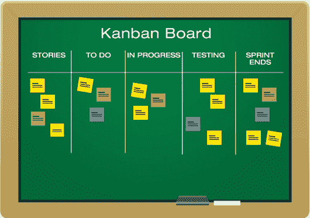
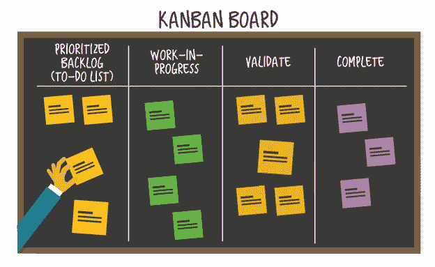

# 看板 VS Scrum——如何变得敏捷

> 原文：<https://www.freecodecamp.org/news/being-agile-kanban-vs-scrum/>

Scrum 和看板是当今商业中最流行的两种项目管理技术。作为一名开发人员，我认为理解这些过程是很重要的，因为如果你是团队的一员，你可能会深深地卷入其中。通过理解，我们可以专注于解决问题，不要太害怕一些流行词汇。

我的职业是开发人员，但我上一份工作是产品管理。我尝试了这两种方法来提高生产力和效率，以最好的方式交付产品和服务。它们还有助于组织快速适应对其产品/服务需求的变化。

## Scrum 是什么？

Scrum 是一种项目管理方法，是为从事复杂项目的 10 人以下的跨职能团队设计的。其主要目标是利用团队成员的各种技能为客户/最终用户创建解决方案/产品。

Scrum 一词来源于橄榄球比赛，两队的球员相互交错，试图作为一个功能单位获得球的控制权。

Scrum 运行在三个主要支柱上，透明性、检查和适应。这种方法基于这样一个前提，即客户/最终用户可能会改变他们想要什么的想法，或者可能会有计划的方法无法处理的变化。

项目通常是从可用的信息开始的。之后，在跟踪开发过程的过程中，可以根据需要随时进行更改或调整。

项目被分解成不同的行动，称为冲刺，必须在固定的时间框架或迭代内完成。短跑的平均持续时间通常是两周到一个月。

通过每天 15 分钟的固定站立会议来跟踪进度。这鼓励团队成员之间的密切互动和交流，而不是传统的顺序方法。

## 什么是看板？

看板是一种可视化的项目管理框架，产生于精益软件开发过程，用于敏捷项目管理。看板这个词是一个日语单词，意思是广告牌，来源于日本汽车制造商丰田首创的精益生产方法。

它通过看板将工作流程和进度可视化。它用于需要持续交付的产品/解决方案，旨在平衡需求和可用产能(拉式系统)，而不是将产品推向市场(推式系统)。

使用看板的目的是消除生产过程中的瓶颈，以便项目能够顺利进行，并且仍然保持在预算之内。它通常与 Scrum 等其他敏捷方法结合使用。

# 历史

### Scrum 的演变

Scrum 方法论最早是在 1986 年哈佛商业评论的一篇文章中提到的，文章名为“新的新产品开发游戏”，作者是竹内广孝和野中郁次郎。

作者将这一过程描述为一种新的开发过程，他们最初称之为整体或橄榄球方法，这种方法将提高商业产品进入市场的速度和灵活性。他们认为它“善于持续、渐进、螺旋式地带来创新”。

1993 年，Jeff Sutherland 与 Easel Corporation 的 John Scumniotales 和 Jeff Mckenna 首次使用了这种方法。两年后，Sutherland 和 Ken Schwaber 在德克萨斯州奥斯汀的面向对象编程、系统、语言和应用 95 (OOPSLA)会议上共同提交了一篇描述 Scrum 方法论的论文。

Schwaber 还在 2001 年和 Mike Beedle 一起写了第一篇 scrum 文本，名为[敏捷软件开发和 Scrum](https://www.amazon.com/Agile-Software-Development-Scrum/dp/0130676349) 。同年，两位作者和 Sutherland 以及其他 14 位 Scrum 专家在犹他州起草了敏捷宣言，详细说明了这种方法的原则、特点和价值。

Scrum Alliance 由 Schwaber 于 2002 年创建，为 Scrum 方法论提供了一个管理机构，并通过 CSM (Certified ScrumMaster)计划提供了正式的认证。Schwaber 后来在 2009 年离开联盟，成立了负责职业 Scrum 认证系列的 Scrum。

自 2010 年以来，一份名为 [Scrum Guide](https://www.scrum.org/resources/scrum-guide) 的文件为 Scrum 方法论提供了指南，并定期进行修订，最新版本于 2017 年 11 月发布。

### 看板的演变

看板作为一种制造方法诞生于丰田的工厂车间，由被称为丰田生产系统之父的大野泰一推广。

Ohno 正在寻找一种方法来提高生产率，减少汽车制造过程中的低效率，同时避免生产出卖不出去的产品，为公司带来损失。

在寻求解决方案的过程中，大野在 1943 年去东京一家超市时偶然发现了这个问题。在那里，他注意到销售的产品只有在几乎售完时才根据顾客的需求重新进货，而不是通过供应商的定期供应。这确保了超市只有很少的多余库存，并且高效运转。

大野将这项技术带到丰田，认为它需要 10 年才能完全投入使用。这一过程的很大一部分将是通信系统，该系统利用称为**看板**的视觉卡，以清晰的术语向工人说明在车辆制造过程的每个阶段需要做什么以及需要什么材料。

它还根据公众的需求调整生产的汽车数量，而不是利用全部生产能力。这一过程也被称为精益制造或“准时制”生产。

这有助于标准化生产流程，消除低效，并通过避免无法销售的过剩产品的积累，使丰田变得敏捷和灵活。这也是美国汽车制造商面临的问题。

这使丰田成为全球汽车巨头。在汽车行业采用看板理念后，看板理念传遍了全世界，进入了不同的行业。

由于 David J. Anderson 的工作，看板将在服务/知识行业变得流行。他是精益制造流程的崇拜者，在 2004 年与微软 XIT 支持工程小组合作时，他应用了受 Ohno 看板哲学影响的拉动式开发系统。

在接下来的几年里，安德森和其他一些同事塑造了看板方法的特点和原则。看板方法通过管理会议和会谈传播开来，更多的公司开始采用它。

安德森在 2010 年出版的一本书《你的技术业务的成功进化变革》中整理了他的看板经验，这本书被认为是对知识型员工看板方法最全面的定义。

## Scrum 原则/价值观

Scrum boards are “Kanban boards” too, confusing eh?

Scrum 项目管理方法成为敏捷开发方法的一部分，在 20 世纪 90 年代末和 21 世纪初传播开来。这些努力是为了找到软件开发中高失败率的解决方案。

在此之前，软件行业主要使用的瀑布式开发方法是僵化和不灵活的——产品开发必须遵循严格制定的过程和文档。

Scrum 允许软件开发人员灵活自由地应对开发中的变化。它还要求客户参与开发过程，而不是成为旁观者。

这种方法后来扩展到其他行业。Scrum 已经成为最常用的敏捷项目管理方法——研究表明，在所有采用敏捷开发方法的项目中，有 66%在使用 scrum。

Scrum 易于理解和遵循，因为它避免了僵化的指令和程序。有了 Scrum，组织可以做任何需要做的事情来完成项目，适应可能突然出现的情况。这种灵活性是 scrum.org 营销副总裁 Eric Naiburg 称 Scrum 为待办事项清单的对立面的原因之一。

将项目分解成 sprints 使得它适合于复杂的任务，而客户参与开发过程提高了透明度。

### 敏捷宣言

敏捷宣言于 2001 年开始着手解决软件项目开发人员的挫折，并提出了四条原则。今天，这些原则是 Scrum 项目管理哲学的基石，并且已经超越了软件行业。他们指出项目应该重视:

*   个人和交互胜过过程和工具。
*   基于全面文档的工作产品/解决方案。
*   合同谈判中的客户协作。
*   响应变化而不是遵循计划。

### Scrum 最佳实践

*   有一些支持 Scrum 方法的最佳实践。
*   我们通过早期和持续的产品交付来确保客户满意度。
*   每天测试并整合产品负责人的反馈。
*   即使在开发过程的后期，也欢迎和响应不断变化的需求。
*   我们在开发过程中与客户一起工作。
*   我们为积极主动完成工作的个人提供支持和环境。
*   强调团队内部和团队之间的面对面交流。
*   我们通过工作解决方案/产品来衡量进展。
*   我们正在以可持续的速度促进发展。
*   我们通过致力于卓越的技术和优秀的设计来提高灵活性。
*   自组织团队是获得最佳架构、需求和设计的最佳方式。
*   定期反思如何通过 sprint 评审提高效率，并调整行动以适应这种情况。
*   我们尊重团队成员职业生活和私人生活之间的平衡，将压力降至最低。

### Scrum 的好处

scrum 方法是最广泛使用的敏捷项目管理方法，原因如下。

**主动的自由**——热爱主动的自由的专业人士因为 scrum 过程的自组织精神而爱上了它。这有助于提高团队士气。

**高质量的产品/服务**——使用 scrum 过程生产的产品和服务往往是高质量的，因为它们必须经历各种迭代和改进，以及客户在开发中的参与。

**更短的交付时间** —这是增量开发过程的结果，它将交付时间缩短了 30%-40%。客户参与开发也是一个因素。

**更好的投资回报** —这得益于更短的交付时间、更好的产品/服务质量以及持续反馈和早期测试带来的更少缺陷。

**灵活性** —团队能够对市场的突然变化做出快速反应，并在产品/服务开发中反映出来。

### Scrum 的缺点

像其他任何事情一样，Scrum 过程也有其局限性。以下是其中的一些。

对专业知识的需求 — Scrum 需要拥有专业知识并接受过 Scrum 方法论培训的专业人士。这需要组织的前期投资。

**范围蔓延** —客户可能会要求对产品/项目进行太多的修改，这可能是不必要的。

昂贵的成本——scrum 过程中对高专业知识的需求以及持续的事件使得 scrum 过程的运营成本很高

# Scrum 过程

### Scrum 团队

这个过程从组建一个 Scrum 团队开始，致力于一个预定义的解决方案/项目。这些团队通常是自组织的、跨职能的。根据 Scrum 原则，自组织团队是确保项目最佳绩效的最佳方式，因为他们可以影响工作如何完成，而不是遵循外部指导。

交叉功能指的是团队成员之间不同的能力，这使得 Scrum 团队拥有完成项目所需的所有能力，并且不需要外部帮助。

一个理想的 Scrum 团队不应该有超过 9 个成员来增强团队精神、亲密度和有效性。同样重要的是，团队成员在同一个物理位置，或者如果他们远程工作，至少保持在线。

Scrum 团队以增量的方式交付解决方案，在每个产品的迭代中结合产品所有者的观点。这确保了功能性产品的持续可用性。为了有效，每个 Scrum 团队都应该遵守 5 个价值观或原则。

*   **承诺** —在每个冲刺阶段朝着团队目标努力。
*   勇气——尽管有冲突和挑战，也能做正确的事情。
*   **专注** —专注于团队目标和冲刺待办事项。
*   公开性——对彼此的工作和挑战保持透明。
*   **尊重** —尊重每一个团队成员。

### Scrum 角色

任何 Scrum 团队都有三个不同的角色:产品负责人、Scrum 主管和开发团队。

**产品负责人**——这个人代表 Scrum 团队中的客户，负责确保团队根据客户/最终用户的规范交付项目/解决方案/产品。他们必须传达最终用户的产品需求以及客户在每个产品迭代中的反馈。他们还管理产品 backlog，该产品 backlog 确定了要处理的产品的特性。

Scrum master —这个人确保团队遵循 Scrum 原则和指导方针。他们确保项目所需的任何东西都是可用的，并处理阻碍项目的任何障碍。他们还促进团队活动，并确保适当的沟通。

开发团队——这包括 Scrum 团队的其他成员。他们必须一起工作，利用他们的各种能力提供一个产品/项目。他们自己组织起来，选择自己的方式来交付产品。

### Scrum 事件

沟通在 Scrum 框架中至关重要。这体现在定期交流发展进程信息的五项活动或会议中。

**Backlog 精化—** 产品负责人定期审查产品 Backlog，它指的是产品特性列表、要做的工作以及交付顺序。他们确保 backlog 以一种向团队成员传达在每个 sprint 中需要做什么的方式进行了适当的准备。

有时，由于客户的反馈或开发团队的评审，工作的顺序必须被修改。在 sprint 结束和新的 sprint 开始之前，对 backlog 进行审查，根据业务价值、风险和需要特性的日期等因素对特性进行优先排序。这个评审通常会交付下一个 sprint 的内容。

Sprint planning——这是在 Sprint 开始时做的，以计划 Scrum 团队需要做的工作。一个项目被分解成的更小的部分被称为 sprints。它们可能持续一周到一个月。

sprint 会议通常持续 2 周的平均 4 个小时，让团队选择可以在 sprint 期间完成的待办事项，如何处理，以及 sprint 的目标。这些都包含在 sprint backlog 中。

**每日争吵/起立** —这是一个快速的每日起立会议，最多持续 15 分钟。团队和个人成员会回顾前一天的工作，并确定挑战。

一个人的任务是获得任何已识别挑战的解决方案，并且 Scrum master 在 Scrum 板上突出显示前一天未完成的工作。

scrum 会议期间不允许进行详细的讨论。还商定了当天工作的策略。

**冲刺评审** —在冲刺阶段结束时召开的会议用于评审团队的表现。如果当天的工作完成了，产品的迭代就被展示出来，然后和包含“完成”项目的 sprint backlog 一起提交给客户/最终用户，以获得他们的反馈。

此时，产品所有者也可以对产品待办事项进行调整。

会议的建议持续时间通常最多为四个小时。

Sprint 回顾会——这是一个让 Scrum 团队反思他们工作效率的机会，以及下一次为了更好的工作效率可以改进的地方。

### Scrum 工件

这里指的是 scrum 过程中常用的工具。这是其中的三个，用来记录 Scrum 团队的进展以及项目的细节。

产品待办事项清单(Product backlog)——是 scrum 团队在项目中必须完成的工作列表。它包含产品需求、要处理的特性和必须修复的错误。它由产品负责人监督，并作为团队的指南。它通常在进入 Sprint backlog 之前被审查。

**Sprint backlog** —这个由开发团队监督的列表指的是在当前 Sprint 期间必须处理的产品 backlog 中的产品特性列表。

团队成员以自我组织和承诺的精神，根据他们的能力签约处理他们可以处理的任务。

冲刺积压可以在冲刺阶段修改，但最终目标保持不变。

**产品增量** —这是在冲刺阶段完成的工作的最终结果。它通常被添加到之前 sprints 完成的工作中。

这通常是根据 Scrum 团队定义并同意的“完成”状态。大多数情况下，这意味着产品功能处于最佳水平，可以交付给客户/最终用户。

# 看板原则和实践

### 看板原则

有四个核心原则构成了成功实施看板方法的基础。

**从现有系统开始—** 看板方法强调通过在一夜之间引入新系统来避免文化冲击的必要性。相反，它可以被带到一个组织中，与现有的技术一起应用。

这使得看板易于实现，并且不会造成中断。然后，在收集和分析关于当前工作流及其低效性的信息的同时，可以在一个长酝酿期内以每个人都可以接受的速度实施变更。

**渐进地做出改变—** 看板方法强调对现状的渐进和微小的改变。这将使受流程影响的组织成员更多地参与进来，减少不确定性和不安，并反过来使组织变得更好，因为以前的增量变化的证据很明显。

**尊重当前的工作流程和角色—** 实施看板方法时，现有的工作流程、职能和负责人不会立即被取消。

团队将决定应该修改哪些角色，应该引入哪些变化，以及应该完成这些变化的正确时间。这是为了缓解成员之间的组织过渡，并使增量变化在他们之间可以接受。

**鼓励各级领导—** 看板意识到，无论在组织中处于什么级别，任何人都可能具备领导素质。这就是为什么我们鼓励团队成员在需要改变或启动计划时采取行动，而不是等待上级或高级管理人员的命令。

这一原则促进团队成员之间的信任和持续自我改善(Kaizen)，帮助他们达到最佳绩效水平，从长远来看，这将提高组织的生产力。

### 看板实践

为了使看板实施有效，团队必须实施六种看板实践。

**可视化工作流程** —这是使用看板方法的第一步。组织用于交付产品/服务的过程及其流程必须在看板上说明，看板可以是实物的，也可以是电子的。

工作流程中的每一步都由板上的一列表示。不同的工作项目由不同颜色的看板卡表示。可以使用看板泳道将相关的工作项目集合在一起。

这些活动的主要目的是让各方了解从客户请求到最终产品/服务交付的工作流程的运作，并改善沟通和协作。这样，可以跟踪和分析工作流程的不同方面，以确定可以解决的可能障碍。

**限制在制品(WIP)——**使用看板，一次应该处理可管理数量的工作项目，并对可处理的在制品进行限制。手头的工作应该在进入新任务之前完成。

看板不鼓励多任务处理，因为它会导致浪费和低效。列板上的 WIP 限制强调了选择团队目前必须完成的工作的重要性，因为产能有限，必须有效利用。

关注在制品也有助于减少特定产品/服务的周期时间(从客户要求到最终交付的时间)。

**管理工作流程—** 使用看板方法，各个工作流程阶段和每个阶段的工作进度都在看板上突出显示。

看板强调工作流程的管理，而不是人的微观管理，其实施的主要目标是在最佳水平上实现平稳的工作流程。

这使团队能够通过使用周期时间和交付时间等指标来衡量生产率/效率，从而分析工作流程。这使得发现工作流程中的任何障碍变得更加容易。

大多数情况下，这些障碍处于工作必须易手的中间等待阶段，但有时像工人效率这样的其他因素也会发挥作用。

无论它们出现在哪里，都会在工作流程中进行调整，以消除它们并使工作流程变得更好。这将使产品或服务的周期时间缩短，确保更快的周转和向客户交付更好的价值。

**清楚地传达流程政策—** 看板的一大部分是向所有相关方明确传达关于如何开展工作的政策和流程规则，以便清楚地了解每个人的期望。这种帮助提供了衡量绩效的标准，并确保了所交付产品/服务的质量一致性。

必须有每个列的工作流程规则和指南，如谁拉什么，进入和退出该列的标准，当一项任务完成等。这必须在看板板上可视化。这使组织中的每个人在朝着共同目标努力时都有一个直观的参考。

**定期获得反馈并实施** —反馈对看板方法非常重要。在每日站立会议期间，在看板板上回顾和分析工作流程阶段是一个很好的机会。工作流程的每一个不同方面，如交付和操作，也应该单独审查，以跟踪它们的进展。

团队成员还应评论他们前一天的个人观察。这些日常会议应该简短，直奔主题。应该启动计划来处理收到的所有反馈。在流程的早期获得所有这些反馈可以使改进快速进行，从而提高周期时间和组织生产率。

**不断试验和改进—** 看板的进化变化模式支持使用科学调查方法，包括形成理论、测试理论并将其修改为更好的理论。

工作流程应不断评估和改进。新技术可以逐步引入到工作流流程中并进行观察，然后应该根据它们通过评估度量标准给流程带来的改进程度来决定是保留还是删除它们。

有时，这些技术只需要一些修改就可以达到最佳性能。持续改进是看板方法的基石。

### 看板流程

看板是一种通过将可视化应用于工作过程来寻求提高组织效率的方法。它基于一个已被证实的观点，即大脑处理图片比处理文字更容易。通过可视化，效率低下的领域变得明显。

看板的目的是逐步地、增量地而不是快速地改进工作流程。这降低了组织的风险。它还旨在加快工作流程。

### 看板板

看板是可视化表示工作流程的主要工具。它通过图片突出显示项目/开发过程的信息，使所有相关方之间的交流更加清晰。

看板可以是物理形式，也可以是数字/电子形式，用于有远程成员的团队。看板通常由三个主要栏目组成:

*   **待办事项** —这里列出了尚未开始的任务。
*   **做** —这里列出了正在进行的任务。
*   **完成** —这包括已经完成的任务。

任务用彩色便签或卡片来表示。通过在看板上用图片表示工作流程，工作流程的效率可以被测量，尤其是在专业看板软件的帮助下。

当效率低于预期时，可以跟踪障碍，然后进行处理。这可以提高生产效率，缩短产品周期，并提高产品/服务质量。

### 看板的好处

看板很快被全球不同行业的组织所采用。造成这种情况的一些原因如下。

*   **清晰的沟通和透明度** -看板上的工作流程可视化实现了清晰的沟通，并让每个参与者都知道对他们的期望。很容易跟踪工作进度，从而很容易知道需要采取什么行动。
*   **快速发现障碍** —一些柱子的过度拥挤可以很容易地突出工作过程被减慢的地方，从而需要调整。
*   **灵活性** —在任何系统或行业中使用看板的能力及其渐进式变革的理念使其成为许多渴望持续提高效率的组织的宠儿。它通常与敏捷项目管理技术相结合，以使它们更加有效。
*   **响应需求** —看板能够调整产能以满足客户需求，避免不必要的浪费，并能够快速响应变化。
*   **专注与协作** —有限的在制品迫使团队专注于 WIP，而不是多任务处理，从而提高生产率。当组织成员在执行任务时互相帮助以消除挑战时，协作也得到了加强。

### 看板的缺点

看板方法有其局限性

*   **不适合大型项目** —看板在大规模的情况下可能很难操作。
*   **看板板的误用** —看板板的误用或过于复杂会发出关于工作流程的错误信号，这可能会导致代价高昂的错误。
*   **疯狂的需求波动** —不规则的产品需求可能会扰乱看板方法，因为可能会因此发出错误的信号。
*   **质量失误** —看板方法将库存水平降至几乎为零，以减少浪费。但是，当最终产品或服务出现质量问题时，由于缺乏库存缓冲，组织可能很难快速做出反应。

### Scrum 和看板的异同

Scrum 和看板是全球最广泛采用的生产力改进工具，但它们并不像大多数人认为的那样是直接的替代品。他们有一些相似之处，但也有两者之间的差异。

### 类似

Scrum 和看板都是提高生产力和效率以及减少浪费的工具。

它们都基于敏捷项目管理技术，强调灵活性和适应变化的能力。

他们还研究“拉动式”计划技术。

他们都认为产品或服务质量的提高和交付时间是这两种技术的基石。

它们都基于自组织精神，团队成员采取自己的主动和行动，每个成员都是平等的，没有来自外部的命令。

复杂的任务通常被分解成更小的、可管理的部分。

### Scrumban

在今天的许多组织中，Scrum 和看板在所谓的 Scrumban 中被使用和结合。这最初是为从 Scrum 过渡到看板的团队创建的，但是已经成为一种独立的项目管理方法。在这种方法下，使用了 Scrum 过程，但是它是通过看板改进系统的镜头来观察的。

使用类似于带有彩色卡片的看板的板。工作被分解成迭代。当团队成员选择他们将要处理的任务时，这里使用 WIP 限制，因为他们是自组织的。

按需规划是 Scrumban 的一个特性。这是在有新任务时而不是每天都有新任务时计划技术的应用。确定任务的优先级是为了让团队成员知道哪些任务是重要的。

### 差异

Scrum 和看板有很多不同之处。这包括:

定义 — Scrum 是一个具有特定规则和技术的框架，而看板是一个与现有系统一起使用的工作流可视化工具。

**培训和管理—** Scrum 需要大量的教育和培训，也需要有专业知识的管理人员和专业人员。另一方面，看板很容易被每个人理解，这使得运行和管理成本更低。

**变革过程** —看板鼓励渐进式变革，适合具有良好、稳定的工作流结构的组织，而需要快速进行全面变革的组织应该选择 Scrum。

**用法—** 看板通常用于较小的项目，而 Scrum 更适用于较大、较复杂的项目。

**角色—** Scrum 有三个明确的角色:scrum master、产品负责人和开发团队。看板没有明确的角色，因为每个团队成员都可以承担可用的职责。

**持续时间—**Scrum 流程持续整个项目/开发过程，并在新的项目开始时重新开始，而看板是一项持续的工作，因为它是针对必须持续交付的产品/服务进行的。

团队 — Scrum 提倡跨职能团队，而专业化团队是看板的标准。

**新任务/迭代** —在 Scrum 中，新项目不能添加到 sprint 的预先计划的任务之外，即使团队有能力添加。在看板中，只要产能可用，就可以处理新任务。

所有权——Scrum 过程中的 sprint backlog 归一个 Scrum 团队所有，而看板可以由尽可能多的团队共享。

**生产率测量** —看板使用产品/服务的周期时间来测量生产率，而 Scrum 使用冲刺阶段的速度来测量生产率。

团队目标 —在 Scrum 中，团队专注于协作和完成预定义的任务，而看板团队专注于设定目标和减少周期时间。

# 结论

本文的目的不是证明 Scrum 和看板哪个更好，因为它们都是旨在提高效率的生产力工具。相反，它旨在提供对这两种工具的理解，以便您可以在选择它们时做出明智的决定，或者您可以决定两者都用。

我个人比较喜欢看板。但我认为这是因为我的一位导师给了我一本“[看板:你的技术业务的成功演变”](https://www.amazon.co.uk/Kanban-Successful-Evolutionary-Technology-Business/dp/0984521402)，当我开始需要让我的团队富有成效时，它真的帮了我。绝对是每个办公室都应该有的书。

如果您有任何反馈或想要联系我，请在 Twitter 上找到我。

# 参考

[https://en . Wikipedia . org/wiki/Scrum _(软件开发)](https://en.wikipedia.org/wiki/Scrum_(software_development))

[https://en.wikipedia.org/wiki/Agile_software_development](https://en.wikipedia.org/wiki/Agile_software_development)

[https://en . Wikipedia . org/wiki/Kanban _(开发)](https://en.wikipedia.org/wiki/Kanban_(development))

【t0 https://en . Wikipedia . org/wiki/scrum】

[https://search software quality . tech target . com/definition/Scrum](https://searchsoftwarequality.techtarget.com/definition/Scrum)

[https://kanbanize . com/kanban-resources/getting-started/what-is-kanban/](https://kanbanize.com/kanban-resources/getting-started/what-is-kanban/)

[https://kanbanzone.com/kanban-resources/what-is-kanban/](https://kanbanzone.com/kanban-resources/what-is-kanban/)

[https://www.planview.com/resources/articles/what-is-kanban/](https://www.planview.com/resources/articles/what-is-kanban/)

[https://www.digite.com/kanban/what-is-kanban/](https://www.digite.com/kanban/what-is-kanban/)

[https://getnave.com/blog/kanban-history/](https://getnave.com/blog/kanban-history/)

[https://www.guru99.com/scrum-vs-kanban.html](https://www.google.com/url?q=https%3A%2F%2Fwww.guru99.com%2Fscrum-vs-kanban.html&sa=D&sntz=1&usg=AFQjCNE4VcyF1uTuyc4tjrQP_gNXANtdMg)[https://medium . com/@ thorbjorn . sigberg/scrum-vs-kanban-c 73 DC 70 e 8 eef](https://www.google.com/url?q=https%3A%2F%2Fmedium.com%2F%40thorbjorn.sigberg%2Fscrum-vs-kanban-c73dc70e8eef&sa=D&sntz=1&usg=AFQjCNEIwTJxMirbodj4uzJrYBFYh7P_Mw)[https://medium . com/ntask/kanban-vs-scrum-2018-7503 ee 98 dd0c](https://www.google.com/url?q=https%3A%2F%2Fmedium.com%2Fntask%2Fkanban-vs-scrum-which-one-is-the-better-approach-to-use-in-2018-7503ee98dd0c&sa=D&sntz=1&usg=AFQjCNFb9deR_GBdWD2iXXu2qxaBxot6Ew)[https://medium . com/@ Pavel . obod/kanban-vs-scrum-why-and](https://www.google.com/url?q=https%3A%2F%2Fmedium.com%2F%40pavel.obod%2Fkanban-vs-scrum-why-and-how-we-switched-from-scrum-to-kanban-8e524b6619bb&sa=D&sntz=1&usg=AFQjCNEQC8MvKq-Rlgcda3Tun6EM3249IA)

[https://www . gliffy . com/blog/scrum-what-it-is-and-how-it-works](https://www.gliffy.com/blog/scrum-what-it-is-and-how-it-works)

[https://www.visual-paradigm.com/scrum/how-scrum-team-works/](https://www.visual-paradigm.com/scrum/how-scrum-team-works/)

[https://skill crush . com/2017/06/28/what-is-scrum-project-management/](https://skillcrush.com/2017/06/28/what-is-scrum-project-management/)

[https://stackify.com/what-is-scrum/](https://stackify.com/what-is-scrum/)

[https://www.atlassian.com/agile/scrum](https://www.atlassian.com/agile/scrum)

[https://www . brighthubpm . com/methods-strategies/71133-权衡看板系统的缺点/](https://www.brighthubpm.com/methods-strategies/71133-weighing-the-disadvantages-of-the-kanban-system/)

[https://small business . chron . com/advantages-missions-scrum-project-management-methodology-36099 . html](https://smallbusiness.chron.com/advantages-disadvantages-scrum-project-management-methodology-36099.html)

[https://www . yodiz . com/blog/kanban-vs-scrum-benefits-similarities-利弊/](https://www.yodiz.com/blog/kanban-vs-scrum-benefits-similarities-pros-and-cons/)

[https://leankit.com/learn/kanban/kanban-vs-scrum/](https://leankit.com/learn/kanban/kanban-vs-scrum/)

[https://upraise.io/blog/scrum-kanban-project-management/](https://upraise.io/blog/scrum-kanban-project-management/)

https://www . quora . com/How-similar-or-different-are-Scrum-and-Kanban