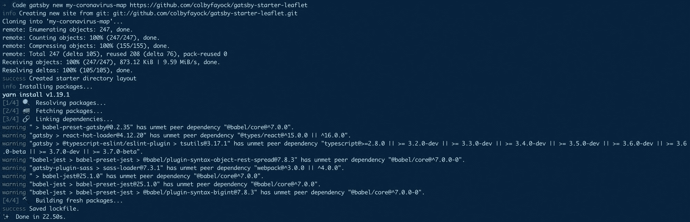
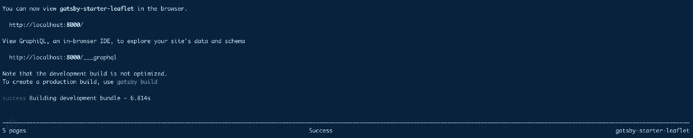
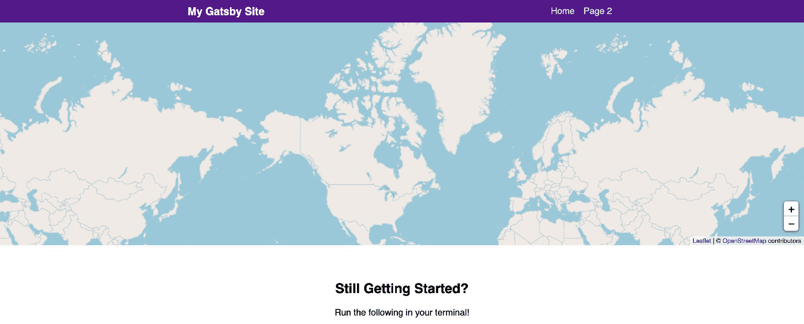
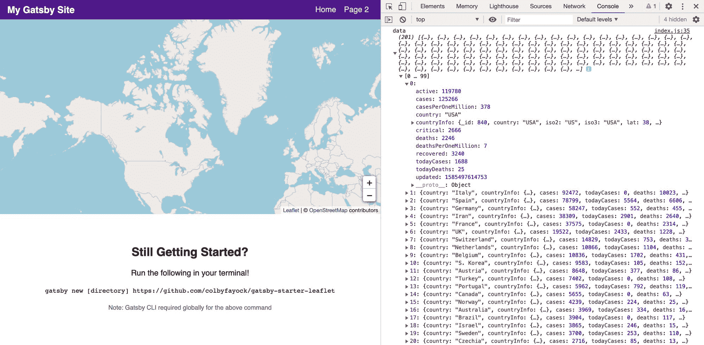
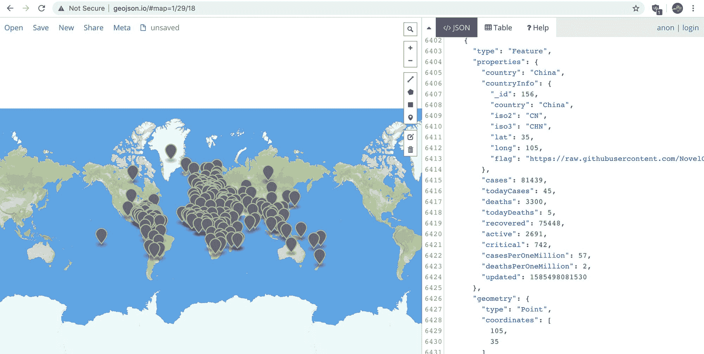
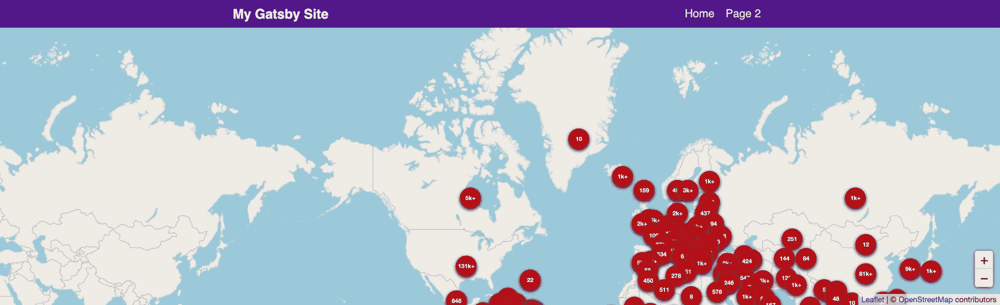
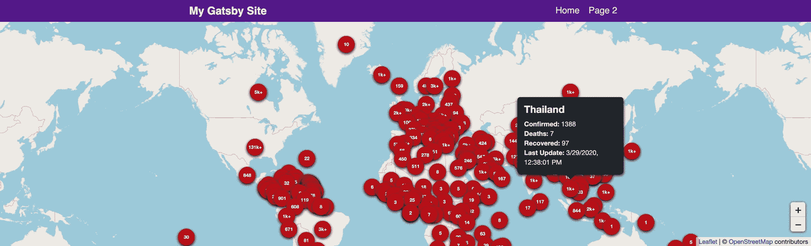
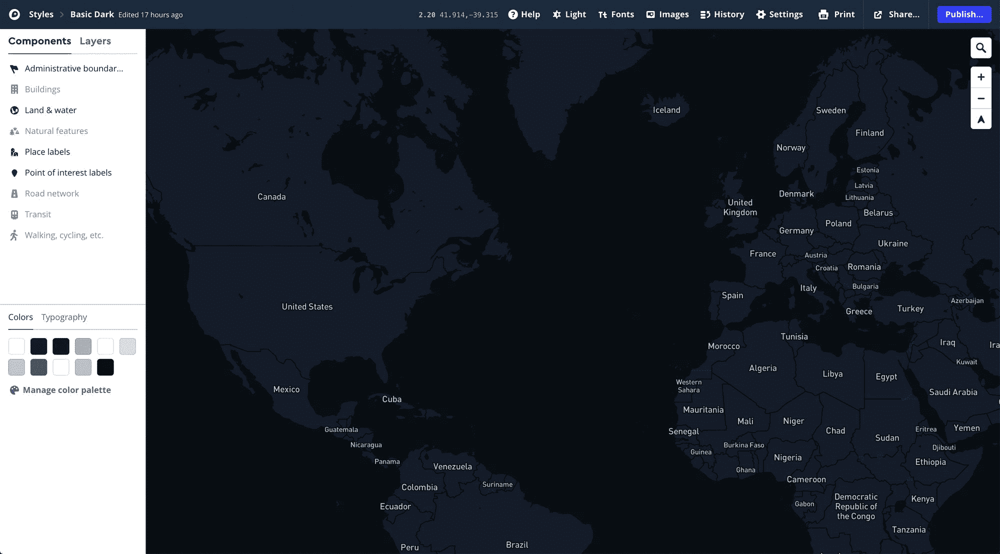
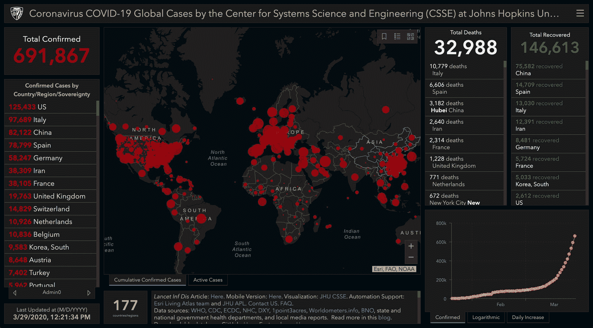

# 如何在《与盖茨比反应》和《传单》中创建冠状病毒(新冠肺炎)仪表盘和地图应用程序

> 原文：<https://www.freecodecamp.org/news/how-to-create-a-coronavirus-covid-19-dashboard-map-app-in-react-with-gatsby-and-leaflet/>

冠状病毒(新冠肺炎)疫情迅速改变了我们所有人的日常交往方式。我们如何使用可用的 API 来构建一个地图应用程序，显示它对世界的影响？

**更新:**原来的 NovelCOVID API v1 端点已被弃用。请更新并使用以下内容:https://corona.lmao.ninja/v2/countries

*作者注:这是一个演示和概念验证，旨在使用真实生活数据构建一个有影响力的地图应用程序。为了完整和准确的分析，请确保使用像[约翰霍普金斯大学仪表板](https://www.arcgis.com/apps/opsdashboard/index.html#/bda7594740fd40299423467b48e9ecf6)这样的工具。呆在家里，注意安全！❤️*

*   我们要建造什么？
*   开始之前我们需要什么？
*   [第一步:清理一些不需要的代码](#step-1-cleaning-up-some-unneeded-code)
*   [步骤 2:获取冠状病毒数据](#step-2-fetching-the-coronavirus-data)
*   [步骤 3:将冠状病毒数据转换成地理数据格式](#step-3-transform-the-coronavirus-data-into-a-geographic-data-format)
*   [步骤 4:将冠状病毒数据添加到地图中](#step-4-adding-the-coronavirus-data-to-the-map)
*   我们还能做什么？
*   [注意安全，保持消息灵通](#be-safe-and-stay-informed)
*   [想了解更多关于地图的知识？](#want-to-learn-more-about-maps)

[https://www.youtube.com/embed/GryBIsfBfro?feature=oembed](https://www.youtube.com/embed/GryBIsfBfro?feature=oembed)

## 我们要建造什么？

我们将开发一个地图应用程序，使用包含最近冠状病毒统计数据的 API，并绘制出每个国家面临的位置和影响。


Coronavirus map dashboard demo

在地图上，我们将为每个国家显示一个标记，标明确诊病例的数量。最重要的是，我们将包括一个小的弹出工具提示，显示更多的深度信息。

我们将要构建的地图看起来和上面的差不多，但是看起来要简单一些。我们将利用 OpenStreetMap 公共 tileserver，而不是使用自定义的[地图框](https://www.mapbox.com/)

首先，我们将使用我制作的这个[传单 Gatsby Starter](https://github.com/colbyfayock/gatsby-starter-leaflet) 来使初始设置更加流畅。随着我们的应用程序启动，我们将获取我们的数据，并用我们的数据向地图添加标记。

## 哇，一个地图应用？

没错。如果你之前没有玩过地图，也不要气馁！这并不像你想象的那么糟糕。如果你更愿意从映射基础开始，你可以先[阅读更多关于映射如何工作的信息](https://www.freecodecamp.org/news/easily-spin-up-a-mapping-app-in-react-with-leaflet/)。

## 开始之前我们需要什么？

如果你按照我之前的教程做了[制作圣诞老人追踪器](https://www.freecodecamp.org/news/create-your-own-santa-tracker-with-gatsby-and-react-leaflet/)或者[制作夏季旅行地图](https://www.freecodecamp.org/news/how-to-create-a-summer-road-trip-mapping-app-with-gatsby-and-leaflet/)，你可以按照同样的步骤开始。如果没有，我们需要确保设置了以下内容:

*   [节点](https://nodejs.org/en/)或[纱线](https://yarnpkg.com/en/) -我将使用纱线，但你可以在适当的时候用 npm 代替
*   [盖茨比的 CLI](https://www.gatsbyjs.org/docs/gatsby-cli/) - `yarn global add gatsby-cli`

如果你不确定以上哪一个，你可以试着看看开头的[我以前的教程](https://www.freecodecamp.org/news/create-your-own-santa-tracker-with-gatsby-and-react-leaflet/)。

我们还想为我们的地图建立一个基础。我们可以通过利用我整理的小册子 Gatsby Starter 来做到这一点，它为我们提供了一个基本的设置，包括[小册子](https://leafletjs.com/)和[反应小册子](https://react-leaflet.js.org/)。

```
gatsby new my-coronavirus-map https://github.com/colbyfayock/gatsby-starter-leaflet 
```



Creating a new Leaflet Gatsby app in the terminal

运行完成后，您可以导航到新创建的项目目录并启动您的本地开发服务器:

```
cd my-coronavirus-map
yarn develop 
```



Starting your Gatsby app in the terminal

如果一切按计划进行，您的服务器应该启动，现在您应该能够在浏览器中看到您的基本地图应用程序！


New Leaflet Gatsby app in the browser

[跟随提交！](https://github.com/colbyfayock/my-coronavirus-map/commits/master)

## 步骤 1:清理一些不需要的代码

我们用来启动这个应用程序的 Gatsby Starter 附带了一些我们在这里不需要的演示代码。我们希望在下面的文件`src/pages/index.js`中进行所有的更改，这是我们应用程序的主页。

首先，让我们删除`mapEffect`函数中的所有内容。该函数用于运行在地图渲染时触发的代码。

```
// In src/pages/index.js
async function mapEffect({ leafletElement } = {}) {
  // Get rid of everything in here
} 
```

我们还将更改我们的`leafletElement`的变量名，只是为了在我们编写代码时能够更容易地理解它。

```
async function mapEffect({ leafletElement: map } = {}) {
} 
```

接下来，我们这次不需要标记，所以让我们从`<Map`组件中移除`<Marker`组件:

```
<Map {...mapSettings} /> 
```

现在我们已经清除了这些部分，我们可以从文件顶部删除以下所有导入和变量:

*   useRef
*   标记
*   承诺飞翔
*   getCurrentLocation
*   盖茨比 _ 宇航员
*   时间工作室
*   timeToOpenPopupAfterZoom
*   timeToUpdatePopupAfterZoom
*   嗡嗡声
*   popupContentHello
*   popupContentGatsby
*   马克里夫

之后，我们的地图应该仍然工作，但不做任何事情。



*New mapping app with nothing going on*

[跟随提交！](https://github.com/colbyfayock/my-coronavirus-map/commit/a3e9cff3949bb7ebb7cc89166c875e97b6dcb5a8)

## 步骤 2:获取冠状病毒数据

对于我们的应用程序，我们将使用 [NovelCOVID API](https://github.com/NovelCOVID/API) 。特别是，我们将使用[国家端点](https://corona.lmao.ninja/countries)来获取我们国家的列表以及与它们相关的统计数据。

对于请求，我个人喜欢使用 axios，因为它有一个很好的 API。如果你想使用[获取](https://developer.mozilla.org/en-US/docs/Web/API/Fetch_API)或者你自己喜欢的请求库，在这个步骤中替换它。

我们将从安装 axios 开始:

```
yarn add axios 
```

一旦安装完成，记得重启你的服务器。

将 axios 包导入到我们的`pages/index.js`文件的顶部:

```
import axios from 'axios'; 
```

接下来我们将真正提出我们的请求。在我们的`mapEffect`函数中，让我们尝试向 API 端点发出一个请求:

```
async function mapEffect({ leafletElement: map } = {}) {
    let response;

    try {
      response = await axios.get('https://corona.lmao.ninja/v2/countries');
    } catch(e) {
      console.log(`Failed to fetch countries: ${e.message}`, e);
      return;
    }

    const { data = [] } = response;
} 
```

在这个片段中，我们做了以下事情:

*   设置一个`response`变量，允许我们存储响应
*   添加一个`try/catch`块，如果请求失败，它将捕捉任何 API 错误
*   如果请求成功，我们将响应存储在`response`变量中
*   如果请求失败，我们将控制台记录错误并从函数中返回，这样我们就不会继续运行请求失败的代码
*   一旦我们得到了响应，我们可以从响应中析构`data`,并将默认值设置为一个空数组，因为这将是我们需要的数据类型

设置好之后，我们可以从控制台注销`data`对象，我们将看到我们的数据被成功获取！



Logging the Coronavirus location data to the browser console

[跟随提交！](https://github.com/colbyfayock/my-coronavirus-map/commit/86bebfee4a34b9bad516879b228921cdaad55126)

**更新:**之前的提交包含一个到原始 NovelCOVID v1 API 端点的链接，该链接现在已被弃用。请用这个代替:【https://corona.lmao.ninja/v2/countries】T2。

[参见更新提交](https://github.com/colbyfayock/my-coronavirus-map/commit/e8f63c7ca60ec358b2edc9bc3ed8935be85b5573)。

## 步骤 3:将冠状病毒数据转换成地理数据格式

现在我们有了数据，我们可以将它转换成地理数据格式，特别是 [GeoJSON](https://geojson.org/) ，这将允许我们与传单进行交互。

让我们从添加这段代码开始:

```
const { data = [] } = response;
const hasData = Array.isArray(data) && data.length > 0;

if ( !hasData ) return;

const geoJson = {
  type: 'FeatureCollection',
  features: data.map((country = {}) => {
    const { countryInfo = {} } = country;
    const { lat, long: lng } = countryInfo;
    return {
      type: 'Feature',
      properties: {
       ...country,
      },
      geometry: {
        type: 'Point',
        coordinates: [ lng, lat ]
      }
    }
  })
} 
```

那我们在这里做什么？

*   我们创建了一个名为`hasData`的新常量，它检查我们的`data`变量是否是一个数组并且有数据
*   如果我们没有数据，我们希望从函数中返回，因为我们不想尝试添加我们没有的数据
*   我们创建一个`geoJson`对象，它将成为我们的 GeoJSON 文档
*   我们的文档是类型`FeatureCollection`的，作为我们的`features`,我们遍历我们的数据集
*   对于数据中的每个国家，我们获取`lat`和`lng`来为我们的地图创建一个点
*   我们还添加了国家数据作为属性，这样我们就可以在我们的映射 API 中访问它

如果您将这个对象放入您的浏览器并复制其内容，您可以将其粘贴到 geojson.io，并看到位置数据正确显示。



Previewing Coronavirus location data on geojson.io

有了这个 GeoJSON 文档，我们现在可以将它添加到地图中。

[跟随提交！](https://github.com/colbyfayock/my-coronavirus-map/commit/f0da2d05cbc16783322684da7a3efaa61022f5b6)

## 步骤 4:将冠状病毒数据添加到地图中

我们有包含位置数据的 GeoJSON 文档，所以让我们将它添加到地图中。

让我们从这个代码块开始。这是一个很长的问题，但我们将一点一点地分解它:

```
const geoJsonLayers = new L.GeoJSON(geoJson, {
  pointToLayer: (feature = {}, latlng) => {
    const { properties = {} } = feature;
    let updatedFormatted;
    let casesString;

    const {
      country,
      updated,
      cases,
      deaths,
      recovered
    } = properties

    casesString = `${cases}`;

    if ( cases > 1000 ) {
      casesString = `${casesString.slice(0, -3)}k+`
    }

    if ( updated ) {
      updatedFormatted = new Date(updated).toLocaleString();
    }

    const html = `
      <span class="icon-marker">
        <span class="icon-marker-tooltip">
          <h2>${country}</h2>
          <ul>
            <li><strong>Confirmed:</strong> ${cases}</li>
            <li><strong>Deaths:</strong> ${deaths}</li>
            <li><strong>Recovered:</strong> ${recovered}</li>
            <li><strong>Last Update:</strong> ${updatedFormatted}</li>
          </ul>
        </span>
        ${ casesString }
      </span>
    `;

    return L.marker( latlng, {
      icon: L.divIcon({
        className: 'icon',
        html
      }),
      riseOnHover: true
    });
  }
}); 
```

那我们在这里做什么？

*   我们创建了一个新的`L.GeoJSON`实例，它将我们的 GeoJSON 文档转换成传单可以理解的东西
*   在该实例中，我们定义了一个定制的`pointToLayer`函数。这使我们能够自定义地图图层传单为我们的地图创建
*   在我们的函数中，我们分配并创建我们想要的数据点。大部分都是析构的，但是我们格式化了事例计数以显示`1k+`而不是`1000`，并且格式化了日期而不是时间戳
*   我们创建了一个 HTML 字符串块，用于定义将要添加到地图中的地图标记。这还包括当鼠标悬停在标记上时弹出的工具提示的 HTML
*   我们返回带有自定义配置的`L.marker`,该配置包括一个用于容器和自定义 HTML 的`icon`类。
*   此外，我们添加了`riseOnHover`属性，这样当鼠标悬停在一个标记上时，它会出现在地图上其他标记的上方

我们还想在这里添加一点 CSS，这样我们可以确保我们的标记显示在地图上，并且是可用的。让我们将这个片段添加到我们的`assets/stylesheets/components/_map.scss`文件中:

```
.icon-marker {

  display: flex;
  position: relative;
  justify-content: center;
  align-items: center;
  color: white;
  width: 3.6em;
  height: 3.6em;
  font-size: .7em;
  font-weight: bold;
  background-color: $red-800;
  border-radius: 100%;
  box-shadow: 0 2px 5px rgba(black, .9);

  &:hover {

    .icon-marker-tooltip {
      display: block;
    }

  }

}

.icon-marker-tooltip {

  display: none;
  position: absolute;
  bottom: 100%;
  width: 16em;
  font-size: 1.4em;
  padding: 1em;
  background-color: $blue-grey-900;
  border-radius: .4em;
  margin-bottom: 1em;
  box-shadow: 0 3px 5px rgba(black, .9);

  &:before {
    display: block;
    position: absolute;
    bottom: -.6em;
    left: 50%;
    content: '';
    width: 1.4em;
    height: 1.4em;
    background-color: $blue-grey-900;
    transform: rotate(45deg);
    margin-left: -.7em;
  }

  h2 {
    font-size: 1.5em;
    line-height: 1.2;
    margin-bottom: .1em;
    margin-top: 0;
  }

  h3 {
    font-size: 1.2em;
    margin: .1em 0;
    font-weight: normal;
    color: $blue-grey-100;
  }

  ul,
  p {
    font-weight: normal;
  }

  ul {
    list-style: none;
    padding: 0;
    margin: .6em 0 0;
  }

} 
```

我们正在做的事情:

*   我们使用`.icon-marker`类创建圆形标记，并设置`.icon-marker-tooltip`类在鼠标悬停时显示
*   默认情况下，我们的`.icon-marker-tooltip`类是隐藏的，因为它是我们的工具提示，但是我们将它绝对放置在我们的标记之上，并按照我们想要的方式格式化

最后，一旦我们创建了添加了样式的`geoJsonLayers`,我们就可以把它添加到地图上了！

```
geoJsonLayers.addTo(map) 
```



Map with Coronavirus location data

现在你可能想知道为什么它似乎没有正确地居中。继续将`index.js`文件顶部的`LOCATION`变量改为:

```
const LOCATION = {
  lat: 0,
  lng: 0
}; 
```

一旦设置完成，当页面重新加载时，地图应该位于世界的中央！



Map with Coronavirus location data centered with a tooltip

[跟随提交！](https://github.com/colbyfayock/my-coronavirus-map/commit/49c78e4ef3e98c974fab7bca10b6f8f7578b42c2)

## 耶，我们做到了！？

如果你跟随，你现在已经创建了你自己的冠状病毒地图仪表板，它给出了一些关于世界各地病例的快速统计。

把你学到的东西带着它跑。您可以将此应用于您能想到的任何其他类型的数据。

## 我们还能做什么？

### 添加更多样式和自定义底图

在我最初的演示中，我使用[地图框](https://mapbox.com/)设置了一个自定义底图，这允许我使用深色背景，使标记更容易看到。



Creating a new basemap in Mapbox Studio

如果你对入门感兴趣，Mapbox 很棒，有一个不错的免费层。

一旦你有了一个地图框账户，你甚至可以[复制我使用的样式](https://api.mapbox.com/styles/v1/colbyfayock/ck8c2foj72lqk1jnug0g2haw0.html?fresh=true&title=copy&access_token=pk.eyJ1IjoiY29sYnlmYXlvY2siLCJhIjoiY2swODZzbXYxMGZzdzNjcXczczF6MnlvcCJ9.HCfgUYZUTP7uixjYF7tBSw)并把它变成你自己的。

[基本黑暗地图框主题](https://api.mapbox.com/styles/v1/colbyfayock/ck8c2foj72lqk1jnug0g2haw0.html?fresh=true&title=copy&access_token=pk.eyJ1IjoiY29sYnlmYXlvY2siLCJhIjoiY2swODZzbXYxMGZzdzNjcXczczF6MnlvcCJ9.HCfgUYZUTP7uixjYF7tBSw)

要了解如何集成它，您可以尝试查看[我的原始演示](https://github.com/colbyfayock/coronavirus-map-dashboard)的源代码:

[https://github.com/colbyfayock/coronavirus-map-dashboard](https://github.com/colbyfayock/coronavirus-map-dashboard)

### 添加概览仪表板统计数据

像约翰·霍普金斯大学的应用程序这样的带有地图的仪表盘让我们看到的不仅仅是地图上的样子，而是对世界各地案件的快速统计的一瞥。



Johns Hopkins University Coronavirus Map Dashboard - March 29, 2020

[NovelCOVID API](https://github.com/NovelCOVID/API) 有更多像`/all`这样的端点，提供一些全局统计数据。

## 注意安全，保持消息灵通

我想重申的是，你应该确保使用官方的信息来源，比如约翰·霍普金斯大学的仪表盘，来获取最新的信息。尽管数据应该是可靠的，但也应将其视为构建地图和参考的概念证明，但不应将其用于任何类型的统计分析。

请在这段时间里照顾好自己。我们都在一起！❤️

## 想了解更多关于地图的知识？

您可以查看我的一些其他资源来开始:

*   [谁都会地图！灵感和对地图世界的介绍](https://www.colbyfayock.com/2020/03/anyone-can-map-inspiration-and-an-introduction-to-the-world-of-mapping)
*   [如何使用 React 传单和传单 Gatsby Starter 设置自定义地图框底图样式](https://www.colbyfayock.com/2020/04/how-to-set-up-a-custom-mapbox-basemap-style-with-react-leaflet-and-leaflet-gatsby-starter/)
*   [如何用盖茨比和传单创建一个夏季公路旅行地图应用](https://www.colbyfayock.com/2020/03/how-to-create-a-summer-road-trip-mapping-app-with-gatsby-and-leaflet)
*   [如何用盖茨比和 React 传单创建自己的圣诞老人追踪器](https://www.colbyfayock.com/2019/12/create-your-own-santa-tracker-with-gatsby-and-react-leaflet/)
*   [如何使用传单以简单的方式创建地图应用](https://www.freecodecamp.org/news/easily-spin-up-a-mapping-app-in-react-with-leaflet/)

[](https://twitter.com/colbyfayock)

*   [？在 Twitter 上关注我](https://twitter.com/colbyfayock)
*   [？️订阅我的 Youtube](https://youtube.com/colbyfayock)
*   [✉️注册我的简讯](https://www.colbyfayock.com/newsletter/)