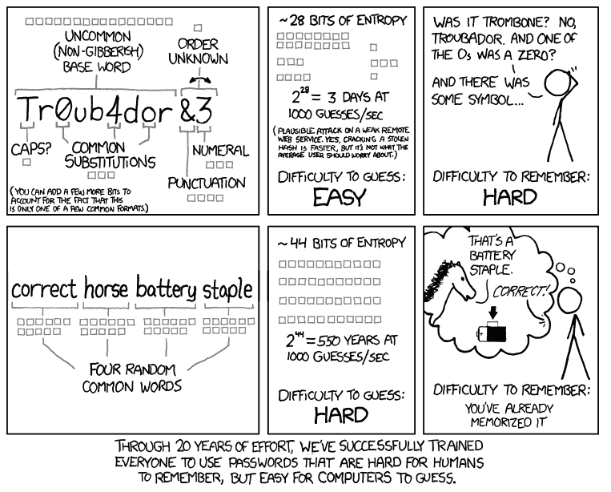
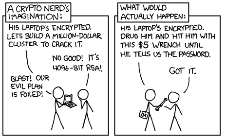

# 为什么一点点盐对你的密码有好处(但不是胡椒！)

> 原文：<https://www.freecodecamp.org/news/why-a-little-salt-can-be-great-for-your-passwords/>

简要说明——这篇文章是关于如何破解散列密码的理论。了解网络罪犯如何实施攻击对于了解如何保护系统免受这些类型的攻击极其重要。

但是，试图入侵一个不属于你的系统在你的管辖范围内可能是非法的(此外，入侵你自己的系统可能[而且经常]违反该产品的任何担保)。

本文假设您对哈希函数和基本密码破解技术有一定的了解——如果您不理解这些主题，请查看这些 [文章](https://www.freecodecamp.org/news/an-intro-to-password-cracking/)。

因此，您已经获得了一组散列密码。强制散列将花费非常长的时间。如何加快这一进程？

### 等等，我以为哈希函数是单向的！如何破解哈希函数？

不幸的是，用于散列密码的散列函数并不总是像普遍认可的散列函数那样安全。例如，用于旧 Windows 设备的哈希函数被称为 LM 哈希，它非常弱，几秒钟就可以被破解。

此外，您不需要对哈希进行反向工程。相反，您可以使用一组预先计算好的明文密码和相应的哈希值(<password>、<hash>)。这告诉黑客什么明文值产生特定的散列。</hash></password>

有了这个你就知道什么明文值产生了你要找的散列。当您输入密码时，电脑会对该值进行哈希运算，并将其与存储的值进行比较(如果匹配)，您就可以进行身份验证了。因此，您实际上不需要猜测某人的密码，只需要一个将创建相同散列的值。

这叫做碰撞。从本质上讲，由于散列可以接受任何长度或内容的数据，因此可以被散列的数据有无限的可能性。

由于哈希将文本转换为固定长度的内容(例如，32 个字符)，因此哈希的组合数量是有限的。这是非常非常多的可能性，但不是无限的。

最终，两组不同的数据将产生相同的哈希值。

预计算表对实现这一点非常有帮助，因为它们节省了大量时间和计算能力。使用预先计算的一组散列来查找密码散列被称为“查找表攻击”。这些表由系统管理员用来测试用户密码的强度，通常可以在线获得或购买。然而，它们也可能被邪恶的黑客所利用。

如果密码是不安全的(假设有人使用 5 个字符长的密码)，它可以相对容易地被破解。例如，5 个小写字符的密码只能用于创建 11，881，376 个不同的密码(26^5).

对于该密码的散列，即使该散列是加密安全的(使用适当的算法)，计算所有可能的密码及其对应的散列仍然是非常容易的。查找表非常适合这些类型的密码哈希。

但是，随着密码长度的增加，每个可能的密码和相应的哈希所需的存储空间(以及存储成本)会呈指数级增长。

例如，如果您试图破解的密码是 8 个字符长，但使用了数字(10 位)、小写字母(26)、大写字母(26)和一些特殊字符(10)，则可能的密码数量会跃升至 722、204、136、308、736——这是一个很大的存储空间，当您意识到每个密码都是用像 SHA-256 这样的散列函数散列的。

彩虹表通过减少存储需求解决了这个问题，但是它们需要更多的时间来计算潜在的密码。在最基本的层面上，这些基本上是预先计算的查找表，使您能够快速找到与您拥有的散列相匹配的明文。如果散列和明文包含在您的表中——类似于字典攻击——您只需查看密码是否包含在您的表中。如果不是，你就无法破解密码。你可以在网上找到这些免费的或购买的。

查看[这篇文章](https://null-byte.wonderhowto.com/how-to/create-rainbow-tables-for-hashing-algorithms-like-md5-sha1-ntlm-0193022/)中关于创建你自己的彩虹表的教程。

### 我仍然感兴趣。彩虹表是如何工作的？

如果您想跳过这些如何工作的详细解释，请随意向下滚动到“如何防范这些攻击”部分。

为了避免在找到所需的散列之前散列和存储每个可能的明文(如查找表)，您散列每个明文并将结果存储在一个表中，以便以后查找，而不必重新生成它们。这需要更长的时间，但节省内存。

要生成这个表，您需要使用散列函数和归约函数创建散列和明文的“链”。归约函数只是从散列中创建明文(它不会对散列进行反向工程，而是从散列中创建不同的明文)。这也是一个单向函数。

因此，为了计算这个表，您在您的归约函数 R()中使用了您的一个散列 h1，以便创建明文 p1。

R(h1) = p1。

然后，使用散列函数 H()和 p1 创建一个新的散列。

H(p1) = h2。

使用我们之前的例子:

如果明文集是[abcdefghijklmnopqrstuvwxyz]{ 5 }(我们正在寻找由长度为 5 的小写字母组成的所有密码的彩虹表)，并且我们使用 MD5(一种哈希算法):

哈希可能是 ab 56 B4 d 92 b 40713 ACC 5 af 89985d 4b 786(h1)。现在，我们应用归约函数，可以简单地取散列中的最后 5 个字母。

r(ab 56 B4 d 92 b 40713 ACC 5 af 89985 d4b 786)= cafdb

h(caf db)= 81a 516 EDA BF 924 CD 0f 727d 329 e 855 B1 f

### 为什么叫彩虹桌？

每列使用不同的归约函数。所以如果每根柱子都是彩色的，那将会是一条又长又细的彩虹。

使用不同的归约函数减少了链合并(冲突)的数量，这在彩虹表的前身哈希链中经常发生。这实质上意味着，如果你继续使用相同的归约函数，有可能你会得到两条不同的链，它们会收敛到相同的明文。使用不同的归约函数可以降低这种情况发生的几率，尽管这并不是不可能的。

### 太好了，你如何创建一个链？

为了创建一个链，你使用你的归约函数和散列函数(都是单向的)来创建一个散列和明文的“链”。这些“链”中的每一个都将继续 k 步，当链结束时，将只存储链中的第一个明文和最后一个散列。

因此，样本链看起来像这样:

P1-> h1 = H(P1)-> R1(h1)= p2-> H(p2)= H2-> R2(H2)= P3-> H(P3)= H3

每个缩减函数是不同的(以 R1、R2、R3 等为代表。)链的示例表(每行是长度为 5 的链)如下所示。请注意，这里填充了虚假数据，这只是给你一个例子——散列函数不是你会发现用来散列密码的散列函数。

R1 和 R2 的归约函数定义如下——R1 取散列的前 3 位，R2 取散列的后 2 个字母:

P1-> h1 = H(P1)-> R1(h1)= p2-> H(p2)= H2-> R2(H2)= P3-> H(P3)= H3

2 ->

15 ->

20-> LD 93 md8d-> 938-> lxkey 93k-> LX-> 93 mdkg 8d

在彩虹表中，只有第一个起点和终点被保存以节省存储空间，如下所示:

起点(明文)终点，经过 k 步链(散列)

P1-—> h1k

p2-—> h2k

P3-—> h3k

那么当你有一个 hash (h)在不知道明文的地方(？)，你会把它比作铁链。

1.  首先，您将检查该散列是否在最终散列(h1k、h2k 等)的列表中。).如果是这样，您可以转到第 3 步。
2.  如果没有，您可以将哈希缩减为不同的明文(R1)，然后哈希该明文(使用上面的哈希函数和下一个缩减函数)并将其与最终哈希列表(h1k、h2k、h3k 等)进行比较。).当它匹配一个最终散列时，该链将可能包含原始散列。
3.  为了找到链中的原始散列，取该链的起始明文(因此，如果它匹配 h1k，就从 p1 开始)并应用散列和归约函数沿着链移动，直到到达已知散列及其对应的明文。这样，您可以在链中遍历散列，而不会占用您机器上的存储空间。

虽然您不能确定链是否包含您需要的散列，但是您生成(或引用)的链越多，您就越有把握。不幸的是，每个链的生成都非常耗时，增加链的数量会增加您需要的时间。

### 您如何防御这些类型的攻击？

首先，对所有系统进行分层防御。如果您可以通过其他方法防止系统受损(这样攻击者就无法获得您的散列密码的副本)，攻击者就无法破解它们。

您也可以使用 salting，它在加密密码之前为密码添加一个随机值。这意味着您找到的预计算值(与哈希值匹配)不起作用。加密文本不仅仅基于未加密文本。因为每个密码的 salt 都不同，所以每个密码都需要单独破解。

Salting 现在作为一个选项包含在大多数主要的散列类型中。虽然 Windows 目前不使用 salting，但如果你使用“SYSKEY”工具，他们可以加密存储的哈希。

你也可以使用“回合”，或哈希密码多次。使用轮次(特别是如果轮次的数量是为每个用户随机选择的话)，使得黑客的工作更加困难。这是最有效的结合盐。

不幸的是，拥有散列密码的黑客也可以访问使用的回合数和 salt(因为为了得到那个列表，他们可能已经妥协了)。使用的 salt 和轮数与密码散列一起存储，这意味着如果攻击者有一个，他们也有另一个。然而，他们不能使用在线预计算的彩虹表，而必须计算他们自己的表(这非常耗时)。

另一种增加破解密码难度的方法是使用胡椒。Pepper 类似于 salt，但是虽然 salt 不是秘密的(它与散列密码一起存储)，但是 pepper 是单独存储的(例如，在配置文件中)，以防止黑客访问它。这意味着胡椒是秘密的，它的效力取决于此。

对于不同的应用，Pepper 需要有所不同，并且应该足够长以确保安全。国家标准和技术研究所建议至少 112 位。

虽然使用胡椒在某些情况下可能有效，但也有一些缺点。首先，目前没有算法支持 peppers，这意味着实际上，这不可能大规模实现。也就是说，除非你在创建自己的算法。听听[布鲁斯·施奈尔](https://www.schneier.com/blog/archives/2011/04/schneiers_law.html)。**别这样。**

关于辣椒问题的更长的文章，请看这个帖子。

最后，使用强(至少 12 个字符)复杂密码，并在所有系统中实施强密码策略。这可以包括强制用户创建强密码、定期测试其强度、在企业级使用密码管理器、强制使用 2FA 等等。

对什么是强密码感到困惑？

[https://xkcd.com/936/](https://xkcd.com/936/)

### 好像真的很容易被黑。我应该担心吗？

关于黑客，要记住的最重要的一点是，没有人想做比他们必须做的更多的工作。例如，计算彩虹表的工作量很大。如果有一种更简单的方法来获取你的密码，那可能是一个邪恶的演员首先会尝试的(比如网络钓鱼！).

这意味着启用基本的网络安全最佳实践可能是防止被黑客攻击的最简单的方法。事实上，微软[最近报告](https://www.zdnet.com/article/microsoft-using-multi-factor-authentication-blocks-99-9-of-account-hacks/)说，仅仅启用 2FA 就可以阻止 99.9%的自动攻击。

[https://xkcd.com/538/](https://xkcd.com/538/)

## 黑客快乐！

**补充阅读:**

[关于哈希链的更多细节](https://engineering.purdue.edu/kak/compsec/NewLectures/Lecture24.pdf)

[彩虹表的另一种解释](http://kestas.kuliukas.com/RainbowTables/)

[在线彩虹表列表](http://project-rainbowcrack.com/table.htm)