# 如何使用密钥库连接器更好地保护您在 Logic 应用程序中的秘密

> 原文：<https://www.freecodecamp.org/news/how-to-better-protect-your-secrets-in-logic-apps-using-key-vault-connector/>

用户在使用[逻辑应用](https://www.serverless360.com/azure-logic-apps)时面临的主要挑战之一是管理秘密值。这过去是通过 ARM 模板传递秘密来处理的，这不是一个现成的解决方案。

在 logic apps 中提供密钥库连接器之前，[一个理想的解决方案](https://www.serverless360.com/blog/managing-secrets-in-azure-logic-apps-using-managed-identities)是使用 Logic Apps 中提供的 HTTP 操作，并利用托管身份认证模式。即使是这种变通方法也有如下一些注意事项:

1.  逻辑应用程序运行历史包含无法隐藏的秘密值
2.  目前，我们只能有 10 个具有系统分配的托管身份的逻辑应用

让我们探索如何使用新的 Key Vault 连接器更好地保护您的逻辑应用中的秘密。此外，我将向您展示如何使用 Key vault 连接器解决上述问题。

## 设计您的示例逻辑应用程序

按照以下步骤在设计器页面中创建示例逻辑应用程序。

1.  向逻辑应用程序添加“Http 请求”触发器。稍后我们将通过 rest 客户端调用这个逻辑应用程序。

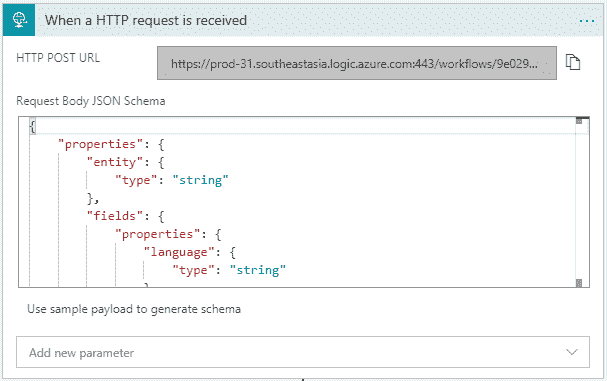

2.然后，搜索密钥库操作，并将“获取秘密”操作添加到 logic 应用程序。现在，您有几个选项来进行身份验证:您可以使用 **Azure AD** 或 [**服务原则**](https://docs.microsoft.com/en-us/azure/active-directory/develop/howto-create-service-principal-portal) **al** 。在这个例子中，我将继续使用 Azure 广告服务。

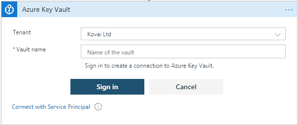

3.使用您的帐户登录。该帐户应该有足够的权限访问您的密钥库。否则，您应该通过**访问策略手动提供访问权限。**

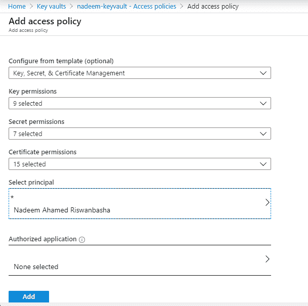

4.用“<secret name="">”填写必填字段。如果您还没有一个，那么您可以通过转至“密钥库”菜单来创建一个。你可以在左窗格找到“秘密”选项。</secret>

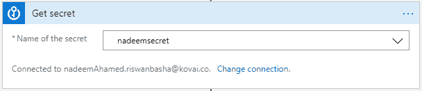

> *注意:如果您是第一次提供密钥库本身，请记住:有时您可能需要手动向您的订阅注册密钥库服务。(第一次做的时候遇到这个问题)。*

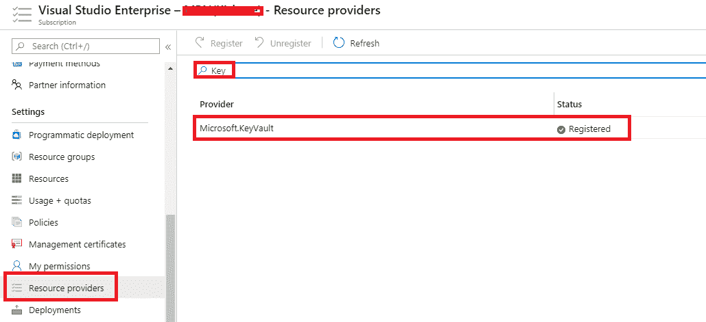

5.现在，将“Http 响应”操作添加到逻辑应用程序中。填写如下字段:

**状态码** : 200
**正文** : <添加动态表情:秘密>

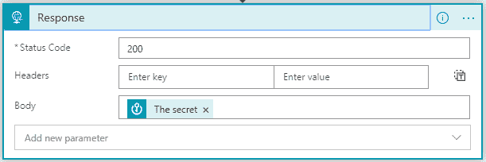

6.保存逻辑应用程序。

## 测试逻辑应用程序

现在，从逻辑应用程序触发器复制 HTTP post URL，并转到 [reqbin](https://reqbin.com/) (在线 REST 客户端)。将 URL 粘贴到地址栏中，并将默认方法从 **GET** 更改为 **POST** ，然后单击 Send。

逻辑应用程序将被触发并发回响应代码 200 和秘密值，如下图所示。

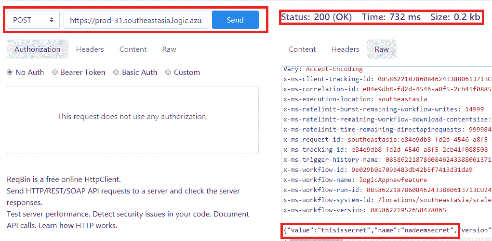

## 检查运行历史

在检查 logic 应用程序的运行历史时，我们注意到秘密值以纯文本显示。

你还记得我们在经典方法中遇到的同样的问题吗？正如我已经说过的，这可以通过以下步骤通过密钥存储库连接器设置轻松解决:

1.  回到设计器，点击“更多选项”菜单下的设置选项。

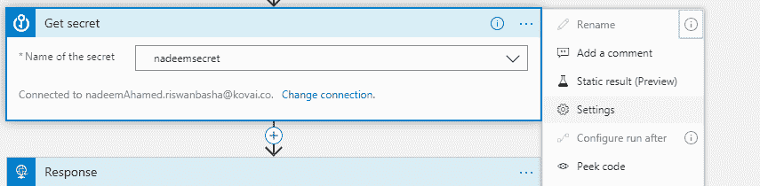

2.现在，在“获取秘密”动作的设置中，启用安全**输入**和**输出**选项并点击完成。

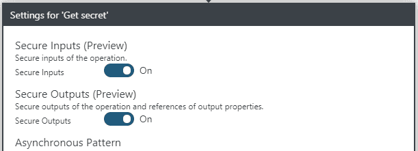

3.再次保存逻辑 app，通过 rest 客户端(reqbin.com)调用。您将在请求 Bin 中得到相同的响应，但是运行历史不包含纯文本格式的秘密值。而是显示为“由于安全配置，内容未显示”。

我们现在已经解决了经典方法中的第一个问题。第二个问题是，我们只能有 10 个具有系统分配的托管身份的逻辑应用。

我们还通过在连接器中不使用托管身份认证模式解决了这个问题。相反，它通过 Azure Active Directory 或服务主体进行认证(尽管这有一个旋转秘密的缺点)。

一旦用户通过访问策略获得对密钥库的足够权限，他们将能够在任何数量的逻辑应用程序中访问密钥库。

## 扩展功能集

在深入研究 Logic Apps 密钥库操作时，我发现了一些更有趣的用例，可以通过加密和解密操作来实现。

如果用户更关心他们的数据，那么他们可以使用加密和解密操作来使值更加安全。

为此，请在密钥库中创建一个加密密钥。

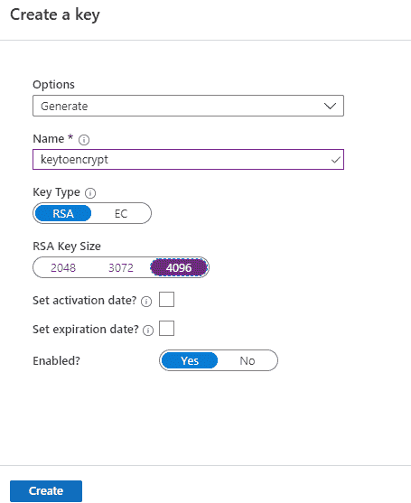

使用 Key vault 连接器中的加密和解密操作，您可以加密数据并再次解密。如上所述，我们甚至可以在设置中启用安全输入和输出选项，使其更加安全。

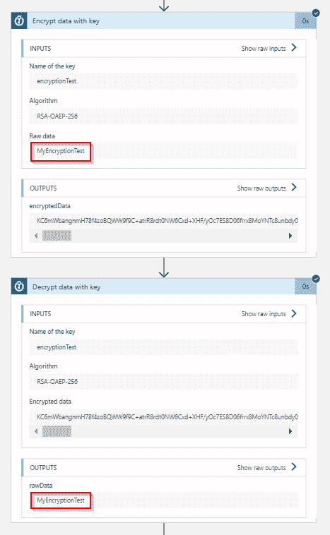

## 使用无服务器 360 管理和监控逻辑应用

[Serverless360](https://www.serverless360.com/) 是一个管理和监控所有 Azure 无服务器资源的平台，专注于帮助您的运营和支持您的团队的日常工作。

考虑使用多个 Azure Logic 应用程序定义的业务应用程序的上述工作流。

业务应用的不同利益相关者会有不同的需求，因为他们[管理和监控 Azure Logic 应用](https://www.serverless360.com/azure-logic-apps-monitoring-management)。

一些很难通过 Azure 门户实现的关键需求是:

*   当发现与预期不同时，自动更正逻辑应用程序状态
*   在服务地图视图中即时反映逻辑应用的警告和错误状态
*   近乎实时的故障检测
*   自动重新提交特定失败的运行操作
*   对流经逻辑应用程序的消息进行端到端跟踪，以及
*   对功耗、性能和可靠性的评估。

这些需求不能直接通过 Azure 门户来实现。但是 [Serverless360](https://www.serverless360.com/) 可以作为 Azure 门户的补充，因为它具有解决 Azure 门户中的缺口的功能。

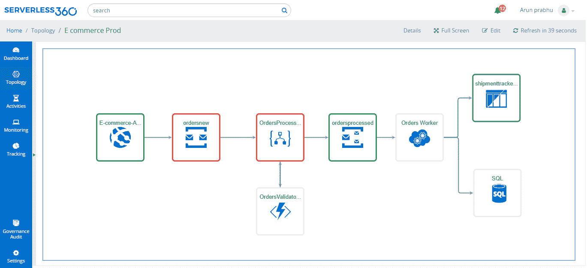

Service Map in Serverless360

## 总结

在这篇博客中，我们看到了在 Logic 应用程序中保护您的秘密的经典和最新方法。另外，我希望这篇博客能让你更清楚地了解目前可用的密钥库连接器。

最后，我介绍了 Logic Apps 密钥库连接器、加密和解密操作的扩展特性集。

我希望你喜欢阅读这篇文章。快乐学习！