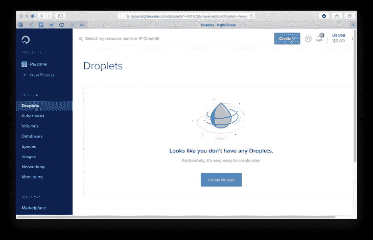
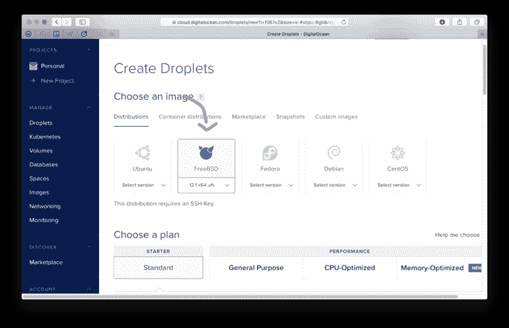
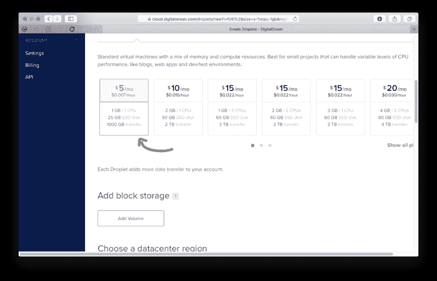
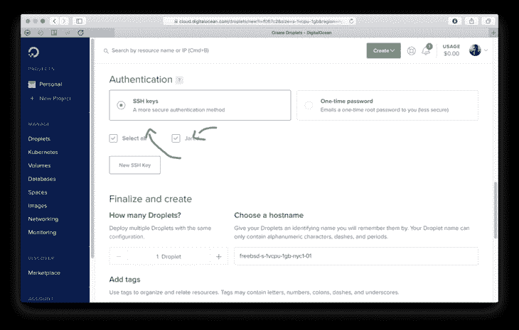
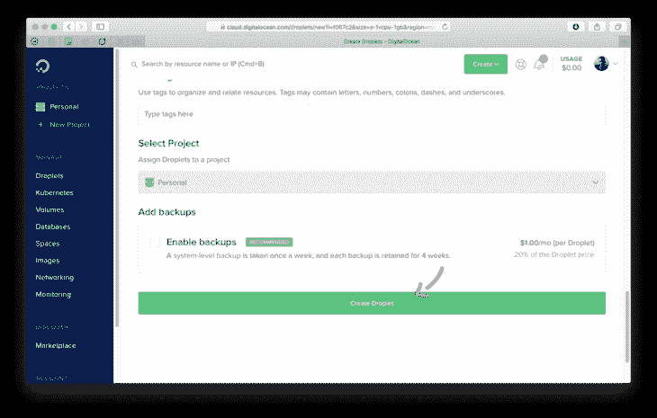

# 如何自托管 Hugo web 应用程序

> 原文：<https://www.freecodecamp.org/news/my-latest-self-hosted-hugo-workflow/>

在 Netlify 上托管了几年后，我决定回到自己托管。这有几个原因，但主要原因是我对事情的运作有更多的控制权。

在这篇文章中，我将向你展示我部署我的 [Hugo](https://gohugo.io) 生成的站点(【www.jaredwolff.com】T2)的工作流程。

我将使用一个基于 FreeBSD Jails 的服务器来完成所有这些工作，而不是使用大多数人喜欢的东西。另外，我将向你展示一些我多年来学到的关于批量调整图像大小的技巧。

我们开始吧。

## 在哪里主持？

如果你想托管自己的服务，你需要一台服务器。这就是像 Digital Ocean 或 Vultr 这样的 VPS 提供商的用武之地。我是一个粉丝，已经使用数字海洋有一段时间了。

要设置新服务器，以下是一些步骤:

1.  登录数字海洋。如果你没有数字海洋，但想支持这个博客，请点击[此处](https://m.do.co/c/9574d3846a29)创建一个帐户。
2.  进入`Account Settings`->-`Security`并确保你有一个 SSH 密钥设置。
3.  创建新的 FreeBSD droplet。确保您使用的是 UFS 版本的 
4.  确保你选择了每月 5 美元的计划。对于简单的安装，这已经足够了！
5.  确保选择了您的 SSH 密钥
6.  最后点击绿色**创建水滴**按钮！
7.  完成后宋承宪:`ssh root@<yourserverip>`

## 用 Bastille 设置 FreeBSD 服务器


直到最近，一切都是在基于 Docker 的平台上运行，使用的是 [Exoframe](https://github.com/exoframejs/exoframe) 。这很容易，几乎不用动脑。

缺点是 Docker 占用了太多的资源。此外，在 Docker 容器中管理文件与本地托管文件一样多，甚至更多。哦，你检查过 Docker 最近在你的机器上使用了多少空间吗？在我的开发机器上，大约有 19GB 的空间。？

那么还有什么选择呢？

FreeBSD 监狱使用巴士底狱。

我已经和巴士底玩了几个月了。我用得越多，就越觉得 100%有道理。

Bastille 允许你创建(现在)基于 FreeBSD 的便携式轻量级监狱。这些监狱是“容器”,几乎没有开销。没有守护进程(操作系统就是“守护进程”！).另外，与 Docker 的蠕虫相比，监狱是安全的。是的，您可能需要编译和移植一些实用程序。尽管大多数已经在 FreeBSD 的包管理器`pkg`中得到支持。

在这一节中，你将学习如何用`caddy`运行一个监狱，这样你就可以安全地托管你的站点。

让我们保持势头！

获得服务器的 IP 地址后，您应该登录:

```
ssh root@123.456.789.10 
```

您应该会收到一条 MOTD 消息和一个`sh`提示。呜！

```
FreeBSD 12.1-RELEASE-p2 GENERIC

Welcome to FreeBSD!
...

# 
```

让我们用`pkg` (FreeBSD 的包管理器)安装几个重要的位:

```
pkg install restic rsync bastille 
```

我们将使用`restic`进行备份，`rsync`用于传输文件，`bastille`用于监狱设置。

你还得在你的`pf.conf`里设置一些静态路由。这是我的一个例子:

```
ext_if="vtnet0"

# Caddy related
caddy_addr=10.10.2.20

set block-policy return
scrub in on $ext_if all fragment reassemble
set skip on lo

table <jails> persist
nat on $ext_if from <jails> to any -> $ext_if

# container routes
rdr pass inet proto tcp from any to port 80 -> $caddy_addr port 8880
rdr pass inet proto tcp from any to port 443 -> $caddy_addr port 4443

# Enable dynamic rdr (see below)
rdr-anchor "rdr/*"

block in all
pass out quick modulate state
antispoof for $ext_if inet
pass in inet proto tcp from any to any port ssh flags S/SA keep state 
```

这是`bastille`的标准`pf.conf`文件。确保你编辑的`caddy_addr`是你选择的 IP。

现在让我们启动防火墙。您将被踢出您的`ssh`会话:

```
sysrc pf_enable="YES"
service pf start 
```

那么让我们来解决一些`bastille`配置问题:

```
# set up bastille networking
sysrc cloned_interfaces+=lo1
sysrc ifconfig_lo1_name="bastille0"
service netif cloneup

# bootstrap the base jail and start bastille
bastille bootstrap 12.1-RELEASE update
sysrc bastille_enable="YES"
service bastille start 
```

这将设置您的网络，并获取您稍后将使用的最新默认基本监狱。

接下来，让我们建立监狱:

```
bastille create caddy 12.1-STABLE 10.10.2.20
bastille start caddy 
```

然后安装`caddy`

```
#install the binary
fetch https://github.com/caddyserver/caddy/releases/download/v1.0.4/caddy_v1.0.4_freebsd_amd64.tar.gz
tar xvf caddy_v1.0.4_freebsd_amd64.tar.gz caddy
bastille cp caddy caddy /usr/local/bin/
rm caddy

#create the caddy user
bastille cmd caddy pw useradd caddy -m -s /usr/sbin/nologin

#install ca root file
bastille pkg caddy install ca_root_nss 
```

安装`ca_root_nss`时，`pkg`必须初始化。接受提示。一旦你完成了这里，我们将进入下一步！

一旦安装完成，我们还应该配置`caddy`在引导时启动。最简单的方法是使用这个`rc.d`脚本:

```
#!/bin/sh

# $FreeBSD: head/net/caddy/files/caddy.in 452063 2017-10-14 12:58:24Z riggs $
#
# PROVIDE: caddy
# REQUIRE: LOGIN
# KEYWORD: shutdown
#
# Add the following lines to /etc/rc.conf.local or /etc/rc.conf
# to enable this service:
#
# caddy_enable (bool):	Set to NO by default.
#				Set it to YES to enable caddy.
# caddy_user (user):		Set user to run caddy.
#				Default is "caddy".
# caddy_group (group):	Set group to run caddy.
#				Default is "caddy".
# caddy_conf (path):		Path to caddy configuration file.
#				Default is /usr/local/etc/caddyfile.conf

. /etc/rc.subr

name=caddy
rcvar=caddy_enable

load_rc_config $name

: ${caddy_enable:="NO"}
: ${caddy_user:="caddy"}
: ${caddy_group:="caddy"}
: ${caddy_conf:="/usr/local/etc/caddyfile.conf"}
: ${caddy_log:="/home/caddy/caddy.log"}
: ${caddy_env:="CADDYPATH=/home/caddy/"}
: ${caddy_https_port:="4443"}
: ${caddy_http_port:="8880"}

pidfile="/var/run/caddy.pid"
procname="/usr/local/bin/caddy"
command="/usr/sbin/daemon"
command_args="-f -p ${pidfile} /usr/bin/env ${caddy_env} ${procname} -agree -http-port ${caddy_http_port}  -https-port ${caddy_https_port} -conf=${caddy_conf} -log=${caddy_log} ${caddy_args}"
extra_commands="reload"

start_precmd=caddy_startprecmd
reload_cmd=caddy_reloadcmd

caddy_startprecmd()
{
      if [ ! -e ${pidfile} ]; then
              install -o ${caddy_user} -g ${caddy_group} /dev/null ${pidfile};
      fi
}

caddy_reloadcmd()
{
      kill -s USR1 $(cat ${pidfile})
}

run_rc_command "$1" 
```

如果还没有删除可执行文件`caddy`,请将其删除。然后用`vi`新建一个文件。这将是你的`rc.d`剧本！

```
vi caddy 
```

然后将上面脚本的内容粘贴在那里，保存并退出。

使用`chmod`确保文件可执行，并复制到 Caddy 容器。

```
chmod +x caddy
bastille cp caddy caddy /usr/local/etc/rc.d/ 
```

最后，我们需要一个 Caddyfile。这里有一个例子:

```
stage.jaredwolff.com {
  tls hello@jaredwolff.com
  log /home/caddy/stage.jaredwolff.com.log
  root /var/www/stage.jaredwolff.com/
  gzip
  log stderr
} 
```

`log`指本站点特定的访问日志。

`root`指根`public`文件夹在您机器上的位置。对我来说，这是常见的`/var/www/<name of site>`。设定你的道路并记住它们。我们以后会需要它们的！

要让 Caddy 为这个子域生成证书，您必须设置 *tls* 选项。只需要一封电子邮件。

关于 Caddyfile 结构的更多信息，请查看文档。

创建一个名为`caddyfile.conf`的文件，并将其复制到 Caddy 容器中的`/usr/local/etc/`:

```
vi caddyfile.conf
# Paste your caddyfile contents and save
bastille cp caddy caddyfile.conf /usr/local/etc/ 
```

现在，您应该将 DNS 重定向到服务器 IP。这样，Caddy 可以生成/获取正确的证书。然后，您可以从以下方面开始 Caddy:

```
bastille service caddy caddy start 
```

您可以在`/usr/home/caddy/caddy.log`检查日志，以确保您的域配置正确。

***补充说明:*** 开始时设置 SSL 证书很困难，尤其是当你从另一个服务器迁移过来的时候。当您切换 DNS 设置并启动`caddy`时，您的网站将不得不暂时关闭。

(前提是你使用的是标准的`caddy` 1.0。你也可以在这里使用 DNS 提供商[插件](https://github.com/caddyserver/dnsproviders)，这让事情变得简单了一些。)

现在我们已经启动并运行了`caddy`，是时候使用`rsync`复制我们的`hugo`生成的资产了。我们开始下一步了！

## *简化*构建和部署


我花了大量时间编写 C 代码，这意味着我花了大量时间使用 Makefiles。对许多人来说，`make`(或者 GNU make 的`gmake`)是他们生存的祸根。

对于构建和部署，`make`使得创建可重用的配方变得容易。这样，您就知道每次都可以放心地进行部署。

我的 Makefile 借用了维多利亚·德雷克不久前发布的 Makefile。我稍微修改了一下，以符合我的需要。

让我们参观一下，看看里面有什么:

```
.POSIX:

HUGO_VERSION := 0.66.0

OPTIMIZED_DIR := optimized
CONTENT_DIR := content
DEST_DIR := public

SERVER := 123.456.789.10
USER := user 
```

第一部分包含了所有的变量，我用它们来告诉后面的函数要做什么。它还引用了`.POSIX`目标。这意味着 Makefile 可以在不同版本的`make`之间移植。

然后，我加入一些逻辑来确定我是部署到*阶段*还是*生产阶段:*

```
# Set the place where it's deployed to.
ifdef PRODUCTION
$(info Building for production. ?)
TARGET := www
else
$(info Building for development. ?)
BASEURL := --baseURL "https://stage.jaredwolff.com"
TARGET := stage
endif 
```

默认情况下，以下配方将使用开发工作流。要使用生产工作流，您可以像这样调用`make`:

```
PRODUCTION=1 make build 
```

这确实给部署过程增加了一些额外的摩擦。不过，这是一个好的步骤。这样，您可以确保部署到正确的位置！

```
# Full path
DEPLOY_DIR := /usr/local/bastille/jails/caddy/root/path/to/$(TARGET).jaredwolff.com 
```

使用上面的`TARGET`变量，我定义了我的服务器资产的路径。我用巴士底狱来组织我的监狱，所以路径特别长。(是的，很长)这允许我们使用`rsync`轻松地部署文件。

现在有趣的部分来了。为了进行完整的批量调整，我使用 Makefile 的`wildcard`功能。

```
IMAGES := \
$(wildcard $(CONTENT_DIR)/*/images/*.jpg) \
$(wildcard $(CONTENT_DIR)/*/images/*.JPG) \
$(wildcard $(CONTENT_DIR)/*/images/*.jpeg) \
$(wildcard $(CONTENT_DIR)/*/images/*.png) \
$(wildcard $(CONTENT_DIR)/*/*/images/*.jpg) \
$(wildcard $(CONTENT_DIR)/*/*/images/*.jpeg) \
$(wildcard $(CONTENT_DIR)/*/*/images/*.png) \
$(wildcard $(CONTENT_DIR)/*/*/images/*.JPG) \ 
```

在这种情况下，它将为我的内容目录中的每个图像创建一个巨大的空格分隔的列表。这种方法的最大缺点是它不具有空间容忍度。解决这个问题的一个简单方法是确保我所有的照片没有空格。

这里有一个快速而肮脏的 bash 命令。您可以使用重命名包含空格的文件，并用“_”字符替换它们:

```
for f in *\ *; do mv "$f" "${f// /_}"; done 
```

接下来，我们重命名这些条目，因此前缀现在是目标目录。当我们想要调整大小时，这很有用:

```
OPTIMIZED_IMAGES := \
$(subst $(CONTENT_DIR)/,$(OPTIMIZED_DIR)/,$(IMAGES)) 
```

现在来看看`optimize`食谱:

```
.PHONY: optimize
optimize: build $(OPTIMIZED_IMAGES)
@echo "? Optimizing images"
rsync -r $(OPTIMIZED_DIR)/ $(DEST_DIR)/
du -sh $(CONTENT_DIR)/
du -sh $(DEST_DIR)/

$(OPTIMIZED_IMAGES):
convert -strip -compress JPEG -resize '730>' $(subst $(OPTIMIZED_DIR)/,$(CONTENT_DIR)/,$@) $@ 
```

它首先调用`build`配方，然后调用`$(OPTIMIZED_IMAGES)`配方。后者将使用来自 [Imagemagick](https://imagemagick.org/script/convert.php) 的`convert`命令优化图像。在这种情况下，我只调整大于 730 像素宽的文件。相应地改变你的网站，这样你就能从一个[优化的网站中获益。](https://www.jaredwolff.com/seven-ways-to-optimize-your-site-for-speed/)

调整大小后，配方使用`rsync`将文件从`OPTIMIZED_DIR`复制到`DEST_DIR.`

如果我们看一看`build`配方，我首先构建资产。然后，我把照片从`content`目录复制到`optimized`目录。好的一面是`rsync`只会移动已经改变的文件。因此，不必在每次构建时一遍又一遍地复制文件。

最后是`deploy`配方。

```
.PHONY: deploy
deploy:
@echo rsync to $(DEPLOY_DIR)
@rsync -r --del public/ $(USER)@$(SERVER):$(DEPLOY_DIR)/
@echo making restic snapshot
@scp scripts/backup.sh $(USER)@$(SERVER):/root/backup.sh
@ssh $(USER)@$(SERVER) sh /root/backup.sh $(DEPLOY_DIR)
@echo "? Site is deployed!" 
```

您可以再次看到，我正在使用 rsync 将`public/`的内容同步到服务器。确保您设置了`USER`、`SERVER`和`DEPLOY_DIR`。在我的情况下`DEPLOY_DIR`出来到`/usr/local/bastille/jails/caddy/root/var/www/www.jaredwolff.com`

当您最终成功部署时，您可以仔细检查所有东西是否都在正确的位置。然后，一旦一切正常，您就可以使用以下命令启动您的球童服务器:

```
bastille service caddy caddy start 
```

`deploy`在这里也会做一些额外的顺手的事情。它将部署我的`restic`备份脚本并运行它。我将在备份部分详细讨论这一点。

总而言之，下面是完整的 Makefile:

```
.POSIX:

HUGO_VERSION := 0.66.0

OPTIMIZED_DIR := optimized
CONTENT_DIR := content
DEST_DIR := public

SERVER := 155.138.230.8
USER := root

# Set the place where it's deployed to.
ifdef PRODUCTION
$(info Building for production. ?)
TARGET := www
else
$(info Building for development. ?)
BASEURL := --baseURL "https://stage.jaredwolff.com"
TARGET := stage
endif

# Full path
DEPLOY_DIR := /usr/local/bastille/jails/caddy/root/var/www/$(TARGET).jaredwolff.com

IMAGES := \
$(wildcard $(CONTENT_DIR)/*/images/*.jpg) \
$(wildcard $(CONTENT_DIR)/*/images/*.JPG) \
$(wildcard $(CONTENT_DIR)/*/images/*.jpeg) \
$(wildcard $(CONTENT_DIR)/*/images/*.png) \
$(wildcard $(CONTENT_DIR)/*/*/images/*.jpg) \
$(wildcard $(CONTENT_DIR)/*/*/images/*.jpeg) \
$(wildcard $(CONTENT_DIR)/*/*/images/*.png) \
$(wildcard $(CONTENT_DIR)/*/*/images/*.JPG) \

OPTIMIZED_IMAGES := \
$(subst $(CONTENT_DIR)/,$(OPTIMIZED_DIR)/,$(IMAGES))

.PHONY: all
all: build optimize

.PHONY: clean
clean:
rm -rf public/
rm -rf optimized/

.PHONY: serve
serve:
@hugo serve -D

.PHONY: ssh
ssh:
@ssh $(USER)@$(SERVER)

.PHONY: build
build:
@echo "? Generating site"
hugo --gc --minify -d $(DEST_DIR) $(BASEURL)
rsync -av --del -f"+ */" -f"- *" $(CONTENT_DIR)/ $(OPTIMIZED_DIR)/

.PHONY: optimize
optimize: build $(OPTIMIZED_IMAGES)
@echo "? Optimizing images"
rsync -r $(OPTIMIZED_DIR)/ $(DEST_DIR)/
du -sh $(CONTENT_DIR)/
du -sh $(DEST_DIR)/

$(OPTIMIZED_IMAGES):
convert -strip -compress JPEG -resize '730>' $(subst $(OPTIMIZED_DIR)/,$(CONTENT_DIR)/,$@) $@

.PHONY: deploy
deploy:
@echo rsync to $(DEPLOY_DIR)
@rsync -r --del public/ $(USER)@$(SERVER):$(DEPLOY_DIR)/
@echo making restic snapshot
@scp scripts/backup.sh $(USER)@$(SERVER):/root/backup.sh
@ssh $(USER)@$(SERVER) sh /root/backup.sh $(DEPLOY_DIR)
@echo "? Site is deployed!" 
```

这里有一些其他方便的小窍门，你可能会想用。测试和连接时，`clean`、`serve`和`ssh`非常有用。

最后，您将有一个两步部署流程。第一个生成你的网站与优化的图像。第二种是部署到服务器进行静态托管。

## 增量备份


在发现 Restic 之后，我被它对我所有增量备份需求的便利性所折服。以我的服务器为例，我使用来备份我的站点的根文件夹。这样，如果我需要回滚，只需几步就可以完成。

以下是你如何建立本地回购的方法。

### 设置它

初始化回购很简单。最重要的部分是确保你不会丢失/忘记你的密码！

```
 # restic init -r /root/backups
    enter password for new repository:
    enter password again:
    created restic repository 32e14c7052 at /root/backups

    Please note that knowledge of your password is required to access
    the repository. Losing your password means that your data is
    irrecoverably lost. 
```

设置`RESTIC_PASSWORD`环境变量以避免输入您的密码。为了使它永久化，你必须将`export RESTIC_PASSWORD="Your password here!"`放在`/root/`中的`.profile`文件中。

### 回投

通过 SSH 调用`restic`很困难。我们下一个最佳选择是什么？

将一个(非常简短的)shell 脚本传输到服务器，并在部署后运行它。以下是我今天使用的内容:

```
#!/bin/sh
export RESTIC_PASSWORD="Your password here!"
restic backup $1 -r /root/backups/ 
```

***边注:*** 当我坐在这里看这个脚本的时候，出于安全考虑你可以把“你的密码在这里！”脚本的第二个参数是$2。这样，您就不需要提交/推送存储在静态文件中的密码！

这将首先设置您的备份密码。然后它使用第一个命令行参数作为路径运行`restic`。因此，要使用此脚本运行备份，它看起来会像这样:

```
./backup.sh /path/to/your/public/folder/ 
```

**注意:**在开始备份之前，你确实需要初始化你的`restic`备份*。否则它会吐在你身上！*

在我的例子中，我将增量备份放在机器的另一个文件夹中。这样一来，它们就很容易拿到，而且速度也很快。

### 查看您的备份

要查看您的备份，您可以运行以下命令:

```
# restic snapshots -r /root/backups -g paths -c
enter password for repository:
repository e140b5e4 opened successfully, password is correct
snapshots for (paths [/usr/local/bastille/jails/caddy/root/var/www/www.jaredwolff.com]):
ID        Time                 Host         Tags
--------------------------------------------------
d3328066  2020-03-10 00:30:58  vultr.guest
f3360819  2020-03-10 04:03:03  vultr.guest
231dd134  2020-03-10 04:44:00  vultr.guest
3c1be26a  2020-03-10 04:56:19  vultr.guest
e96c947c  2020-03-10 05:03:00  vultr.guest
34c3682a  2020-03-10 14:01:37  vultr.guest
fbccdb8c  2020-03-10 14:04:26  vultr.guest
9ce11146  2020-03-10 15:38:49  vultr.guest
046b3da3  2020-03-10 15:47:06  vultr.guest
9c28d4bc  2020-03-10 15:48:25  vultr.guest
469dc228  2020-03-10 15:48:54  vultr.guest
6f78af72  2020-03-10 17:00:21  vultr.guest
29ad17b2  2020-03-10 20:18:23  vultr.guest
ed22ce1f  2020-03-10 20:20:24  vultr.guest
9c8c1b03  2020-03-11 13:56:40  vultr.guest
b6cfcfec  2020-03-11 14:08:14  vultr.guest
e8546005  2020-03-11 14:27:22  vultr.guest
49a134fe  2020-03-17 00:47:58  vultr.guest
c0beb283  2020-03-18 20:44:52  vultr.guest
-------------------------------------------------- 
```

您可以使用此列表来确定是否需要回滚部署。

### 恢复

从备份中恢复，尤其是在实时环境中，需要很快。查看备份后，您可以使用特定备份的 *ID* 来恢复该备份。

```
restic restore d3328066 
```

这将把文件恢复到 2020-03-10 00:30:58 所做的备份。牛逼。另外，它不会覆盖每一个文件。它将只应用当前状态和存储状态的差异。

## 结论

在这篇文章中，我们已经涉及了大量的内容。您已经学会了如何:

*   使用 Vultr 部署您自己的服务器
*   使用巴士底狱来建造类似容器的监狱
*   设置 Caddy 为 TLS 提供静态文件资产
*   使用一个相当简单的 Makefile 和`rsync`来部署文件
*   每次部署后使用`restic`进行备份

最终，我们拥有了一个健壮、安全和简单的平台来托管静态文件和服务。

请继续关注，因为很快会有更多像这样的帖子出现在你面前！同时，看看我的其他帖子。

感谢您的阅读，下次再见！？

你可以在 www.jaredwolff.com 找到其他类似的文章。