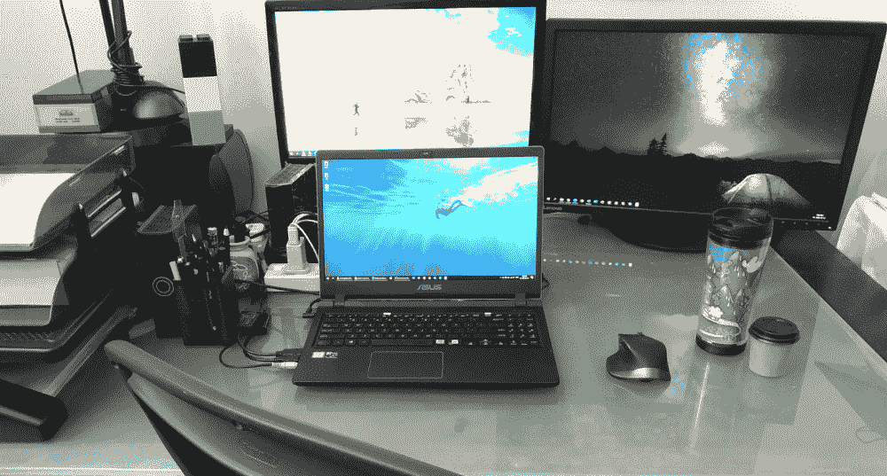
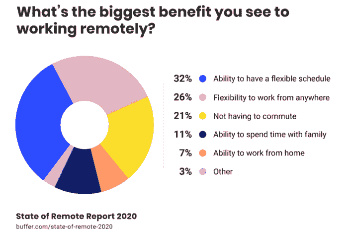
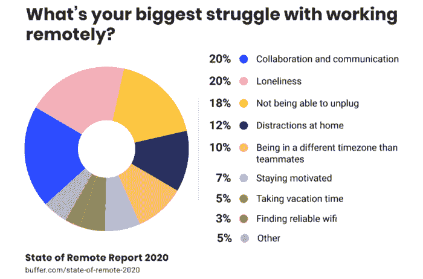
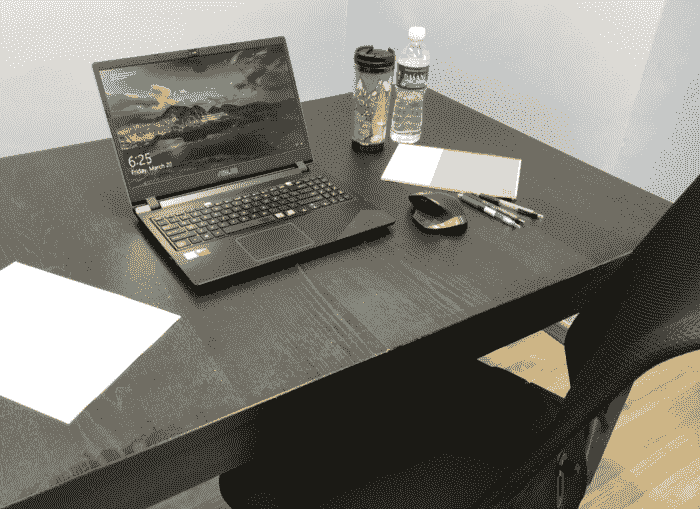
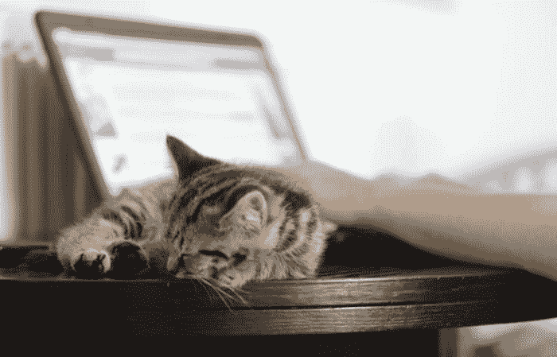

# 如何在新冠肺炎疫情期间在家工作:我的个人建议

> 原文：<https://www.freecodecamp.org/news/my-personal-tips-on-working-from-home-during-this-covid-19-season/>

### 新冠肺炎冠状病毒疫情导致许多人在家工作。所以你可能想知道——我如何在家里保持高效率？

多年来，远程工作在许多公司都呈上升趋势。一些公司为员工提供远程工作作为福利，以更好地平衡工作和生活。

今天，由于新冠肺炎冠状病毒的爆发，世界各地数百万人最近开始在家(WFH)工作。

一些公司不提倡 WFH，因为他们认为人们不能在没有监督的情况下工作。相反，他们采用了一种控制和微观管理的文化。

但是，对于员工来说，哪种环境更有生产力呢？国内办公室还是 **办公室*办公室*办公室？看来我们有机会找到答案了。

这种情况可能会持续数周甚至更长时间。尽管如此，这是一个改变生活方式的好机会。不会有匆忙离家，不吃早餐，这样你就不会错过火车。

Buffer 和 Angellist 的联合报告调查了 3500 多名远程技术人员。它发现 WFH 最大的好处是灵活的时间表，可以在任何地方工作，而且不用通勤。

在天平的另一端，当团队成员孤立分散时，团队协作和沟通的挑战变得明显。他们还会在被家里的事情分散注意力的时候，不断地感到对工作的依恋。

WFH 太棒了。对一些人来说，这似乎是新发现的自由，但随之而来的也是责任。为了帮助你过渡到这种新的工作方式，这里有一些有用的提示:

## 日常工作

****被管教**** 。养成严格的作息规律或工作时间很重要，但也要善待自己。在你平常的时间醒来，过你平常的生活。对我来说，我利用平时花在通勤上的时间读书或者伸伸腿。

**。不要穿睡衣。你的穿着会影响你的情绪和态度，所以穿合适的工作装。**

******设定工作时间**** 。WFH 允许灵活性，但是你工作日的开始和结束应该尽可能的常规化。在一天结束的时候强制停下来，然后为之后的个人差事做计划。设定一个目标结束时间将决定期望值并提高生产率。**

******用短暂的运动休息创造良好的作息规律**** 。我个人觉得，移动和拉伸身体可以给大脑提供能量。事实是，内啡肽是在运动时产生的，它会增加幸福感和兴趣水平。**

****

## **沟通**

******与你的团队**** 进行每日站立会议。这可以远程完成(无论是站着还是坐着)。保持简短的本质，让团队成员在各自的任务中对彼此负责。**

******有更多的社会交往**** 。WFH 可能会很孤独，所以我会和同事计划虚拟的工间休息时间(喝一杯真正香浓的咖啡)。保持与人交谈，这样你就不会感到孤立。**

******过度沟通**** 。WFH 的意思是我不能从一个同事身边走过去说些什么。如果事情紧急，我通常会在通信中进行冗余。比如，邮件发出后，我也会给收件人发短信，或者在 Slack 上留下 ping。**

******使用表情符号**** 。短信本身通常看起来更正式和严肃。为了让信息保持积极向上，有时我喜欢通过添加笑脸来缓解情绪。说做和做有天壤之别:-)。**

## **娱乐**

******保持电视机关闭**** 。这是一个很大的干扰。如果你是那种喜欢背景音乐的人，YouTube 上的收音机或音乐可能会更好。放松的爵士乐创造了一种放松的情绪，而电子游戏的配乐保持了高水平的能量。**

******休假** s **社交媒体**。我们时不时都会犯这种错误，如果不小心的话，社交媒体会是一个巨大的浪费时间的工具。****

******将工作空间与休息空间分开**** 。你不应该在卧室里工作(床太舒服了！而且会让你腰酸背痛)，也不在厨房里(你完全可以吃到所有的零食！而且打乱了你的饮食)。**

******离开家**** 。如果诱惑太分散注意力，去一家像星巴克这样有无线网络的咖啡馆。一个新的环境也能极大地激发创造力和注意力。**

****

## **时间管理**

******保持每日清单**** 。无论你是在办公室还是在家工作，为一天制定一个时间表并记录每天的任务是非常重要的。**

******使用在线工具**** 。有很多免费软件可以提高生产力:**

*   **视频会议:Skype、Zoom、Google Meet、Cisco Webex**
*   **任务和项目管理:[空中工作台](https://airtable.com/)、[诺瓦托工具](https://www.novatools.org/)、[特雷罗](https://trello.com/)**
*   **团队交流:Whatsapp online、Slack、Workplace 作者脸书**
*   **共享文档:Dropbox、box、GoogleDrive**

******日程安排频繁短暂休息**** 。虽然休息可能会适得其反，但研究表明，短暂的休息实际上可以提高生产力和创造力水平。去户外呼吸一些新鲜空气**，听听鸟鸣，享受一下微风，花点时间闻闻花香，通过短途散步或骑自行车与大自然联系起来。****

********忌功蠕**** 。WFH 会侵犯你的私人生活。如果没有预定的工作时间，工作会悄悄进入你的家庭生活，就像个人杂事会悄悄进入工作时间一样。不要在工作时间做家务。****

## **工作区物流**

******准备一个有利的工作空间**** 。除了拥有高速互联网连接和可靠的路由器之外，买一把舒适的椅子，并保留一个安静的空间，以便能够专注地工作。**

**我把客房改造成了家庭办公室，里面有符合人体工程学的椅子、扩展的监视器屏幕、全套文具和一台打印机。最重要的是，采光通风好。**

******使用舒适的耳机或听筒进行通话**** 。在电话会议期间将麦克风静音是一个好习惯(除非你正在讲话),以尽量减少打断谈话的音频反馈和随机声音。**

**其他技巧包括:在网络流量大时降低视频分辨率，使用协作工具共享屏幕，但通过手机获取音频。**

****

## **给父母的**

******把孩子留在你的计划里**** 。由于学校关闭，孩子们也可能在家。在你工作的时候，计划和安排一些活动来占据你的时间。

有错开的午餐时间与孩子一起度过；例如，一方可以在上午 11 点至下午 12 点午休，另一方在下午 12 点至 1 点休息，因此有 2 个小时是和孩子一起度过的。众所周知，从这一季开始，和身边的孩子一起工作可能会成为一种新的常态。**

******得到家人的支持**** 。我很幸运有我的妈妈在白天照看这些小家伙，还有一个家庭佣工做家务，这样我和我的妻子就可以专注于工作。**

# **这可能是一件好事。**

**WFH 非常适合工作与生活的平衡。它增加了所有权和性能。它训练人们专注和自律。我期待看到信任和授权带来的生产效益。**

**每个人的情况在家庭环境、性格、习惯等方面都不一样。我的建议是忽略任何与你个人信仰相冲突的建议。为你量身定制最有效的工作方式，并坚持练习，直到它成为生活方式或文化的一部分。**

**"[养成习惯需要 21 天](https://www.brainpickings.org/2014/01/02/how-long-it-takes-to-form-a-new-habit/)"**

**一旦一种新的工作方式在全世界建立起来，就很难再回到旧的方式。**