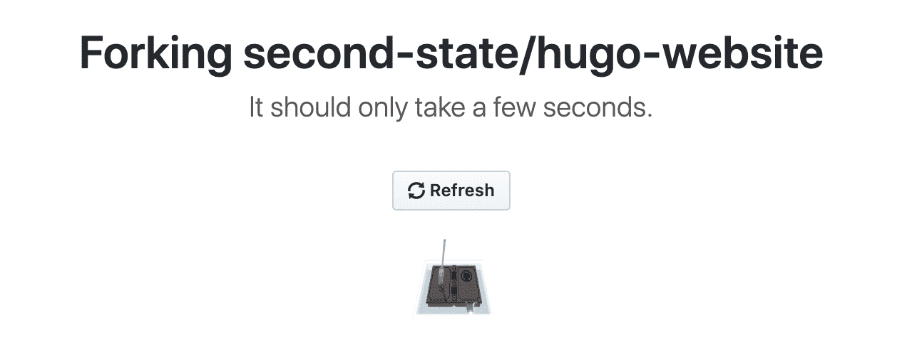
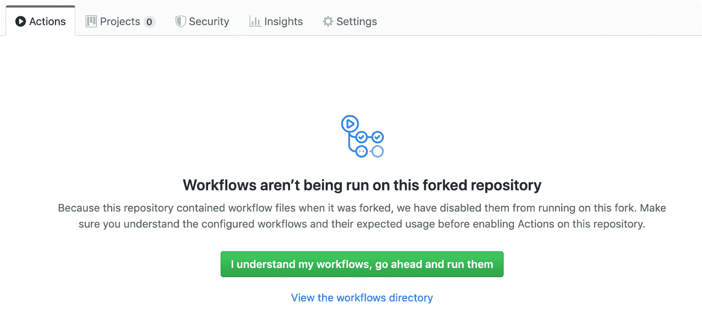
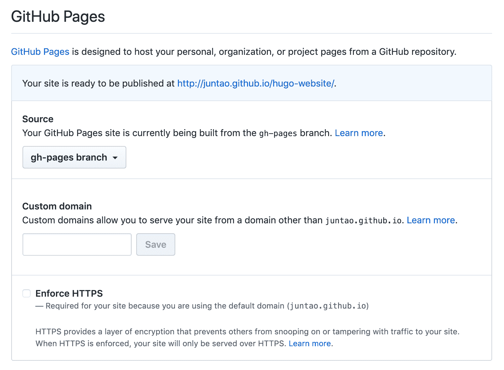
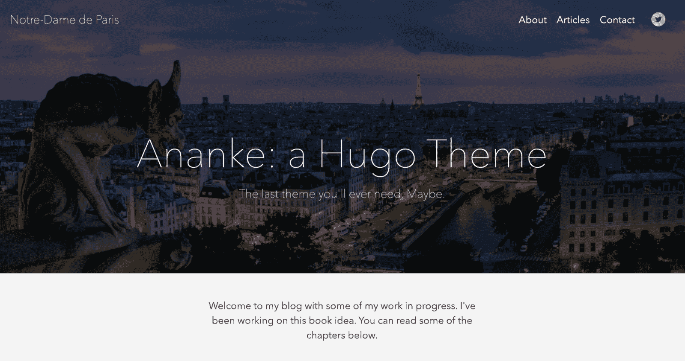
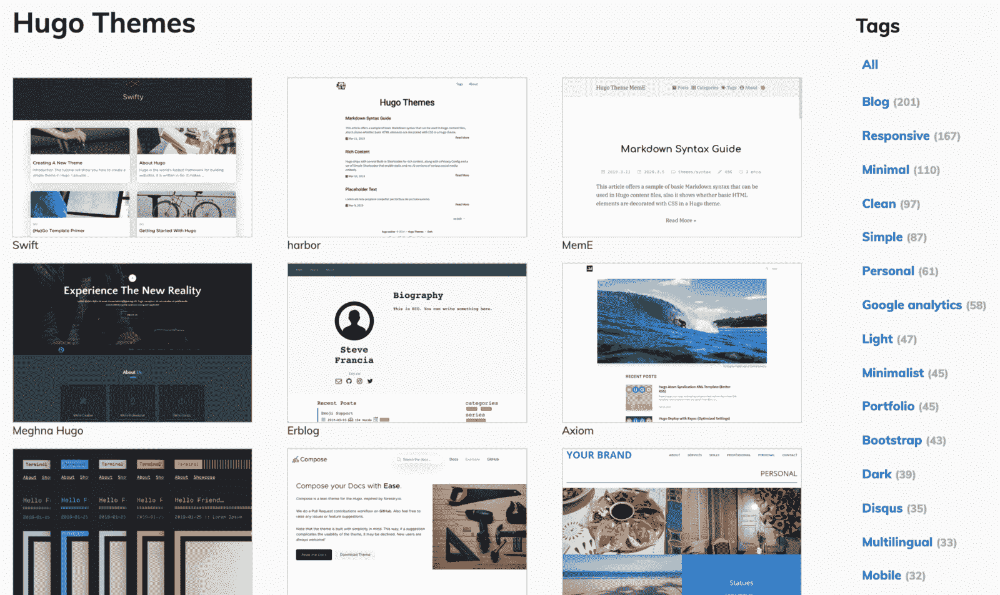
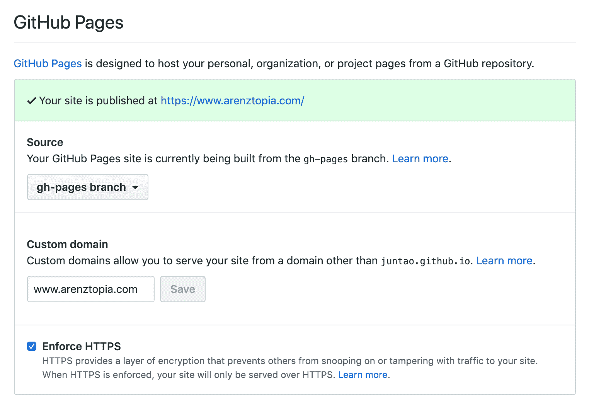
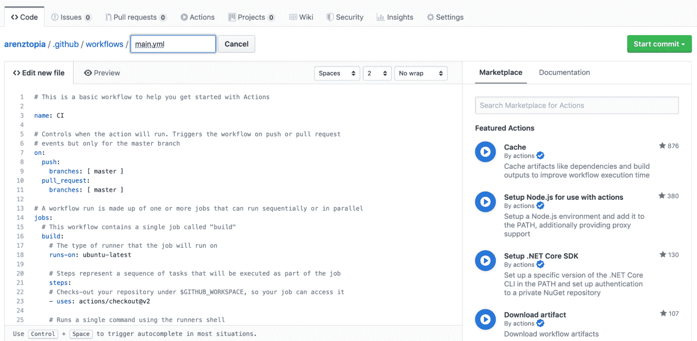

# 如何在 10 分钟内发布一个无代码网站

> 原文：<https://www.freecodecamp.org/news/publish-a-no-code-website-in-10-minutes/>

在本文中，我将介绍一种无代码、无软件、无成本的解决方案，来发布由非技术人员管理的复杂网站。完整的代码库在 GitHub 的[这里](https://github.com/second-state/hugo-website)。

伊萨克·牛顿爵士在瘟疫期间练习“社交距离”时发现了万有引力定律。你会怎么做？隔离的一线希望是，所有这些自由时间激发了我们的企业家精神和创造力。

然而，尤其是因为隔离，现在比以往任何时候，任何新的想法或项目必须有一个网站。传统的 CMS 解决方案如 Wordpress、Squarespace 或 Wix 难以使用，看起来过时，价格昂贵，或者以上所有的问题！

我们希望创建一个具有复杂外观和感觉的网站，并且易于定制。一个非技术人员应该能够编辑源文件，并在几分钟内看到实时网站上出现的更改。理想情况下，它还应该是免费的(永远免费，而不仅仅是现在免费)，如果它变得流行，可以扩展到处理数百万的访问者。

这可能吗？

在这篇短文中，我将向您介绍一个基于 Hugo 框架、GitHub 页面和 GitHub 动作的解决方案。到本文结束时，您就可以开始运行您闪亮的新网站了。

> 这太简单了，我 9 岁的儿子就做到了。他现在为自己虚构的国家管理一个名为“Arenztopia”的网站。看看[的背景故事](https://medium.com/@michaelyuan_88928/welcome-to-arenztopia-95cc85253163)。

## TL；速度三角形定位法(dead reckoning)

如果你只是想尽快上手一个工作网站，首先要确保你有一个免费的 GitHub 账户。

转到[这个 GitHub 库](https://github.com/second-state/hugo-website)，点击右上方的“Fork”按钮，**将其叉**到自己的账户。



转到分叉的存储库，并单击 Actions 选项卡。您将看到一条类似下图的消息。**点击**“我了解我的工作流程…”按钮。



转到存储库的 Settings 选项卡，然后向下滚动到 GitHub Pages。**从下拉框中重新选择**`gh-pages`来建立网站。



转到存储库的 Code 选项卡，打开`config.toml`文件，并编辑它。**将**的`title`属性更改为其他属性，并点击底部的“提交更改”按钮。我们需要这个步骤来触发新存储库中的工作流。

等待几分钟，转到 GitHub Pages 的“发布于”网址，您将看到模板网站。



接下来，您可以通过编辑`config.toml`文件和`content`文件夹中的文件来自定义站点。请参阅本文末尾的“添加您自己的内容”部分，了解如何添加内容。你可以在这里查看阿南刻主题的说明。

快速入门到此为止！在接下来的几节中，我将更详细地解释这些概念和过程。

## 雨果基础

像 Wordpress 这样的老一代 CMS 解决方案太难适应新的网站设计，而像 SquareSpace 这样的商业托管解决方案又太贵，不够灵活。像 Hugo 这样的静态网站生成器在特性、灵活性和创作的简易性之间提供了一个很好的平衡。

*   Hugo 网站可以通过配置文件进行定制和修改。
*   新页面和内容部分可以用 markdown 而不是 HTML 编写。这使得内容创作更加容易。
*   有许多现代设计主题可供选择。
*   Hugo 的输出是一个静态 HTML 网站，可以部署在任何低成本的主机提供商上。
*   加上静态网站托管服务，如 GitHub Pages 和 Netlify，它们可以提供一个完全免费的解决方案。

Hugo 软件发行版[在所有主要操作系统上](https://gohugo.io/getting-started/installing/)可用。你可以[在这里](https://gohugo.io/getting-started/quick-start/)了解一下。但是，由于我们将使用 GitHub Actions 来自动构建我们的 Hugo 网站，我们实际上不需要在这里安装 Hugo 软件。

下面是怎么做的。

## 创建一个模板网站

首先，选择一个雨果主题。有[多](https://themes.gohugo.io/)。有些适合有一个或多个内容网页的网站，而有些则针对有时间戳文章的博客类网站进行了优化。



Hugo themes

找一个你喜欢的，下载一个 zip 包或者克隆一个 GitHub repo，把主题解压到一个文件夹里。我们假设主题发行版被解压到一个名为`my-theme`的文件夹中。以下是 Linux 终端中的命令。您可以在 Mac 上使用终端应用程序，或者在 Windows 上使用 PowerShell。

接下来，在您的计算机上创建网站项目目录。

```
$ mkdir -r my-site/themes
```

将主题文件夹复制到项目中。

```
$ cp -r my-theme my-site/themes
```

接下来，将主题的`exampleSite`复制到项目的顶层目录。

```
$ cd my-site
$ cp -r themes/my-theme/exampleSite/* ./
```

编辑项目根目录`my-site/`中的`config.toml`指向正确的主题。

```
baseURL = "/"themesDir = "themes"theme = "my-theme"
```

接下来，创建一个名为`my-site`的 GitHub repo，并将`my-site`目录推到它的`master`分支上。下面是[从 GitHub 的 web UI](https://help.github.com/en/github/managing-files-in-a-repository/adding-a-file-to-a-repository) 上传文件的步骤。现在我们准备发布主题示例站点。

对于非开发人员(或尚未掌握命令行工具的年轻开发人员)来说，要使基于 Hugo 的系统可用，我们必须自动化构建和部署静态网站的过程。

## 自动化部署

在 GitHub 项目中，进入设置并启用 GitHub 页面。选择源作为`gh-pages`分支。



Settings, GitHub Pages

接下来，我们创建一个 GitHub Actions 工作流，对来自`master`分支的源文件运行 Hugo 命令，并将生成的 HTML 文件推送到`gh-pages`分支进行发布。在项目的“操作”标签中，点击“自行设置工作流程”按钮。



Set up a workflow yourself

工作流程作为`.github/workflows/main.yml`文件存储在`master`分支中。该文件的内容如下。

```
name: github pages

on:
  push:
    branches:
      - master

jobs:
  deploy:
    runs-on: ubuntu-18.04
    steps:
      - uses: actions/checkout@v1  # v2 does not have submodules option now
        # with:
        #   submodules: true

      - name: Setup Hugo
        uses: peaceiris/actions-hugo@v2
        with:
          hugo-version: '0.62.2'
          extended: true

      - name: Build
        run: hugo

      - name: Deploy
        uses: peaceiris/actions-gh-pages@v3
        with:
          github_token: ${{ secrets.GITHUB_TOKEN }}
          publish_dir: ./public
```

这里发生的事情是网站作者和编辑将改变`master`分支上的内容和文件。每当新内容被推送到`master`分支时，自动化的 GitHub Actions 工作流将[设置 Hugo 软件](https://github.com/peaceiris/actions-hugo/blob/master/README.md)，运行`hugo`命令，并将这些文件转换成静态网站的 HTML 文件。

HTML 文件被[推](https://github.com/peaceiris/actions-gh-pages/blob/master/README.md)到同一个存储库的`gh-pages`分支。它们将按照配置由 GitHub Pages 发布在指定的 web 地址上。

注意最后一行中的`cname`属性。那是我们用 GitHub Pages 设置的[自定义域名](https://help.github.com/en/github/working-with-github-pages/configuring-a-custom-domain-for-your-github-pages-site)。如果您没有自定义域名，只需删除这一行，您就可以通过 GitHub Pages 提供的域名访问您的网站。

现在转到网站，您应该会看到主题的默认网页。


The HugoSerif template for one of our web sites.

## 添加您自己的内容

要将默认主题网站更改为您自己的内容，您只需要更改`master`分支上的文件。请参考您所选主题的[文档](https://gohugo.io/content-management/organization/)。一般来说，Hugo 模板是这样工作的:

*   网页是以 markdown 格式创作的，`md`文件位于`content`文件夹中。
*   每个`md`文件都有一个 header 部分，包含页面的菜单位置、优先级、时间戳、摘录等属性。
*   整体配置，比如多个页面使用的菜单项和属性，都存储在`data`文件夹中。
*   原始 HTML 文件、JavaScript 文件和图像文件等静态内容可以放在`static`文件夹中。

具体来说，下面是如何定制我们模板附带的阿南刻主题:

*   通过 [config.toml](https://github.com/second-state/hugo-website/blob/master/config.toml) 文件，您可以配置网站标题、所有页面上的社交图标以及主页上的大专题图片。
*   所有图像应上传至[静态/图像](https://github.com/second-state/hugo-website/tree/master/static/images)文件夹。
*   [content/_index.md](https://github.com/second-state/hugo-website/blob/master/content/_index.md) 文件包含主页的文本。
*   要给网站添加页面，你可以在[内容](https://github.com/second-state/hugo-website/tree/master/content)文件夹中创建 [markdown](https://guides.github.com/features/mastering-markdown/) 文件。一个例子是 [contact.md](https://github.com/second-state/hugo-website/blob/master/content/contact.md) 文件。注意，在文件的顶部，有一些属性来控制这个页面是否应该出现在网站菜单上。
*   要向站点添加文章，您可以在 [content/post](https://github.com/second-state/hugo-website/tree/master/content/post) 文件夹中创建降价文件。这些是类似博客的内容文章，顶部有日期和标题。最近的两篇文章将出现在主页上。

如果您有兴趣了解更多信息并了解我们是如何做到的，您可以在

*   阿伦茨托邦[ [GitHub](https://github.com/juntao/arenztopia) ] [ [网站](https://www.arenztopia.com/)
*   第二状态博客[ [GitHub](https://github.com/second-state/blog) ] [ [网站](https://blog.secondstate.io/categories/en/)

祝你好运，保持健康！

## 关于作者

Michael Yuan 博士是关于软件工程的 5 本书的作者。他的最新著作[构建区块链应用](https://www.buildingblockchainapps.com/)于 2019 年 12 月由 Addison-Wesley 出版。袁博士是第二状态(Second State)的联合创始人，这是一家由风投资助的初创公司，将 WebAssembly 和 Rust 技术引入云应用、人工智能应用。它使开发人员能够在 Node.js 上部署快速、安全、可移植、无服务器的 [Rust 函数。](https://www.secondstate.io/articles/getting-started-with-rust-function/)

[https://webassemblytoday.substack.com/embed](https://webassemblytoday.substack.com/embed)

在 Second State 之前，袁博士是 Red Hat、JBoss 和 Mozilla 的长期开源贡献者。在软件之外，袁博士是美国国立卫生研究院的首席研究员，在癌症和公共卫生研究方面获得了多项研究奖。他拥有奥斯汀德克萨斯大学的天体物理学博士学位。