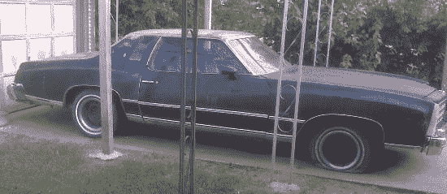
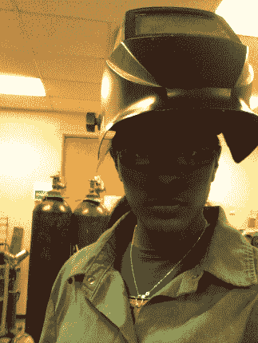
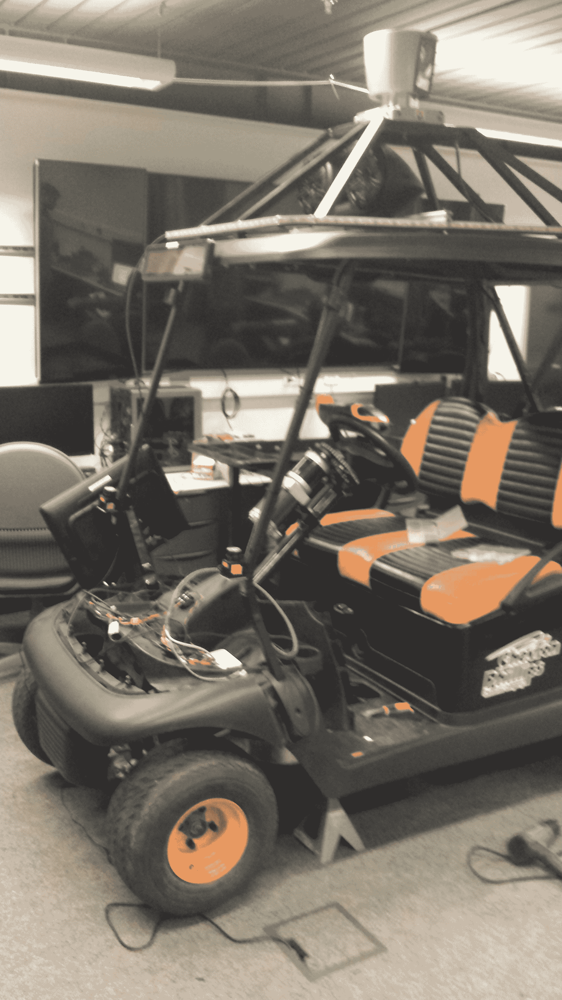
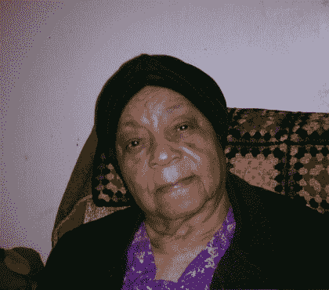

# 从机械工程师到软件开发人员——我的编码过山车

> 原文：<https://www.freecodecamp.org/news/mechanical-engineering-to-software-developer/>

没有多少人从小就梦想着写代码。我绝对没有。我想设计汽车。但不知何故，我最终还是做了软件。

我小时候经常在夏天帮我爷爷修车。我想有一天我会像他一样成为一名机械师。但是我妈妈和奶奶有不同的计划。

我们没有钱，所以他们总是让我忙些事情。无论是在社区做志愿者，从图书馆看书，还是为了“好玩”而做作业，他们总是让我专注于学习。我想这主要是为了让我从周围的混乱中转移注意力。

我和我的曾祖母一起长大，她是我一直提到的母亲。我的家人到处都是，这不是最稳定的环境。但是有我妈妈和奶奶保护我远离那些疯狂，我能够假装逃避到我对数学和实验的热爱中。

我记得有一件生日礼物是我第一次接触到与科技相关的东西。这是一个小型的伟易达笔记本电脑，我喜欢它。我到哪里都带着它，玩上面的任何游戏。

它最终停止工作，我试着回去帮我爷爷修车。但我妈妈不想让我这么做，因为我是个女孩。这粉碎了我成为一名机械师的小小希望和梦想。

有几次我想溜出去和他一起工作，但他知道这只会让我妈妈生气，所以他会把我送回去。

我会回去，开始思考我可以在房子里做的其他事情。通过大量的修补和运气，最终我变得足够好去做一些小的管道和电气工作。

直到今天，我仍然不明白为什么妈妈认为用电工作比汽车工作好，但她从未在这个问题上让步。

## 从机械师到工程师

我仍然想做一些与汽车有关的事情，因为我非常喜欢在汽车上工作，所以我选择了下一个最好的事情:设计机械师可以工作的汽车！

那时候这看起来不像是一份真正的工作，所以我通过画一些我认为很酷的概念来满足这种欲望。然后我会试着在它们背后做一些数学运算，看看我是否能从我们周围的垃圾中造出一个原型。

幸运的是，有人看到我这样做，他们开始谈论工程，他们开始设计这样的东西。就在那时，我下定决心要成为一名机械工程师。那时我大概 13 岁左右，家里的事情变得越来越忙乱。

### 机械工程动机

我成长的直系亲属大多是老年人。他们已经开始死亡。这是一个很大的挑战。

请记住，到现在为止，我妈妈已经 87 岁了。当时我觉得这是因为我们没有足够的钱。我了解到工程师挣很多钱，所以我加倍了我的决定。

那时，我家里没有人上过大学，也没有人知道工程师到底是干什么的。我想我妈妈以为我会开一段时间火车。

老实说，直到我大学快毕业的时候，我才完全理解一个工程师是做什么的。

从我的阅读中，我看到你需要擅长数学和科学，而我已经爱上了这些东西，所以继续下去对我来说是有意义的。后来我在高中加入了一个机器人俱乐部，在那里我第一次接触到了代码。

让硬件对我从电脑发出的命令作出反应真是太神奇了。虽然这很有趣，但我仍然去上大学，决心成为最好的机械工程师，去设计令人敬畏的汽车，因为汽车是我童年最美好的部分之一。

The car behind it all, a 1977 Chevy Monte Carlo

### 大学时光

关于大学，我有太多不了解的地方。大概直到高三开学，我才开始和学校里的任何人谈起大学。

我知道你必须申请，但我不知道你必须付钱。在我和辅导员谈过之前，我认为大学只是高中后发生的事情，如果你想在学校呆更长时间的话。你只要递交申请，被录取，就可以走了。

当我第一次看到大学花费如此之多时，我感到的绝对空虚几乎让我立即放弃。我们养不起人，那我们上大学的钱从哪里来？

我的父亲是一名退伍军人，所以他能够帮助我使用他的一些残疾福利，这有助于减轻一些压力。谢天谢地，我的辅导员教会了我奖学金和一些经济资助。现在是春天，奖学金的截止日期就在眼前。

从那以后，我几乎把所有的空闲时间都花在了寻找和申请任何一个我有资格申请的奖学金上。我大概申请了数百份奖学金，实际上我能够凑齐足够的钱来支付第一年的学费。

## 大学时代

大一的时候因为什么都不懂，就去做了一个任务。我认为如果你申请了贷款，你基本上就死了，所以我很害怕他们。我第一学期甚至没有去经济资助办公室，因为我害怕那个地方。

这绝对是最好的结果，因为每个学期我都要花数小时寻找和申请奖学金。通过这样做，我可以无债一身轻地读完大学。这需要做很多工作，但这是我迄今为止经历过的最好的工作。

我加入了一切能让我与汽车打交道的工作——从在 SAE 团队焊接车架接头到在 SolidWorks 中设计车身面板。我在航空航天领域进行了本科研究，这样我就可以学习更多关于空气动力学和材料的知识来制造更好的汽车。

Me getting ready to go weld some joints together

我的工程研究之旅开始于激情和需要，那是一段不可思议的时光。我当了几年的小白鼠，大部分时间都是亲自动手。我们使用电动工具，创建自己的材料清单，并在纸上或 SolidWorks 中构建我们设计的东西。

### 大学“分心”

这时，我大二已经读了一半，第一次受到了打击。我的一个最好的朋友死于车祸。这很痛，但我能够“挺过去”并保持专注。然后最坏的，最随机的消息来了。

我爷爷被诊断出癌症，不到 4 个月就去世了。那件事彻底震撼了我。

在此期间，我几次考虑退学，但我妈妈和奶奶一直鼓励我。当我不想让步时，他们推我。

这个时候我每个周末都要回家，所以我基本上是去上课，住在实验室，每个周末把作业带回家。我想帮助我的奶奶照顾妈妈，因为她越来越老，她不能再开车了。所以我们联手照顾她。

在我所有的家庭问题中，我仍然试图逃避我的功课。然后代码开始越来越多地出现在我的作业中。我选了一门课，这门课真正动摇了我对自己投身于汽车事业的信心。

### “真实”编码

我们用 C 语言和 PIC 微控制器一起工作，我被迷住了。我喜欢让这些传感器一起工作的一切，以及如何使用数据让现实世界的事情发生。这让我大吃一惊，我开始沿着这条路走下去。

但是汽车仍然在我的脑海深处。汽车一直在我的生活中，它们帮我度过了许多艰难的时光。所以我还没准备好去想象做别的事情。

忽略我矛盾的感觉，我投入到一个不同的研究项目中，在那里我可以和微控制器一起工作。那是我第一次真正脱离机械之路。然后我到了一个主要的十字路口，是时候毕业了。

## 研究生院

我妈妈的健康状况明显恶化，我想呆在她身边。所以我决定读研机械与航天工程。这时候大转变来了。

我的研究最终集中在自动高尔夫球车上的机器学习算法上。我写的代码比我想象的要多。我不确定我是否还会写那么复杂的代码。

当我还在从事硬件工作时，我的注意力转移到了处理所有的原始数据和编写能够快速处理这么多信息的代码上。在花了 16 个多小时编写代码后，我仍然不完全讨厌它，我知道它是没有希望的。

事实是，研究中的汽车部分远没有我的代码的美丽重要。这就是最终艰难决定的来源。

我必须决定是离开——这样我就可以继续从事很酷的机器人项目——还是和家人呆在一起，尝试做一名工程师。

我做了一个从未后悔过的决定，我和家人在一起。我妈妈没能活到看到我成为“大师级”工程师的那一天。但是我很高兴我在那里和她分享我的时光。

她在我毕业前几个月去世了。那学期剩下的时间还是一片模糊。

My mom in the good times

谢天谢地，在这期间，我有一个非常可爱的男朋友，他现在是我的丈夫，试图让我保持理智。

## 从研究生院到工程

所以我试着在石油和天然气行业做了一段时间的机械工程师。我的第一天，我的老板来告诉我我会做什么。他扑通一声放下这一大叠尺寸怪异的纸，上面有这些叫做 P & IDs 的技术图表。

然后，他拿着荧光笔坐在我旁边，向我展示如何检查 P&id 的所有并找到特定的传感器。他给了我一个微笑，拍了拍我的背，说:“我已经做了 37 年，我们还没有太大的变化！你会找到窍门的。”

我知道那没用。我至少想看着电脑假装工作。那时我想我会尝试航空航天工程。我只知道在航天领域会有很多设计东西的机会。

在我得到一份航空航天工作后，我被介绍到 CATIA V5——它远不如 SolidWorks 友好——但它是一个航空航天的东西。这时我发现仍然没有任何设计！

为 FAA 合规性做标准和公差分析有几个月是很酷的。当然，在 2 英寸垫片上八分之一英寸的变化上获得 800 个签名是令人兴奋的。但这仍然不是我所希望的。

有一次，我在这台超级旧的盒式监视器计算机上用 FORTRAN 语言进行短舱分析。

这是让我回到代码的原因。FORTRAN 太难了，以至于我开始回到我以前用过的一些语言，比如 C++和 Python。在制作了一些有用的工作工具后，我知道软件可能是我下一步应该关注的地方。

我从事的工作与汽车或总体设计相去甚远，因此我知道我必须想办法找到一份可以编写不涉及硬件的代码的工作。工程并不是我所期望的，所以我必须实现这个转变。我就是从那时开始学习 web 开发的。

我还是不想搬家，因为丈夫喜欢他的家庭，而我的奶奶是我唯一的亲人。所以我开始学习如何制作 WordPress 网站，并做了一些自由职业来获得一些经验。

然后我一头扎进了 PHP 的插件工作，这让我研究了更多的免费在线编码资源。所以我开始学习更多关于 HTML、CSS 和 JavaScript 的知识。剩下的就是历史了。

一旦我有了一些项目，我申请了一份仍然需要一些工程计算的软件工程工作，这就是我如何得到我的第一份真正的软件工作。

## 在代码中成长

之后就只是慢慢开始提升自己的技能。我进入了 MVC。网络核心世界。这是一个很酷的技术堆栈，但是随着我对 JavaScript 以及我可以用它做的事情了解得越来越多，我决定更深入地研究这些堆栈。

后来不小心做了顾问。但这是一次很棒的经历。我从前端、后端、数据库、DevOps、移动、客户端管理等诸多方面学到了一切。

那是我真的需要时间去看所有的东西，弄清楚我真正想做什么的地方。所以我跳进了 React 和 Node，那是我目前最开心的地方。

### 代码工程

在物理工程世界中，我奇怪地怀念的一件事是围绕一切的大量结构。无论你尝试做什么，总会有标准的知识被建立、研究和测试。

软件不像机械工程那样有任何强制措施，因为我们制造的大多数东西如果坏掉了不会杀死任何人。所以我开始采用一些我从未有机会应用到汽车上的设计原则，并将它们应用到我的个人软件项目中。

从那时起，我开始寻找惊人的机会。我开始构建项目，从前端的机器学习到无服务器应用和虚拟现实游戏，使用的方法与我在工程师时代学到的方法相同。

如果你能看到我这些年来编造的一些可笑的软件方程式和常数，你会忍俊不禁的。

### 随波逐流

我从未开始走这条路，也没想到会走这么远。它以很多奇怪的方式发生，就像大多数在这个领域结束的人一样。在这段旅程中，我经历了很多战斗并取得了胜利，现在我仍在恢复中。

尽管软件并不像它应该的那样多样化，但我从来没有真正感觉到人们试图阻止我或者把我放在一个位置上。

我在传统工科的时候不是这样。对于一个有色人种的女人来说，这是一个如此危险的地方。我让人们审问我，问我是如何进入我负责的部件的设施的。有人试图贬低我的成就。我遇到一些人，他们直截了当地告诉我，他们不希望像我这样的人在身边呆太久。

对我来说，技术从来没有那么可怕。

我能说的一件事是，这些年来，我遇到了这么多友好的、真正乐于助人的人，尽管他们中间也有一些混蛋。

如果你曾经考虑从工程领域转到科技领域，要知道有一群人会在每一步帮助你。