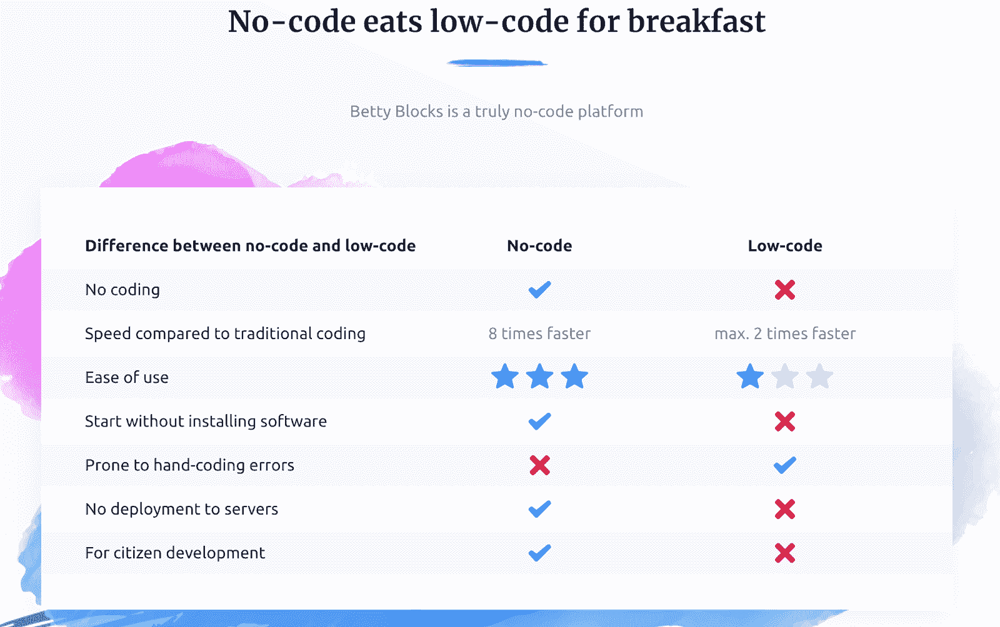

# 无代码 VS 低代码。有什么区别？它。不会。事。

> 原文：<https://www.freecodecamp.org/news/no-code-vs-low-code-defined/>

您可能会听到开发人员和企业家抛出的术语“无代码”和“低代码”。

关于这些术语的含义有很多模糊之处。更令人困惑的是...

Hacker Noon 希望您思考一下[低代码与无代码平台的困境](https://hackernoon.com/the-low-code-vs-no-code-platform-dilemma-m03o32s5)。

Betty Blocks 已经科学地确定[无代码比低代码](https://www.bettyblocks.com/no-code-vs-low-code#hs_cos_wrapper_widget_1544248078798)至少快 4 倍:

G2 热衷于告诉我们[在 RAD 世界](https://learn.g2.com/low-code-vs-no-code-development)中无代码和低代码有什么不同。这就是“快速应用程序开发”，对于那些显然不够了解的人来说。

Kissflow(一个“无代码”平台)并不完全是死亡时间，但你应该知道[低代码还没有死亡，但它看起来并不好](https://kissflow.com/low-code/low-code-vs-no-code/)。

在另一个角落，Mendix(一个“低代码”平台)[警告你](https://www.mendix.com/blog/understand-no-code-vs-low-code-development-tools/)大多数无代码工具的问题是它们通常不能很好地伸缩，集成能力非常有限。

最后，Wavemaker 举起双手，直接问了这个问题:[无代码与低代码——有区别吗？](https://www.wavemaker.com/no-code-vs-low-code-different/)

每当看到问题标题，我就想到[贝特里奇定律](https://en.wikipedia.org/wiki/Betteridge%27s_law_of_headlines):任何以问号结尾的标题，都可以用“不”字来回答。正如预测的那样，Wavemaker 又用了 863 个单词或 5601 个字符来总结:“无代码平台与低代码平台没有什么不同。”

别说了。就此打住。这些琐碎的争吵怎么会是对时间的有效利用呢？作为读者，你读完这些后会觉得更明智吗？

可以肯定的是，有很多人出于经济动机，选择“无代码”和“低代码”来支持自己的一方，同时贬低另一方。“军火商”也是如此，他们乐于为双方煽风点火。

## “无代码”工具让你编码

看看给“无代码”工具添加代码有多普遍。

Webflow 是当代无代码宣传的冠军，也是无代码会议的组织者。甚至他们[鼓励你添加代码片段](https://webflow.com/blog/6-useful-code-snippets-for-your-webflow-projects)来做任何事情，从样式滚动条到更新版权信息。

但不仅仅是为了小事。最流行的集成需要添加代码片段。如果你想在你的网站上添加一个会员专用的部分(例如，通过订阅赚钱，这是一个非常重要的用例)，你必须插入 [Memberful](https://memberful.com/help/third-party-integrations/webflow/#insert-the-memberful-code) 或 [Memberspace](https://www.memberspace.com/start/webflow-membership-site/#section-3) 或 [Memberstack](https://help.memberstack.io/post/install-header-code) 的代码。您添加的集成越多，您要编写的代码就越多。

有 Betty Blocks，你会想起的“无代码”工具确信没有代码比低代码至少快 4 倍。这是他们的首席执行官谈论在 Betty Blocks 的无代码平台中使用传统编码的[。这是他们的网上研讨会，教你在 Betty Blocks 中](https://www.youtube.com/watch?v=u11b9BuotrI)[设置类似 SQL 的关系数据库模式](https://www.youtube.com/watch?v=KO90H49UoyU)的外键。从哪一点来看，你真的只是在用一个花哨的 IDE 编码？

大多数“无代码”平台提供“逃生出口”来进行编码，这看起来是不是违背直觉？这只是实用主义在作祟。当平台不让用户做他们需要做的事情时，用户会很痛苦，而代码是平台和外部世界之间最具可塑性的接口。

## “低代码”工具不需要代码

看看不用编码，在“低代码”工具中能做多少事。

Zoho Creator 称自己为“[一个低代码平台](https://www.zoho.com/creator/blog/everything-you-need-to-know-about-low-code-development-platforms.html)”然而，你可以从头开始浏览[的所有 6 个视频，创建、定制和分享你的应用，而无需编写一行代码。](https://www.zoho.com/creator/newhelp/videos.html?src=hdd#how-to-videos)

Appian 以第一个公开上市的“[低代码自动化平台](https://www.appian.com/)而闻名。但是当你看它的“[快速成为 Appian 专家](https://www.youtube.com/watch?v=Sk6HuQ_klxY)”教程时，你会意识到整个 43 分钟的视频没有涉及编写一行代码。

“低代码”平台不需要代码，但又不把自己标榜为“无代码”，这是否有悖常理？

你可以听听约翰·雷默(John Rymer)的观点，他是创造了“低代码”这个术语的弗雷斯特分析师二人组的成员之一据他说，他们对“无代码”这一说法进行了市场测试，但“低代码”只是对企业客户更有吸引力。所以是“低代码”。

### 我们是同一战线的

总的来说，你会发现“无代码”和“低代码”品牌的区别主要在于年份:

*   较老的公司(Appian、Zoho Creator 和我调查的其他公司都是在 2010 年之前创建的)今天自豪地戴着“低代码”的标签。
*   较新的网站(Webflow、Betty Blocks 和其他 2010 年以后的网站)认为自己“没有代码”来区分。
*   然后就是不挑边的雪花。抛物线只是想让你“通过描述来完成你的常规数据任务”。Airtable 是“部分电子表格，部分数据库”Zapier 让你“连接你的应用程序和自动化工作流程。”所有这些公司经常被归入这一领域，但都试图超越这一领域。

事实是，所有这些公司都站在同一边——让每个企业用户都能更快、更便宜地创建实际应用程序。

甚至还有关于如何称呼这种用户的争论——公民开发者？可视化开发者？超级用户？NoCoder？-将他们与传统开发商区分开来。

但是这个世界并没有整齐地划分为开发人员和非开发人员，技术人员和非技术人员。

你可以成为一个非技术型的企业主。你不太擅长“电脑”但是你认识到通过软件工作会更便宜、更快、更可靠、更协作。

你可能是一个技术用户。你不写代码——但你是那种关注最新 iPhone 和 Android 规格的人。你对最佳生产力应用有强烈的看法。你仍然认识到，在现有的应用程序中存在着未得到服务的空白。如果你能开发一个应用程序，你就能满足自己的需求(以及同事和其他人的需求)。

你甚至可以是一个普通的开发人员，厌倦了传统的、错误的、缓慢的做事方式。你认识到了快速 MVP 的价值。您的时间最好花在利用商品 ui、API 和工作流上。你的开发时间最好留给还没有实现的“最后一英里”。

不管你的技术方面如何，没有代码和低代码平台可以为你服务。应该根据它们满足您需求的能力来评估它们，而不是根据它们可能需要或不需要的代码量。

### 这不是一个瞬间，而是一场运动

所有这些不会有一个大赢家。每一个领域、每一个行业、每一级堆栈都准备进行无代码/低代码转换。这是一场将人机交互带入 21 世纪的大运动。

可以用软件解决的问题并不局限于美国每年大约 150，000 名训练营和计算机科学毕业生，也不局限于全球大约 3，000 万开发人员(占全球人口的 0.4%)。

最大的障碍是电子表格。绝大多数人(数十亿人)使用 Excel 和 Google Sheets 已经非常高效了。你如何能比电子表格做得更好？

您可以在我们的主要计算设备手机上使数据输入和查找更符合人体工程学。您可以自动执行其他数据输入和输出过程(发送电子邮件、发送文本或在后台安排上传处理)。您可以围绕错误处理、团队权限和用户生成的内容(如照片和视频)设计更好的防护栏。

关键是要从清楚地了解自己的需求开始，然后倒着做。无代码和低代码平台的自助餐就在那里等着你。

我的建议是:不要再纠结语义了。开始创作。