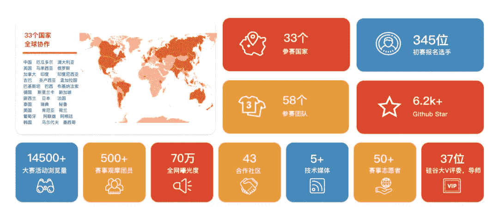
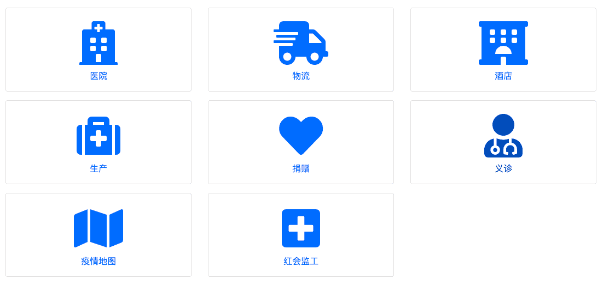
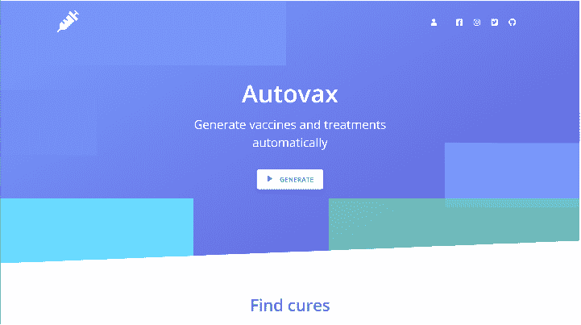

# 武汉黑客马拉松的黑客内幕——开发者如何对抗新冠肺炎

> 原文：<https://www.freecodecamp.org/news/wuhan-hackathon/>

2020 年的春节是近年记忆中最悲伤的春节之一。新冠肺炎病毒突然爆发后，这座城市暂停了所有庆祝活动。

而现在——即使中国的疫情有所缓解——学校仍然关闭。大多数商店仍然关门。人们仍然不能出去享受春天。

在这场全球公共卫生危机中，不仅仅是一线医务人员采取了行动。其他人正在生产口罩和防护设备，运输日常用品，并为受影响地区的人们提供心理援助。

开发商也开始行动了。

## **武汉的**黑客** H **阿克顿****

武汉 2020 开源社区计划了一个大型的[黑客马拉松](https://github.com/wuhan2020)。主题:开源协作应对流行病背后的挑战。

他们一起鼓励开发者利用他们自己的技术来支持这场新的无烟战争。

wuhan2020 是一组独立的开发人员，他们编写代码来聚合和分析流行病数据。他们利用这一点来预测病毒的传播，并计算出向哪里运送医疗用品。

自从武汉 2020 在一月份创建以来，它已经吸引了来自不同国家的 3000 多名志愿者。

他们联系了 freeCodeCamp，询问我们是否有兴趣帮助支持他们即将到来的黑客马拉松。我还发现，freeCodeCamp 成都学习小组的组长水格是武汉 2020 的核心开发者之一。

## freeCodeCamp 是如何参与进来的

freeCodeCamp 作为联合主持人加入了黑客马拉松组织团队。我们的几个贡献者帮助策划比赛，担任评委，并维护 GitHub 库。

从最初的想法到举办黑客马拉松本身只用了 20 天。

以下是关于此次活动的一些快速数据:

*   50 多名志愿者主持了比赛
*   来自 33 个国家的 902 名选手报名参赛
*   33 支队伍进入初赛。12 支队伍进入了决赛。8 支队伍获得了大奖。
*   4 家公司为竞赛提供了技术资源，包括 IBM Developer、Agora.io、腾讯 Serverless 和 Amazon Web Services。
*   世界各地的 45 位行业专家提供了指导，如安德森霍洛维茨风险投资公司的 Connie Chan、前阿里巴巴首席技术官庄和斯坦福慈善和公民社会中心(PACS)的 Eva Woo
*   48 家媒体发表了关于黑客马拉松的文章，超过 70 万人阅读了这些文章

Even more data. Yes - this is in Chinese but if you can't read Chinese you may be able to guess the meaning from the icons :)

## **黑客马拉松**主题** s**

黑客马拉松的总主题是:使用开源软件解决流行病背后的社会挑战。

## ****介绍部分获奖项目****

12 名决赛选手在网上开始了他们的现场演示，评委们也可以在网上发表评论。

### **入围:A **一站式** O **笔** P **平台为**E**pidemic**D**ATA****

这个开放平台帮助研究人员有效地收集、标记和分析疫情数据。

许多官方机构和卫生委员会报告精细的流行病数据。但是数据格式经常是不兼容的，并且需要人来解释它们。这使得无法使用爬网程序来自动爬网和结构化数据。你得引进熟练的体力劳动。

那么如何以尽可能少的劳动高效地收集数据呢？

该项目采用开源协作的方式，将所有对数据感兴趣的人带到这个平台上。然后平台帮助人们对数据进行结构化和标注。

完成后，平台通过公共 API 提供数据。科学家和开发人员可以在这个 API 的基础上构建其他工具。

### ****autovax****

Autovax 是一个 web 应用程序，它允许从病毒基因组和病毒基因中自动生成疫苗和其他治疗药物。

哈佛大学的一名研究人员正在开发这个来帮助新冠肺炎。

### ****城市英雄****

在这个教育游戏中，你可以选择一个职业——比如医生或护士——来体验他们在疫情的生活。这有助于玩家理解参与救援工作的人，以及他们面临的艰难选择。

## 前进的道路

武汉黑客马拉松的黑客活动不仅是对参赛者的挑战，也是对组织团队的挑战。我们在短短 20 天内规划并执行了一切，并帮助 900 名开发人员参与其中。

我要感谢所有参与其中的人。感谢您阅读这篇黑客马拉松报告。

我希望你们都能保持安全，一旦安全了，我们就能拥抱春天。

如果你有兴趣了解这些项目的更多信息，或者参加我们下一次的黑客马拉松，你可以通过微信 fcczhongguo 联系我，或者通过 Twitter 联系[。](https://twitter.com/miyaliu666)