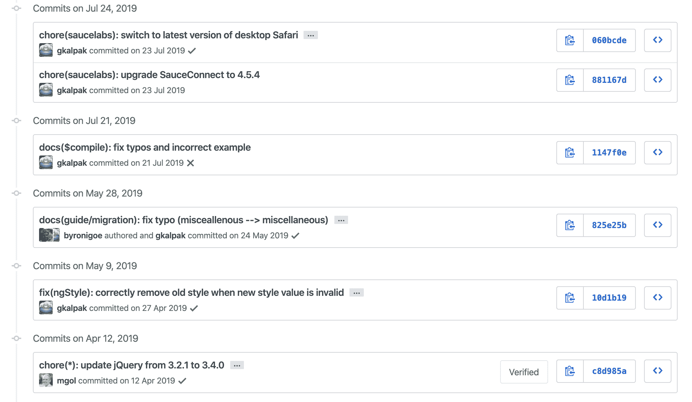
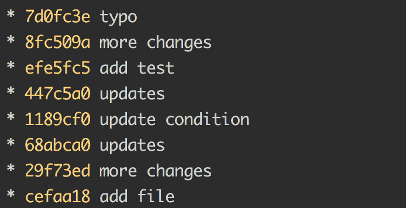
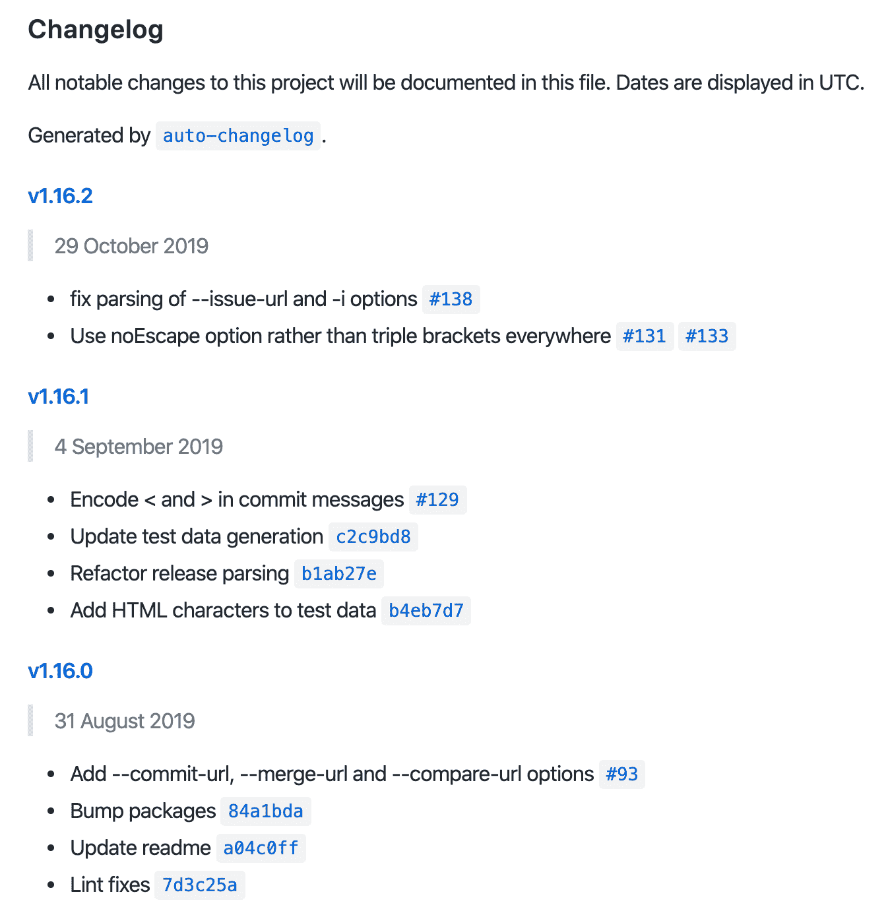

# Git 初学者指南——如何编写好的提交消息

> 原文：<https://www.freecodecamp.org/news/a-beginners-guide-to-git-how-to-write-a-good-commit-message/>

你是最近才开始使用 Git 的开发者吗？如果您想知道如何为您的项目创建一个好的提交消息，那么这篇文章就是为您准备的。

离开写作几个星期后，我今天回来继续我在谷歌上搜索最多的一篇文章。

一年前，当我开始写作时，我写了一篇关于如何用 Git 开始和创建你的第一个存储库的文章。

这篇文章每周帮助许多人。所以我决定写这篇关于如何写一个好的提交消息的文章，这样你就可以把你的 Git 技能提升到一个新的水平。

## 什么是好的提交消息？

作为一个简短的提醒，提交消息是您在 Git 上保存工作时留下的简短文本。此消息旨在识别您的工作。

这个想法是，只要通过阅读，任何人都可以清楚地了解你在这部分工作中做了什么。

### 一个很好的提交示例

下面，你可以在 GitHub 上找到 Angular.js 项目的最后提交。正如你所看到的，信息是清晰的，我们可以更好地了解不同部分做了哪些工作。

比如 2019 年 7 月 24 日，“gkalpak”对“SauceConnect”进行了升级，切换到了 Safari(网页浏览器)的最后一个版本。



Git commits history on the Angular.js project [on GitHub](https://github.com/angular/angular.js/commits/master)

### 为什么每个人的行为方式都不一样？

不幸的是，没有一种通用的方式来编写提交。每个项目和每个公司都为他们的需求定义了特定的规则。

但是不要担心——你经常会发现写信息的类似方法。

为了找出这些是什么，我强烈建议你在进入一家公司或从事一个开源项目之前阅读这些规则。

在本文的后面，我将为您提供关于这些指导方针的更多细节。

## 为什么写好你的承诺很重要

我列出了使用好的提交消息的好处。

### 更好的协作

如果你在一家公司工作，或者在一个开源项目上工作，为了更好的合作，遵守规则是很重要的。如果你写一些可以理解的东西，遵循项目的规则，其他开发人员将能够更有效地工作。他们不会问你关于你工作的问题。

> 注意:如果你正在做一个个人项目，我强烈建议你也遵循特定的规则。这将提高您的工作效率，如果您需要其他开发人员的帮助，他们会更容易开始您的项目。

### 更好的理解

你需要创造清晰易懂的信息。这将有助于你和你的合作者一起完成一个项目。下面，您可以找到一个只有不清楚消息的 git 提交历史的例子。正如你将看到的，很难理解发生了什么。

### 奖励——更新日志一代

我告诉你一个小秘密:如果你写了好的消息，你将能够直接从你的提交消息中生成一个 changelog。

以下是几个工具:

*   [Github 变更日志生成器](https://github.com/github-changelog-generator/github-changelog-generator)
*   [Git Chglog](https://github.com/git-chglog/git-chglog)
*   [自动变更日志](https://github.com/CookPete/auto-changelog)
*   [常规变更日志](https://github.com/conventional-changelog/conventional-changelog)。

我也会写一篇关于这个话题的文章。想要更新，[可以在 Twitter 上关注我](https://twitter.com/gaelgthomas/)。我把所有更新都贴在那里。



Bad git commits example from [Jason McCreary](https://jasonmccreary.me/articles/when-to-make-git-commit/)

> 注意:如果你想有更多糟糕的提交的例子，同时又想玩得开心，[一个名为“git lost”](https://twitter.com/gitlost)的 Twitter 账户每天都在推特上发布有趣和未经过滤的提交。



Example of auto-generated Git changelog

好了，现在让我们进入更多的细节，看看真正需要什么来编写一个好的提交消息。

## 如何编写提交消息

如果你想写一个好的提交消息，你需要遵循一些规则。我在下面创建了一个清单。每次你想承诺的时候，花点时间参考这个列表。

*   经常检查你的语法。阅读充满错误的信息永远不会令人愉快。要做到这一点，我建议你使用一个语法工具。如果你用英语写作，你可以用[语法](https://www.grammarly.com/)、 [Reverso](https://www.reverso.net/spell-checker/english-spelling-grammar/) 或[语法检查](https://www.grammarcheck.net/editor/)。这些工具并不完美，但它们会消除你的大部分错误。
*   一次承诺，一次改变。试着经常承诺。理想的情况是在不同的提交中进行每个更改。你会更容易回到以前的工作。
*   **说清楚。当你写提交的时候，尽可能的透明。我建议你使用简单的英语，开门见山。**
*   详述你做了什么。花时间重读你的代码，写下你做了什么。如果您需要添加很多细节，请使用提交的描述部分。

### git 提交命令

我想分享更多关于“git commit”命令的细节。如果您没有使用 git 软件，您应该知道您可以通过键入以下命令来创建详细的提交:

```
$ git commit -m "Title" -m "Description" 
```

它和之前的一样，但是有第二个描述部分。因此，“-m 'title '”允许您编写提交的简短标题，而“-m 'description '”允许您在需要提供更多细节时编写描述。

### 使用 git 指南

如果您想有一个清晰的 git 提交历史，您应该遵循一些准则。就我而言，我选择了来自 Udacity 的[这个简单的。](http://udacity.github.io/git-styleguide/)

还有很多其他的，像[常规提交](https://www.conventionalcommits.org/en/v1.0.0/)，和[角度指引](https://github.com/angular/angular/blob/master/CONTRIBUTING.md#commit)。提交指南将帮助您给出提交的结构。

例如，添加一个标签来澄清你做了什么:“git commit -m 'fix:当触发删除帐户按钮时，正确删除所有用户信息”。

## 结论

我希望你喜欢这篇关于如何使用 Git 的指南！如果您有任何问题或反馈，请随时提问。

如果你有任何其他关于如何做好承诺的建议，请告诉我。

如果你想要更多这样的内容，你可以[在 Twitter](https://twitter.com/gaelgthomas/) 上关注我，在那里我会发关于 web 开发、自我完善和我作为一个全栈开发人员的旅程的推文！