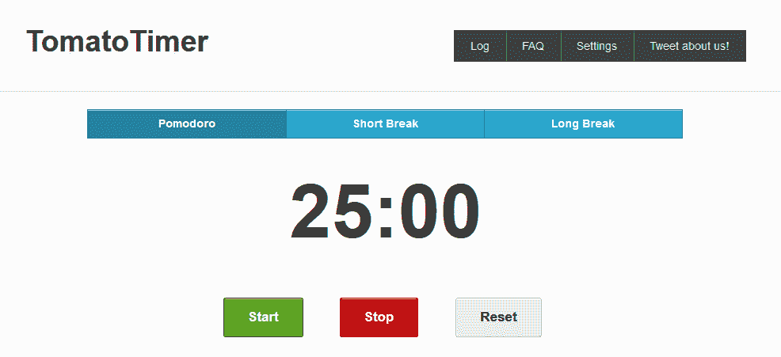
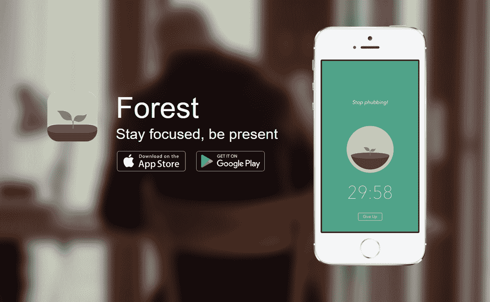
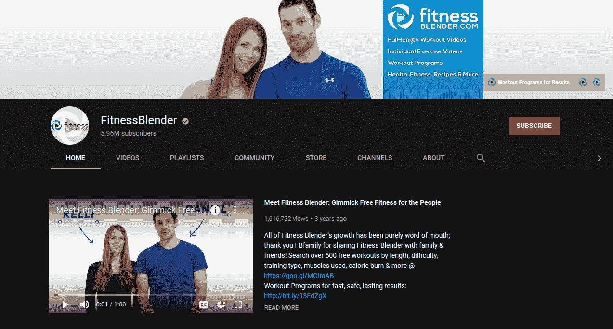
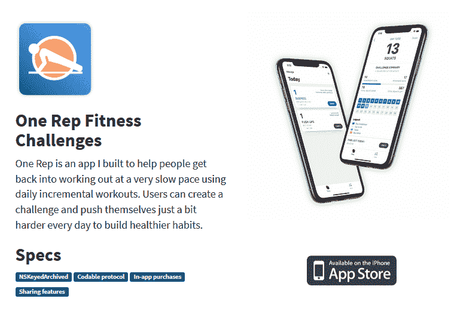
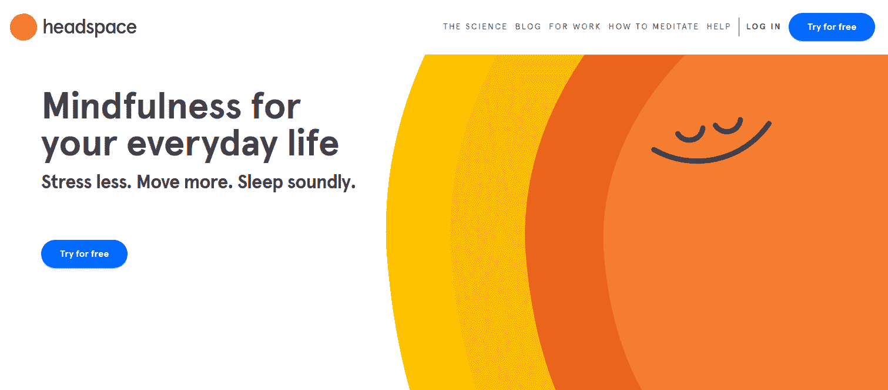
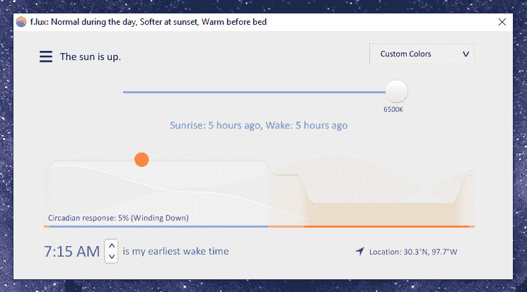
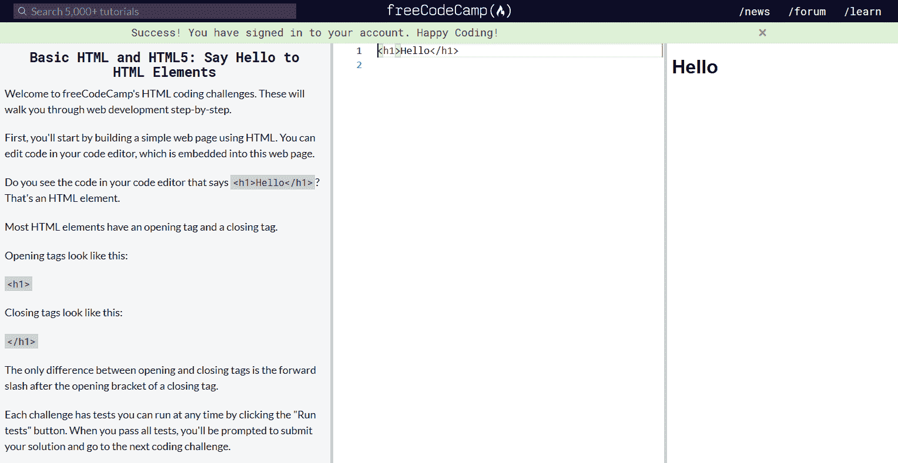

# 如何在社交距离时代保持高效

> 原文：<https://www.freecodecamp.org/news/staying-productive-in-the-age-of-social-distancing/>

在世界各地，我们中的许多人如今在家里度过了更多的时间，要么是因为被迫关闭，要么是因为练习社交距离。

无论你是远程工作，寻找下一份工作，还是学习编码，这都是一个不确定的时间。很难保持专注和高效。

在过去的四年里，我一直作为一名 web 开发人员远程工作，虽然我肯定没有弄清楚所有的事情，但我已经学到了一些如何在整天呆在家里的时候保持高效和联系的技巧。

我真诚地希望这些建议能帮助你，因为我们都在适应新的现状，至少目前是这样。

## **有一个专用的工作空间。**

你的物质环境会影响你专注于工作的精神能力。如果你已经习惯了在实体办公室工作，那么在家工作时，要找到同样的专注度可能会很难。

如果你有一个可以用作家庭办公室的房间，那你就非常幸运了。但是，即使你没有专门的房间，也可以试着搭建一个临时的桌子，或者利用现有的桌子来办公。

避免懒洋洋地躺在沙发上工作，或者更糟，躺在床上工作。试图在那些通常为放松而保留的地方工作，会让你的大脑分不清是工作时间还是休息时间。

这就引出了下一点:

## 把工作时间和家庭时间分开。

在适应每天在家工作的过程中，我遇到的最大困难是保持工作和家庭生活之间的界限。白天我不会感到很有动力，而且很容易分心。

所以我会跑腿，洗衣服，浏览 Reddit，以及其他与工作无关的事情。然后在晚上，我会因为工作进度落后而感到紧张，并熬夜试图完成工作。这导致了一个糟糕的循环，我白天没有充分工作，晚上也没有充分放松。

我的建议是，尽可能把工作和家庭生活分开。当你试图工作时，不要做杂事、家务或看视频。一旦工作时间结束，尽可能不要让它进入你的寒冷期。

## 保持专注，避免分心。

当你在办公室或学校工作时，周围都是努力工作的人，通常更容易保持专注。但是当你在家的时候，没有人让你负责，你会很快发现你是多么不守纪律！

我知道我刚开始远程工作时就发现了这一点。让自律变得富有成效需要时间，但有几件事会有所帮助。

使用番茄技术，你工作 25 分钟，然后休息 5 分钟，可以帮助你继续工作。出于某种原因，告诉自己集中注意力 25 分钟比认为自己必须在接下来的 8 个小时里工作更容易。一次吃一大块。

我使用一个简单的网络应用，名为[Tomato-Timer.com](https://tomato-timer.com/)，但是还有很多其他的应用。你甚至可以自己写！

如果你想减少手机屏幕时间，另一个流行的生产力应用程序是 [Forest](https://www.forestapp.cc/) 。它的工作原理是你可以种树，它们会在一定的时间内生长。问题是，如果你通过关闭森林应用程序以使用手机上的另一个应用程序来中断它们的生长，它们就会死去！

## 用健康的习惯安排你的一天。

我们都知道我们都应该做的基本习惯——充足的睡眠，合理健康的饮食，以及良好的锻炼。现在，我并不提倡在凌晨 4 点开始你的一天，除非你喜欢早起的生活。

但总的来说，要有充足的睡眠，尽量遵循对身心有益的习惯。

我最近一直在努力遵循的一个习惯是每天写日记。这是记录生活中正在发生的事情的好方法，我发现思考正在发生的事情会引发反思。

锻炼是另一个健康的习惯，可以帮助你的身体保持健康，也有助于你的心理健康。即使你不能再去健身房，我们也可以利用许多在线选项。

晚上，我会试着从 YouTube 频道的 [Fitness Blender](https://www.youtube.com/user/FitnessBlender) 中挑选一个快速的锻炼项目，那里有很多很棒的锻炼项目。

此外，如果你喜欢“X 日挑战”类型的锻炼，可以看看我的朋友[爱德华](https://www.instagram.com/edouard_iosdev/)制作的这个可定制的[锻炼挑战 iPhone 应用程序](https://apps.apple.com/us/app/onerep-easy-fitness-challenge/id1478401895)。

最后，我知道冥想现在是一个非常流行的词，但是它确实有帮助。我喜欢使用[洞察计时器](https://insighttimer.com/)应用程序，它有大量免费的冥想指导、冥想计时器和高级课程。

另一个流行的冥想应用是优秀的 [Headspace 应用](https://www.headspace.com/)，它是付费的，但有免费试用。

## 休息一下屏幕！

无论你是在工作还是在学习，你都可能每天长时间盯着电脑和手机屏幕。这在我们的现代生活中是不可避免的，但是试着在一天中远离屏幕休息一下。

这可能包括身体上远离电脑。在户外散散步(当然要遵守你所在国家或地区的法律法规),晒晒太阳，补充维生素 d。久坐不动后，散几分钟步有助于促进血液循环，我发现这有助于我更好地思考。如果您也受困于编码问题，这可能会很有帮助！

除了散步，尽量避免眼睛疲劳。你可能听说过 [20-20-20 法则](https://www.healthline.com/health/eye-health/20-20-20-rule)——每隔 20 分钟，专注于 20 英尺外的事物 20 秒。现在我不确定这在科学上有多准确，但我知道如果我长时间连续打电话，我的眼睛会感到疲劳。

你也可以在晚上用白光滤镜来帮助避免眼睛疲劳。这样做的原因是，来自太阳的自然光是蓝色波长的，我们的身体适应这种波长。然而，我们的电脑和手机也发出光谱中蓝色一端的光，所以[夜间屏幕时间](https://www.health.harvard.edu/staying-healthy/blue-light-has-a-dark-side)实际上会扰乱睡眠并导致眼睛疲劳。

许多手机都有内置的蓝光过滤器，或者你可以使用网络或移动应用程序让你的屏幕在晚上稍微变黄。我在电脑上使用免费的 f.lux 应用程序，但我肯定还有更多。

## 给自己时间去适应。

面对所有这些变化和你可能试图遵循的新习惯，对自己要有耐心。完全过渡到大的生活变化需要很长时间。你不会在几天内成为在家工作的专家——不幸的是，这可能需要更长的时间。

但是进步可以一步一步来。如果你发现自己效率低下，心烦意乱，不要太沮丧。试着一次专注于一个主要习惯，而不是试图立即彻底改变你的日常习惯。

如果你犯了错误，比如从手机上抬起头来，意识到你在过去的一个小时里无意中浏览了 Twitter，那也没关系！给自己一些空间和弹性。

## **学习编码或其他新技能！**

正如昆西最近写的那样，这一次可能是学习如何编码的绝佳机会。我们中的许多人比过去有更多的空闲时间，我们可以学习许多新技能！

无论是学习如何编码，如何从零开始烤面包，还是如何弹吉他，试着至少花一些时间在你的技能上。我为自己考虑的一些技能是重新开始拉小提琴，创建一个简单的视频游戏，以及学习新的编码和商业技能。

如果你想学习 web 开发，没有比 [freeCodeCamp](https://www.freecodecamp.org/) 更好的地方来学习全栈编码技能了。如果您还没有，请注册开始学习。还有一个优秀的论坛和一个巨大的 [YouTube 频道](https://www.youtube.com/channel/UC8butISFwT-Wl7EV0hUK0BQ)，里面充满了教程！

此外，如果你刚刚开始，但不知道从哪里开始，我写了一篇博客，解释了作为一个完全的初学者，你需要学习 web 开发的所有技能。我也有一个傻傻的(但是知识性强！)[YouTube 上的视频版本！](https://www.youtube.com/watch?v=ysEN5RaKOlA)

## 保持联系，寻找在线社区。

当你独自学习或工作时，感到孤立是一种常见的反应，尤其是如果你已经习惯了与他人面对面合作和聊天。

没有什么可以完全取代面对面的交流，但是我们很幸运，有很多数字方式可以和别人保持联系。

如果你正在学习编程，我强烈建议你登录 Instagram，开始发布你自己的旅程。那里有一个令人难以置信的支持和令人敬畏的开发者社区，我已经能够通过 Instagram 结交真正的朋友和熟人！你可以在[@ the codecoder-](https://www.instagram.com/thecodercoder/)找到我，随时给我发 DM 来询问任何关于 web 开发的问题！

甚至还有一个名为 BuildUpDevs 的非正式社区，由资深 Instagrammer devs 的布莱恩·克拉克(Brian Clark)和 T2·达尼什·加贾(Dhanish Gajjar)创建。他们最近还开始在 [Twitch](https://www.twitch.tv/clarkio) 上做关于网络开发各种话题的直播。

## 小心关注新闻和社交媒体。

我想说的最后一点是，要注意你脑子里塞满了多少新闻和时事。显然，关注我们的城市、国家和世界的最新发展是一个好主意。

但是试着缓和一下，因为过度的话，你可能会让自己变得更加焦虑。我知道这才是真实的自己！

如果我开始感到消极和不舒服，我不得不经常在新闻和社交媒体上休息。只要你有足够的信息来做出好的决定，不要沉溺于阅读所有的推文和新闻。试着保持积极，同时也保持现实。

我希望这篇文章能给你一些好的建议，告诉你如何应对这份新的家庭工作。最美好的祝愿，并在那里保持安全！