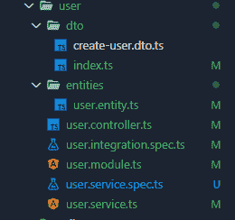
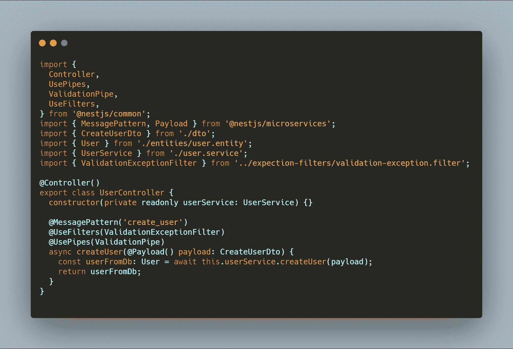
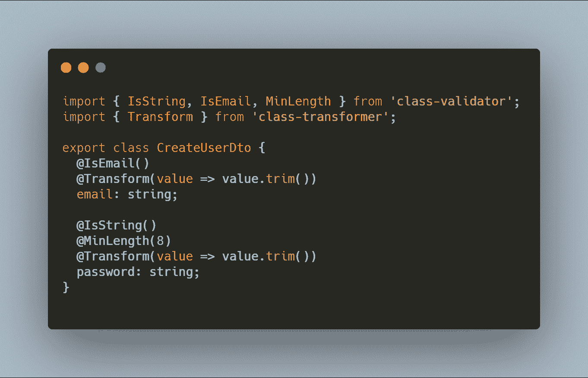
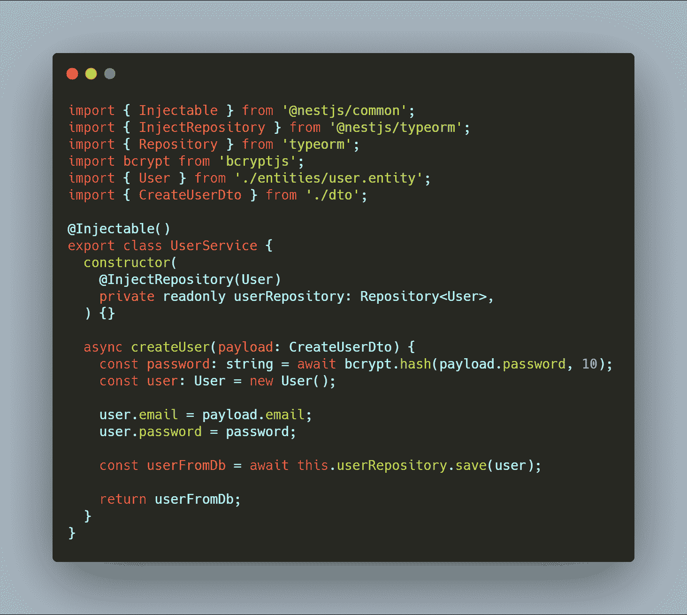
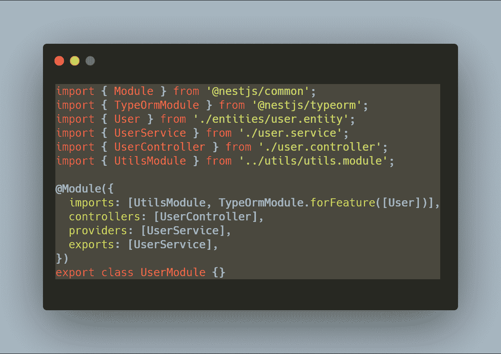
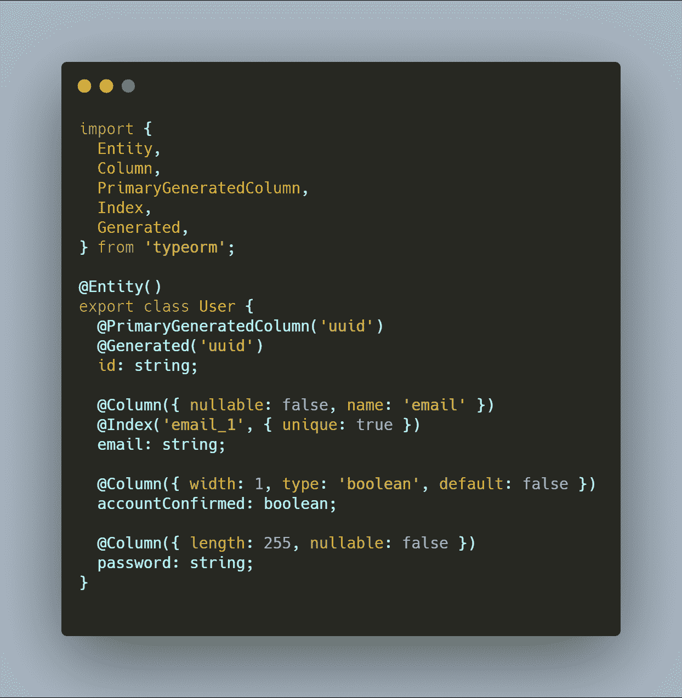
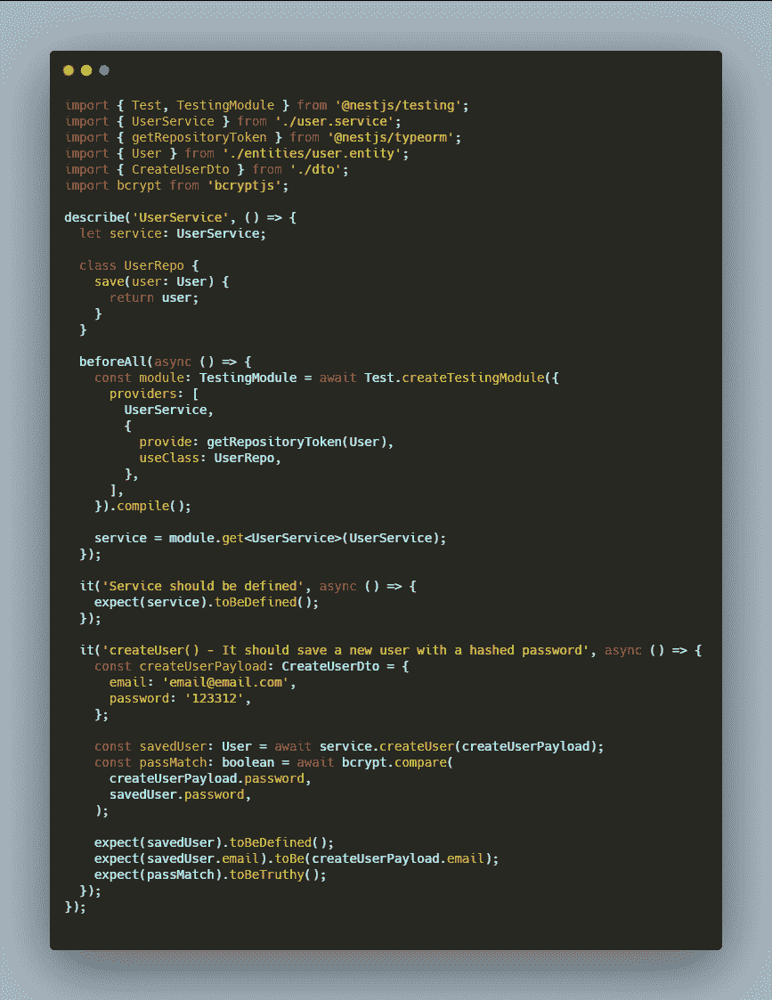
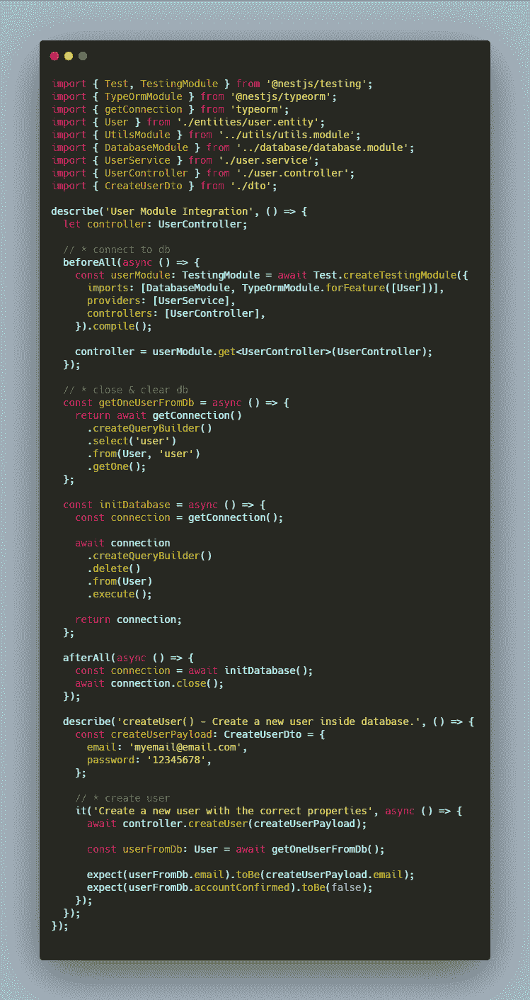
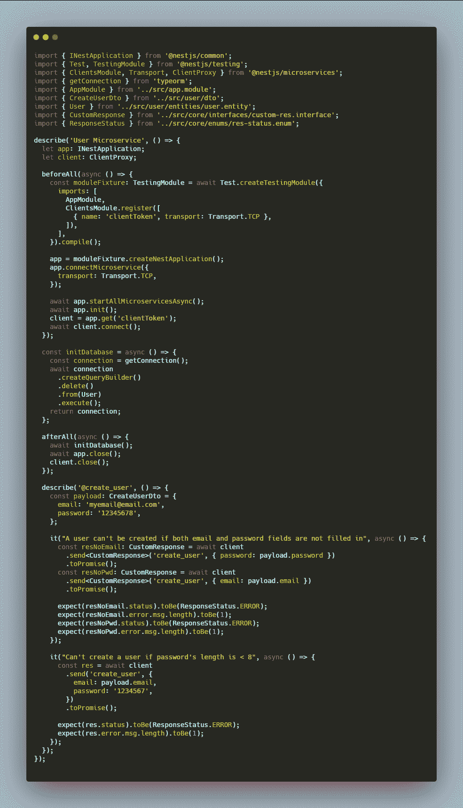

# 如何测试您的微服务，以确保它们为生产做好准备

> 原文：<https://www.freecodecamp.org/news/testing-microservices-are-they-production-ready-2/>

微服务架构描述了将应用程序分解成一系列更小、更面向问题解决方案的组件的实践。然后，这些组件中的每一个都通过通用协议(如 HTTP 或更轻量级的 TCP)相互通信。

## 你可能想知道——考试对我来说重要吗？

**长话短说——是的。**

软件测试之所以重要有很多原因，但最重要的是:

*   这既省钱又省时
*   安全性
*   产品质量(更少的缺陷和错误)
*   客户满意度
*   它让你晚上睡得安稳

没有人喜欢一个有 bug，无缘无故停止工作的应用。而且安全性差的危害也就不用说了，安全性差会让黑客窃取凭证甚至钱财。只要你开发一个将被用户使用并且有一定复杂性的应用程序，测试就不应该是一个选项——它们应该是强制性的。

## **应该写什么考试？**

有各种类型的软件测试。

**功能测试类型包括:**

*   单元测试
*   集成测试
*   烟雾测试
*   回归测试
*   健全性测试
*   beta/验收测试
*   端到端(e2e)测试

**非功能测试类型包括:**

*   性能试验
*   负载测试
*   压力测试
*   安全测试
*   符合性测试
*   可用性测试

应用程序越复杂，你使用的测试类型就越多。

**您应该经常使用的基本测试如下:**

*   单元测试
*   集成测试
*   E2E 测试结合回归测试和安全测试

这个过程是这样的:首先你编写测试来检查你的应用程序是否在几乎所有方面都像预期的那样运行，包括极限情况。第二，如果你的应用已经上线，你可以编写测试来检查代码的任何新变化是否会破坏当前的功能。

*边注:除了这些你应该在任何类型的软件上使用的基本测试之外，你还应该为微服务编写额外的测试。不要忘记负载测试，例如，检查您的系统在正常和预期的峰值负载条件下的行为。*

## **少说多码**

在下面的例子中，我们将看到如何在微服务中实现这些基本类型的软件测试。微服务使用 TCP 协议进行通信，使用[嵌套框架](https://nestjs.com/)在 Node.js 中编写。

如果 NestJS 对你来说听起来很陌生，不要担心——你只需要知道以下内容:

> " **Nest** 是一个用于构建高效、可伸缩的 **Node.js** 服务器端应用的框架。
> 
> 它使用现代 JavaScript，用 TypeScript(保留与纯 JavaScript 的兼容性)构建，结合了 OOP(面向对象编程)、FP(函数式编程)、FRP(函数式反应编程)的元素。
> 
> 在幕后，Nest 使用了 [Express](https://expressjs.com/) ，但也提供了与其他各种库的兼容性，例如
> 
> [Fastify](https://github.com/fastify/fastify) ，允许轻松使用各种可用的第三方插件。–*官方 Github 回购描述*

对于这个例子，我们将使用一个简单的模块，名称:**用户**，与一个简单的功能**创建用户**，这将在我们的数据库中创建一个新用户。

模块的文件夹结构如下:

我们有一个监听消息的控制器**创建用户**。在使用 ValidationPipe 进行验证之后，它将调用其服务中的同名函数。

在服务内部，我们散列用户密码。然后使用 TypeORM 在数据库中保存一个新用户。

对于这个模块，我们使用 TypeORM 作为链接到用户表的 ORM，另一个模块名为 **UtilsModule** ，其中我们有一些帮助函数:

## 单元测试

一个**单元** 是一个应用程序中最小的可测试部分，比如函数、类或过程。**单元测试**是一种软件测试方法，通过测试源代码的单个单元来确定它们是否对我们有益。

基本上，编写单元测试是为了确保不同代码形式(函数、类等等)的每个简单实现都符合它们的设计和需求，并且行为符合预期。

[单元测试](https://codepad.co/blog/test-driven-development-writing-efficient-code-for-your-unit-tests/)的目标是分离程序的各个部分，并测试各个部分是否正常工作。

这意味着代码的其他部分如果不是直接来自测试单元(而是与之链接)将会被嘲笑。

在我们的例子中，我们想要测试的函数( **createUser** )是我们想要测试的单元。这意味着我们必须将它与其他组件隔离开来。所以我们必须模仿我们的**用户存储库**类，它使用**类型表单**表示与数据库的链接。

如果我们分析这个函数(服务中的那个)，我们会看到它所做的只是散列一个密码，然后在我们的数据库中保存一个用户对象。鉴于这一事实，我们编写了以下测试套件:

首先，我们在创建测试模块的所有函数之前编写一个**。然后我们用我们的模拟类替换原来的存储库，它将只返回我们希望保存在数据库中的对象。**

在我们的函数中，我们有一个关于极限情况的需求:

*   使用一些给定的属性(电子邮件、密码)创建一个新的用户对象，但使用散列密码

我们模仿了函数 **save()，**，因为它来自 TypeORM，在我们的单元之外，我们用一个简单的函数覆盖了它，该函数返回我们传递的对象。

所以我们所要做的就是检查我们发送的对象是否具有正确的电子邮件属性和正确的哈希。

## 集成测试

**集成** **测试**是一种软件测试方法，通过测试源代码单元来验证组合功能。单元测试基本上是为了确保代码满足它的设计和需求，并如预期的那样运行。单元测试的目标是将不同的模块混合在一起，并测试它们是否正常交互。

现在，对于我们的例子，我们将我们的**用户模块**与 TypeORM 模块(依赖)结合起来，检查用户是否保存在数据库中。

我们又有了上面同样的功能，但这次用了下面的测试:

这一次，在我们的 **beforeAll** 函数中，我们没有模仿**用户存储库**。相反，我们使用原来的那个，加上我们添加的**数据库模块**，它创建了到我们数据库的连接。同时，因为我们现在使用一个真实的数据库，我们必须编写几个函数来准备我们的数据库进行测试。我们需要在测试之前和之后清空数据库，以确保它是完全空的。

与此同时，我们必须手动关闭与它的连接，这样在我们完成测试后，我们就不会保留任何打开的处理程序。通过单元测试，我们检查我们的功能是否如设计的那样工作。所以在这里，我们所要做的就是测试我们的函数是否与 TypeORM 的 **save()** 方法混合，我们的用户是否存储在数据库中。

我们写了一个名为 **getOneUserFromDb，**的帮助函数，它做了它所说的事情。然后，我们检查电子邮件以及属性 **accountConfimed** 是否正确，该属性在实体类中设置为默认值 **false** 。

## 端到端测试

**[端到端测试](https://itnext.io/end-to-end-testing-78033fb768a8)** 是一种软件测试技术，用于测试一个应用的流程是否从头到尾都按照设计执行。

我们做这种类型的测试是为了确保应用程序在现实环境中能够正常工作。到目前为止，我们已经测试了用户密码是否进行了相应的哈希处理，以及密码和电子邮件是否保存在数据库中。现在我们需要在请求级别测试我们的验证。在我们的控制器中，我们有一个验证管道来测试传入的有效负载，以检查对象是否与**createuserdo 匹配。**

测试是:

在这里，我们测试了如果我们试图创建一个用户，但是没有发送整个对象或者以不正确的格式发送属性会发生什么。这些是我们仅用 3 种软件测试方法测试的函数的一些极限情况的例子。

## 手动测试与自动化测试

到目前为止，我们已经手动编写了我们的测试——对于这个例子来说，这已经很完美了。但是你拥有的代码越多，你的测试套装就会变得越复杂越大。

例如，如果你要测试一个认证系统，你将不得不复制一个真实用户的整个行为。您将不得不模拟请求和响应，包括 cookies 和许多其他东西，只是为了构建测试环境。一个长的测试套件可能需要很多时间来运行。

幸运的是，在测试方面，您还有一个选择:自动化工具。这些工具具有内置的功能，可以模拟整个测试环境，这使得测试过程更加容易。

你可以更进一步，为你的应用程序使用[自动化 API 测试工具](https://www.loadmill.io/)。这些工具带有额外的选项，使它们非常适合负载测试、回归测试和真实情况下的数据报告。另外，他们有一个很好的用户界面，这使得编写测试更加容易。

## 结论

构建可用于生产的软件需要测试。有时，根据应用程序的复杂性，这些测试可能会成为您或您的团队的瓶颈。在这种情况下，一定要按照类型来分离你的测试套件，就像我们之前做的那样。并且只测试属于当前测试类型的功能。

如果这对于你的用例来说还不够，或者测试太难写并且花费太多时间，那么你可以使用自动化工具和平台来使事情变得更简单。