# 我如何通过 Scikit-Learn 和 Statsmodels 使用回归分析来分析预期寿命

> 原文：<https://www.freecodecamp.org/news/regression-analysis-on-life-expectancy/>

在本文中，我将使用一些与预期寿命相关的数据来评估以下模型:线性、岭、套索和多项式回归。所以让我们直接开始吧。

我在探索新加坡的登革热趋势，那里的登革热病例最近激增——尤其是在我居住的[登革热红区](https://www.nea.gov.sg/dengue-zika/dengue/dengue-clusters)。然而，NEA 网站上没有原始数据。

我想知道，登革热是否影响了某个国家的人的寿命？富裕国家的人更长寿吗？影响一个国家预期寿命的因素有哪些？

所以我探究了预期寿命，寻找以下几个方面(特征)的数据:

*   [出生率](https://en.wikipedia.org/wiki/List_of_sovereign_states_and_dependent_territories_by_birth_rate)
*   [癌症发病率](https://www.worldlifeexpectancy.com/cause-of-death/all-cancers/by-country/)
*   [登革热病例](https://en.wikipedia.org/wiki/Dengue_fever_outbreaks)
*   环境绩效指数( [EPI](https://epi.envirocenter.yale.edu/epi-topline) )
*   国内生产总值
*   [卫生支出](https://en.wikipedia.org/wiki/List_of_countries_by_total_health_expenditure_per_capita)
*   [心脏病发病率](https://www.worldlifeexpectancy.com/cause-of-death/coronary-heart-disease/by-country/)
*   [人口](https://en.wikipedia.org/wiki/List_of_countries_by_population_in_2010)
*   [区域](https://en.wikipedia.org/wiki/List_of_countries_by_population_in_2010)
*   [人口密度](https://en.wikipedia.org/wiki/List_of_countries_by_population_in_2010)
*   [冲程速度](https://www.worldlifeexpectancy.com/cause-of-death/stroke/by-country/)

目标是以年数衡量的预期寿命。

这些假设是:

1.  这些是国家一级的平均值
2.  没有男女之分

Python 代码可以在我的 [GitHub](https://github.com/JNYH/Project-Luther) 上找到。

## 数据科学过程

我在分析中使用了以下数据科学流程:

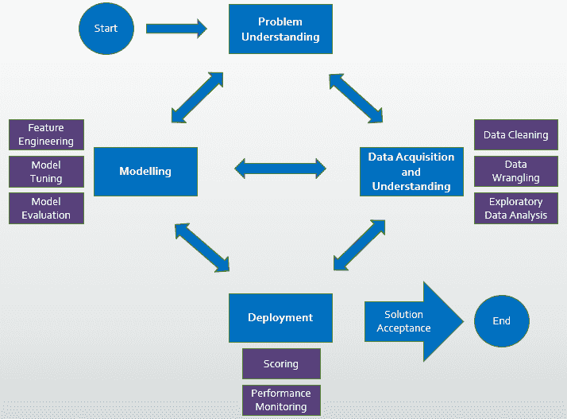

*   数据收集、数据清理、探索性数据分析
*   特征选择，特征工程
*   模型选择、模型调整和超参数调整
*   基于所选性能度量的模型优化

用于此分析的工具包括:


*   Python 库，特别是用于操作数据结构的 [Numpy](https://numpy.org/) 和 [Pandas](https://pandas.pydata.org/docs/)
*   [Matplotlib](https://matplotlib.org/) 和 [Seaborn](https://seaborn.pydata.org/) 进行可视化
*   用于回归分析的 [Scikit-Learn](https://scikit-learn.org/stable/index.html) 和 [Statsmodels](https://www.statsmodels.org/stable/index.html)

## 探索性数据分析

首先，我检查要素之间的多重共线性。

```
sns.set(rc={'figure.figsize':(10,7)})sns.heatmap(df.corr(), cmap="seismic", annot=True, vmin=-1, vmax=1)
```

似乎有一些强烈的共线性，用深红色和深蓝色的方框表示，如下图所示。

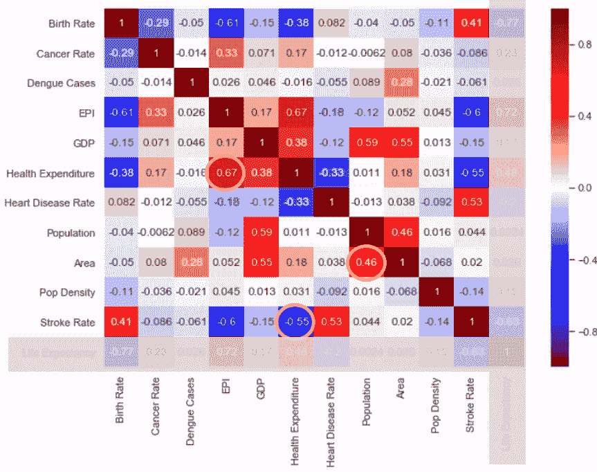

例如，在医疗保健上花费更多的国家的 EPI 得分更高。当卫生支出较高时，中风率也较低。面积越大，人口越多。

特征和目标的相关性如何？
要长寿，就要中风率低，健康支出高，爱护环境，少生孩子(根据相关图表)。

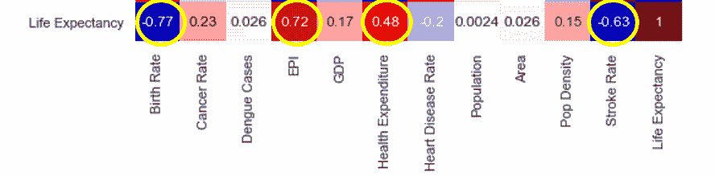

让我们看看最初的配对图。

```
sns.pairplot(df, height=1.5, aspect=1.5)
```

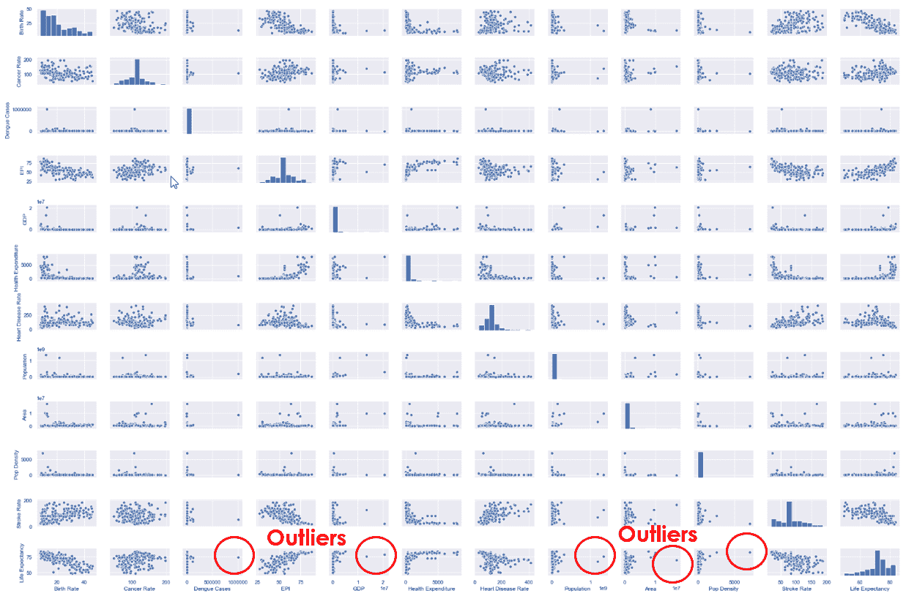

似乎需要移除许多要素中的异常值，例如，登革热病例、GDP、人口、面积和人口密度。

每个异常值都被列中的下一个最高值替换。移除异常值后，图仍然向右倾斜(点非常集中在左侧)。因此，这表明可能需要一些转变。

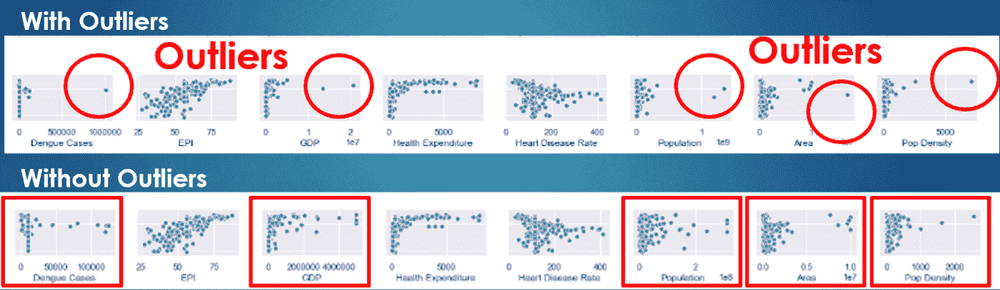

另一种去除异常值的方法是使用 LOG 函数，这有助于将集中的数据向右扩展。

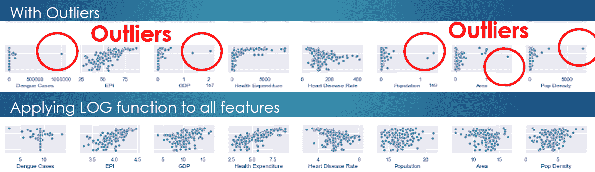

# 特征选择

为了寻找重要的特性，我一次删除一个特性，看看它对简单回归模型的影响。查看 R 得分，选择这 3 个特征(出生率、EPI、中风率)，因为没有它们模型会受到不利影响。

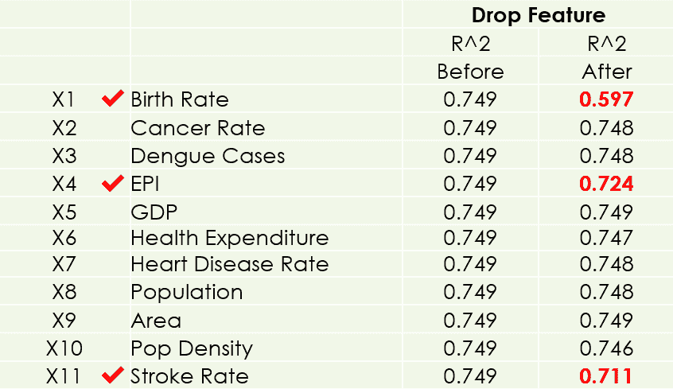

接下来，我移除了**异常值，并查看了 ****Statsmodels**** 上的 p 值。我获得了一个更显著的特征(人口密度)。当一个特征的 p 值小于 0.05 时，它被认为是一个好的特征，因为我选择了 5%作为显著性水平。**

**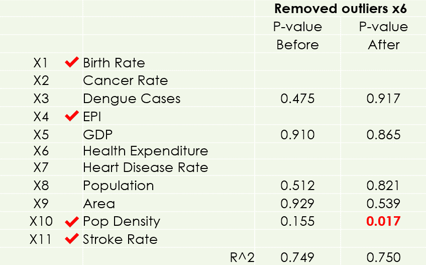**

**之后，我将 ****LOG**** 函数应用于所有特征，获得了 4 个更显著的特征(GDP、心脏病发病率、人口和面积)。**

**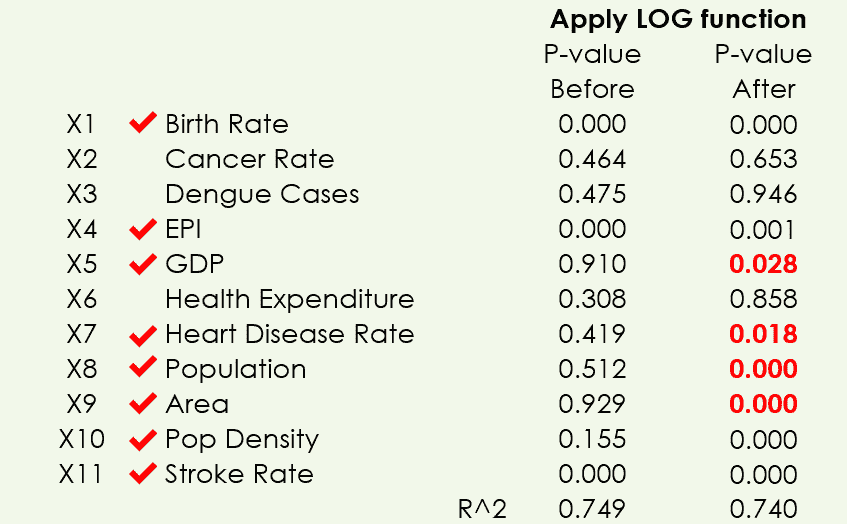**

**我也做过其他的变换(倒数，2 次方，平方根)但是没有更多的改进。**

**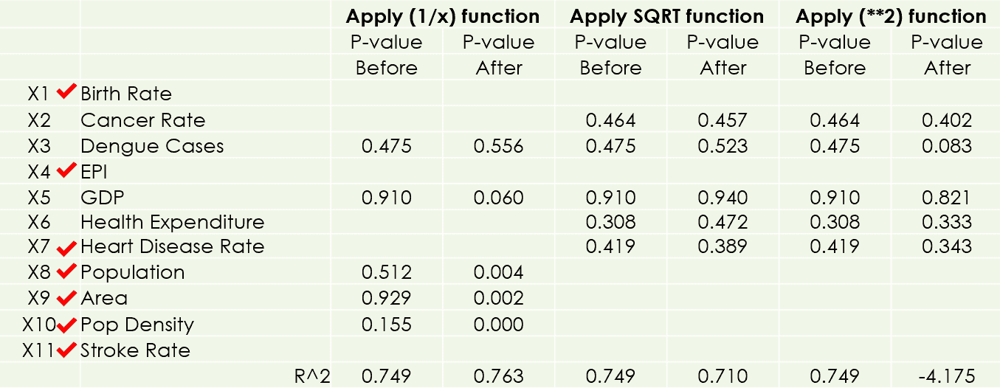**

**也可以使用 ****SkLearn**** 中的 ****LassoCV**** 功能选择功能。**

**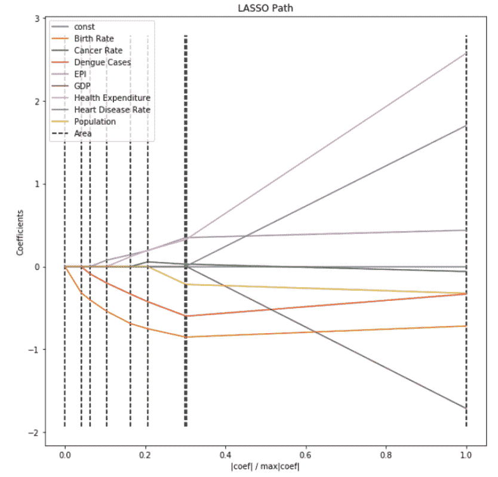**

**最后，我再次查看了包含所有重要特征的结对图。散点图现在很好地展开，有一些清晰的趋势。**

**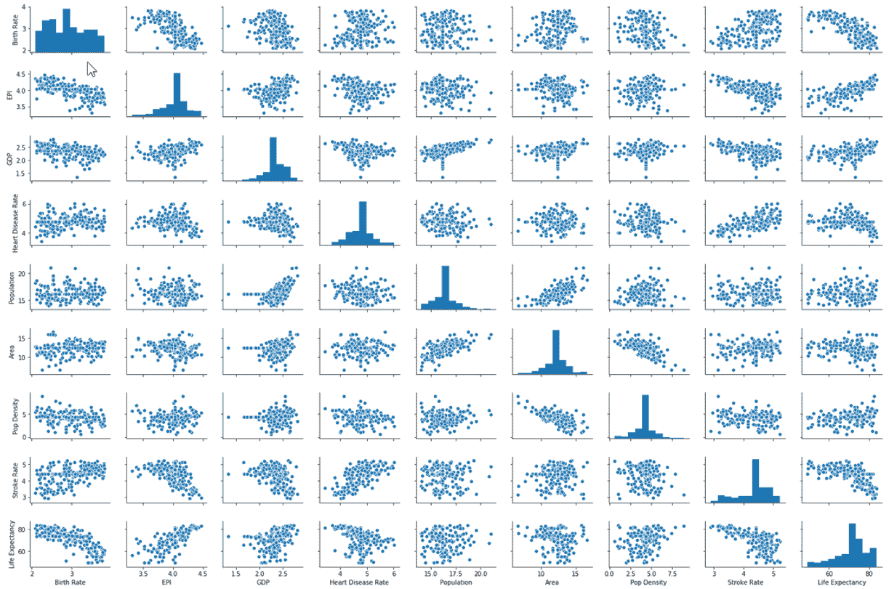**

# **型号选择**

**现在，我已经准备好在训练数据集上拟合以下模型:**

*   **[****线性**** 回归](https://www.thebalancesmb.com/what-is-simple-linear-regression-2296697)(逼近因变量和独立目标变量之间关系的直线)**
*   **[****岭**** 回归](https://www.datacamp.com/community/tutorials/tutorial-ridge-lasso-elastic-net)(这降低了模型复杂度，同时保持了模型中的所有系数，称为 L2 惩罚)**
*   ******[L](https://www.datacamp.com/community/tutorials/tutorial-ridge-lasso-elastic-net)**ASSO**[回归](https://www.datacamp.com/community/tutorials/tutorial-ridge-lasso-elastic-net)(最小绝对收缩和选择算子通过将模型系数罚为零来降低模型复杂度，例如，L1 罚)**
*   **[****二次多项式**** 回归](https://towardsdatascience.com/polynomial-regression-bbe8b9d97491)(一条曲线来近似因变量和独立目标变量之间的关系)**

**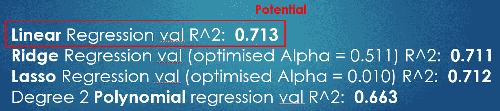**

**我还在验证数据集上验证了它们的性能。简单线性回归模型似乎有潜力成为表现最好的模型。**

**这是通过 ****交叉验证**** 使用 ****KFold**** 来确认的(有 5 个拆分)。**

**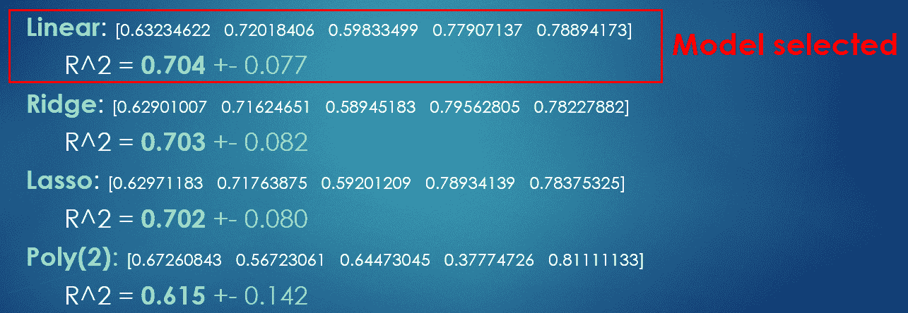**

**最后，我根据假设检查了残差。残差应该正态分布，在均值零点附近具有相等的方差。正常的四分位对四分位图看起来也正常得可以接受。**

**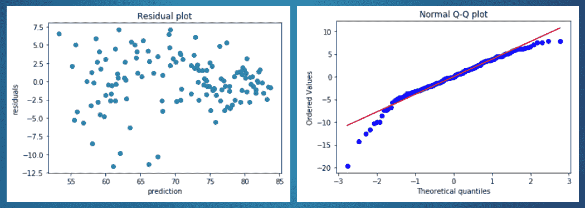**

**由于我只有 250 行(数据受到世界上国家数量的限制)，我使用了整个数据集来模拟测试数据集(注意:这是出于学术目的，并不实际，因为它会导致[数据泄漏](https://towardsdatascience.com/data-leakage-in-machine-learning-10bdd3eec742))。我用 ****KFold 交叉验证****10 个拆分来评估模型性能。**

```
`from sklearn.model_selection import cross_val_score
from sklearn.model_selection import KFold
kf = KFold(n_splits=5, shuffle=True, random_state = 1)
lm = LinearRegression()
lm.fit(X_train, y_train)
cvs_lm = cross_val_score(lm, X, y, cv=kf, scoring='r2')
print(cvs_lm)`
```

**R 值在 0.49 到 0.82 之间有相当大的变化，但平均结果在 0.69 左右，这是相当令人满意的。**

**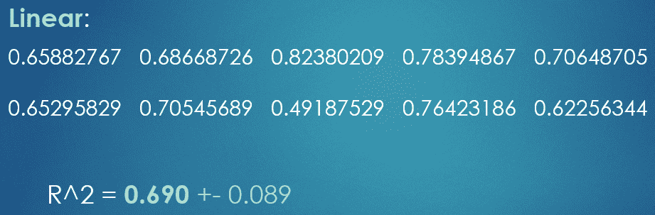**

# **我们如何解释这个模型？**

```
`df = pd.read_csv('df3.csv')
X = df[ ['Birth Rate', 'EPI', 'GDP', 'Heart Disease Rate', 'Population', 'Area', 'Pop Density', 'Stroke Rate'] ].astype(float)
X = np.log(X)
y = df[ "Life Expectancy" ].astype(float)
X = sm.add_constant(X)

model = sm.OLS(y, X)
results = model.fit()
results.summary()`
```

**如果你不受这些特征的影响，你的预期寿命是 62 岁。如果你的国家出生率低，多活 5 年。 ****如果 EPI(环境绩效指数)高，多加 8 年寿命。**** 如果你生活在一个富裕的国家，多加半年寿命。最后，中风率每降低一个单位(或者更确切地说是对数单位),你的寿命就会增加 5 年。**

**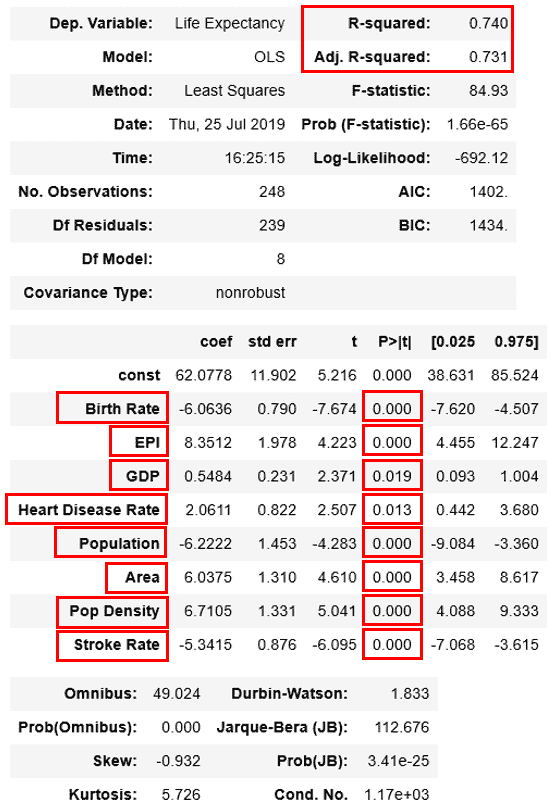**

# **后续步骤**

**我可能会通过将范围扩大到城市而不是国家来收集更多的数据，并探索影响预期寿命的其他特征(因素)。此外，我可以将数据分为男性和女性类别，以进行这种预期寿命回归分析。**

**总之，这里有一些有趣的见解:**

1.  **日本的人均寿命最高(83.7 岁)。中非共和国(49.5 岁)和非洲大陆的许多国家在规模中垫底。新加坡排名第五(82.7 岁)。**

******2。爱护环境**** 。这对一个国家的预期寿命有最大的系数(影响)。**

**上述分析的 Python 代码可以在我的 [GitHub](https://github.com/JNYH) 上找到——请随意参考。**

**[https://github.com/JNYH/Project-Luther](https://github.com/JNYH/Project-Luther)**

**视频演示:[https://youtu.be/gC2m_lvouu8](https://youtu.be/gC2m_lvouu8)**

**感谢您的阅读。**