# 如何开始使用无服务器架构

> 原文：<https://www.freecodecamp.org/news/how-to-get-started-with-serverless-architecture/>

传统上，当您想要构建一个 web 应用程序或 API 时，您通常必须花费大量的时间和精力来管理服务器，并确保您的应用程序能够处理大量的请求。无服务器是一种云计算模式，让您无需担心管理和扩展服务器就可以运行应用程序。

你所需要做的就是将你的代码上传到云提供商的服务中，他们会自动提供一个短暂的环境。与传统架构不同，它可以瞬间处理数千个请求，并且您只需为代码执行的持续时间付费。

在本文中，我们将构建一个简单的联系人表单，由 AWS(Amazon Web Services)的无服务器产品 Lambda 提供支持。然而，无服务器适用于任何复杂性或规模的应用程序。举个例子，我们构建了[my compiler](https://www.mycompiler.io/)——一个支持 20 种语言的编程平台——它主要由无服务器驱动。

在我们开始之前，我们将仔细看看无服务器和 Lambda 是如何工作的，以及我们将为联系人表单设置的架构。此外，在本文的结尾，我们将看一些工具，它们有助于构建和部署大型无服务器应用程序。

你需要一个 AWS 账户来遵循这个指南，并且[你可以在这里注册](https://portal.aws.amazon.com/billing/signup)。我们在本指南中的 AWS 用法将完全包含在免费层中。

## AWS Lambda 是如何工作的？

在这一节中，我们将理解 Lambda 的工作流程，并简要了解它是如何工作的。然而，这些概念也适用于大多数其他云提供商的无服务器产品。

使用 Lambda，你可以将代码上传到 AWS，通常是用 Python、Node.js 或 Ruby 编写的脚本。对于 Go、Java 或 C#这样的语言，它是一个 Linux 可执行文件或该语言格式的包(如 Java 的 jar 文件)。

上传代码后，您可以手动“调用”它，或者使用另一个 AWS 服务来实现这个目的(我们稍后将详细讨论这一点)。当您调用代码时，Lambda 会在它们的一个服务器上创建一个安全的、短暂的 Linux 环境，称为“容器”,您作为调用的一部分传递的任何数据都会被提供给函数。

一旦函数完成执行，Lambda 服务将代码的结果返回给调用者。然后容器可以被重用来为另一次执行服务，或者如果函数很长时间没有被调用，容器就会被销毁。

当您进行并行调用时，Lambda 会创建一个容器来服务每个调用。因为每个调用都专用于单个容器，所以每个调用都获得充足的执行资源。您可以为每次调用分配 128 MB 到 3 GB 的内存，以及随内存增加而增加的 CPU。再加上它可以服务多达 1000 个并行调用(可以通过联系 AWS 来增加)，您可以处理繁重的工作负载，而不必担心伸缩性。

那么，抛开扩展问题不谈，AWS Lambda 的运行成本是多少？Lambda 的使用通过以下参数来衡量:请求的数量、分配给它的内存以及函数运行的毫秒数。

如果您选择最小的内存大小(128 MB)，并且您的函数在调用时需要 1 秒钟运行，那么您可以免费调用您的函数多达一百万次。之后，每 100 万次调用的成本可高达 2.30 美元。128 MB 的内存大小可能看起来很小，但它肯定足以处理多种工作负载。

## API 网关——用 Lambda 服务 HTTP 请求

正如我们前面提到的，一旦你上传了你的代码，你必须手动调用它。要构建一个 web 应用程序，您需要有一个服务器来监听 HTTP 请求，用请求的细节调用您的函数，并将从函数返回的数据转换为 HTTP 响应。

AWS 有另一个服务可以让你做到这一点——API gateway。就像 Lambda 一样，它是另一个 AWS 托管服务，可以自动扩展以处理极高的请求量。

一旦你创建了一个 API 网关，你会得到一个基本 URL，看起来像这样:
`https://abcdefgh.execute-api.us-east-1.amazonaws.com/`

在这个基本 URL 下，您可以将路径和请求方法(如 GET 或 POST)映射到您的函数。如果您想使用默认域之外的其他域，您也可以选择创建您的自定义域，但我们不会在本指南中详细介绍。

此外，就像 Lambda 一样，API gateway 的定价也很棒——你可以免费服务多达 100 万个请求，之后每 100 万个请求要花 1 美元。

## 构建联系人表单

我们将构建一个简单的联系表单，向我们发送一封包含用户填写的详细信息的电子邮件。这就是我们如何构建联系人表单的各个部分:

1.  首先，我们将设置 SES(简单电子邮件服务)，AWS 的电子邮件服务。这是为了帮助我们发送联系表格的电子邮件。
2.  接下来，我们将为 Lambda 设置一个“角色”,然后创建一个 Lambda 函数来接收 HTTP 请求并向我们发送电子邮件。
3.  我们将设置 API gateway，并将其映射到我们在步骤 2 中创建的函数。
4.  然后，我们将设置一个与 API 网关端点交互的 web 页面，并提交用户填写的详细信息。

在本指南的最后，您将设置如下内容:

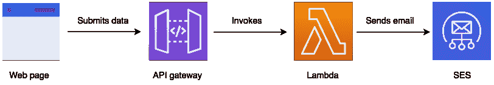

要开始，请访问 [AWS 管理控制台](http://console.aws.amazon.com/)(或简称为“控制台”)，并使用您用来注册的详细信息登录。登录后，您可以使用导航栏中的“服务”下拉菜单在我们将要使用的各种服务之间切换。

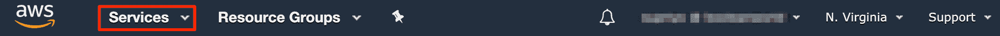

## 设置发送电子邮件的 se

首先通过“服务”下拉菜单访问控制台的 SES(简单电子邮件服务)部分，或者使用此[直接链接](https://console.aws.amazon.com/ses/home)。然后，点击左侧的“电子邮件地址”部分。您将看到以下页面:

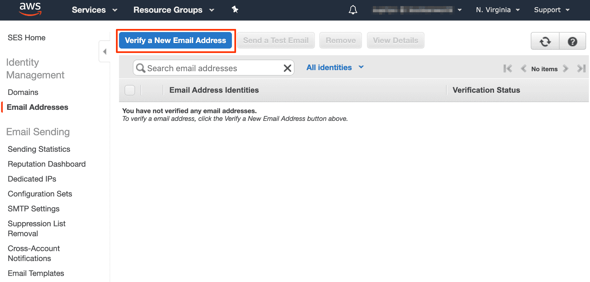

单击“验证新的电子邮件地址”按钮，然后输入您的电子邮件地址，并单击“验证此电子邮件地址”。您将收到一封带有验证链接的电子邮件。打开它以验证地址，然后刷新 SES 控制台页面。您将看到电子邮件地址已经过验证:

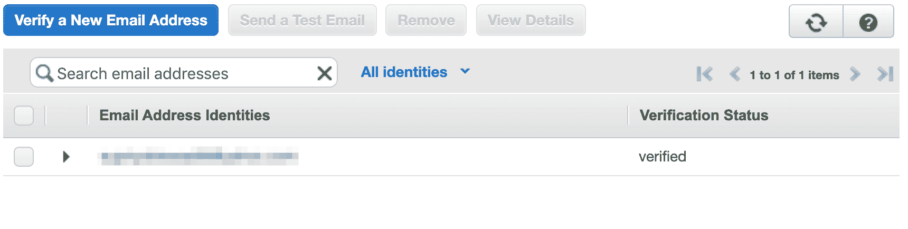

此时，您将能够使用 SES 为您的电子邮件地址发送电子邮件。

## 为 Lambda 函数设置角色

在 AWS 中，大多数事情开始时根本没有与 AWS 帐户中的其他资源或服务进行交互的权限，除非您给它明确的权限。

这意味着我们的 Lambda 函数将无法与 SES 等服务对话来发送电子邮件。Lambda 使用一种叫做“角色”的东西来定义它对其他服务的访问级别。因此，在本节中，我们将为我们的功能设置一个角色，以访问 SES 和 [CloudWatch](https://aws.amazon.com/cloudwatch/) 。CloudWatch 是一个存储日志和指标的服务，Lambda 用它来存储你的函数的错误和执行日志。

要设置角色，请转到控制台的 IAM(身份和访问管理)部分，或使用此[直接链接](https://console.aws.amazon.com/iam/home)，并单击左侧的“角色”。您将看到如下所示的页面:

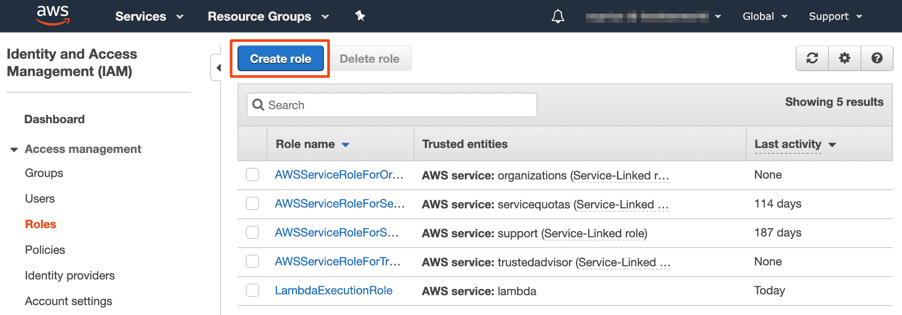

我们需要创建一个新角色，因此单击“创建角色”。您将看到一个包含 AWS 服务列表的页面。因为我们是为 Lambda 设置的，所以选择“Lambda”并点击“下一步:权限”按钮。

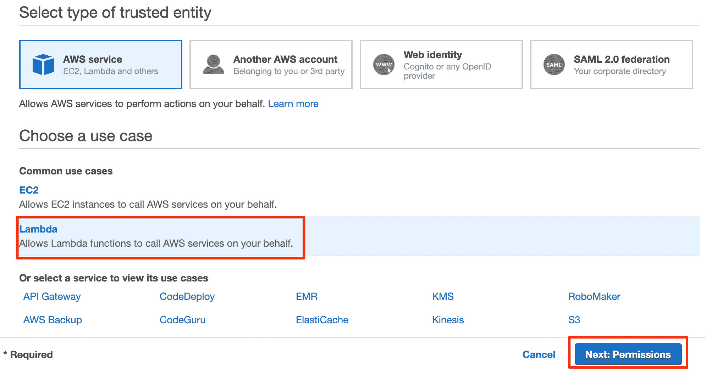

现在，在权限页面上，您将获得一个附加策略的选项。首先，我们将授予“SES”权限——您可以通过搜索“SES”并选择“AmazonSESFullAccess”策略来做到这一点。

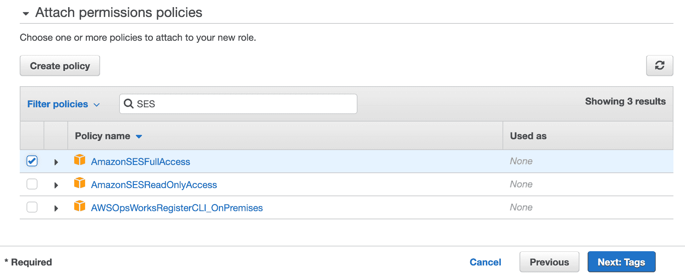

类似地，您可以通过搜索“CloudWatchFullAccess”来授予 CloudWatch 访问权限，然后选择出现的策略:

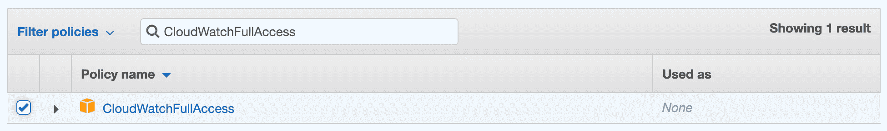

选择这些策略后，单击“下一步:标签”,然后单击“下一步:查看”按钮。在“角色名称”文本框中，输入您选择的角色名称，如“ContactFormRole”。然后，单击“创建角色”按钮。

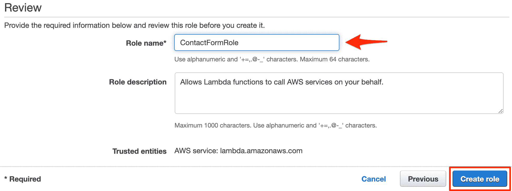

现在，我们有一个角色可以使用 Lambda 函数了。

## 创建 Lambda 函数

此时，我们可以创建 Lambda 函数，它从 API gateway 接收详细信息，并向我们发送电子邮件。

创建这个功能到控制台的 Lambda 部分，或者使用这个[直接链接](https://console.aws.amazon.com/lambda/home)。点击左侧的“功能”。在此页面上，单击“创建函数”按钮。

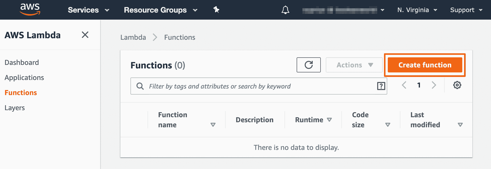

在 create function 页面上，会要求您输入函数的名称和想要使用的语言。我们将我们的函数命名为“ContactFormFunction”，我们将使用 Python 3.8 作为语言。

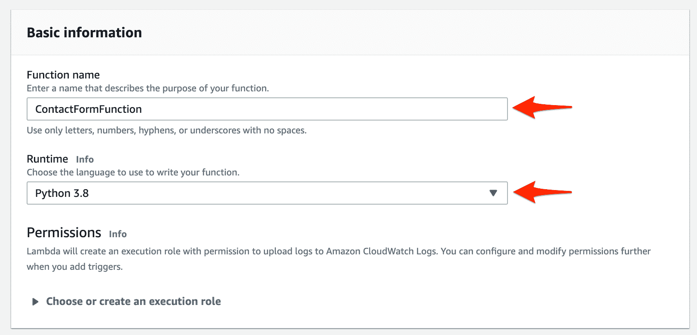

接下来，我们将附加上一节中创建的角色。单击“Permissions”部分下面的“Choose or create an execution role ”,选择“Use an existing role ”,然后选择我们之前创建的角色“ContactFormRole”。输入详细信息后，点击“创建功能”按钮。

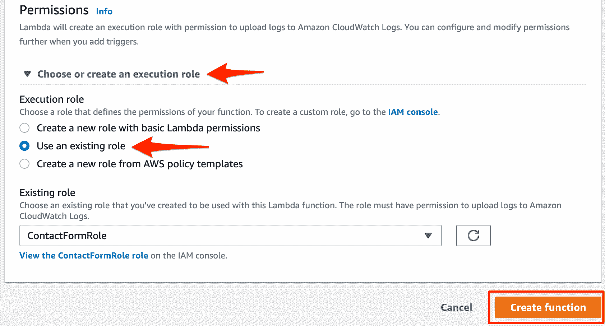

这将带您进入一个页面，显示有关您的功能的详细信息。向下滚动一点，以便可以看到代码编辑器，如下所示:

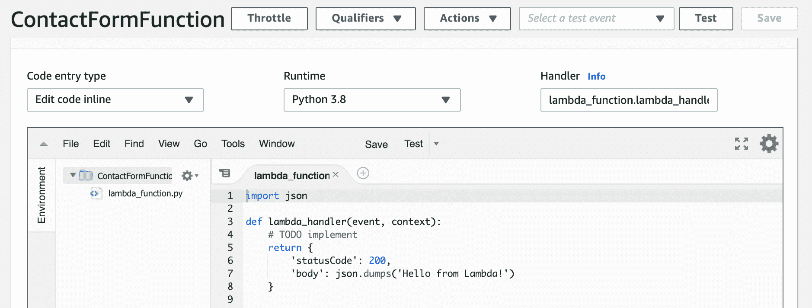

在右窗格中，粘贴以下代码并用您的电子邮件地址更改`your_email_address_here`。

```
import boto3
from base64 import b64decode
from urllib.parse import parse_qs

# Replace your email address here
send_to = 'your_email_address_here'

def lambda_handler(event, context):
    # We receive our data through POST requests. API gateway
    # sends the POST data as a Base64 encoded string in
    # event['body'], so we must decode it.
    data = parse_qs(b64decode(event['body']).decode())

    subject = 'You got a message from %s' % data['email'][0]
    text = '\n'.join([
        'Name: %s' % data['name'][0],
        'Email: %s' % data['email'][0],
        'Message %s' % data['message'][0]
    ])

    # Send an email through SES with the SendEmail API
    client = boto3.client('ses', region_name='us-east-1')
    client.send_email(
        Source=send_to,
        Destination={'ToAddresses': [send_to]},
        Message={
            'Subject': {'Data': subject},
            'Body': {'Text': {'Data': text}}
        },
        ReplyToAddresses=[data['email'][0]]
    )

    # This is the response that'll be sent out through the
    # API gateway to the browser.
    return {
        'statusCode': 200,
        'headers': {
            'Access-Control-Allow-Origin': '*'
        },
        'body': '"Success"' # jquery expects a JSON response
    }
```

然后，单击右上角的“保存”按钮保存您的代码。这样一来，我们将创建一个 API 网关，并用 Lambda 函数映射它。

## 用 API 网关处理 HTTP 请求

要添加 API 网关并将其映射到您的函数，请向上滚动 Lambda 函数页面，直到看到“设计器”部分，然后单击“添加触发器”按钮，如下所示:

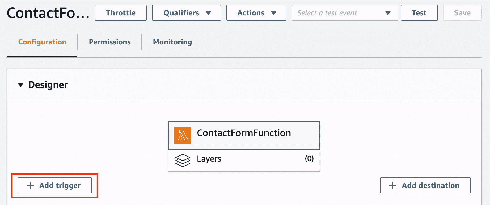

这将打开“触发器”配置页面。触发器是可以调用 Lambda 函数的东西，因为我们需要一个 API 网关，所以从下拉列表中选择它:

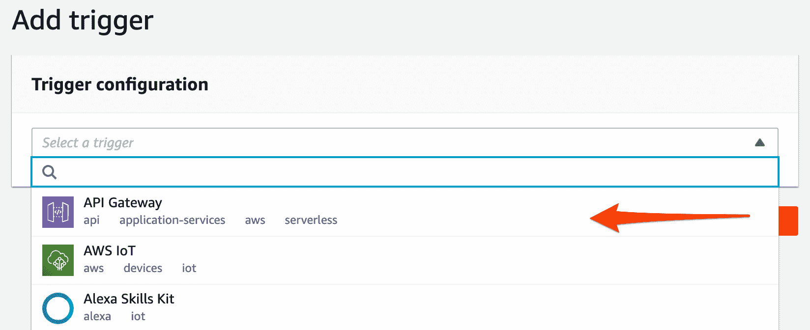

这将带来设置 API 网关的各种选项。确保您已将“API”设置为“创建新 API”并将“选择模板”设置为“HTTP API”:

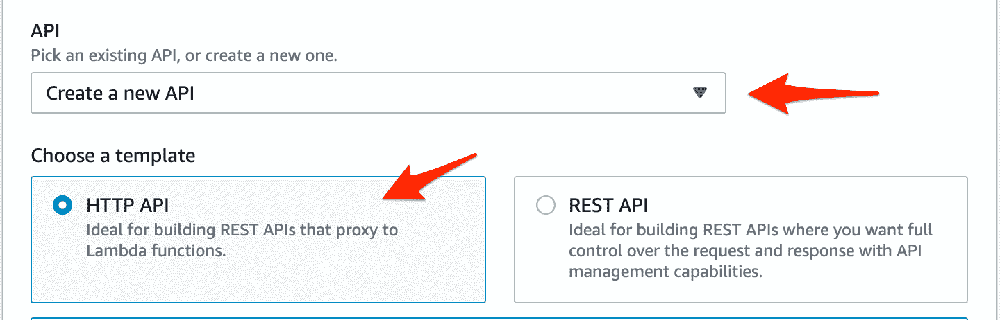

向下滚动并单击“添加”功能来设置 API 网关。这需要几秒钟的时间来完成，一旦完成，您将被带到 designer 视图。点击左边的“API gateway”按钮，查看可以触发 Lambda 函数的 URL:

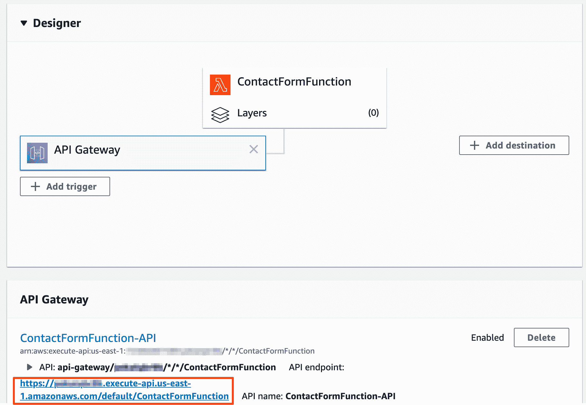

现在，在我们构建联系表单页面之前，我们将测试我们的设置是否正常工作。如果您使用的是 MacOS、Linux 或最新版本的 Windows 10，您可以复制上面显示的 API 网关 URL，并在您的终端中运行以下命令。确保用实际的 URL 替换`your_api_gateway_url`！

```
curl -i your_api_gateway_url --data-urlencode "name=John" --data-urlencode "email=john@example.com" --data-urlencode "message=hi there"
```

如果一切顺利，您可以看到带有“成功”消息的 200 OK 响应，如下所示:

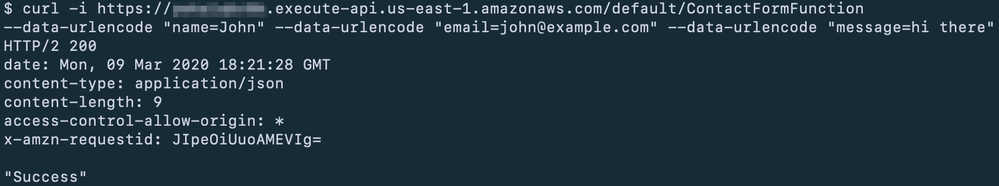

您还应该会在收件箱中收到一封标题为“您收到了一封来自 john@example.com 的邮件”的电子邮件，其中包含表单中输入的详细信息。

然而，这有时会很挑剔。该邮件可能会被发送到您的垃圾邮件文件夹中，或者有时甚至会在您没有看到该邮件的情况下被拒绝。这是因为 Gmail 和雅虎等提供商阻止第三方(如 SES)使用他们的域名发送电子邮件。

如果你有自己的域名，可以通过设置一个 [SPF 记录](https://docs.aws.amazon.com/ses/latest/DeveloperGuide/send-email-authentication-spf.html)来解决这个问题。但是，我们不会在本指南中讨论这一点，因为我们希望您即使没有域名也能理解。

接下来，我们将通过构建联系表单页面来完成本指南。

## 构建联系人表单

打开您喜欢的文本编辑器，将下面的代码保存为 HTML 文件。记得用之前获得的完整 URL 替换`your_api_gateway_url`。

```
<!DOCTYPE html>
<html>
<head>
  <title>Contact form</title>
  <link rel="stylesheet" href="https://stackpath.bootstrapcdn.com/bootstrap/4.4.1/css/bootstrap.min.css">
  <style>
    body {
      margin-top: 20px;
    }
  </style>
</head>
<body>
  <div class="container">
    <h2>Contact form</h2>
    <hr>
    <form id="form">
      <div class="form-group">
        <label for="name">Your name</label>
        <input type="text" class="form-control" id="name" placeholder="Your name">
      </div>
      <div class="form-group">
        <label for="email">Your email address</label>
        <input type="email" class="form-control" id="email" placeholder="Your email address">
      </div>
      <div class="form-group">
        <label for="message">Your message</label>
        <textarea class="form-control" id="message" rows="3"></textarea>
      </div>
      <div id="alert" class="alert d-none">
      </div>
      <button type="submit" class="btn btn-primary">
        Submit
      </button>
    </form>
  </div>
  <script src="https://code.jquery.com/jquery-3.4.1.min.js"></script>
  <script>
    function showMessage(msg, type) {
      $('#alert').attr('class', `alert alert-${type}`).text(msg)
    }

    function hideMessage(msg) {
      $('#alert').attr('class', 'd-none')
    }

    $('#form').submit(event => {
      event.preventDefault()
      hideMessage()

      let name = $('#name').val().trim()
      let email = $('#email').val().trim()
      let message = $('#message').val().trim()

      if (!(name && email && message)) {
        showMessage('You must fill in all the fields before submitting the form', 'danger')
        return
      }

      $.post('your_api_gateway_url', {name, email, message}).done(_ => {
        showMessage("Thanks for contacting us. We'll be in touch shortly.", 'success')
      }).fail(_ => {
        showMessage('Something went wrong when submiting the message', 'danger')
      })
    })
  </script>
</body>
</html>
```

保存文件后，在浏览器中打开它，填写详细信息，然后单击“提交”。您将能够看到一条成功消息，如下所示:

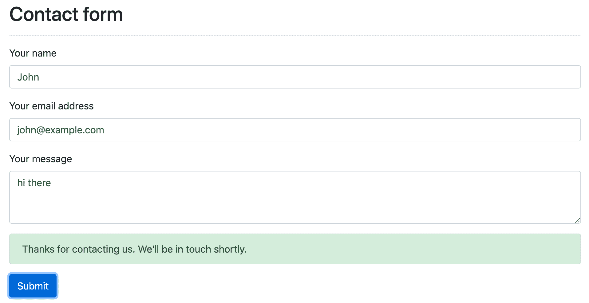

单击按钮将详细信息作为 POST 请求提交给 API 网关，然后 API 网关触发 Lambda 函数，Lambda 函数又通过 SES 向我们发送电子邮件。然而，正如我们在上一节(“用 API gateway 处理 HTTP 请求”)中讨论的，在某些情况下，您可能不会收到电子邮件。

现在我们有了一个联系人表单，它的大部分逻辑都转移到了无服务器上，您就有了这个静态 web 页面，您需要在某个地方托管它。

那么，你需要一个服务器来托管这个页面吗？一点也不！AWS 提供名为 S3(简单存储服务)的存储服务，你可以用它来托管静态网站。这确实需要一个域名，所以如果你有一个，你可以使用[这篇文章](https://medium.com/@kyle.galbraith/how-to-host-a-website-on-s3-without-getting-lost-in-the-sea-e2b82aa6cd38)来托管网页。

## 接下来去哪里？

既然我们已经使用无服务器构建了一个简单的联系人表单，那么如何构建大型应用程序呢？在控制台中点击各种选项是学习 AWS 和无服务器的好方法，但当你试图构建一个有许多移动部件的大东西时，这不是一个选项。

幸运的是，有各种工具可以帮助你在 AWS 上构建和部署无服务器应用，比如[无服务器框架](https://serverless.com/)或 [AWS Chalice](https://chalice.readthedocs.io/en/latest/) 。[免费的 AWS 服务 CloudFormation](https://aws.amazon.com/cloudformation/) 也可以通过用 JSON 或 YAML 编写的模板自动化部署过程来帮助你构建应用，尽管它比其他选项使用起来有点困难。