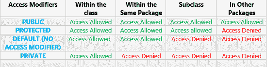

# 解释 Java 中的访问修饰符

> 原文：<https://www.freecodecamp.org/news/java-access-modifiers-explained/>

# 什么是访问修饰符？

你有没有想过定义人们将如何访问你的一些财产？你不会想让任何人穿你的内裤。然而，你的密友和亲戚可以用你的毛衣，也许还可以用你的车。

类似于您如何设置对您的位置的访问级别，Java 也控制访问。你想要为变量、方法和类定义访问级别，这取决于你想要访问它们的其他类。

Java 提供了 4 个级别的访问修饰符。这意味着你可以用 4 种方式修改对变量、方法或类的访问。这 4 种方式是私有、公共、受保护和默认。

这些访问修饰符可以应用于字段、方法和类(类是一个特例，我们将在本文的最后讨论它们)。下面是对每个`Access Modifier`对应的`Access Levels`的快速概述 ¹ :

### 访问修饰符表参考:



## 私有访问修饰符

允许变量或方法只能在创建它的类中被访问。除了创建该变量或方法的类之外，任何其他类都不能访问它。这和你的内脏非常相似。只有所有者才能访问它们。要使变量或方法私有，只需在变量或方法类型前添加 private 关键字。让我们在编码示例中使用 private。如果一家银行希望为其贷款提供 10%的利率，它将确保利率变量(让我们假设`int int_rate;`)保持私有，这样就不会有其他类试图访问和改变它。比如说；

上面的例子创建了一个名为 name 的变量，并确保它只能在创建它的类中被访问。

方法的另一个例子是

```
private void setAge(){
System.out.println("Set Age");
}
```

上面的例子确保了方法 setAge 只能在创建它的类中访问，而不能在其他地方访问。

## 公共访问修饰符

公共访问修饰符与私有访问修饰符正好相反。一个类、方法或变量可以被声明为公共的，这意味着它可以从任何类中访问。公共访问修饰语可以比作一所公立学校，在那里任何人都可以申请入学并被录取。

可以随时从任何其他类访问公共类、方法或变量。

例如，要将一个类声明为 public，您只需要:

```
public class Animal{

}
```

因此，Animal 类可以被任何其他类访问。

```
public int age;
public int getAge(){
}
```

以上是将变量和方法指定为 public 的方法。

## 默认访问修饰符

默认访问修饰符不同于所有其他访问修饰符，因为它没有关键字。要使用默认访问修饰符，只需不使用任何其他访问修饰符，这意味着您正在使用默认访问修饰符。

例如，要使用类的默认访问修饰符，可以使用

```
class Bird{
}
```

这基本上意味着您正在使用默认的访问修饰符。默认的访问修饰符允许同一个包中的其他类访问一个变量、方法或类。包是文件目录中相关类的集合。有关软件包的更多信息，请查看关于软件包的部分。

声明使用默认访问修饰符的任何变量、方法或类都不能被声明它的包之外的任何其他类访问。

```
int age;
void setNewAge(){
}
```

以上是使用变量或方法的默认访问修饰符的一些方法。不要忘记，默认的访问修饰符没有关键字。缺少其他 3 个访问修饰符意味着您使用了默认的访问修饰符。

## 受保护的访问修饰符

受保护的访问修饰符与默认的访问修饰符密切相关。受保护的访问修饰符具有默认访问修饰符的属性，但稍有改进。

只有变量和方法使用受保护的访问修饰符。小的改进是声明变量或方法的类包之外的类可以访问所述变量或方法。但是，只有当它从类继承时，这才是可能的。

可以看到受保护变量或方法的另一个包中的类必须扩展了创建这些变量或方法的类。

注意没有继承的优势，默认访问修饰符与受保护的访问修饰符具有完全相同的访问权限。

使用受保护的访问修饰符的示例如下所示:

```
protected int age;
protected String getName(){
  return "My Name is You";
}
```

## 类的访问修饰符

默认情况下，类只能有两个修饰符:

*   公众的
*   无修改器(默认修改器)

所以这意味着类永远不能被设置为`private`或`protected`？

这是符合逻辑的，为什么要做私教？没有其他类能够使用它。但有时，您可以将一个类嵌入到另一个类中。这些特殊的类`inner classes`可以设置为私有或受保护，这样只有其周围的类才能访问它:

```
public class Car {
    private String brand;
    private Engine engine;
    // ...    
    private class Engine {
        // ...
    }
}
```

在上面的例子中，只有`Car`类可以使用`Engine`类。这在某些情况下很有用。

其他类永远不能设置为`protected`或者`private`，因为没有意义。`protected`访问修饰符用于使事情`package-private`可以被子类访问。java 中没有‘子包’或‘包继承’这样的概念。