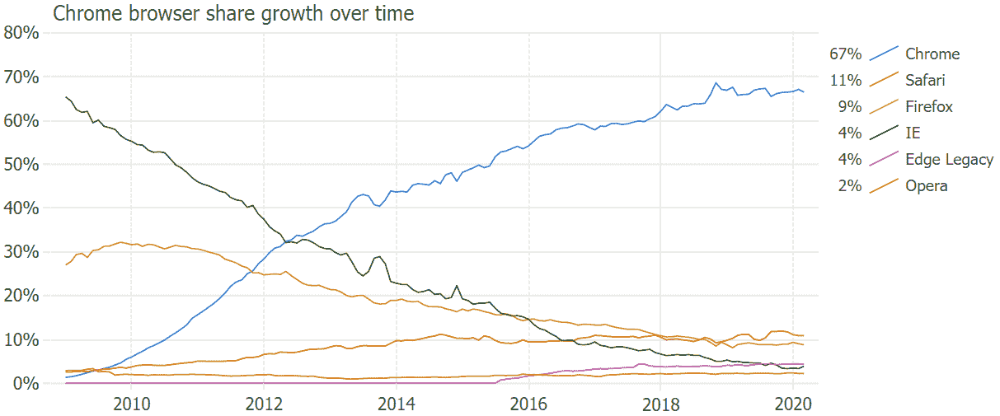
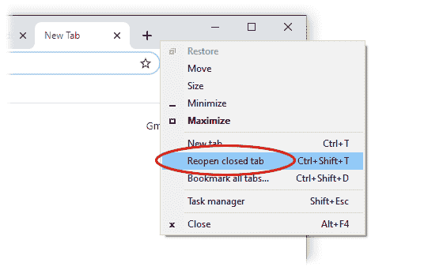
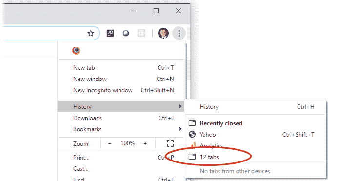
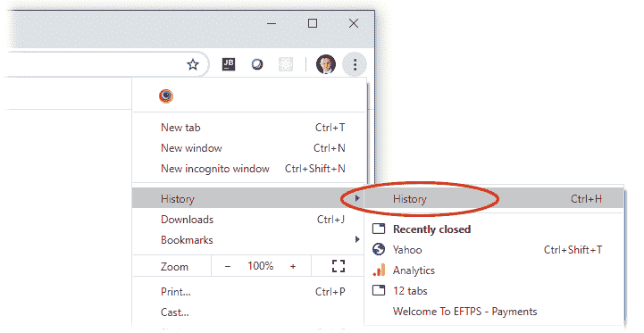

# 如何恢复 Chrome 上的标签页:恢复你最后的会话和页面

> 原文：<https://www.freecodecamp.org/news/how-to-restore-tabs-in-google-chrome-restore-your-last-session-and-pages/>

Chrome 已经成为世界上最受欢迎的网络浏览器，其性能和功能优于竞争对手。但这种受欢迎程度的上升导致许多人因丢失或关闭 chrome 标签而失去重要的网页、研究和会话。

JavaScript line chart created using [JSCharting](https://jscharting.com) with data from statcounter.com
Explore the [interactive chart](https://jscharting.com/examples/chart-types/line/multi-series-trendline/) illustrating Chrome browsers rise to dominance over time.

想象一下，你正在为一个项目做研究，在点击了大量的链接后，找到了完美的信息来源。你不知道你是如何到达那里的，但你现在就在那里，这才是最重要的。？

你正在处理笔记、电子邮件、切换标签，一切都很顺利……直到灾难降临:你不小心点错了像素，你需要的标签毫无征兆地消失了。？

或者，不是你自己的错，Chrome 无缘无故地决定让你崩溃。

你不用担心。你不是第一个遇到这种事的人，也不会是最后一个。幸运的是，谷歌 Chrome 会记住你的网页浏览历史，无论哪里出错，你都应该能够完全恢复。

如果你遇到过这种情况，这里有几种方法可以让你轻松地恢复关闭的标签页。

## 事故的关闭标签

如果你只是点击了错误的像素，并关闭了一个标签，你不是故意的，这很容易恢复。您只需右键单击选项卡栏部分的空白区域，然后选择重新打开已关闭的选项卡。

您也可以使用键盘快捷键——按 Ctrl+Shift+T(或者在 Mac 上按 Command+Shift+T ),您关闭的最后一个标签页将在新的标签页中重新打开。

## Chrome 或电脑崩溃

电脑崩溃从来都不是一次愉快的经历，但你不必担心 Chrome 会丢失当前会话。

当你丢失所有打开的标签页时，谷歌 Chrome 可以优雅地处理崩溃。通常当你重启 Chrome 时，它会显示一个“恢复标签”按钮。此选项将完全恢复您上次的浏览会话。点击它，你就回到你离开的地方。

如果你没有得到这个选项，没关系。单击 Chrome 菜单，将光标悬停在历史菜单项上。您应该会看到一个选项，显示“# tabs”，例如“12 个 tabs”。您可以单击该选项来恢复之前的会话。

Ctrl+Shift+T 命令也可以重新打开崩溃或关闭的 Chrome 窗口。您可以一直按这个快捷键，直到它用完所有要恢复的标签和关闭的窗口。

## 恢复最近关闭的选项卡

类似地，你可以通过再次点击 Chrome 菜单并将光标悬停在 history 菜单项上来恢复最近关闭的标签。您最近访问的页面的简短摘要也将在那里列出。

如果您要恢复的页面列在那里，您可以单击恢复它。如果不存在，您可以尝试下一种方法。

## 你前几天关闭的选项卡

如果您没有看到要恢复的网页，请单击“历史记录”子菜单项(chrome 菜单>历史记录>历史记录)。或者可以使用快捷键 Ctrl+H (Mac: Command+Y)。

这将显示您访问过的页面的完整历史。你应该可以在那里找到你想要的页面。如果你已经关闭或者丢失了你的标签，你甚至可以搜索你的网页历史来使它变得容易。

**小心** -如果你在匿名浏览(隐私模式)时丢失了标签，Chrome 不会记住它们。

## 小费

单击地址栏右侧的⭐️图标，将您经常访问的网页加入书签。这将在 Chrome 浏览器中添加一个按钮——点击该按钮会将当前标签重定向到该网页。