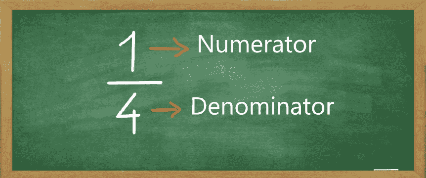
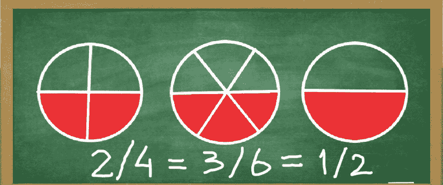
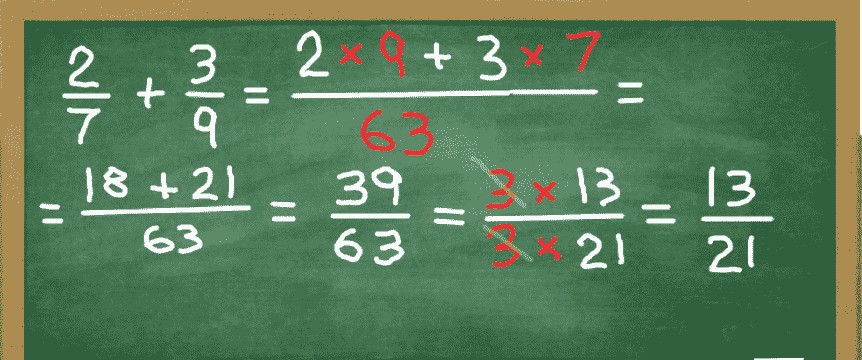
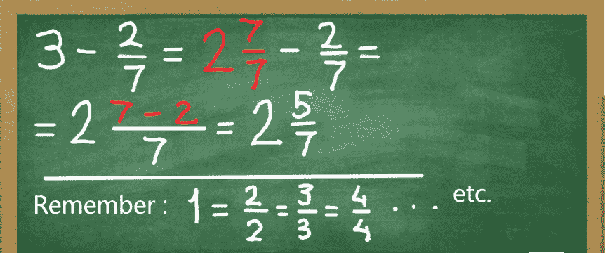
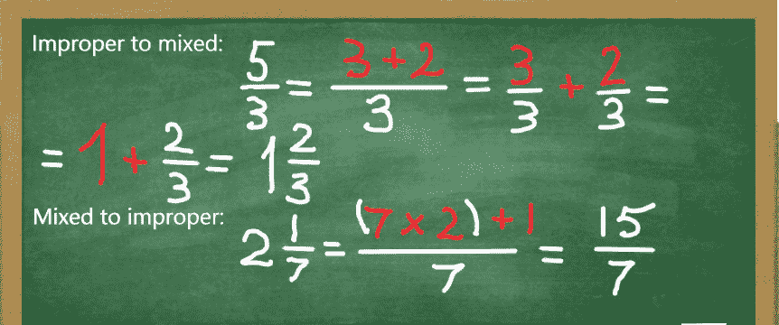
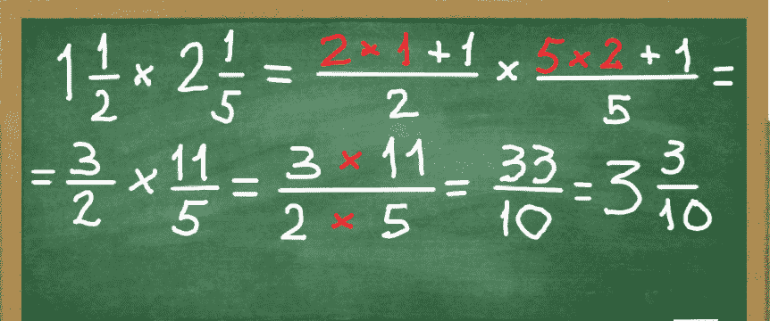
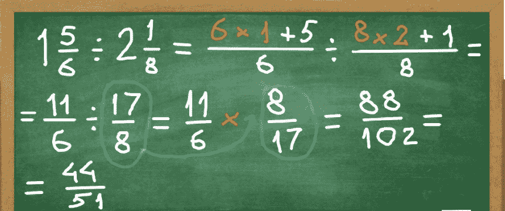

# 分数数学:初学者如何做分数

> 原文：<https://www.freecodecamp.org/news/fraction-math-how-to-do-fractions-for-beginners/>

我们每天都和分数打交道。但是分数到底是什么呢？我们如何更好地了解他们？在本教程中，我们将一起探索基础和实践，所以分数可以成为日常生活中有价值的帮手。

## 第一部分。分数作为份额

让我们想象一个分成 4 等份的馅饼。一部分是红色阴影。

image of a circle with one quarter shaded red

**四个**等份中的一个红色部分表示整体的 **1/4** 被遮挡。如果我们把一个整体的相等部分看作股份，那么这里的一份馅饼就是红色阴影的。

drawing of a fraction 1/4\. 1 is a Numerator, 4 is a Denominator

在线上的数字 1 **称为**分子**。它显示有多少股票是阴影部分。在**线下面的数字 4 **叫做**分母**。它显示了一个整体被分成多少个**相等的**股。让我们看另一个例子。**

image of a circle with three sixths shaded red

上面的新馅饼分成 **6** 等份。因此，分母等于 6。在这 6 个相等的份额中**有 3 个**是红色阴影。因此，分子将等于 3。换句话说，饼图的 **3/6** 是阴影的。

现在让我们来测试一下到目前为止我们学到了什么。如你所知，一整天有 24 个小时。如果你花了 6 个小时学习，你一天花了多少时间学习？

### 6 小时是一天的几分之一？

选择 1 个答案

* * *

* * *

* * *

* * *

* * *

一天被分成 **24** 等份称为小时。所以分母是 24。把花在学习上的 6 个小时想象成 T2 的那份馅饼。这将使分子等于 6。我们正在寻找的分数是 **6/24** 。

## 第二部分。简化分数

还记得上一个例子中的馅饼吗？它的三分之二是红色的。我们再加两个新馅饼，一起看看。

image of 3 circles with half of each painted red

第一个馅饼被分成 4 份，两份被涂成红色。但正如我们所见，这只是一半。第二个馅饼被分成 6 份，三份是红色阴影。又是半个馅饼。最后，第三个馅饼被分成两半，一半被涂成红色。

由于两种情况下都是**半个**带阴影的饼图，我们可以得出分数相等的结论: **2/4 = 3/6 = 1/2** 。

image of 3 circles with half of each painted red. 2/4 = 3/6 = 1/2

最后，通过将分子和分母都乘以或除以相同的**数，分数将保持不变(除了被零除的情况，这超出了本文的范围，在此不做考虑)。**

这条规则有助于简化分数，并使它们更容易使用。举个例子，让我们考虑 4/12。分子和分母除以 4 得到(4:**4**)/(12:**4**)= 1/3。考验你知识的时候到了。

### 什么分数和 2/5 一样？

选择 1 个答案

* * *

* * *

* * *

* * *

* * *

## 第三部分。比较分数

当我们看到一个馅饼的两片时，我们通常可以分辨出哪一片更大。与分数类似，有一个简单的方法来比较它们。

假设我们需要比较 1/3 和 2/7。因为它们有不同的分母，所以它们有不同数量的部分。所以**的第一步**必须是找到**的共同点**。我们通过找到一个**共同点**来做到这一点。

寻找两个或多个分数的公分母的方法之一是将分母相乘。 **3** 次 **7** = **21** 。

既然我们找到了公分母，我们需要用公分母替换每个分数自己的分母。

bringing 1/3 and 2/7 to the common denominator

第一个分数是 1/3，所以我们用 21 除以 3，得到的 **7** 乘以那个分数的分子。由于分子等于 1，我们得到 **7 乘以 1 = 7** 。

第二个分数是 2/7，所以 21 除以 7 等于 3。将这个分数分子乘以 3，得到 **3 乘以 2 = 6** 。

既然分数有相同的分母，我们终于可以比较它们了。7 股大于 6 股，因此 7/21 大于 6/21。

表示我们结果的数学符号是 **>** 符号。 **7/21 > 6/21** 。读作“**大于**”表示**小于**的符号是这样的: **<** 。我们可以这样重写我们的结果: **6/21 < 7/21** 。

### 比较 3/4 和 5/7

选择 1 个答案

* * *

* * *

* * *

* * *

* * *

## 第四部分。添加分数

为了将分数相加，我们再次需要找到一个公分母。让我们看看下面的例子。

我们需要添加 **2/7** 和 **3/9** 。公分母是 **7 乘以 9 = 63** 。下一步是用共同的分母代替每个分数自己的分母。

对于第一个分数， **63 除以 7 = 9** 和 **9 乘以 2 = 18** 。结果是 **18/63** 。第二个， **63 除以 9 = 7** 和 **7 乘以 3 = 21** 。结果是 **21/63** 。

接下来，我们添加分子。 **18 加 21 = 39，**剩下的是 **39/63** 的总和。

作为一个有用的习惯，总是检查得出的分数是否可以进一步简化。

我们知道 39 能被 3 整除。63 也能被 3 整除。因为分子和分母都被同一个数除，所以分数保持不变。 **39 除以 3 = 13** 和 **63 除以 3 = 21** 。我们最终的结果是 **13/21** 。

Fraction addition calculation 2/7 + 3/9 = 39/63 = 13/21

如果我们需要将混合数字相加呢？要将混合数字相加，我们首先将整数相加，然后将分数相加。

比如要把 **1 个半**加到 **2 个半**上，加 **1 和 2 = 3** ，再加 **1/2 和 1/2 = 1** 。最后，**3 加 1 = 4** 。让我们进行一些练习，并记住如何简化结果。

### 4/6 + 2/9 的结果是什么？

选择 1 个答案

* * *

* * *

* * *

* * *

* * *

## 第五部分。减去分数

我们从两个简单的分数开始。从 3/5 中减去 1/3。就像加法一样，我们需要找到一个共同点。因此，如果我们乘以分母，那么**等于 3 乘以 5 = 15** 。

接下来，我们用公共分母代替旧分母。

image of 3/5 - 1/3 = 4/15

然后我们需要找到我们的分子。对于第一个分数， **15 除以 5 = 3** 和 **3 乘以 3 = 9** 。结果是 **9/15** 。对于第二个， **15 除以 3 = 5** 和 **5 乘以 1 = 5** 。结果是 **5/15** 。

最后一步是减去调整后的分子数: **9 减 5 = 4。**得到的分数等于 **4/15** 。

现在让我们来看看当我们需要从一个整数中减去一个分数时的情况。让我们从 **1 - 2/7** 开始。

你记得在前面的章节中，一个整数就像一个完全被阴影笼罩的饼图。因此，如果一个饼图被分成 **3 个**部分，**所有 3 个**部分都被阴影化。如果分成 **7** 个部分，那么 **7** 个部分将被阴影化。所以， **1 = 3/3 = 7/7** 等等。

由于我们需要减去 **2/7** ，我们将把 **1 整**变成 **7/7** 来简化我们的任务。 **7/7 减去 2/7 = 5/7** 。如果整数不是 **1** ，我们把它写成一个混合数，并按照上一个例子中的步骤。

所以我们用 3 减去 **2/7。**

image of 3 - 2/7 = 19/7

通常，作为计算的结果，我们可能会得到一个分子大于或等于分母的分数。这样的分数叫做不适当分数。比如 **5/3** (五分之一) **7/2** (七分之一)等等。它们可以转换成混合数，反之亦然。

Converting improper fractions to mixed numbers and vice versa

到目前为止涵盖的所有规则也适用于不适当的分数。

### 9/11 - 3/4 的结果是什么？

选择 1 个答案

* * *

* * *

* * *

* * *

* * *

## 第六部分。乘法分数

假设我们需要将两个分数相乘， **2/5 乘以 3/7** 。乘积的**分子**将是这些分数的分子的**乘积: **2 乘以 3 = 6。**乘积的**分母**将是这些分数的分母**的**乘积: **5 乘以 7 = 35** 。于是， **2/5 乘以 3/7 = 6/35** 。**

如果我们需要将一个**分数**乘以一个**整数**，那么乘积的**分子**将是该分数的分子与该整数的**乘积。乘积的**分母**将保持与分数**的**分母相同。**

比如 **3/10 乘以 5 = 15/10** 。为了简化，我们将分子和分母除以 **5** ，得到 **3/2。**

最后，如果我们需要将混合数相乘，首先我们将它们转换成不适当的分数，然后像上面那样将它们相乘。下面的示例显示了这些步骤。

image of 3/2 times 11/5 equals 33/10

## 第七部分。分割分数

要分割分数，翻转除数，使其分子成为新的**分母**，分母成为新的**分子**。然后就像我们之前做的那样把分数相乘。

例如，将 3/7 除以 2/5。翻转之后， **2/5** 变成了 **5/2** ，我们最终乘以 **3/7 乘以 5/2 = 15/14** 。

为了将分数除以一个整数，我们将这个数反过来，它就变成了 T2 1 除以那个数。

例如， **2 变成 1/2** ， **9 变成 1/9** 等等。接下来，我们如上相乘。你可能已经猜到了，混合数的除法也是同样的方法。让我们看看下面的例子。

dividing 11/6 by 17/8 = 44/51

让我们来测试你的知识。

### 11/3 除以 11/7 的结果是什么？

选择 1 个答案

* * *

* * *

* * *

* * *

* * *

## 第八部分。一些实际例子

为了找到某个数的分数，我们需要用给定的**数**乘以**分数****。**

想象一下，你学校的课本有 200 页。如果你读了教材的 3/5，你读了多少页？我们得到了等于 200 的数。为了找到 200 的 3/5，我们将**乘以 200 乘以 3/5** ，得到 **120** 页。

自己解决下一个问题。我的生日蛋糕有 12 块。几个朋友来了，享用了 2/3 的蛋糕。我的朋友有多少件？

### 我的朋友有多少件？

选择 1 个答案

* * *

* * *

* * *

* * *

* * *

最后，还有一个案例我想探讨一下。如果我们知道某个数的给定分数等于多少，并且我们需要找到那个数，那该怎么办？

例如，我们知道我的朋友吃了 **8** 块生日蛋糕，那是**整块蛋糕**的 **2/3** 。蛋糕一开始有几块？为了找到那个**整数**，我们需要用**除以 8 除以 2/3** ，也就是 **12** 。

自己解决下一个问题。一辆赛车在赛道上开了 900 米，是全程的 3/5。跑道有多长？

### 跑道有多长？

选择 1 个答案

* * *

* * *

* * *

* * *

* * *