# 帮助您构建开源 JavaScript 项目的最佳工具

> 原文：<https://www.freecodecamp.org/news/effective-tools-for-your-open-source-javascript-project/>

我最近发布了一个关于 npm 的包:用 JavaScript 实现的数据结构和算法库。

该项目的目的是帮助其他人从 JavaScript 的角度学习和理解数据结构和算法。

该项目不仅仅包含代码片段和附带的解释，而是旨在为渴望学习的人提供完整的工作代码、良好的测试案例和充满示例的操场。

如果你感兴趣，这个项目可以在 npm [这里](https://www.npmjs.com/package/js-data-structures-and-algorithms)找到。

但是，与其谈论项目本身，我今天想写的是我在创建项目时学到和使用的所有优秀工具。

在过去的六年里，我做了大量的附带项目和演示，但是它们中的每一个都是非常明显的“宠物项目”。他们根本不具备让自己看起来专业或适合生产的素质。

我着手创建的是一个值得尊敬的开源包。为此，我决定我的项目需要适当的文档、工具、林挺、持续集成和单元测试。

下面是我用过的一些工具。每一个都有独特的用途。我已经链接了每个包的文档，所以你也可以在你自己的项目中使用这些工具。

**注意**:本文假设您已经熟悉了创建一个简单的 JavaScript 包并在 npm 上发布它的过程。

如果没有，npm 团队有一些[很棒的入门文档](https://docs.npmjs.com/creating-and-publishing-unscoped-public-packages)，可以带你完成项目的初始化和发布步骤。

所以让我们开始吧。

# 较美丽

漂亮是一个固执己见的代码格式化程序，自动为你格式化你的代码。与其简单地使用 ESLint 来执行你的团队已经同意的任何格式标准，不如让 Prettier 来为你处理格式问题。

不用再担心修复你的缩进和行宽！我专门将它用于我的 JavaScript，但是它可以处理许多不同的语言。

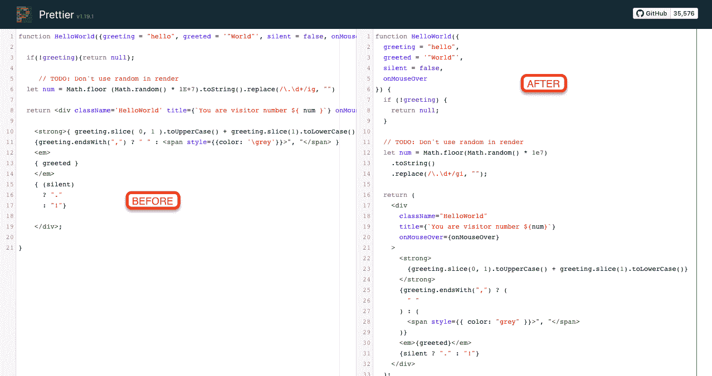

Sample JavaScript before and after running Prettier

你可以在这里找到更漂亮的医生:[https://github.com/prettier/prettier](https://github.com/prettier/prettier)

# stylelint

stylelint 为你自动格式化你的 CSS。类似于 Prettier，这个工具帮助你保持 CSS 的整洁，同时为你处理繁重的工作。

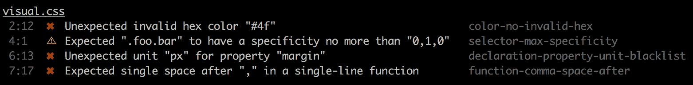

Sample output from running stylelint

你可以在这里查看 stylelint 文档:[https://github.com/stylelint/stylelint](https://github.com/stylelint/stylelint)

# 埃斯林特

ESLint 处理我所有的其他 JavaScript 林挺，用于捕捉语法错误和实施最佳实践。

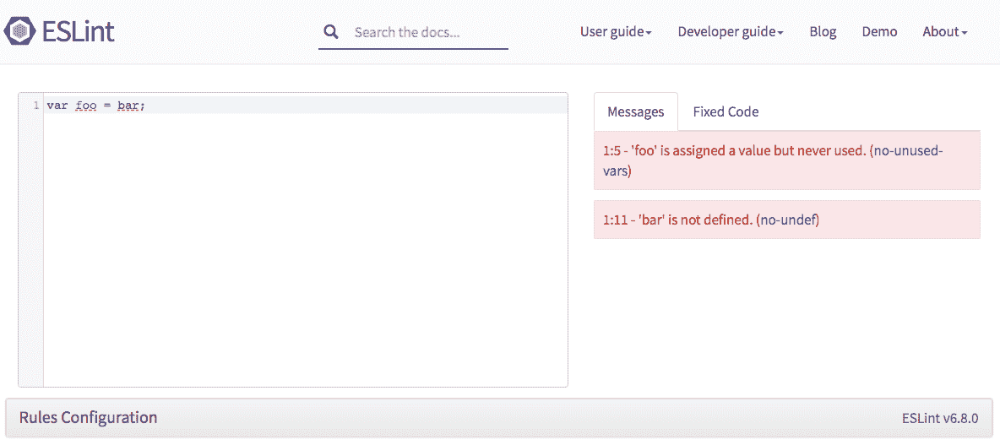

Sample output from linting with ESLint in their playground environment

你可以在这里查看 ESLint 文档:[https://eslint.org/](https://eslint.org/)

# 承诺

Commitizen 是一个 CLI 工具，引导您编写提交消息。它根据您的输入为您生成提交消息，并确保生成的提交消息遵循传统的提交标准。

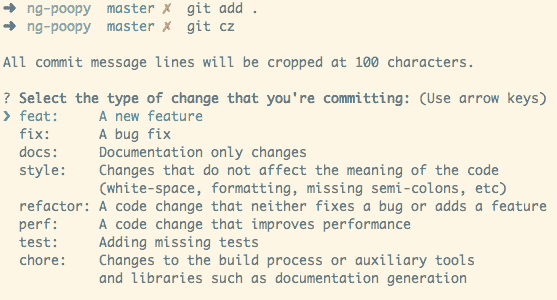

Commitizen command line interface when creating a new commit

你可以在这里查看委托文件:[https://github.com/commitizen/cz-cli](https://github.com/commitizen/cz-cli)

# 共产主义者

commitlint 验证您的提交消息是否遵循传统的提交标准。只要使用 Commitizen 创建提交消息，就不会遇到任何问题。

使用 commitlint 的真正好处是捕捉开发人员自己编写的不符合您的格式标准的提交。

commitlint demo to show possible error messages

你可以在这里查看承诺文件:[https://github.com/conventional-changelog/commitlint](https://github.com/conventional-changelog/commitlint)

# 皮棉阶段

lint-staged 针对您尝试提交的代码运行 linters。在这里，您可以验证您的代码是否通过了由 Prettier、stylelint 和 ESLint 执行的标准。

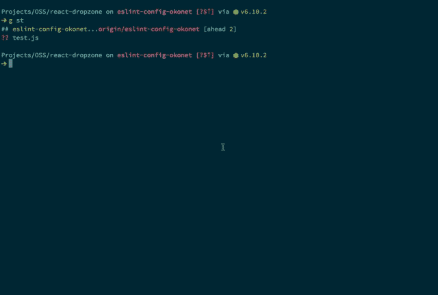

lint-staged example that runs ESLint on checked-in code

你可以在这里查看 lint 暂存文件:[https://github.com/okonet/lint-staged](https://github.com/okonet/lint-staged)

# 强壮的

Husky 使得运行 Git 钩子变得很容易。

前面提到的所有工具都可以通过 Husky 在 Git 挂钩上运行，比如`pre-commit`或`commit-msg`，所以这就是神奇的地方。

例如，我在`pre-commit`挂钩期间运行 lint-staged 和我的单元测试，在`commit-msg`挂钩期间运行 commitlint。这意味着当我试图签入我的代码时，Husky 会进行所有的验证，以确保我遵守我在项目中实施的所有规则。

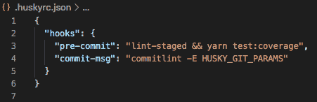

Sample Husky configuration that runs on the pre-commit and commit-msg Git hooks

你可以在这里查看哈士奇的文件:[https://github.com/typicode/husky](https://github.com/typicode/husky)

# 到达

Rollup 是 JavaScript 的一个模块捆绑器。它把你所有的源代码打包成你真正想作为你的包的一部分分发的文件。

传统观点似乎是，如果你正在构建一个 web 应用程序，你应该使用 webpack。如果你正在构建一个库，你应该使用 Rollup。

在我的例子中，我正在构建一个数据结构和算法库，所以我选择使用 Rollup。一个好处似乎是 Rollup 生成的输出比 webpack 输出的要小得多。

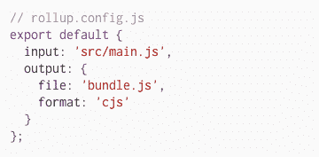

A very minimal Rollup config that creates an output bundle in the CommonJS format

你可以在这里查看汇总文件:[https://rollupjs.org/guide/en/](https://rollupjs.org/guide/en/)

# 标准版本

标准版本有助于自动化您的版本控制和变更日志生成。

之前，我提到过像 Commitizen 和 commitlint 这样的工具，用于根据传统的提交标准格式化您的提交。你可能会问，为什么这有帮助？

答案是，至少部分是，通过使用一致的提交消息格式，您可以使用能够理解您的提交正在进行何种更改的工具。

比如，你在修复 bug 吗？添加新功能？使用你的图书馆的人应该知道的突破性变化？标准版能够理解您的提交消息，然后为您生成一个变更日志。

它还能够根据语义版本标准(主要版本、次要版本、补丁)智能地修改您的包的版本。

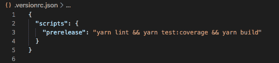

Sample Standard Version pre-release script that runs before version bumps

你可以在这里查看标准版本的文档:[https://github.com/conventional-changelog/standard-version](https://github.com/conventional-changelog/standard-version)

# 特拉维斯·CI

Travis CI 是一个持续集成(CI)工具，可以与 GitHub 集成，而我的代码恰好托管在 GitHub 中。

CI 工具很重要，因为它们允许您在将提交合并到您的主分支之前再次测试它们。您可以争论使用 Travis CI 和像 Husky 这样的工具复制功能，但重要的是要记住，即使是 Husky 也可以通过向您的 commit 命令传递一个`--no-verify`标志来绕过。

通过 GitHub，您可以指定 Travis CI 作业必须通过才能合并代码，这样就增加了一层保护，并验证只有通过的代码才能进入您的 repo。

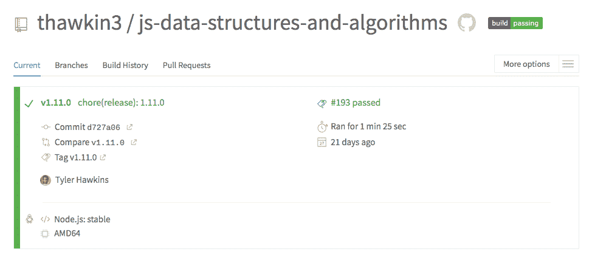

Travis CI output from a passing build

你可以在这里查看特拉维斯的 CI 文档:[https://docs.travis-ci.com/](https://docs.travis-ci.com/)

# Codecov

Codecov 是另一个查看项目代码覆盖率的 CI 工具。

我正在使用 Jest 编写 JavaScript 单元测试。我的 Travis CI 工作的一部分是运行我的测试套件，并确保它们全部通过。它还通过管道将代码覆盖率输出到 Codecov，然后 code cov 可以验证我的代码覆盖率是下降还是保持在较高水平。它也可以和 GitHub 徽章一起使用，我们接下来会谈到。

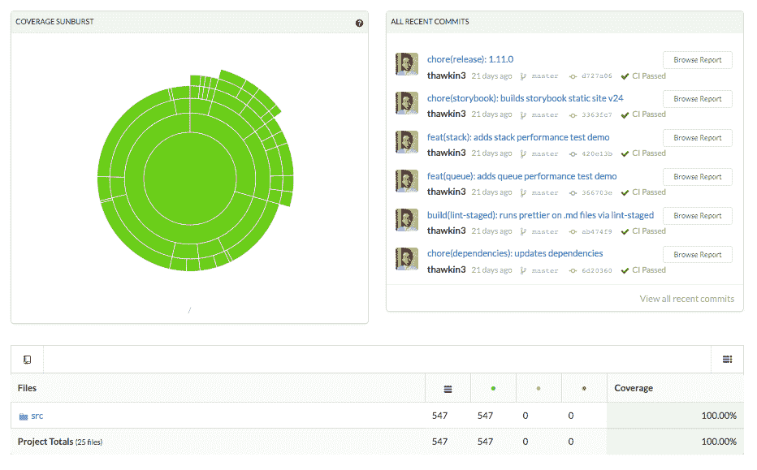

Codecov dashboard (look at that beautiful 100% code coverage!)

你可以在这里查看 Codecov 文档:[https://docs.codecov.io/docs](https://docs.codecov.io/docs)

# 徽章

你是否曾经在 GitHub 中查看过一个项目，并在 README 的顶部看到过小徽章？像构建是否通过，代码覆盖率是多少，npm 包的最新版本是什么，这些都可以使用徽章来显示。

它们添加起来相对简单，但我认为它们给任何项目都增添了一抹亮色。Shields.io 是一个很好的资源，可以找到许多不同的徽章，可以添加到您的项目中，它可以帮助您生成包含在自述文件中的降价。

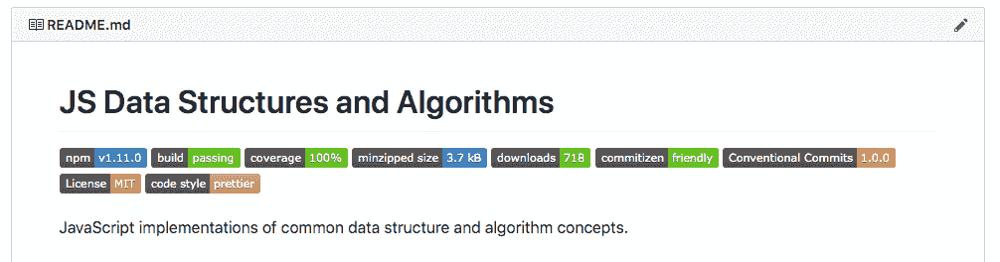

GitHub badges for my js-data-structures-and-algorithms npm package

你可以在这里查看 Shields.io 文档:[https://shields.io/](https://shields.io/)

# 证明文件

一点点文档就能帮上大忙。在我的项目中，我添加了自述文件、变更日志、投稿指南、行为准则和许可证。

这些文档有助于人们了解你的项目是什么，如何使用它，每个版本都做了哪些更改，如果他们想参与进来，如何做出贡献，他们应该如何与社区的其他成员互动，以及法律条款是什么。

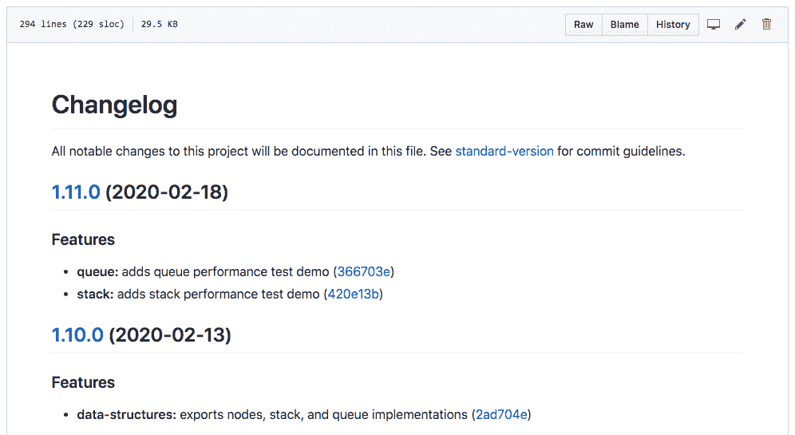

The CHANGELOG for my js-data-structures-and-algorithms npm package

您可以在这里查看我的项目的文档:[https://github . com/thaw kin 3/js-data-structures-and-algorithms](https://github.com/thawkin3/js-data-structures-and-algorithms)

# GitHub 模板

你知道你可以在 GitHub 中为错误报告、特性请求和拉取请求创建模板吗？创建这些模板使得事情变得非常清楚，例如，当提交一个 bug 时，应该期望某人提供什么信息。

GitHub templates for bug reports and feature requests

你可以在这里查看 GitHub 模板文档:[https://help . GitHub . com/en/GitHub/building-a-strong-community/about-issue-and-pull-request-templates](https://help.github.com/en/github/building-a-strong-community/about-issue-and-pull-request-templates)

# 关闭

就是这样。当我第一次向一些朋友展示这个项目时，他们中的一个评论道，“哦，我的构建工具汤！”他可能是对的。这是很多。但是我坚信添加上面所有的工具是值得的。它有助于许多事情的自动化，并有助于保持您的代码库整洁有序。

我从构建这个项目中最大的收获是，设置上面的所有工具并不像看起来那么令人生畏。这些工具都有很好的文档和有用的入门指南。这真的没有那么糟糕，您应该对在您的项目中采用这些工具中的一些(如果不是全部)感到自信。

编码快乐！