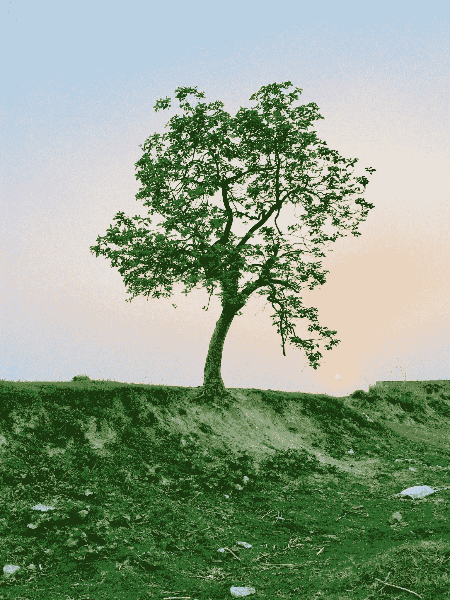
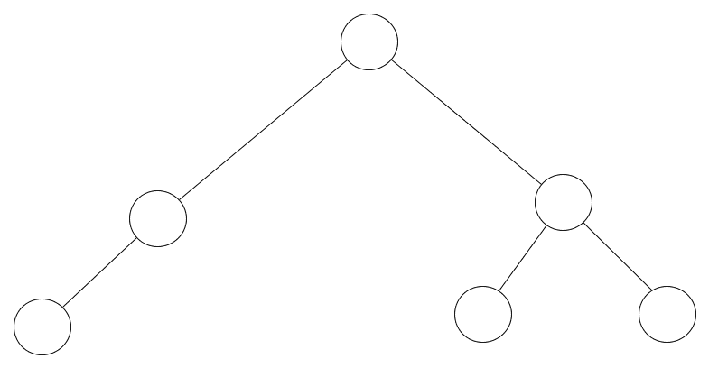
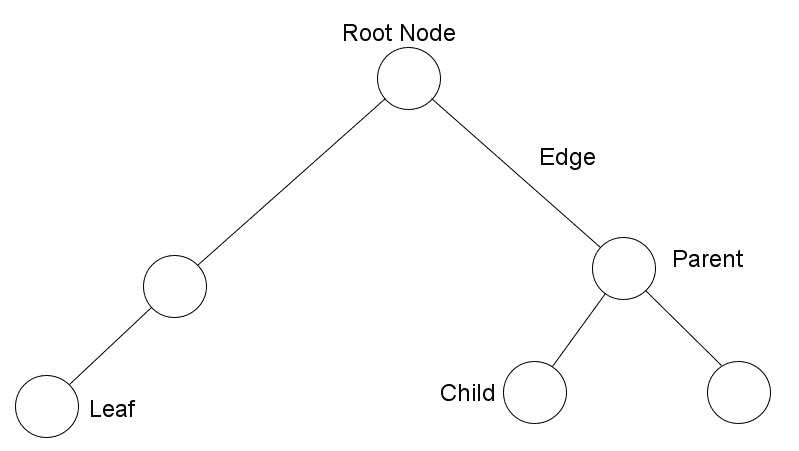
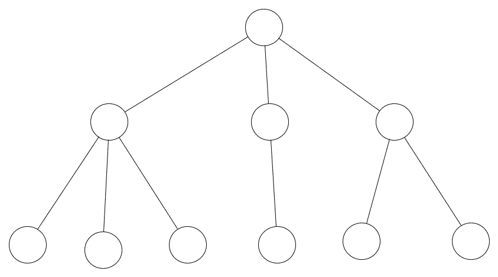
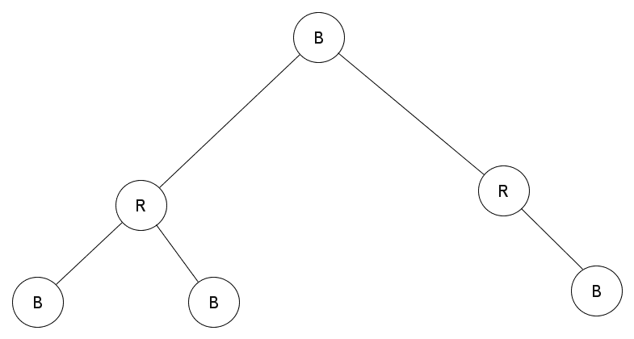

# 如何以无代码的方式学习树形数据结构

> 原文：<https://www.freecodecamp.org/news/the-codeless-guide-to-tree-data-structures/>

树数据结构可以形成所有编程中最有用和最复杂的数据结构。事实上这棵树是如此的强大，以至于我可以大胆的宣称:

一旦你理解了树，你就能轻松理解许多其他的数据结构和算法。

有一个警告。有这么多种类的树，可能不知道从哪里开始！有 B 树，红黑树，二叉树，AVL 树和许多其他的树。有丰富的选择，每一个似乎都值得学习。

这就出现了一个问题。作为一个学习树的人，你可能会问自己，我应该首先学习哪种树数据结构？哪棵树对我来说最重要？有这么多，我从哪里开始？

了解树木就像了解我们当今世界的无数奇迹。我们有很多选择，事实上我们甚至有太多的选择。

心理学家称之为**过度选择**或**选择超载**，即当面对许多选择时，人们很难决定做什么。我称之为初学者最糟糕的噩梦。

然而，没有必要恐慌。从我使用树数据结构的知识来看，就像生活中的大多数事情一样，Pareto 原则(我们称之为 80/20 规则)适用。

这意味着，作为一名程序员，80%的情况下你需要使用树，而你将尝试学习的树的类型大约有 20%涵盖了这些情况。

因此，我们将只关注这 20%，我认为这是你需要了解的最重要的树。不要误解我的意思，我不是说不要学习其他类型的树。我的意思是先学习这些，然后再关注其他的，这样才能真正获得优势。

即使当您确定想要学习哪种树数据结构时，您还会面临另一个问题。

有很多资源可以教你关于树的知识，但是它们都提供了一些特定语言的代码，比如 JavaScript、Java、Python 或其他语言。

在这篇文章中，我打破现状，教你基本的树数据结构，而且不需要你写一行代码。

和我一起进入树的世界，不管你使用的是哪种编程语言，你都可以学到你需要知道的关于树数据结构的所有基础知识。

## 到达树根

让我们进入讨论的根本(双关语)。我解释树的方式是把它和我们都熟悉的生物树联系起来。如果你不熟悉，我们现在就来看一个:

A Biological Tree

看看我们的树，是不是很漂亮！？我们看到树是一种巨大的植物，有树干、树枝和树叶。还有隐藏在地下的根，它们也是生物体的一部分。

计算机科学中的一棵树没什么不同。让我们看看这里的一个:

A Computer Science Tree

计算机科学树和普通的树非常相似——有点像颠倒的生物树，不是吗？它不仅看起来相似，而且还有一些部分的命名也与我们的“有形之树”相似。

在我们了解树的种类之前，有一些关于树的事实你必须知道。

### 以下是你需要了解的关于树木的 5 个事实:

1.树中的每个圆称为一个节点，每条线称为一条边。

2.根节点是树的一部分，所有其他部分都建立在其上。

3.存在在根的方向上连接到其他节点的父节点，以及在远离根的方向上连接的子节点。

4.树的最后一个节点叫做叶子

5.导航树的过程称为遍历。

如果你喜欢直观地看事物，这里有一个我们之前看到的识别零件的树的图表:

Our Labelled Tree

你还应该知道，当一棵树是一个节点的孩子时，它被称为子树。请看上图，标有“Parent”的节点和它的两个子节点可以归为一个子树。

很好，现在你对基本树有了一个概念。因此，让我们深入一些你会遇到的最有用的树的类型。

## 通用树

我们需要了解的第一类树是普通树。一般的树就是我们所说的超集。这是因为所有其他类型的树都是从通用树派生出来的。

树在存储数据的方式上是分层的。简单的数据结构可能以线性方式存储数据(比如数组)，而树是非线性的。

通用树是分层树结构的体现，因为它对每个节点可以有多少个子节点没有限制，并且对树的层次结构没有约束。

Example of A General Tree

## 二叉树

谈论树而不谈论二叉树是不可能的(好吧，不是完全不可能，但你知道我的意思)。

简单地说，二叉树是一种有限制的树。在二叉树中，每个父节点只能链接到树中的两个子节点。

有一种二叉树类型最能说明这一点:二叉查找树。你看到的树不仅仅是用线连接起来的空圆圈。树中的每个节点都有一个与之关联的值，整个树是一个键值结构。

二分搜索法树保持他们的钥匙排序。他们是这样排序的:所有的节点都比左子树中的节点大，但比右子树中的节点小。迷茫？也许一张照片会有帮助:

A Binary Search Tree

仔细观察这棵树，你会发现一个小秘密。在二叉树中，最小的节点位于从根节点开始的最左边的子树。想猜猜我们能在哪里找到最大的节点吗？

## 红黑树

让我们看看二叉查找树的一个变体，人们倾向于把它过于复杂化。我说的是红黑树。

在很多情况下，树中的数据可以被插入和删除。因此二叉查找树的变体被创造出来，使得这种不断的插入和删除更加有效。

红黑树是二叉查找树的一种配置，它使得插入和删除过程更加有效。

树通过为节点添加一个属性来实现这一点。添加到节点上的这个属性是 color，这个颜色可以解释为红色或黑色。因此得名红黑树。

让我们看看红黑树是如何排列的:

A Red-Black Tree

在红黑树中，根节点通常是黑色的，每个红色节点都有黑色的子节点。

如果你做到了这一步，那么恭喜你！您已经了解了足够多的知识，可以进入树数据结构的世界了。

## 树用在哪里？

在这一点上，你可能想知道树是用来做什么的。这个问题问得好！树木用于发展的许多方面，包括:

1.  数据库
2.  编译程序
3.  建立工作关系网
4.  很
5.  机器学习算法

树木有无数的用途，唯一的限制是设计师的想象力。

## 包扎

在这篇文章中，我们开始了进入树的世界的旅程。尽管我们涉及了一些领域，但我们仅仅是触及了这个庞大而复杂的数据结构的表面。

我们通过介绍什么是树和研究树的结构来激起我们对树数据结构的兴趣。然后我们讨论了三种常见的树，包括普通树、二叉树和红黑树。最后，我们看了一些可以使用树木的地方。

在这篇文章结束时，你应该有一个坚实的基础去探索树木的世界！

## 接下来去哪里？

想学习树和其他数据结构而不写一行代码吗？拿起《无代码数据结构和算法》这本书，在这里你不用写一行代码就能学到所有你需要知道的关于数据结构和算法的知识！

我们不仅会大大扩展我们所学的内容，还会涵盖一些有趣的话题，比如树平衡、AVL 树、B 树、堆以及数据结构和算法领域的大量话题！

你可以在这里阅读这本书:

[Codeless Data Structures and Algorithms - Learn DSA Without Writing a Single Line of Code | Armstrong Subero | ApressThis book brings you a new perspective on algorithms and data structures, completely code free. Learn about data structure algorithms (DSAs) without ever having to open your code editor, use a compiler, or look at an integrated development environment (IDE)....Armstrong SuberoSearch Menu Cart V Your cart is currently empty. Login AccountBookshelf Login Apress Access](https://www.apress.com/gp/book/9781484257241)