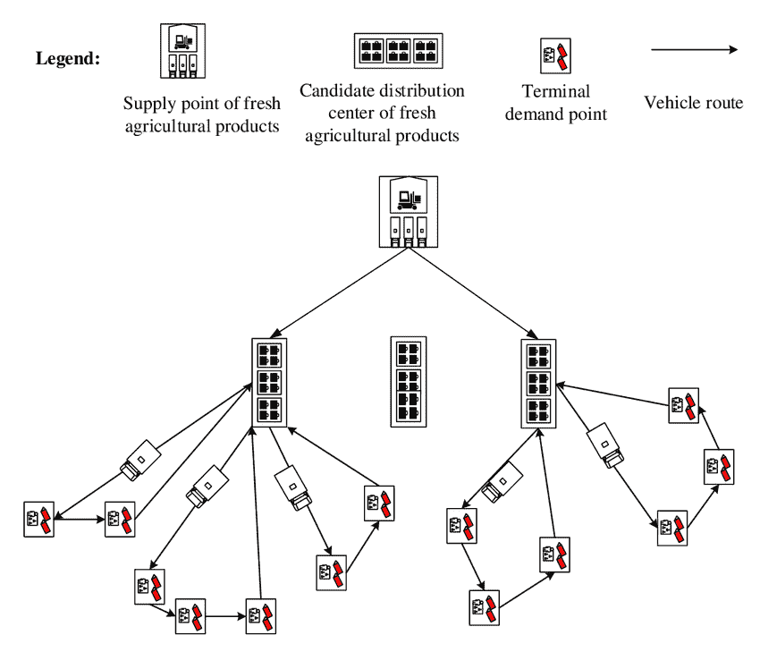
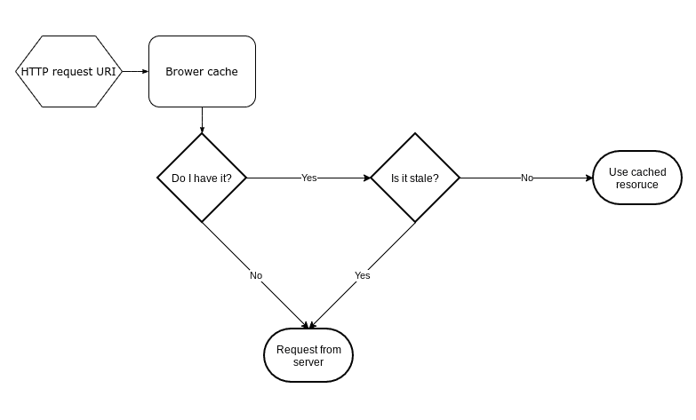
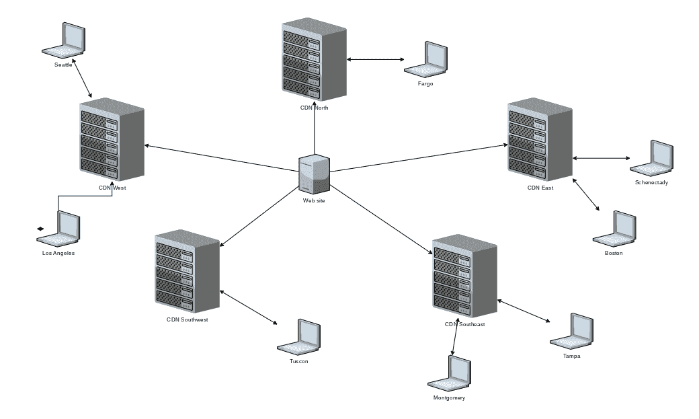

# 什么是缓存数据？清除缓存是什么意思，有什么作用？

> 原文：<https://www.freecodecamp.org/news/what-is-cached-data/>

# 首先，什么是缓存？

一般来说，[缓存](https://www.merriam-webster.com/dictionary/cache)(读作“cash”)是一种存储库。您可以将存储库视为存储仓库。在军队中，这将是持有武器，食物和其他物资需要进行一项任务。



A military distribution network

在计算机科学中，这些“供给”被称为资源，其中资源是脚本、代码和文档内容。后者有时更具体地称为“资产”，如文本、静态数据、媒体和超链接，但这里我只使用一个术语*资源*。

## 缓存和其他类型的存储库之间的区别

缓存的主要目的是加速网页资源的检索，减少页面加载时间。缓存的另一个重要方面是确保它包含相对较新的数据。

本文将介绍两种流行的缓存方法:**浏览器缓存**和**内容交付网络** (CDNs)。

除了缓存，其他存储库也在 web 架构中发挥作用；通常这些被设计用来保存大量的数据。但是，他们并不关注检索性能。

例如，Amazon Glacier 是一个数据仓库，旨在廉价地存储数据，但不能快速检索数据。另一方面，SQL 数据库被设计成灵活、最新和快速的，但是很少是便宜的，并且通常不如缓存快。

# 浏览器缓存:内存缓存

一个[内存缓存](https://www.geeksforgeeks.org/cache-memory-in-computer-organization/)在运行浏览器的计算机上本地存储资源。当浏览器处于活动状态时，检索到的资源将存储在计算机的物理内存(RAM)中，也可能存储在硬盘上。

稍后，当再次访问网页时需要*完全相同的*资源时，浏览器将从缓存而不是远程服务器中提取这些资源。由于缓存存储在本地的快速内存中，因此这些资源的获取速度更快，页面的加载速度也更快。



资源检索的速度很重要，但资源保持新鲜的必要性也很重要。陈旧资源是指已经过时并且可能不再有效的资源。

浏览器的部分工作是识别哪些缓存资源是陈旧的，并重新提取那些是陈旧的。因为一个网页通常有许多资源，所以在缓存中通常会有旧版本和新版本的混合。

## 浏览器如何知道缓存中什么是陈旧的？

答案并不简单，但有两种主要方法:缓存破坏和 HTTP 头字段。

### 破坏缓存


Photo by [Sarah Shaffer](https://unsplash.com/@sarah_elizabeth?utm_source=ghost&utm_medium=referral&utm_campaign=api-credit) / [Unsplash](https://unsplash.com/?utm_source=ghost&utm_medium=referral&utm_campaign=api-credit)

缓存破坏是一种服务器端技术，可以确保浏览器只获取新的资源。它间接地做到了这一点。

虽然破坏缓存听起来很戏剧化，但它真的不会破坏任何东西，甚至不会触及浏览器上已经缓存的内容。缓存破坏所做的只是改变原始资源的 URI，让浏览器觉得资源是全新的。因为它看起来是新的，所以它不会在浏览器的缓存中。旧版本的缓存资源仍然会被缓存，但最终会消失，再也不会被访问。

假设我有一个位于`www.foobar.com/about.html`的网页，上面有你想知道的关于 foobar.com 的一切。一旦访问了该页面，浏览器就会缓存该页面及其相关资源。

后来，foobar.com 被 Quxbaz 公司收购，about 页面的内容发生了重大变化。浏览器的缓存不会有新的内容，但它可能仍然认为它拥有的内容是最新的，永远不会尝试重新获取它。

作为 Quxbaz 网站的管理员，你是如何确保所有新内容都被推送出去的？

由于浏览器依靠 URI 来查找缓存中的项目，如果资源的 URI 发生变化，那么在从服务器获取资源之前，浏览器就好像从未见过它一样。

因此，通过将资源 URI 从`www.foobar.com/about.html`更改为`www.foobar.com/about2.html`(或者更改为`www.quxbaz.com/about.html`)，浏览器将找不到任何与该 URI 相关联的缓存资源，并从服务器进行完全提取。在旧 URI 下，资源可能与原始资源基本相同，但浏览器不知道这一点。

但是，您不必更改页面名称。因为根据定义，URI 还包括一个查询字符串，所以您可以向 URI 添加一个版本参数:`www.foobar.com/about.html?v=2hef9eb1`。

在这种情况下，每当内容改变时，或者由某个其他过程(例如服务器重启)触发时，版本参数 **v** 被设置为新的新生成的散列值。浏览器发现查询字符串已经更改，因为查询字符串会影响返回的内容，所以它会从服务器获取最新的资源。

如果从书签直接访问旧的 URI，这两种技术都不起作用。除非浏览器被指示在最后一次缓存请求时重新验证 URI(或者缓存资源过期)，否则它不会进行完全提取来刷新其缓存。这就把我们带到了下一个话题。

### HTTP 头字段

每个资源请求都带有一些被称为[头](https://developer.mozilla.org/en-US/docs/Web/HTTP/Headers)的元信息。相反，每个响应也有与之相关的头信息。

在某些情况下，浏览器会看到响应标头值，并在后续请求标头中更改相应的值。在这些头值中，有一些会影响资源缓存在浏览器上的执行方式。

#### HEAD 请求和条件请求

一个 [HEAD 请求](https://developer.mozilla.org/en-US/docs/Web/HTTP/Methods/HEAD)就像一个截断的 GET 或 POST 请求。HEAD 请求不是请求完整的资源，而是仅请求在完整请求中返回的头字段。

资源的头部通常比与之相关的资源数据(响应的“主体”)要小得多(总字节数)。标题信息的信息量足以让浏览器确定其缓存中资源的新鲜度。

HEAD 请求通常用于验证服务器资源的有效性(也就是说，该资源是否仍然存在，如果存在，那么自从浏览器上次访问它以来，它是否被更新过？).如果 HEAD 请求指示资源有效，浏览器将使用其缓存中的内容，否则它将执行完整的 GET 或 POST 请求，并用返回的内容刷新其缓存。

通过一个[条件请求](https://developer.mozilla.org/en-US/docs/Web/HTTP/Conditional_requests)，浏览器在头中发送描述其缓存资源新鲜度的字段。这一次，服务器确定浏览器的缓存是否仍然是新的。

如果是，服务器返回一个 304 响应，其中只有资源头信息，没有资源体(数据)。如果浏览器的缓存被确定为过时，那么服务器将返回完整的 200 OK 响应。

这种机制比使用 HEAD 请求更快，因为它消除了发出两个请求而不是一个请求的可能性。

以上简化了一个相当复杂的过程。缓存中涉及到很多微调，但都是通过头字段控制的，其中最重要的是**缓存控制。**

#### 缓存控制

当响应请求时，服务器将向浏览器发送头字段，指示缓存时应该适应什么行为。如果我在`https://en.wikipedia.org/wiki/Uniform_Resource_Identifier`加载页面，响应在其标题记录中包含以下内容:

```
cache-control: private, s-maxage=0, max-age=0, must-revalidate 
```

**private** 表示只有浏览器应该缓存文档内容。

**s-maxage** 和 **max-age** 被设置为 **0** 。 **s-maxage** 值用于带有缓存的代理服务器，而 **max-age** 用于浏览器。单独设置**max-age***的效果是，缓存的资源会立即过期，但在同一个浏览器会话中，在页面重新加载期间，它仍可能被使用(即使是陈旧的)。*

*陈旧的资源可以通过 HEAD 请求进行重新验证，根据响应的不同，HEAD 请求后面可能跟有 GET 或 POST 请求。 **must-revalidate** 指令命令浏览器在缓存的资源失效时对其进行重新验证。*

*由于在这种情况下**最大年龄**被设置为 **0** ，缓存的资源一旦被接收就立即失效。两个指令的组合相当于单个指令**无缓存**。*

*这两个设置确保浏览器总是重新验证缓存的资源，无论是否仍在同一个会话中。*

*缓存控制指令非常广泛，有时令人困惑——它们本身就是一个主题。完整的指令列表可以在[这里](https://developer.mozilla.org/en-US/docs/Web/HTTP/Headers/Cache-Control)找到。*

#### *电子标签*

*这是服务器发送的令牌，浏览器会保留该令牌直到下一次请求。这仅在浏览器知道资源的缓存生存期已过期时使用。*

*电子标签是服务器生成的哈希值，通常使用资源的物理文件名和服务器上的最后修改日期作为种子。当更新资源文件时，修改日期会发生变化，并且会生成一个新的哈希值，并在请求的响应标头中发送。*

#### *影响缓存的其他头标记*

*标题标签**过期**和**最后修改**几乎已经过时，但是为了向后兼容旧浏览器，大多数服务器仍然发送这些标签。一个例子:*

```
*`expires: Thu, 01 Jan 1970 00:00:00 GMT
last-modified: Sun, 01 Mar 2020 17:59:02 GMT`* 
```

*这里，expires 被设置为第零个日期(历史上，从 UNIX 操作系统)。这表明资源立即过期，就像 **max-age=0** 一样。Last-modified 告诉浏览器最近一次更新资源的时间，然后浏览器可以使用它来决定是否应该重新提取资源而不是使用缓存值。*

## *从浏览器强制缓存刷新*

### *什么是硬装？*

*硬重新加载会强制重新提取页面上的所有资源，无论是内容、脚本、样式表还是媒体。几乎什么都有，对吧？*

*有些资源可能不会明确地包含在页面中。相反，它们可以被动态地获取，通常是在所有显式的东西都被加载之后。*

*浏览器事先并不知道会发生这种情况，即使知道了，后面的请求(通常由脚本发起)仍然会使用这些资源的缓存副本(如果可用的话)。*

### *什么是清除缓存和硬重装？*

*该操作清除整个浏览器缓存，这与硬重新加载具有相同的效果，但是还会导致动态加载的资源被获取——毕竟，缓存中什么也没有，所以没有选择！*

# *内容交付网络:地理定位的缓存*

**

*CDN 不仅仅是一个缓存，缓存也是它的工作之一。CDN 将数据存储在地理上分布的位置，从而减少了往返于地理上本地浏览器的往返时间。*

*浏览器请求被路由到附近的 CDN，从而缩短了响应数据必须经过的物理距离。cdn 还能够处理大量流量，并针对某些类型的攻击提供安全性。*

*CDN 通过互联网交换点(IXP)获得资源，这些节点是互联网主干网(caps)的一部分。设置请求路由到 CDN 而不是主机服务器需要一些步骤。下一步是确保 CDN 拥有你网站的最新内容。*

*在过去，大多数 CDN 支持推送方法:网站会将新内容推送到 CDN 中心，然后再分发到地理上分散的节点。*

*如今，大多数 cdn 使用上述缓存协议(或类似协议)来 1)下载新资源，以及 2)刷新现有资源。浏览器仍然有它的缓存，没有任何改变。CDN 所做的只是加快新资源的转移。*