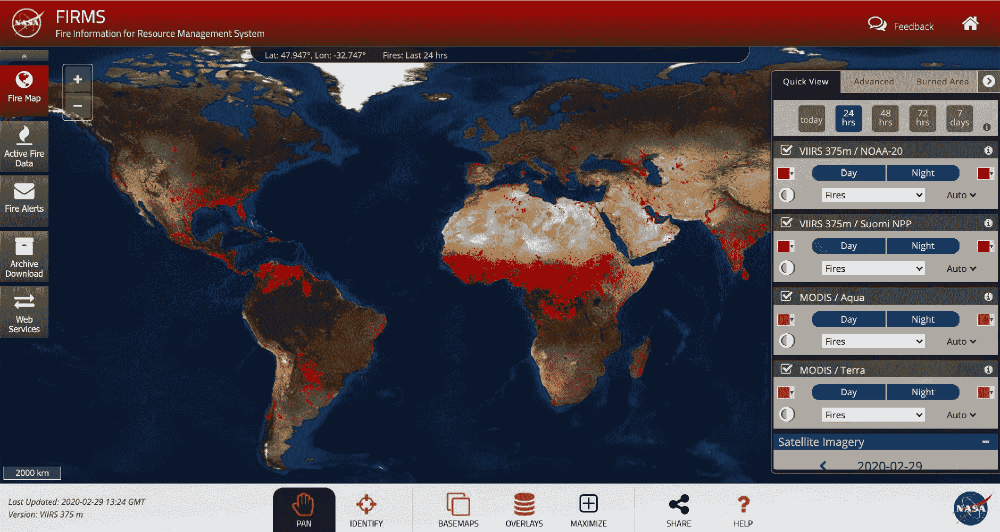
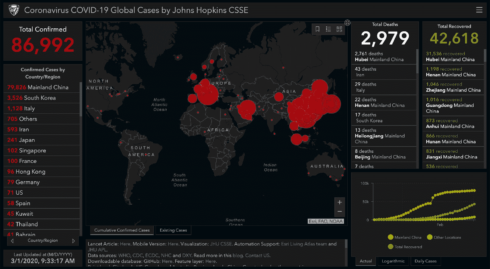
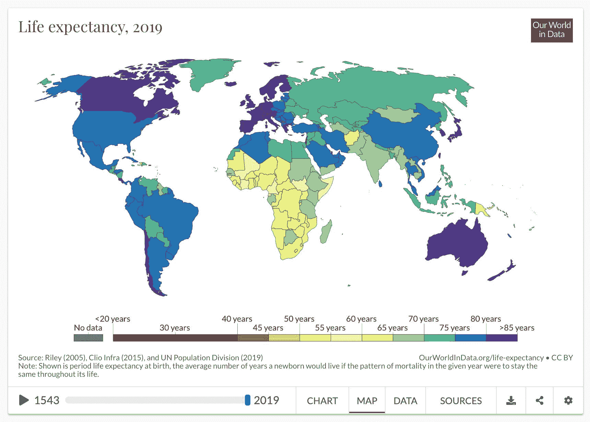
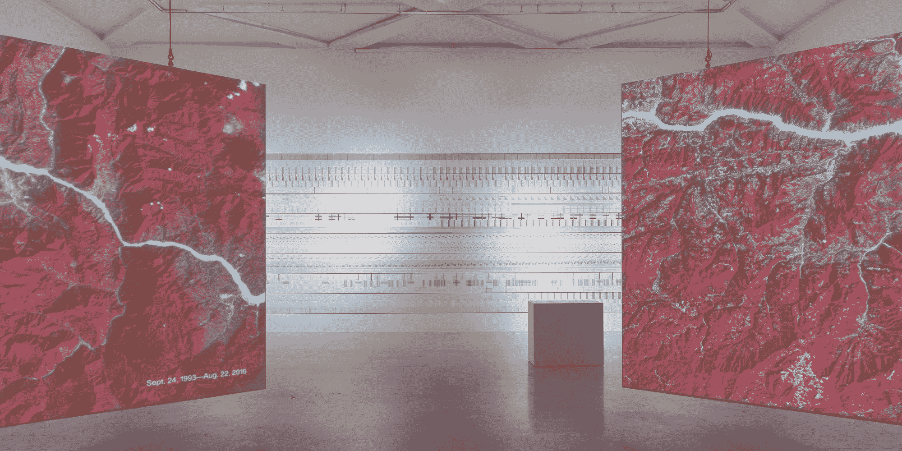
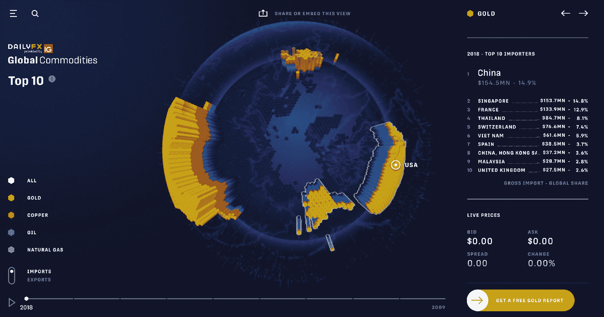
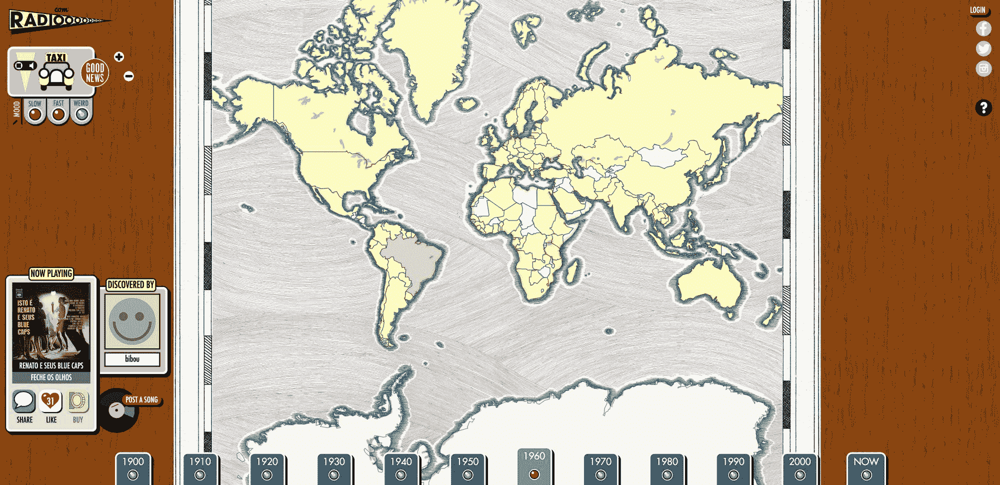
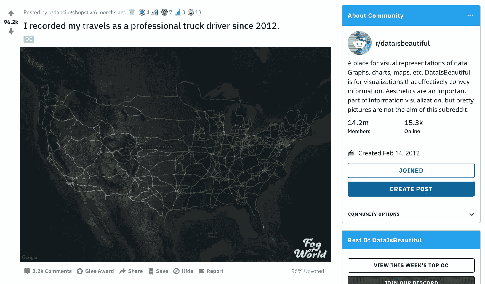
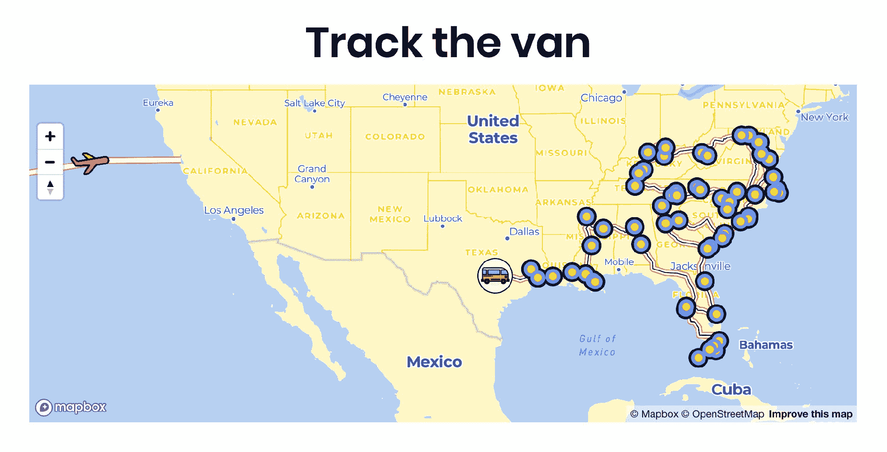
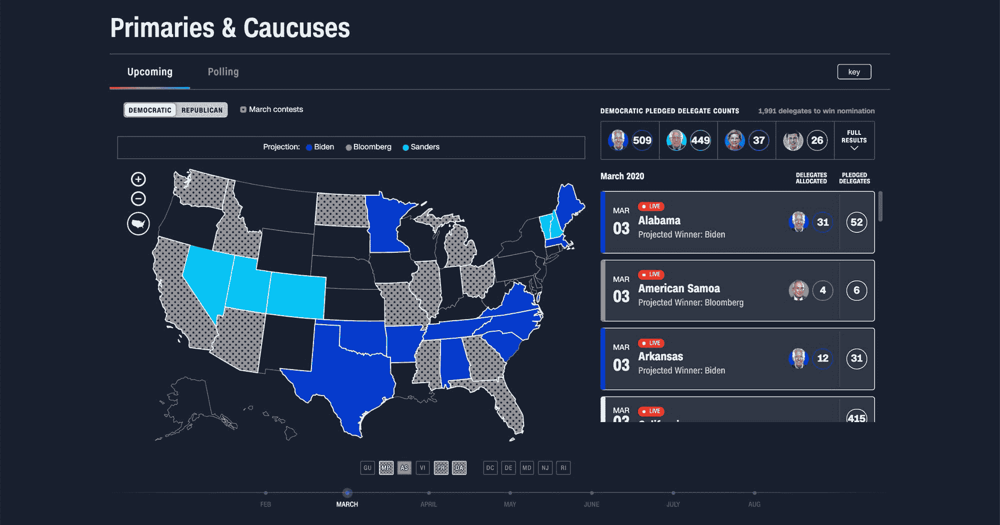
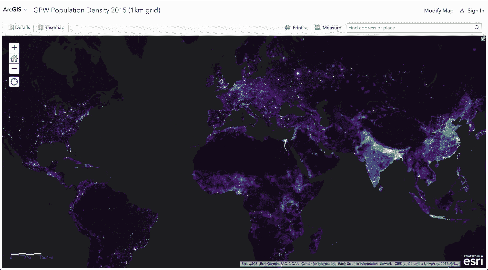

# 谁都会地图！灵感和对地图世界的介绍

> 原文：<https://www.freecodecamp.org/news/anyone-can-map-inspiration-and-an-introduction-to-the-world-of-mapping/>

Gusteau 主厨是一个有远见的人，他创造了让世界享受的美食体验。我们如何将他的经验应用到制图领域？

## 从烹饪大师那里获得灵感

如果你看过皮克斯的电影《T2》和料理鼠王，你应该知道谁是 T4 的主厨古斯特。他帮助我们的“小厨师”[雷米](https://pixar.fandom.com/wiki/Remy)这只老鼠在烹饪界游刃有余，成为巴黎的顶级厨师。

Remy from Ratatouille overlooking Gusteau's in Paris

在整部电影中，我们在他们的旅程中得到了很多精彩的引用。但我们感兴趣的是古斯特的座右铭，以及他的书名，“人人都能做饭！”那么，我们如何将这些经验和教训应用到我们自己的测绘之旅中呢？

我承认，这里的部分乐趣是从我最喜欢的电影之一中翻译一些经验教训，但这里有很多东西要吸取。我将介绍一些地图示例和类型，这些示例和类型应该会激发您开始使用自己的地图应用程序。所以让我们开始吧！

[https://www.youtube.com/embed/pQ_5PGv0YTA?feature=oembed](https://www.youtube.com/embed/pQ_5PGv0YTA?feature=oembed)

## 通过了解地图及其对世界的影响获得灵感

> 美食总会降临到热爱烹饪的人身上。古斯多主厨

通过我的工作，我发现很容易爱上制作地图。每天，科学家都使用地图来可视化数据，以帮助他们做出更有效的决策。这直接转化为造福全世界人民和拯救生命。

有了这个灵感，你将踏上一段旅程，了解世界上不同类型的地图以及它们是如何被使用的。你甚至可能偶然发现一些有趣的数据，探索你自己的邻居！

### 世界各地正在发生的火灾

以美国宇航局的公司服务为例，它提供了世界范围内的实时火灾数据。

Active fires around the world via [NASA FIRMS](https://earthdata.nasa.gov/earth-observation-data/near-real-time/firms)

火灾是我们可以从中学习的灾难的真实例子。该工具用于帮助管理资源，通过允许科学家和那些好奇的人分析燃烧区域和模拟数据本身来阻止和预防这些火灾。

### 新冠肺炎的全球案例

还有一些非常流行的东西，新冠肺炎(Coronavrius)的案例由[约翰·霍普金斯系统科学与工程中心](https://systems.jhu.edu/)在世界各地发布。

[Global cases of Coronavirus (COVID-19) from John Hopkins CSSE](https://www.arcgis.com/apps/opsdashboard/index.html#/bda7594740fd40299423467b48e9ecf6)

该地图实时跟踪病毒的传播，允许科学家对其覆盖范围进行建模，并产生研究结果以与全球社区共享。

像这样的绘图工具提供了一种有效的方式，以一种易于理解的方式提供尽可能多的信息，让那些能够利用这些信息做出改变的人知道。

### 预期寿命延长

从更积极的角度来看，我们可以详细了解随着时间的推移，世界各地的预期寿命是如何提高的。

[Life expectancy in 2019 from Our World in Data](https://ourworldindata.org/life-expectancy)

虽然在一些地区比其他地区增长更多，但全球的改善是显而易见的，我们可以看到一些国家从几百年前就开始增长了！

## 探索地图之美并将数据应用于地图

> 我该怎么形容呢？美食就像你可以品尝的音乐，你可以闻到的颜色。你周围都是优秀。你只需要意识到停下来品味它。古斯多主厨

伟大的地图也有创造性和美丽的一面。应用于地图(或任何介质)的厚数据集通常可以成为文字艺术品。

[The Room of Change from Pentagram](https://www.pentagram.com/work/the-room-of-change?rel=discipline&rel-id=16)

无论是在展览中展示，还是在 Etsy 上购买众多选项中的一个，以一种美丽的方式展示有意义的数据不仅从信息的角度，而且从文化的角度来看都是有影响力的。

### 有时候互动会很有趣

地图还可以提供一些交互性，在您了解数据集的更多信息时，探索这些地图会很有趣，例如这个 globe，它从 DailyFX 中绘制了全球商品。

[Global Commodities interactive map from DailyFX](https://www.dailyfx.com/research/global-commodities/globe)

虽然数据本身可能经常很厚很无聊，但这并不意味着我们不能找到更有趣的方式来呈现数据以进行交互。

### 有时地图可以提供一种聆听体验

这张来自 radiooooo.com 的地图可以让你环游世界并穿越时间。

[Music Radio from radiooooo.com](http://radiooooo.com/)

他们使用地图可以很容易地确定这个人想要探索的世界的一部分。

### 停下来欣赏你周围的地图

无论您是否注意到，当您每天浏览网页时，您很可能会遇到数据集的可视化，这些可视化创建了以更容易理解的方式呈现数据的强大方法。

[u/dancingchopstix's recordings of their truck driving travels](https://www.reddit.com/r/dataisbeautiful/comments/csl706/i_recorded_my_travels_as_a_professional_truck/)

幸运的是，我们不必努力寻找这种灵感，因为我们可以访问漂亮地图和一般数据集的聚合，如 [/r/dataisbeautiful](https://www.reddit.com/r/dataisbeautiful/) 。

## 尝试，发挥创造力，探索其他可视化数据的方法

> 你必须富有想象力，坚强。你必须尝试那些可能行不通的事情，你不能让任何人因为你的出身而定义你的极限。你唯一的限制是你的灵魂。古斯多主厨

地图有各种形状和大小。虽然阴影地理区域通常适用于选举结果，但它可能不适用于展示你的夏季公路旅行。

[50 State Project road trip map](https://www.the50statesproject.com/)

### 探索常见的地图类型

你可能经历过比你意识到的更多的地图类型。鉴于地图是一种强大的数据呈现方式，它在网络上被频繁使用。

[**choropleth map**](https://en.wikipedia.org/wiki/Choropleth_map) 常见于选举结果和区域数据集，其中特定的地理位置代表一个参考点。

[CNN Map of Democratic primary after Super Tuesday](https://www.cnn.com/election/2020/primaries-and-caucuses)

**[热图](https://en.wikipedia.org/wiki/Heat_map)** 另一方面允许你反映给定区域内数据点的强度。当您既想表示数据集覆盖的区域，又想同时表示数据表示的范围(如人口密度)时，这一功能非常强大。

[ArcGIS GPW 2015 Population Density heat map from](https://www.arcgis.com/home/webmap/viewer.html?useExisting=1&layers=90978c3a3a664c20b8da8fc21de6071b)

### 向他人学习，但不要害怕创造一条新的道路

探索和尝试不同的技术来可视化地图上的数据。通常没有一种方法可以做到这一点，这意味着您可以发挥创造力，尝试不同的地图呈现方式。

但这也意味着您不需要拘泥于常见地图类型的限制。使用现有的工具，或者创造新的工具，开辟新的天地。最重要的是以一种能给消费者带来最大影响的方式呈现数据。

## 不要放弃，从你的经历中学习

> 我说的是真的——任何人都会做饭...但只有无畏的人才能伟大。古斯多主厨

虽然不一定总是有正确的方法，但有时也会有错误的方法。但是不要让失败阻止你！

> 英国所有酒吧的地图。[pic.twitter.com/LZPyfLUq0M](https://t.co/LZPyfLUq0M)
> 
> — Terrible Maps (@TerribleMaps) [April 19, 2019](https://twitter.com/TerribleMaps/status/1119336763762331649?ref_src=twsrc%5Etfw)