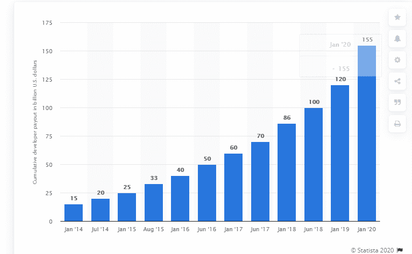
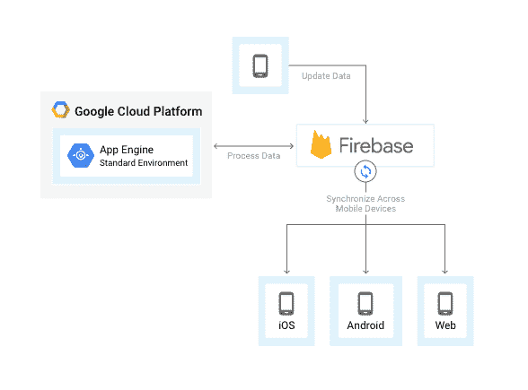
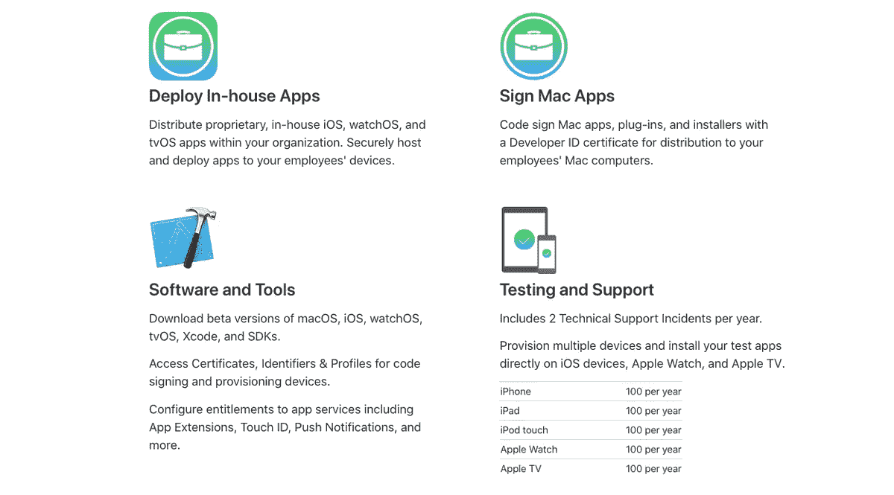
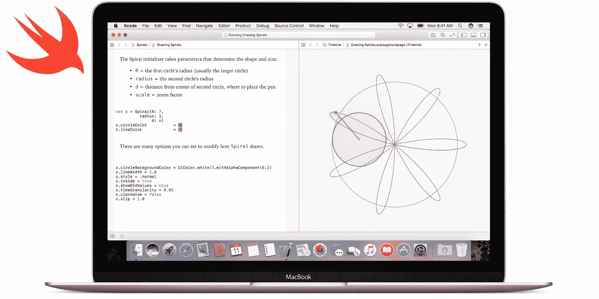
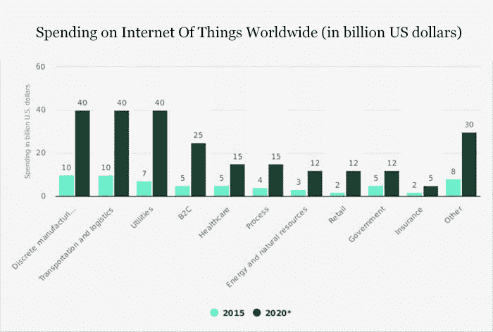

# 将在 2020 年占据统治地位的 iOS 应用程序开发趋势

> 原文：<https://www.freecodecamp.org/news/latest-ios-app-development-trends-2020/>

随着时间的推移，技术总是带来新的东西。面对这些不断变化的技术，您需要保持更新，以便从新技术中获得所有好处。

此外，当我们谈论技术时，我们首先想到的可能是手机和移动应用程序。我们也很清楚 iOS 设备的名字和名气。正如我们从阿瓦隆上方[的一份报告中了解到的那样，现在野生 I-phone 的数量可能超过**9 . 25 亿部。**](https://www.aboveavalon.com/notes/2019/5/30/apples-billion-users)

现在，是时候来看看 2020 年最热门的 iOS 应用开发趋势了。我们应该深入了解 iOS 移动应用程序的开发趋势，因为近年来 iOS 已经成为市场上领先的开发平台之一。iOS 也被认为比其他任何操作系统都更安全。

我们可以从 Statista.com 的统计数据中看到这一切:

这些统计数据显示了截至 2020 年 1 月移动应用开发者的累计苹果应用商店收入。截至上一个报告期*，*苹果已经向 iOS 应用开发者支付了总计**1550 亿美元。** 一年前，这个数字达**1200 亿美元**。

根据[**【Goodworklabs.com】**](https://www.goodworklabs.com/)的说法，苹果的 iOS 拥有 **18%** 的市场份额和 **99.6%** 与 Android 相加的份额，是世界上最具影响力的操作系统之一。

好了，在浏览了各种统计数据和事实之后，是时候跳到不同的趋势中来观察 2020 年的 iOS 应用程序开发了。

## 提高应用安全性

安全特性是 iOS 移动应用开发最有帮助和最重要的趋势之一。你们可能都知道苹果的安全算法。事实上，该公司以其核心安全层和高度安全的政策而闻名，这些政策有助于阻止黑客入侵苹果设备。

鉴于如今黑客攻击的数量，一个错误就能毁掉一切。苹果拥有大约 14 亿台活跃设备。

[福布斯](https://www.forbes.com/sites/zakdoffman/2019/08/30/google-shocks-1-billion-iphone-users-with-malicious-hack-warning/#3ad74a742524)于 2019 年 8 月 30 日发表了一篇题为“iPhone 黑客:谷歌警告**10 亿苹果用户**他们可能受到了攻击”的文章。这是在 iPhone 11 发布之前，几乎所有 iOS 设备都存在漏洞。该漏洞已在最新的 iOS 更新中修复。

根据苹果公司全球营销高级副总裁菲尔·席勒的一份声明，

> “(苹果)正在帮助保护我们的孩子免受可能被用来侵犯他们隐私和安全的技术的影响。”

这揭示了潜在的安全漏洞。为了帮助关闭它们，苹果公司已经启动了一种企业文化，以迎合用户创造一个安全环境的需求。因此，他们的目标是帮助提高整体安全性，以及防止网络攻击和数据泄露。

例如，让我们来谈谈密码自动填充。你知道苹果已经部署了**as web authentic ation Sessions**来帮助协调 cookies 和网站数据以便登录吗？这样，设备就能够使用认证服务的框架来整合密码管理器应用程序。

## 云集成 iOS 应用

云技术给科技领域带来了一场革命，也带来了许多机遇。在云技术的帮助下，组织可以在云端存储大量数据，而不必担心使用过多的数据空间。

正因为如此，现在大多数 iOS 应用都建立在云技术上，因为这是最值得信赖的平台之一，你可以在这里存储数据。您还可以在任何地方安全、快速、轻松地访问它。

你可能听说过“iCloud”服务。这使得 iOS 设备用户可以存储他们的内容，而不必担心空间问题。储存在 iCloud 中的内容包括图像、文件、备忘录等等。

使用您的登录 id 和密码，可以在任何设备上访问 iCloud。**根据[维基百科](https://en.wikipedia.org/wiki/ICloud)的数据，有 8.5 亿人信任 iCloud。**

拥有基于云的应用程序的一个显著优势是，它们不需要你系统中的任何物理空间，因为你可以直接在云上运行你的数据。

云有助于增强和扩展智能设备的内部内存。基于云的应用程序的这一主要功能有助于提高工作效率以及与移动应用程序的协作。

这一趋势将在未来几年彻底改变应用程序开发。

## 企业发展

企业开发是许多企业最重要和最基本的部分之一，这就是为什么大多数开发人员更喜欢通过 iOS 构建企业软件。

企业开发应该以定制的方式进行，以便用户可以获得所有的好处。它提供了最佳的用户体验、改进的安全性和高生产率。

这就是为什么大多数 iOS 开发者信任 iOS，因为它在可伸缩的企业开发中很有用。

**来源:**

## **Swift 5 编程语言**

**Swift 5 编程语言已经变得相当流行。苹果发布了一个稳定的*应用二进制接口(ABI)* 和二进制兼容性。**

**除了 ABI，Swift 5 还有原始字符串、未来枚举案例、结果类型、检查整数倍数等等。现在，iOS 应用程序开发公司正专注于尽最大能力使用 Swift，以获得最佳业务影响。**

****

****来源**:[9 to 5 MAC](https://9to5mac.com/2019/01/28/apple-swift-5-update-ios-12-2/)**

> **根据 Reddit 的数据，“在 app store 排名前 110 的应用中，有 42%在使用 Swift。如果忽略游戏，那么 57%的应用都在使用 Swift。”**

**Swift 库将被整合到未来的每一个 **macOS、iOS、可穿戴 OS、**和**TVOS***设备中。***

**Swift 5 与 Swift 4、Swift 4.1 和 Swift 4.2 以及 X code 10.2 源代码兼容。它有一个代码迁移，旨在自动处理一些必要的源代码更改。**

**该软件的一个显著优势是它与 Linux 高度兼容，因此开发人员在设计应用程序时将很容易增加他们对 Swift 5 的知识库。**

## **物联网应用**

**毫无疑问，物联网已经成为日常生活的一部分，因此没有必要介绍它。这项技术在世界各地的开发人员中越来越有名。**

**物联网是您和您的智能设备之间的通信来源。这就是为什么它正在创造一场革命。**

**如今，开发者更关注于开发 iOS 应用，例如，可以连接到互联网设备的应用。因此，我们可以说，物联网通过在应用程序中嵌入更好的连接设施，帮助开发者为用户创造了卓越的产品。**

****

**毫无疑问，物联网将彻底改变技术世界。这就是为什么 iOS 开发者应该把这项技术作为他们的主要工具。这对最终用户来说肯定是有益的，并且使事情变得更容易。**

**我们来看一个例子:制药公司使用物联网设备来帮助开发温度监测应用程序。这些应用程序可以检测特定过程的温度(根据需要)是否没有超过允许的限制。因此，物联网在许多领域都留下了积极的影响。**

**IOT-analytics.comT2 表示，在全球范围内，活跃的物联网设备数量预计到 2020 年将增长到 100 亿，到 2025 年将增长到 220 亿**

## **最后的话**

**好了，在这些信息的基础上，你现在可以看到，上述 iOS 应用程序的发展趋势正在走向 2020 年。因此，今年在开发你的 iOS 应用程序时，你绝对不应该忘记这些趋势。**

**如果你还有问题，你可以进一步探索这个广阔的话题。否则，你可以留言让我知道这篇文章对你有什么帮助。**

**一个相关的有趣阅读:**[2020 年顶级移动应用趋势](https://www.pixelcrayons.com/blog/top-app-trends-2019/?utm_source=freecodecamp&utm_medium=ios%2Bsk&utm_campaign=website)****