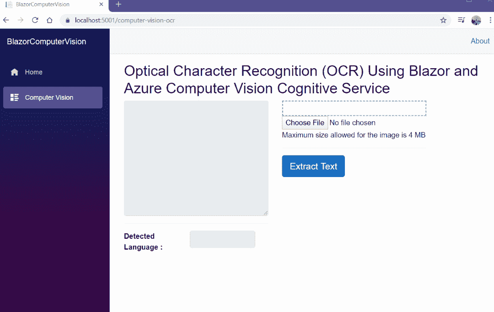
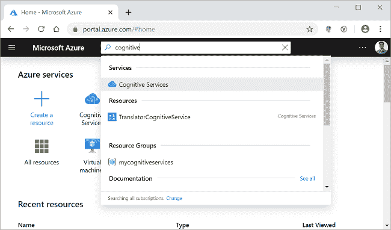
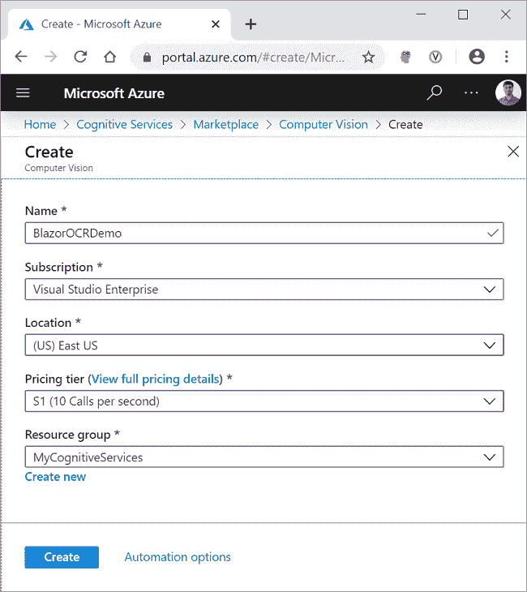
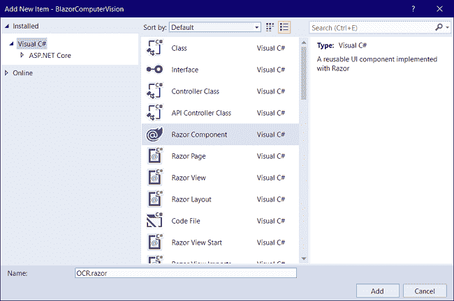
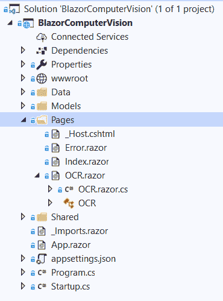
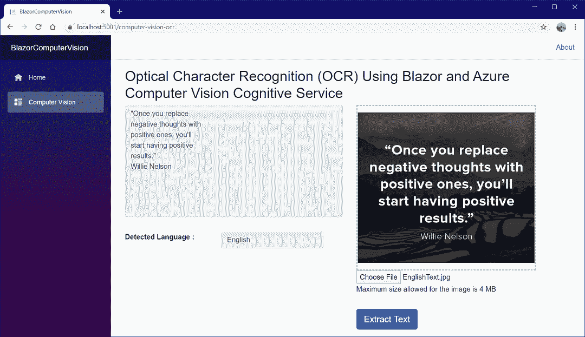
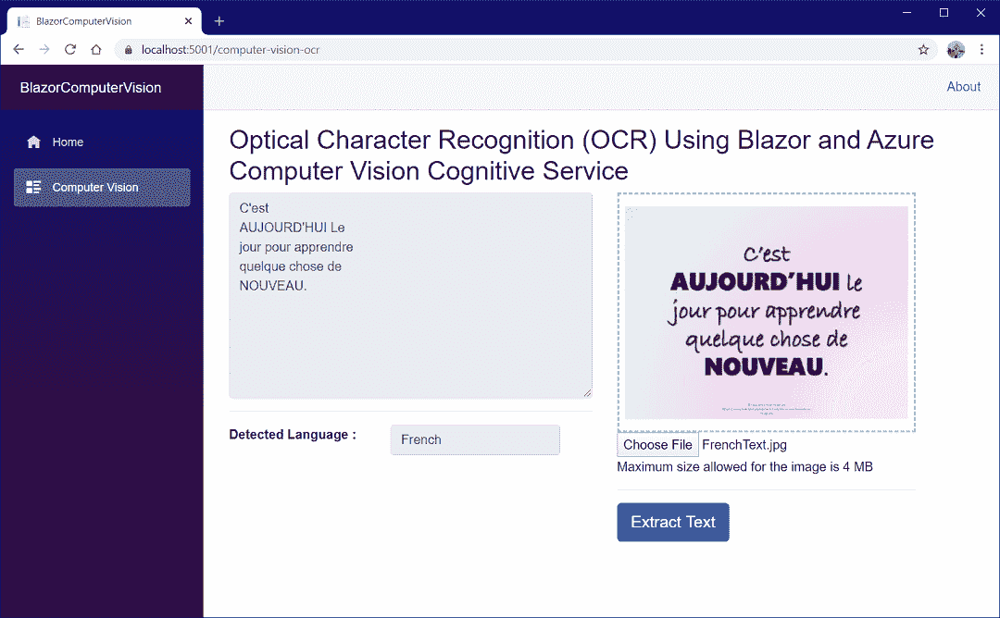
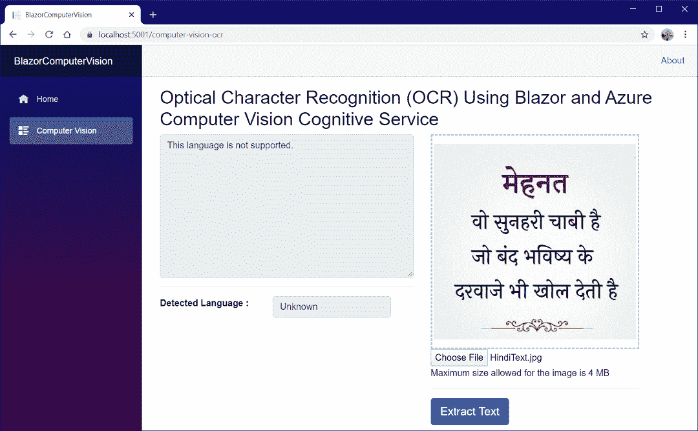

# 如何使用 Blazor 和 Azure 计算机视觉创建光学字符阅读器

> 原文：<https://www.freecodecamp.org/news/how-to-create-an-optical-character-reader-using-blazor-and-azure-computer-vision/>

## 介绍

在本文中，我们将使用 Blazor 和 Azure 计算机视觉认知服务创建一个光学字符识别(OCR)应用程序。

计算机视觉是一种分析图像内容的人工智能服务。我们将使用计算机视觉的 OCR 功能来检测图像中的印刷文本。

应用程序将从图像中提取文本，并检测文本的语言。目前，OCR API 支持 25 种语言。

下面显示了该应用程序的演示。



## 先决条件

*   安装最新版本。来自[https://dotnet.microsoft.com/download/dotnet-core/3.1](https://dotnet.microsoft.com/download/dotnet-core/3.1)的 NET Core 3.1 SDK
*   从[https://visualstudio.microsoft.com/downloads/](https://visualstudio.microsoft.com/downloads/)安装最新版本的 Visual Studio 2019
*   Azure 订阅帐户。你可以在[https://azure.microsoft.com/en-in/free/](https://azure.microsoft.com/en-in/free/)创建一个免费的 Azure 账户

## 图像要求

OCR API 将处理符合下述要求的图像:

*   图像的格式必须是 JPEG、PNG、GIF 或 BMP。
*   图像的大小必须在 50 x 50 和 4200 x 4200 像素之间。
*   图像文件大小应小于 4 MB。
*   图像中的文本可以旋转 90 度的任意倍数，加上一个最大 40 度的小角度。

## 源代码

可以从 [GitHub](https://github.com/AnkitSharma-007/Blazor-Computer-Vision-Azure-Cognitive-Services) 获取源代码。

## 创建 Azure 计算机视觉认知服务资源

登录 Azure 门户，在搜索栏中搜索认知服务，然后点击结果。请参考下图。



在下一个屏幕上，单击添加按钮。这将打开认知服务市场页面。

在搜索栏中搜索计算机视觉，然后单击搜索结果。它将打开计算机视觉 API 页面。单击“创建”按钮创建新的计算机视觉资源。请参考下图。


在“创建”页面上，填写如下所示的详细信息。

*   ****名称**** :为您的资源指定一个唯一的名称。
*   **:下拉选择订阅类型。**
*   ******定价等级**** :根据您的选择选择定价等级。**
*   ******资源组**** :选择一个已有的资源组或创建一个新的资源组。**

**点击创建按钮。请参考下图。**

****

**成功部署资源后，单击“转到资源”按钮。您可以看到新创建的计算机视觉资源的键和端点。请参考下图。**

****

**记下密钥和端点。在本文的后半部分，我们将使用它们从。NET 代码。为了保密，这里的值被屏蔽了。**

## **创建一个服务器端 Blazor 应用程序**

**打开 Visual Studio 2019，点击“新建项目”。选择“Blazor App”并点击“下一步”按钮。请参考下图。**

****

**在下一个窗口中，将项目名称设为`BlazorComputerVision`,然后单击“创建”按钮。**

**下一个窗口将要求您选择 Blazor 应用程序的类型。选择`Blazor Server App`并点击 Create 按钮来创建一个新的服务器端 Blazor 应用程序。请参考下图。**

****

## **安装计算机视觉 API 库**

**我们将安装 Azure 计算机视觉 API 库，它将为我们提供现成的模型来处理计算机视觉 REST API 响应。**

**要安装软件包，请导航到工具>>获取软件包管理器>>软件包管理器控制台。它将打开软件包管理器控制台。运行如下所示的命令。**

```
`Install-Package Microsoft.Azure.CognitiveServices.Vision.ComputerVision -Version 5.0.0` 
```

 **你可以在 [NuGet gallery](https://www.nuget.org/packages/Microsoft.Azure.CognitiveServices.Vision.ComputerVision/) 了解更多关于这个包的信息。

## 创建模型

右键点击`BlazorComputerVision`项目，选择添加> >新文件夹。将文件夹命名为`Models`。同样，右键单击`Models`文件夹并选择 Add > > Class 来添加一个新的类文件。将您的类命名为`LanguageDetails.cs`,然后单击 Add。

打开`[LanguageDetails.cs](https://github.com/AnkitSharma-007/Blazor-Computer-Vision-Azure-Cognitive-Services/blob/master/BlazorComputerVision/Models/LanguageDetails.cs)`，把下面的代码放进去。

```
namespace BlazorComputerVision.Models
{
    public class LanguageDetails
    {
        public string Name { get; set; }
        public string NativeName { get; set; }
        public string Dir { get; set; }
    }
}
```

类似地，添加一个新的类文件`[AvailableLanguage.cs](https://github.com/AnkitSharma-007/Blazor-Computer-Vision-Azure-Cognitive-Services/blob/master/BlazorComputerVision/Models/AvailableLanguage.cs)`，并将下面的代码放入其中。

```
using System.Collections.Generic;

namespace BlazorComputerVision.Models
{
    public class AvailableLanguage
    {
        public Dictionary<string, LanguageDetails> Translation { get; set; }
    }
}
```

最后，我们将添加一个作为 DTO(数据传输对象)的类，用于将数据发送回客户端。添加一个新的类文件`[OcrResultDTO.cs](https://github.com/AnkitSharma-007/Blazor-Computer-Vision-Azure-Cognitive-Services/blob/master/BlazorComputerVision/Models/OcrResultDTO.cs)`，并将下面的代码放入其中。

```
namespace BlazorComputerVision.Models
{
    public class OcrResultDTO
    {
        public string Language { get; set; }

        public string DetectedText { get; set; }
    }
}
```

## 创建计算机视觉服务

右击`BlazorComputerVision/Data`文件夹，选择添加> >类，添加一个新的类文件。将文件名设为`ComputerVisionService.cs`,然后点击 Add。

打开`[ComputerVisionService.cs](https://github.com/AnkitSharma-007/Blazor-Computer-Vision-Azure-Cognitive-Services/blob/master/BlazorComputerVision/Data/ComputerVisionService.cs)`文件，将下面的代码放入其中。

```
using BlazorComputerVision.Models;
using Microsoft.Azure.CognitiveServices.Vision.ComputerVision.Models;
using Newtonsoft.Json;
using Newtonsoft.Json.Linq;
using System;
using System.Net.Http;
using System.Net.Http.Headers;
using System.Text;
using System.Threading.Tasks;

namespace BlazorComputerVision.Data
{
    public class ComputerVisionService
    {
        static string subscriptionKey;
        static string endpoint;
        static string uriBase;

        public ComputerVisionService()
        {
            subscriptionKey = "b993f3afb4e04119bd8ed37171d4ec71";
            endpoint = "https://ankitocrdemo.cognitiveservices.azure.com/";
            uriBase = endpoint + "vision/v2.1/ocr";
        }

        public async Task<OcrResultDTO> GetTextFromImage(byte[] imageFileBytes)
        {
            StringBuilder sb = new StringBuilder();
            OcrResultDTO ocrResultDTO = new OcrResultDTO();
            try
            {
                string JSONResult = await ReadTextFromStream(imageFileBytes);

                OcrResult ocrResult = JsonConvert.DeserializeObject<OcrResult>(JSONResult);

                if (!ocrResult.Language.Equals("unk"))
                {
                    foreach (OcrLine ocrLine in ocrResult.Regions[0].Lines)
                    {
                        foreach (OcrWord ocrWord in ocrLine.Words)
                        {
                            sb.Append(ocrWord.Text);
                            sb.Append(' ');
                        }
                        sb.AppendLine();
                    }
                }
                else
                {
                    sb.Append("This language is not supported.");
                }
                ocrResultDTO.DetectedText = sb.ToString();
                ocrResultDTO.Language = ocrResult.Language;
                return ocrResultDTO;
            }
            catch
            {
                ocrResultDTO.DetectedText = "Error occurred. Try again";
                ocrResultDTO.Language = "unk";
                return ocrResultDTO;
            }
        }

        static async Task<string> ReadTextFromStream(byte[] byteData)
        {
            try
            {
                HttpClient client = new HttpClient();
                client.DefaultRequestHeaders.Add("Ocp-Apim-Subscription-Key", subscriptionKey);
                string requestParameters = "language=unk&detectOrientation=true";
                string uri = uriBase + "?" + requestParameters;
                HttpResponseMessage response;

                using (ByteArrayContent content = new ByteArrayContent(byteData))
                {
                    content.Headers.ContentType = new MediaTypeHeaderValue("application/octet-stream");
                    response = await client.PostAsync(uri, content);
                }

                string contentString = await response.Content.ReadAsStringAsync();
                string result = JToken.Parse(contentString).ToString();
                return result;
            }
            catch (Exception e)
            {
                return e.Message;
            }
        }

        public async Task<AvailableLanguage> GetAvailableLanguages()
        {
            string endpoint = "https://api.cognitive.microsofttranslator.com/languages?api-version=3.0&scope=translation";
            var client = new HttpClient();
            using (var request = new HttpRequestMessage())
            {
                request.Method = HttpMethod.Get;
                request.RequestUri = new Uri(endpoint);
                var response = await client.SendAsync(request).ConfigureAwait(false);
                string result = await response.Content.ReadAsStringAsync();

                AvailableLanguage deserializedOutput = JsonConvert.DeserializeObject<AvailableLanguage>(result);

                return deserializedOutput;
            }
        }
    }
}
```

在类的构造函数中，我们已经初始化了 OCR API 的密钥和端点 URL。

在`ReadTextFromStream`方法中，我们将创建一个新的`HttpRequestMessage`。这个 HTTP 请求是一个 Post 请求。我们将在请求的头部传递订阅密钥。OCR API 将返回一个 JSON 对象，该对象包含图像中的每个单词以及检测到的文本语言。

`GetTextFromImage`方法将接受图像数据作为字节数组，并返回一个类型为`OcrResultDTO`的对象。我们将调用`ReadTextFromStream`方法，并将响应反序列化为`OcrResult`类型的对象。然后，我们将通过迭代`OcrWord`对象来构成句子。

方法将返回翻译文本 API 支持的所有语言的列表。我们将设置请求 URI 并创建一个`HttpRequestMessage`,这将是一个 Get 请求。这个请求 URL 将返回一个 JSON 对象，该对象将被反序列化为一个类型为`AvailableLanguage`的对象。

## 为什么我们需要获取支持语言的列表？

OCR API 返回语言代码(例如，en 代表英语，de 代表德语，等等。)的语言。但是我们不能在 UI 上显示语言代码，因为它对用户不友好。所以我们需要一本字典来查找语言代码对应的语言名称。

Azure 计算机视觉 OCR API 支持 25 种语言。要了解 OCR API 支持的所有语言，请参见[支持的语言列表](https://docs.microsoft.com/en-us/azure/cognitive-services/computer-vision/language-support)。

这些语言是 Azure 翻译文本 API 支持的语言的子集。由于没有专门的 API 端点来获取 OCR API 支持的语言列表，因此，我们使用翻译文本 API 端点来获取语言列表。

我们将使用来自这个 API 调用的 JSON 响应创建语言查找字典，并根据 OCR API 返回的语言代码过滤结果。

## 安装 BlazorInputFile NuGet 包

[BlazorInputFile](https://www.nuget.org/packages/BlazorInputFile/) 是 Blazor 应用程序的文件输入组件。它提供了将单个或多个文件上传到 Blazor 应用程序的能力。

打开`[BlazorComputerVision.csproj](https://github.com/AnkitSharma-007/Blazor-Computer-Vision-Azure-Cognitive-Services/blob/master/BlazorComputerVision/BlazorComputerVision.csproj#L8)`文件，为`BlazorInputFile`包添加一个依赖项，如下所示:

```
<ItemGroup>
    <PackageReference Include="BlazorInputFile" Version="0.1.0-preview-00002" />
</ItemGroup>
```

打开`[BlazorComputerVision\Pages\_Host.cshtml](https://github.com/AnkitSharma-007/Blazor-Computer-Vision-Azure-Cognitive-Services/blob/master/BlazorComputerVision/Pages/_Host.cshtml#L17)`文件，通过在`<head>`部分添加下面一行来添加对包的 JavaScript 文件的引用。

```
<script src="_content/BlazorInputFile/inputfile.js"></script>
```

在`[_Imports.razor](https://github.com/AnkitSharma-007/Blazor-Computer-Vision-Azure-Cognitive-Services/blob/master/BlazorComputerVision/_Imports.razor#L10)`文件中添加以下行。

```
@using BlazorInputFile
```

## **配置服务**

为了使服务对组件可用，我们需要在服务器端应用程序上配置它。打开 Startup.cs 文件。在启动类的`[ConfigureServices](https://github.com/AnkitSharma-007/Blazor-Computer-Vision-Azure-Cognitive-Services/blob/master/BlazorComputerVision/Startup.cs#L31)`方法中添加下面一行。

```
 services.AddSingleton<ComputerVisionService>();
```

## 创建 Blazor UI 组件

我们将在`BlazorComputerVision/Pages`文件夹中添加 Razor 页面。默认情况下，我们在应用程序中提供了“计数器”和“获取数据”页面。这些默认页面不会影响我们的应用程序，但是出于本教程的考虑，我们将从`BlazorComputerVision/Pages`文件夹中删除 fetchdata 和 counter 页面。

右击`BlazorComputerVision/Pages`文件夹，然后选择添加>T3 新项目。将会打开一个“添加新项目”对话框，从左侧面板中选择“Visual C#”，然后从模板面板中选择“Razor Component”，将名称设为`OCR.razor`。单击添加。请参考下图。



我们将为这个 razor 页面添加一个代码隐藏文件，将代码和表示分开。这将使应用程序易于维护。

右键单击`BlazorComputerVision/Pages`文件夹，然后选择添加> >类。将该类命名为`OCR.razor.cs`。Blazor 框架足够聪明，可以将这个类文件标记到 razor 文件中。请参考下图。



## Blazor UI 组件代码隐藏

打开`[OCR.razor.cs](https://github.com/AnkitSharma-007/Blazor-Computer-Vision-Azure-Cognitive-Services/blob/master/BlazorComputerVision/Pages/OCR.razor.cs)`文件，将下面的代码放入其中。

```
using Microsoft.AspNetCore.Components;
using System;
using System.Collections.Generic;
using System.Linq;
using System.Threading.Tasks;
using System.IO;
using BlazorComputerVision.Models;
using BlazorInputFile;
using BlazorComputerVision.Data;

namespace BlazorComputerVision.Pages
{
    public class OCRModel : ComponentBase
    {
        [Inject]
        protected ComputerVisionService computerVisionService { get; set; }

        protected string DetectedTextLanguage;
        protected string imagePreview;
        protected bool loading = false;
        byte[] imageFileBytes;

        const string DefaultStatus = "Maximum size allowed for the image is 4 MB";
        protected string status = DefaultStatus;

        protected OcrResultDTO Result = new OcrResultDTO();
        private AvailableLanguage availableLanguages;
        private Dictionary<string, LanguageDetails> LanguageList = new Dictionary<string, LanguageDetails>();
        const int MaxFileSize = 4 * 1024 * 1024; // 4MB

        protected override async Task OnInitializedAsync()
        {
            availableLanguages = await computerVisionService.GetAvailableLanguages();
            LanguageList = availableLanguages.Translation;
        }

        protected async Task ViewImage(IFileListEntry[] files)
        {
            var file = files.FirstOrDefault();
            if (file == null)
            {
                return;
            }
            else if (file.Size > MaxFileSize)
            {
                status = $"The file size is {file.Size} bytes, this is more than the allowed limit of {MaxFileSize} bytes.";
                return;
            }
            else if (!file.Type.Contains("image"))
            {
                status = "Please uplaod a valid image file";
                return;
            }
            else
            {
                var memoryStream = new MemoryStream();
                await file.Data.CopyToAsync(memoryStream);
                imageFileBytes = memoryStream.ToArray();
                string base64String = Convert.ToBase64String(imageFileBytes, 0, imageFileBytes.Length);

                imagePreview = string.Concat("data:image/png;base64,", base64String);
                memoryStream.Flush();
                status = DefaultStatus;
            }
        }

        protected private async Task GetText()
        {
            if (imageFileBytes != null)
            {
                loading = true;
                Result = await computerVisionService.GetTextFromImage(imageFileBytes);
                if (LanguageList.ContainsKey(Result.Language))
                {
                    DetectedTextLanguage = LanguageList[Result.Language].Name;
                }
                else
                {
                    DetectedTextLanguage = "Unknown";
                }
                loading = false;
            }
        }
    }
}
```

我们在这门课上注入了`ComputerVisionService`。

`OnInitializedAsync`是一个 Blazor 生命周期方法，在组件初始化时调用。我们在`OnInitializedAsync`方法中调用服务的`GetAvailableLanguages`方法。然后我们将初始化变量 LanguageList，这是一个保存可用语言细节的字典。

在`ViewImage`方法中，我们将检查上传的文件是否只是一个图像，大小是否小于 4 MB。我们将把上传的图像传输到内存流。然后我们将把内存流转换成一个字节数组。

为了设置图像预览，我们将把图像从字节数组转换成 base64 编码的字符串。`GetText`方法将从服务中调用`GetTextFromImage`方法，并将图像字节数组作为参数传递。我们将根据服务返回的语言代码从字典中搜索语言名称。如果没有可用的语言代码，我们会将该语言设置为未知。

## Blazor UI 组件模板

打开`[OCR.razor](https://github.com/AnkitSharma-007/Blazor-Computer-Vision-Azure-Cognitive-Services/blob/master/BlazorComputerVision/Pages/OCR.razor)`文件，将下面的代码放入其中。

```
@page "/computer-vision-ocr"
@inherits OCRModel

<h2>Optical Character Recognition (OCR) Using Blazor and Azure Computer Vision Cognitive Service</h2>

<div class="row">
    <div class="col-md-5">
        <textarea disabled class="form-control" rows="10" cols="15">@Result.DetectedText</textarea>
        <hr />
        <div class="row">
            <div class="col-sm-5">
                <label><strong> Detected Language :</strong></label>
            </div>
            <div class="col-sm-6">
                <input disabled type="text" class="form-control" value="@DetectedTextLanguage" />
            </div>
        </div>
    </div>
    <div class="col-md-5">
        <div class="image-container">
            
        </div>
        <InputFile OnChange="ViewImage" />
        <p>@status</p>
        <hr />
        <button disabled="@loading" class="btn btn-primary btn-lg" @onclick="GetText">
            @if (loading)
            {
                <span class="spinner-border spinner-border-sm mr-1"></span>
            }
            Extract Text
        </button>
    </div>
</div>
```

我们已经为该组件定义了路线。我们继承了`OCRModel`类，它允许我们从模板中访问这个类的属性和方法。Bootstrap 用于设计 UI。我们有一个显示检测到的文本的文本区域和一个显示检测到的语言的文本框。图像标签用于在上传图像后显示图像预览。`<InputFile>`组件将允许我们上传一个图像文件，并在上传图像时调用`ViewImage`方法。

## 为组件添加样式

导航到`[BlazorComputerVision\wwwroot\css\site.css](https://github.com/AnkitSharma-007/Blazor-Computer-Vision-Azure-Cognitive-Services/blob/master/BlazorComputerVision/wwwroot/css/site.css#L185-L197)`文件，并在其中添加以下样式定义。

```
.preview-image {
    max-height: 300px;
    max-width: 300px;
}
.image-container {
    display: flex;
    padding: 15px;
    align-content: center;
    align-items: center;
    justify-content: center;
    border: 2px dashed skyblue;
}
```

## **向导航菜单添加链接**

最后一步是在导航菜单中添加 OCR 组件的链接。打开`[BlazorComputerVision/Shared/NavMenu.razor](https://github.com/AnkitSharma-007/Blazor-Computer-Vision-Azure-Cognitive-Services/blob/master/BlazorComputerVision/Shared/NavMenu.razor#L15-L19)`文件，添加以下代码。

```
<li class="nav-item px-3">
	<NavLink class="nav-link" href="computer-vision-ocr">
		<span class="oi oi-list-rich" aria-hidden="true"></span> Computer Vision
	</NavLink>
</li>
```

删除计数器和提取数据组件的导航链接，因为此应用程序不需要它们。

## 执行演示

按 F5 启动应用程序。点击左边导航菜单上的计算机视觉按钮。在下一页，上传一张包含一些文字的图片，然后点击“提取文字”按钮。您将在左侧的文本区域看到提取的文本以及检测到的文本语言。请参考下图。



现在，我们将尝试上传一个带有一些法语文本的图像，您可以看到提取的文本和检测到的语言是法语。请参考下图。



如果我们试图上传一个不支持的语言的图像，我们会得到错误。请参考下图，该图上载了一个带有印地语文字的图像。



## **总结**

我们使用 Blazor 和计算机视觉 Azure 认知服务创建了一个光学字符识别(OCR)应用程序。我们添加了使用`BlazorInputFile`组件上传图像文件的特性。该应用程序能够从上传的图像中提取打印文本，并识别文本的语言。使用计算机视觉的 OCR API，它可以识别 25 种语言的文本。

从 [GitHub](https://github.com/AnkitSharma-007/Blazor-Computer-Vision-Azure-Cognitive-Services) 中获取源代码，并进行试验，以便更好地理解。

## 请参见

*   [使用 Blazor 和 Azure 认知服务的多语言翻译](https://ankitsharmablogs.com/multi-language-translator-using-blazor-and-azure-cognitive-services/)
*   [服务器端 Blazor 应用中的脸书认证和授权](https://ankitsharmablogs.com/facebook-authentication-and-authorization-in-server-side-blazor-app/)
*   [服务器端 Blazor 应用中的谷歌认证和授权](https://ankitsharmablogs.com/google-authentication-and-authorization-in-server-side-blazor-app/)
*   [使用 JWT 的 Angular 中基于策略的授权](https://ankitsharmablogs.com/policy-based-authorization-in-angular-using-jwt/)
*   [使用 Heroku 和 GitHub 持续部署 Angular App](https://ankitsharmablogs.com/continuous-deployment-for-angular-app-using-heroku-and-github/)
*   [在 Firebase 上托管 Blazor 应用](https://ankitsharmablogs.com/hosting-a-blazor-application-on-firebase/)
*   [在 Azure 上部署 Blazor 应用](https://ankitsharmablogs.com/deploying-a-blazor-application-on-azure/)**