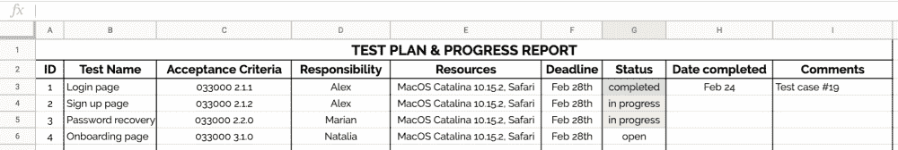
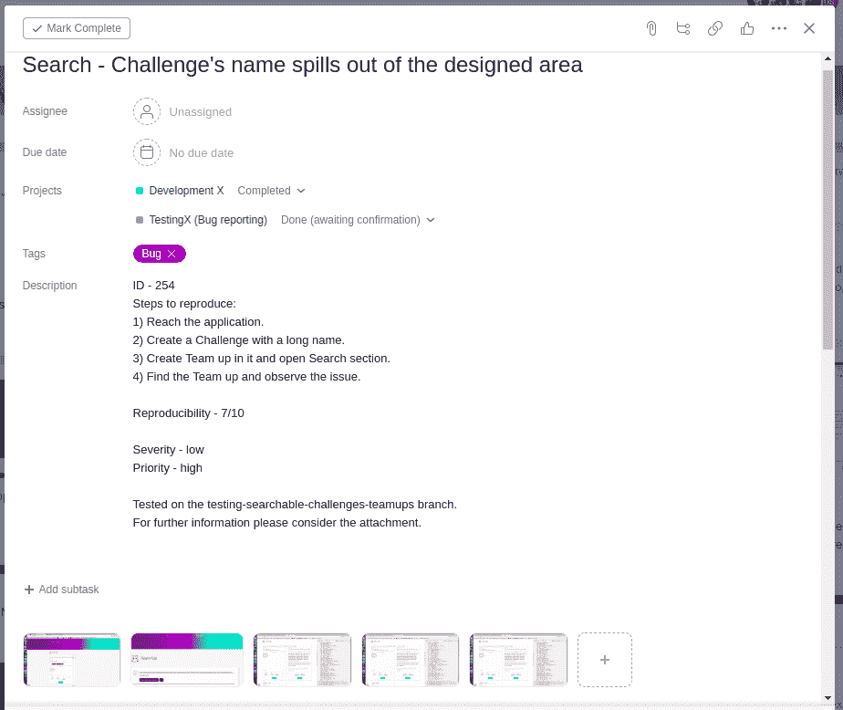
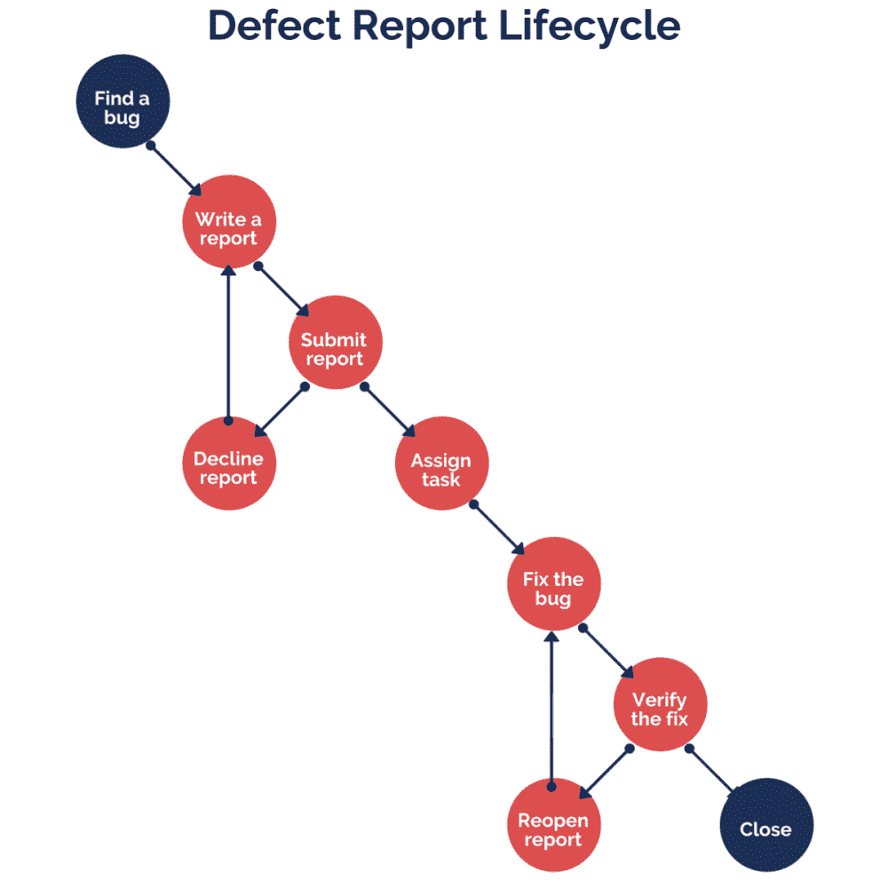

# 如何编写实际可行的质量保证文档

> 原文：<https://www.freecodecamp.org/news/how-to-write-qa-documentation-that-will-work/>

一个软件产品就像一架飞机:它必须在发射前经过技术检查。

质量保证是成功发布软件产品的必要步骤。这只是所有项目工作的一小部分，但没人说它会简单。

软件测试有很多种类型——自动化和手动、探索性和功能性、兼容性、UI/UX、回归、单元、API 和性能测试。祝你好运，把它们都记在脑子里！

然而，所有这些类型的共同点是，每种类型都需要您编写完整的 QA 测试文档。测试文档的质量决定了你的工作是有用还是徒劳。

我写这篇文章是为了让你的生活轻松一点。这就是你如何编写软件质量保证文档的终极指南。

## 制定测试计划和测试进度报告

《测试计划》是一份指导性文件，概述了质量保证过程的全貌，包括任务清单、策略、资源和时间表。

在创建 QA 计划文档之前，问问自己“软件解决方案的目的是什么？”以及“需要测试哪些特性？”。不要急于测试软件的每一个部分。您需要决定您将使用什么方法、技术和工具。

测试计划将帮助您理解以下内容:

*   验收标准是什么？
*   需要什么资源？什么操作系统，多少份拷贝，使用什么许可证？你需要技术顾问吗？
*   你的角色和职责划分清楚了吗？
*   什么是测试时间框架？

测试进度报告是 QA 文档的另一部分，它类似于测试计划，但是增加了当前进度的数据。本文档让您和您的开发团队监控项目进度，并识别组织问题(如果有的话)。

## 创建测试用例

一旦你明确了需要在你的测试计划中测试的一组功能，你需要为你的软件的每个部分创建一个测试用例。

测试用例非常简单——这个 QA 文档由 7 个部分组成:ID、测试用例、测试步骤、预期结果、状态、实际结果和注释。

1.  ID 是分配给你的测试用例的唯一编号。
2.  在**测试用例**部分，您指出您将要测试的需求，并在规范文档中提供一个链接。
3.  在**测试步骤**部分，您列出了完成一个测试用例所需的所有动作。
4.  在**预期结果**部分，您总结了特定测试的结果(如果成功的话)。
5.  在**状态**部分，您可以指出一个特定的步骤是否通过测试。
6.  在**实际结果**部分，您解释了失败测试的结果。
7.  **注释**部分不是必须的，但是您可以添加它来留下一些额外的注释。

## 写一份缺陷报告

缺陷报告是质量保证文档的重要组成部分。它记录你程序中任何不必要的问题。它是项目文档的一个关键元素，引导你获得一个无错误的软件解决方案。

听起来很简单，对吧？是的，但只是在你开始记录之前。在这里，您可以看到一个典型缺陷报告的例子:

缺陷报告由以下部分组成:标识符、摘要、描述、重现步骤、再现性、严重性、优先级、环境和附件。

1.  每个特定的软件版本都被分配了一个唯一的编号，即**标识符**。它优化了 QA 文档的导航，促进了开发人员、测试人员和项目经理之间的交流。
2.  在**总结**部分，你提供了三个简单问题的简明答案:发生了什么，在哪里，在什么情况下。
3.  在**描述**部分**，**你详细描述了 bug。你应该讲述实际的结果和预期的结果。提供软件需求的链接是很有用的。
4.  然后，你写关于**的步骤来重现(STR)** 。这向开发人员展示了如何重现该问题。不要漏掉任何一步，否则你的报告可能会退回给你。
5.  在**再现性**部分，您要弄清楚是否每次跟踪 STR 时都会出现 bug。你应该用数字来表示大概的机会，例如 10 次中有 7 次。
6.  在**严重性**部分，你解释 bug 可能给项目带来多大的危害。换句话说，它显示了缺陷对整个系统的技术影响程度。即使是一个小问题也可能严重影响整个应用程序。
7.  优先级显示了特定缺陷报告的重要性。优先级可以用字母来表示——“A”表示最紧急,“Z”表示最不紧急,“1”表示最紧急,“9”表示最不紧急，或者简单地用“高”、“中”或“低”来表示。
8.  在**环境**部分，您应该定义哪些操作系统或浏览器版本受到了影响。
9.  最后，**附件**包括添加到缺陷报告中的视频、截图或控制台日志文件的列表。

## 记住这些对缺陷报告写作有用的提示

1.  写一份充分和适当的总结。不管它是长是短。重要的是要明确。
2.  看一下总结和描述。他们看起来很像吗？您一定忘记了在描述中概述预期的和实际的结果，以及添加到需求的链接。
3.  借助屏幕截图捕捉问题。这可能会为您和开发团队节省大量时间。有时候，看一眼图片就足以了解情况。
4.  在报告问题之前，请尝试至少重现 3 次，以确保问题存在。
5.  尽快报告问题，如果问题严重，通知您的项目经理或产品负责人。
6.  检查你的 QA 文档中的语法错误，这样你就不会被语法警察抓到把柄。
7.  不管听起来有多滑稽，请确保该问题不是一个特性——再次查看文档！
8.  在复制的过程中，不要错过任何重要的信息。

## 提交缺陷报告

缺陷报告经历了一个生命周期——从您报告问题的时刻到问题结束的时刻。

第一步是编辑并**提交**缺陷报告。在这一点上，项目经理或技术负责人决定是**将**它分配给开发商还是**以不足或不合适为由拒绝**它。

在被指派的开发人员**修复了**bug 之后，你作为一个 QA 必须再次检查并**验证**它已经被修复。如果是，您可以**关闭**缺陷报告。最好的做法是在一两周内关闭它。

如果错误没有被修复，你**重新打开**缺陷报告，并将其发送回指定的开发人员。修复 bug 的过程可能会很漫长，但是你必须保持坚强，直到所有的缺陷报告最终结束。

## 总结

质量保证是一个你无法回避的过程。每架飞机在起飞前都要经过技术检查。如果有任何问题，飞机停飞，直到问题得到解决。

同样，每个软件产品在发布前都需要检查。你不能部署有问题的软件，因为用户不会给你的应用第二次机会。

## 你需要提高你的软件质量吗？

我的公司 KeenEthics 提供坚实的[开发和质量保证服务](https://keenethics.com/services-development-and-quality-assurance)。如果您需要类似项目的估算，请随时与**联系。**

如果你喜欢这篇文章，你应该继续讨论[什么是原型制作，我们为什么需要它](https://keenethics.com/blog/1517766794846-what-is-prototype-and-how-to-eat-it-in-a-right-way?utm_source=fcc_qa_document&utm_medium=fcc_qa_document&utm_campaign=fcc_qa_document)和[最小可行产品:在想法和产品之间](https://keenethics.com/blog/minimum-viable-product)。

## 附言

发布在 KeenEthics 博客上的原始文章可以在这里找到:[如何编写可以工作的 QA 文档？](https://keenethics.com/blog/qa-documentation)