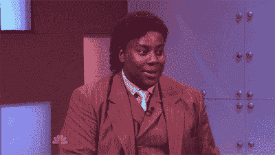

# 如何使用 HTML、CSS、JavaScript 和 Firebase 构建活动预订应用程序

> 原文：<https://www.freecodecamp.org/news/how-to-build-an-event-booking-app-using-html-css-javascript-and-firebase/>

在本教程中，我们将使用 HTML、CSS、JavaScript 和 Firebase 构建一个活动预订应用程序。

*   [规划我们的应用](#plan-our-app)
*   [Markup](#markup)
*   [造型](#styling)
*   [与 Firebase 互动](#interact-with-firebase)
*   [获取事件](#fetch-events)
*   [创建一个事件](#create-an-event)
*   [预订活动](#book-an-event)
*   [用 JavaScript 显示和更新数据](#show-and-update-data-with-javascript)

## 规划我们的应用

我们不会构建一个拥有所有功能的完整的活动预订应用程序。我们不需要在一个教程中涵盖所有内容。因为我只是想让事情变得简单和容易理解，所以我们将在另一篇文章中讨论认证部分。

因此，我们的活动预订应用将具备以下功能:

*   用户可以创建一个事件并将其存储到 Firestore。
*   用户可以实时获取所有事件。
*   用户可以预订活动。
*   用户只能预定一次活动。

现在我们知道了我们的应用程序将会是什么样子，让我们在下一节开始构建它。

## 利润

我们的 HTML 文件会相对简单。我们将在`header`标签中保存我们的导航栏和最新事件。

*   在`index.html`

```
<body>
    <header id="home">
      <nav class="navbar">
        <h1>Eventic</h1>
        <ul>
            <li><a href="#home">Home</a></li>
            <li><a href="#events">Events</a></li>
            <li><a href="#add-event">New Event</a></li>
        </ul>
      </nav>
      <div class="welcome-event"></div>
    </header>
    <main>
        <section id="events">
            <h1 class="section-title">Events</h1>
            <div class="events-container"></div>
        </section>
        <section id="add-event">
            <h1 class="section-title">New Event</h1>
            <form class="form">
                <input type="text" id="name" placeholder="Name">
                <input type="number" id="attendee" placeholder="Attendees">
                <textarea id="description" cols="30" rows="10" placeholder="Description..."></textarea>
                <select id="status">
                    <option value="0">Free</option>
                    <option value="1">Paid</option>
                </select>
                <button class="btn btn-primary">Save</button>
            </form>
        </section>
    </main> 
```

接下来，`main`标签将包装事件列表和表单，使我们能够创建一个新事件。

这些事件稍后将在 JavaScript 的帮助下显示。

*   在`index.html`

```
<script src="https://www.gstatic.com/firebasejs/7.9.1/firebase-app.js"></script>
<script src="https://www.gstatic.com/firebasejs/7.9.1/firebase-firestore.js"></script>

<script>
  // Your web app's Firebase configuration
  var firebaseConfig = {
    apiKey: "xxxxxxxxxxxxxxxxxxxxxxxxx",
    authDomain: "xxxxxxxxxxxxxxxxxxxxxxxx",
    databaseURL: "xxxxxxxxxxxxxxxxxxxxxxxxx",
    projectId: "xxxxxxxxxxxxxxxxxxxxxxxxx",
    storageBucket: "xxxxxxxxxxxxxxxxxxxxxxxxx",
    messagingSenderId: "xxxxxxxxxxxxxxxxxxxxxxxxx",
    appId: "xxxxxxxxxxxxxxxxxxxxxxxxx"
  };
  // Initialize Firebase
  firebase.initializeApp(firebaseConfig);
  const db = firebase.firestore()
</script>

<script src="db.js"></script>
<script src="app.js"></script>

</body>
</html> 
```

接下来，我们需要将我们的应用程序连接到 [Firebase](https://firebase.google.com/) 以便能够存储我们的数据。

要获得这些证书，你需要在 [Firebase 控制台](https://console.firebase.google.com/)中创建一个新的应用程序。项目创建完成后，点击 iOS 和 Android 图标旁边的代码图标`</>`来注册你的应用。

现在，要生成凭证，您必须注册应用程序的名称。最后，像我这样将凭证放入 HTML 文件中。

接下来，复制第一个`script`标签并将`firebase-app.js`改为`firebase-firestore.js`，因为我们将在这个项目中使用 Firestore。

然后，用配置初始化`firebase`,并声明一个`db`变量，稍后将使用该变量与 Firebase 进行交互。

现在，我们有了标记，并成功地将我们的项目链接到 Firebase。所以让我们在下一节开始设计它。

## 式样

CSS 文件有点长，所以我不会在这篇文章中涵盖所有内容。我只强调最重要的部分。不过，不用担心，你会在文章的最后找到源代码。

像往常一样，我们开始导入我们的字体，并做一些重置，以防止默认行为。

*   在`style.css`

```
@import url('https://fonts.googleapis.com/css?family=Nunito:400,700&display=swap');

*,
*::after,
*::before {
  margin: 0;
  padding: 0;
  box-sizing: border-box;
}

html {
    --primary-color:#e74c3c;
    --secondary-color:#222;
    --tertiary-color:#333;
    --light-color: #fff;
    scroll-behavior: smooth; 
}

body {
    background-color: #1f1f1f;
    font-family: 'Nunito', sans-serif;
    font-size: 1rem;
    color: var(--light-color);
    line-height: 1.6;
} 
```

接下来，我们使用 CSS 变量来存储我们的颜色，并将`scroll-behavior`设置为`smooth`，这样当用户点击导航栏链接时，我们就有了一个很好的滚动效果。

然而，小心使用`scroll-behavior`，因为不是所有的浏览器都支持[。你可以在这里](https://caniuse.com/#search=scroll-behavior)查看浏览器兼容性[。](https://caniuse.com/)

*   在`style.css`

```
nav {
    display: flex;
    justify-content: space-between;
    align-items: center;
    padding: 0.5rem 2.5rem;
    z-index: 100;
    width: 100%;
    transition: background 0.3s;
    position: fixed;
    top: 0;
    left: 0;
}

nav ul {
    display: flex;
    list-style: none;
}

nav li:not(:last-child), .welcome-event div span {
    margin-right: 1.5rem;
} 
```

对于导航栏，默认情况下，背景将是透明的。为了更好的可用性，它会在用户开始滚动时改变。

我们的活动预订应用已经初具规模。现在让我们开始实现 Firebase，并将我们的应用程序连接到 Firestore。


## 与 Firebase 交互

Firebase 是一个平台，为我们处理与后端相关的一切。我们唯一要做的就是将我们的应用程序连接到它，并开始使用数据库或其他服务。

Firestore 是一个 NoSQL 数据库，它是非关系型的，使用文档、集合等来创建数据库。

现在，让我们连接到 Firestore 并创建我们的第一个数据库。

### 获取事件

在本教程的前面，我们已经在 HTML 部分声明了一个变量`db`。现在，让我们使用该变量将我们的应用程序连接到 Firestore。

我将把所有与数据库相关的东西放在`db.js`文件中，这样就有了一个更清晰的结构。

*   在`db.js`

```
db.collection('events').onSnapshot(snapshot => {
    // Handle the latest event
    const newestEvent = snapshot.docChanges()[0].doc.data()
    const id = snapshot.docChanges()[0].doc.id
    showLatestEvent(newestEvent, id);

    // delete the latest event element
    snapshot.docChanges().shift()

    snapshot.docChanges().forEach(event => {
        showEvents(event.doc.data(), event.doc.id)
    });
}) 
```

在`db`的帮助下，我们现在可以访问我们的收藏`events`。这只是我们数据库的名称，如果它不存在，Firestore 会为我们动态创建。

集合对象有一个非常方便的方法叫做`onSnapshot()`。它帮助我们实时监听数据库。这意味着，每当它发生变化时，它将实时做出反应并返回变化。



`onSnapshot()`方法也将帮助我们访问文档(我们的数据)。现在，我们可以提取最新的事件显示在标题上。并且，在遍历事件数组之前，删除最新的事件，这样它就不会再次显示它。

现在，为了在 UI 上显示事件，我们必须调用必要的函数`showLatestEvent()`和`showEvents()`。然后我们将事件和 id 作为参数传递给他们。

我们现在可以从 Firestore 获取事件，但是我们仍然没有任何事件可以显示。让我们将我们的第一个事件存储在数据库中。

### 创建活动

为了获取用户输入的值，我们必须首先选择`form`标签，并使用它来选择每个输入的 id，并提取输入的值。

*   在`db.js`

```
const addNewEvent = () => {
  const event = {
    name: form.name.value,
    attendee: form.attendee.value,
    booked: 0,
    description: form.description.value,
    status: parseInt(form.status.value, 10)
  }
    db.collection('events').add(event)
    .then(() => {
    // Reset the form values
    form.name.value = "",
    form.attendee.value = "",
    form.description.value = "",
    form.status.value = ""

    alert('Your event has been successfully saved')
    })
    .catch(err => console.log(err))
} 
```

`db`变量(记住它是对`firebase.firestore()`的引用)有另一种保存数据到 Firestore 的方法:`save()`函数。这是一个承诺，一旦完成，我们现在可以重置表单的值并向用户显示成功消息。

现在，让我们继续处理用户想要预订活动的情况。

### 预订活动

正如我前面说过的，我们不能检查用户是否经过身份验证，所以他们可能不止一次预定一个活动。

因此，为了处理这个问题，我将使用`localStorage`来防止预订重复。

*   在`db.js`

```
let bookedEvents = [];

const bookEvent = (booked, id) => {
  const getBookedEvents = localStorage.getItem('booked-events');

    if (getBookedEvents) {
     bookedEvents = JSON.parse(localStorage.getItem('booked-events'));
      if(bookedEvents.includes(id)) {
        alert('Seems like you have already booked this event') 
      } 
      else {
        saveBooking(booked, id)
     }
    } 
    else {
        saveBooking(booked, id)
    }
};

const saveBooking = (booked, id) => {
    bookedEvents.push(id);
    localStorage.setItem('booked-events', JSON.stringify(bookedEvents));

    const data = { booked: booked +1 }
    db.collection('events').doc(id).update(data)
    .then(() => alert('Event successfully booked'))
    .catch(err => console.log(err))
} 
```

正如您在这里看到的，我们首先检查事件 id 是否存储在 localStorage 中。如果是，则用户不能再次预订相同的活动。否则，他们将能够预订活动。

为了更新预订计数器，我们再次使用`db`来更新 Firestore 上的事件。

`db.js`文件现在已经完成，所以，让我们移动到最后一部分，将我们的项目连接到`db.js`

## 用 JavaScript 显示和更新数据

像往常一样，我们从选择必要的元素开始。

```
const eventsContainer = document.querySelector('.events-container')
const nav = document.querySelector('nav')
const welcomeEvent = document.querySelector('.welcome-event')
const form = document.querySelector('.form')

const showEvents = (event, id) => {
  const {name, attendee, status, description, booked} = event

  const eventStatus = status === 0 ? 'free': 'paid'
  const output = `
        <div class="card">
          <div class="card--details">
            <div>
              <h1>${name}</h1>
              <span>${attendee - booked} attendees</span>
            </div>
            <span class="card--details-ribbon ribbon-${eventStatus}">
                ${eventStatus}
            </span>
             <p>${description}</p>
            <button onclick="bookEvent(${booked} ,'${id}')" class="btn btn-tertiary">Book</button>
          </div>
        </div>
        `
    eventsContainer.innerHTML += output;
} 
```

在本文的前面，我们已经将从 Firestore 中获取的事件作为参数传递给了`showEvents()`函数。

我们现在可以提取事件对象上保存的值并显示它。并且，当用户点击按钮预定一个事件时，我们将调用`bookEvent()`函数来处理它。

```
const showLatestEvent = (latestEvent, id) => {

  const {name, attendee, status, description, booked} = latestEvent 
  // Get the first event
    welcomeEvent.innerHTML = `
    <h1>${name}</h1>
    <p>${description.length >= 100 ? `${description.substring(0, 100)}...` : description}</p>
    <div>
      <span>Attendees: ${attendee - booked}</span>
      <span>Status: ${status === 0 ? 'free': 'paid'}</span>
     </div>
     <button onclick="bookEvent(${booked} ,'${id}')" class="btn btn-tertiary">Book</button>
    `
}

form.addEventListener('submit', e => {
  e.preventDefault()
  addNewEvent()
})

window.onscroll = () =>  {
  if (document.body.scrollTop > 20 || document.documentElement.scrollTop > 20) {
    nav.style.background = 'var(--tertiary-color)';
    nav.style.boxShadow = '0 10px 42px rgba(25,17,34,.1)';
  } else {
    nav.style.background = 'none';
    nav.style.boxShadow = 'none';
  }
} 
```

如您所见，`showLatestEvent()`方法与`showEvents()`非常相似，不同于用于显示事件的元素。

并且，当描述有点长时，我们使用`substring()`来截断值。

接下来，我们监听`form`元素来处理提交事件，并用`addNewEvent()`将其存储到 Firestore。

为了让一切看起来更好，当用户滚动时，我们给导航栏添加了背景色和阴影。

经过这一改变，我们现在有了使用 JavaScript 和 Firebase 的活动预订应用程序。

感谢阅读这篇文章。

你可以在这里查看[live](https://event-booking.netlify.com/)或者在这里找到[的源代码。](https://github.com/ibrahima92/event-booking-app-with-javascript-and-firebase)

[在我的博客上阅读更多文章](https://www.ibrahima-ndaw.com) - [订阅我的简讯](https://ibrahima-ndaw.us5.list-manage.com/subscribe?u=8dedf5d07c7326802dd81a866&id=5d7bcd5b75) - [在 twitter 上关注我](https://twitter.com/ibrahima92_)