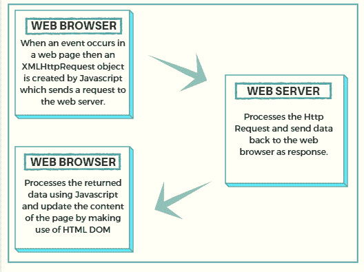

# AJAX 教程:什么是 AJAX 以及如何使用它

> 原文：<https://www.freecodecamp.org/news/ajax-tutorial/>

## **什么是 AJAX？**

****AJAX**** 代表 ****异步 JavaScript 和 XML**** 。它不是一种编程语言。它是一种使用 HTML、CSS、JavaScript 和 XML 开发更好、更快和交互式网络应用的技术。

1.  HTML:超文本标记语言(HTML)用于定义 Web 应用程序的结构。
2.  CSS:级联样式表(CSS)用于为 Web 应用程序提供外观和样式。
3.  JavaScript : JavaScript 用于使 Web 应用程序具有交互性、趣味性和用户友好性。
4.  XML:可扩展标记语言(XML)是一种从 Web 服务器存储和传输数据的格式。

### AJAX 中的异步是什么意思？

异步意味着 Web 应用程序可以在不刷新页面的情况下从 Web 服务器发送和接收数据。这个从服务器发送和接收数据以及更新网页不同部分的后台过程定义了 AJAX 的异步属性/特性。

## AJAX 如何工作

AJAX 利用浏览器内置的 ****XMLHttpRequest 对象**** 向 Web 服务器请求数据，利用 ****HTML DOM**** 显示或使用数据。

****XMLHttpRequest 对象**** :它是一个对象形式的 API，其方法帮助在网络浏览器和网络服务器之间传输数据。

****HTML DOM**** :当网页被加载时，浏览器创建该页面的文档对象模型。



****创建 XMLHttpRequest 对象:****

```
var xhttp = new XMLHttpRequest();
```

****XMLHttpRequest 对象属性:****

`readystate`是 XMLHttpRequest 对象的属性，用于保存 XMLHttpRequest 的状态。

*   0:请求未初始化
*   1:服务器连接已建立
*   2:请求已收到
*   3:处理请求
*   4:请求完成，响应就绪

“onreadystatechange”是 XMLHttpRequest 对象的一个属性，它定义了 readyState 属性更改时要调用的函数。“状态”是 XMLHttpRequest 对象的一个属性，它返回请求的状态号

*   200:“好的”
*   403:“禁止”
*   404:“未找到”

****XMLHttpRequest 对象方法:**** 要向 Web 服务器发送请求，我们使用 XMLHttpRequest 对象的 open()和 send()方法。

```
xhttp.open("GET", "content.txt", true);
xhttp.send();
```

****使用 JavaScript 创建函数 change content():****

```
function changeContent() {
  var xhttp = new XMLHttpRequest();
  xhttp.onreadystatechange = function() {
    if (this.readyState == 4 && this.status == 200) {
     document.getElementById("foo").innerHTML = this.responseText;
    }
  };
  xhttp.open("GET", "content.txt", true);
  xhttp.send();
}
```

****AJAX 改变网页内容的例子:****

```
<!DOCTYPE html>
<html>
<body>

<div id="foo">
<h2>The XMLHttpRequest Object</h2>
<button type="button" onclick="changeContent()">Change Content</button>
</div>

<script>
function changeContent() {
  var xhttp = new XMLHttpRequest();
  xhttp.onreadystatechange = function() {
    if (this.readyState == 4 && this.status == 200) {
      document.getElementById("foo").innerHTML =
      this.responseText;
    }
  };
  xhttp.open("GET", "content.txt", true);
  xhttp.send();
}
</script>

</body>
</html>
```

文件`content.txt`应该出现在 Web 应用程序的根目录中。