# 完成平方公式:如何用二次方程完成平方

> 原文：<https://www.freecodecamp.org/news/how-to-complete-the-square-a-method-for-completing-the-square/>

考虑以下二次方程: ***x ² = 9*** 。如果要求求解，我们自然会取 ***9*** 的平方根，最后得到 ***3*** 和 ***-3*** 。但是如果简单的平方根方法不行呢？如果等式包含 ***x*** 的一次幂，并且不能轻易分解，那该怎么办？

幸运的是，有一个**完成正方形**的方法。结果，一个二次方程可以通过求平方根来求解。让我们一起一步一步来探索这个。

假设我们有以下等式:

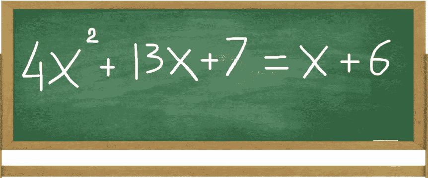

Given equation: 4x² + 13x + 7 = x + 6

## 示例 1:完成正方形

### 步骤 1:将可变项与常数项分开

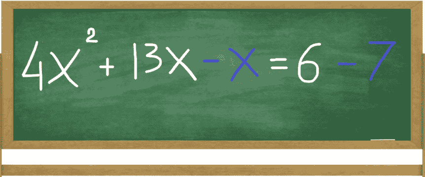

Separate terms to simplify: 4x² + 13x **- x** = 6 **- 7**

让我们简化我们的等式。首先，将包含变量的项与常数项分开。接下来，从 **13x** 中减去 **x** (结果为 **12x** )，从 **6** 中减去 **7** (结果为 **-1** )。

### 第二步:确保 X 平方的系数等于 1

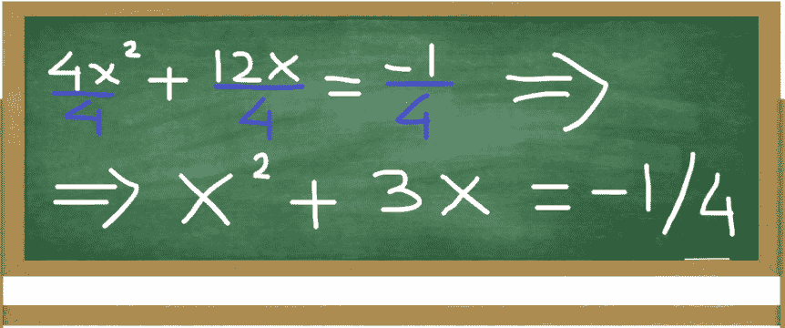

Divide by the term of x² : x² + 3x = -1/4

当系数**x²等于 **1** 时，完成平方的方法要容易得多。我们这里的系数等于 **4** 。将 **4** 分成每个成员，结果是 **x ² + 3x = - 1/4** 。**

### 第三步:完成正方形

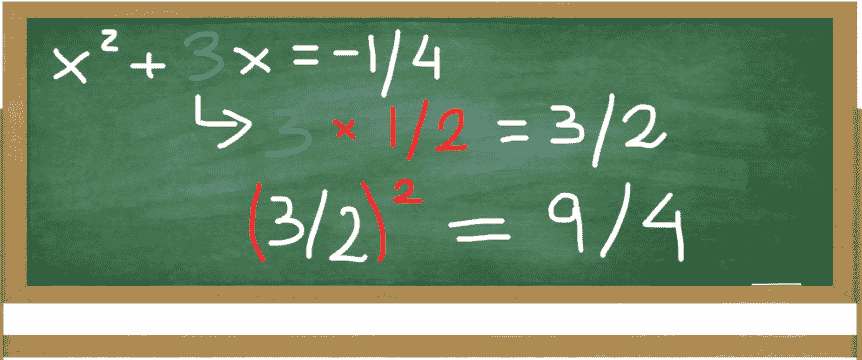

The coefficient of x is divided by 2 and squared: (3 / 2)² = 9/4

首先我们需要找到我们的完全平方的常数项。系数 **x** ，等于 **3** 除以 **2** 并平方，得到 **9/4** 。

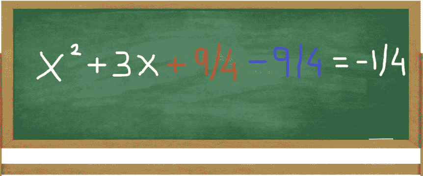

The resulting 9/4 is added and subtracted: x² + 3x + 9/4 - 9/4 = -1/4

然后我们加减 **9/4** 如上图。这样做并不影响我们的等式( **9/4 - 9/4 = 0** )，而是给我们一个完全平方 **x ² + 3x + 9/4** 的表达式。

### 步骤 4:对表达式 X 的平方+ 3X + 9/4 进行因式分解

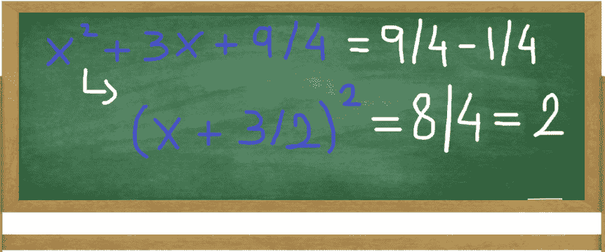

Factoring x² + 3x + 9/4 gives us (x + 3/2)²

现在让我们记住一个更一般的**(x+a)²= x²+2ax+a²**并用在当前的例子中。代入我们的数字得到:**x²+3x+9/4 = x²+2 *(3/2)* x+(3/2)²=****(x+3/2)²**。

### 第五步:求平方根

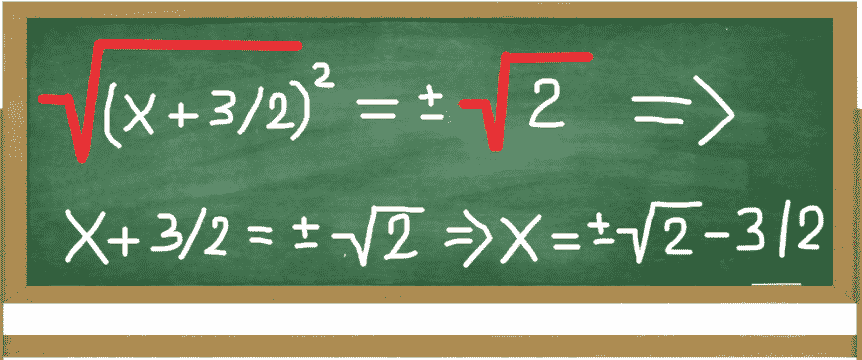

Taking the square root: ((x + 3/2)²)^(1/2) = (2)^(1/2). x = 2^(1/2) - 3/2 & x = -2^(1/2) - 3/2

最后，两边取平方根得到 **√(x + 3/2) ² = √2** 。或者干脆 **x + 3/2 = √2** 。我们通过求解**X**:**X[1]=√2-3/2***和 **X [2] = - √2 - 3/2 *得出这个结论。****

## *例 2:再来解一个*

*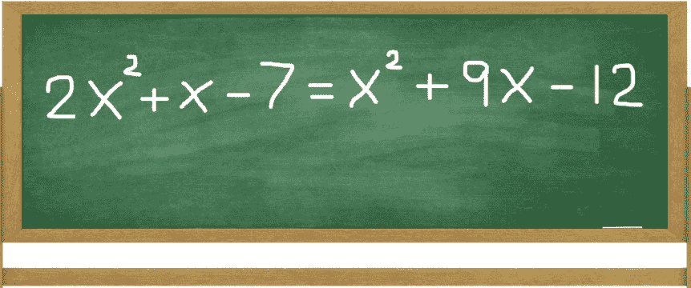

Given equation: 2x² + x - 7 = x² + 9x - 12* 

### *步骤 1:将可变项与常数项分开*

*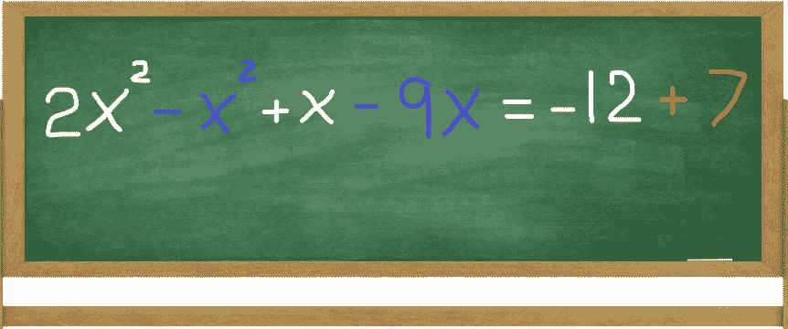

Separate terms to simplify: 2x² **- x²** + x **- 9x** = -12 **+ 7*** 

*通过将变量项与常数项分开来简化。然后对等式两边执行减法和加法。*

### *第二步:确保 x 平方的系数等于 1*

*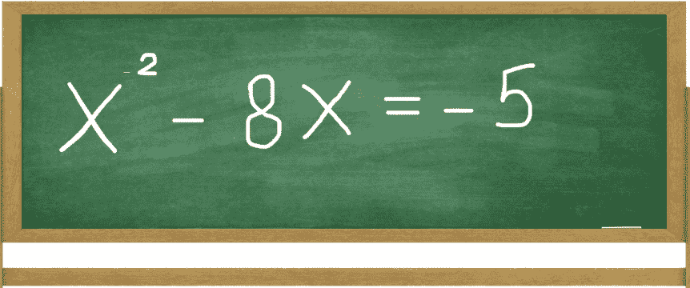

The coefficient of x² is equal to 1* 

*这里，**X²的系数已经等于 **1** ，所以不需要进一步的动作。***

### *第三步:完成正方形*

*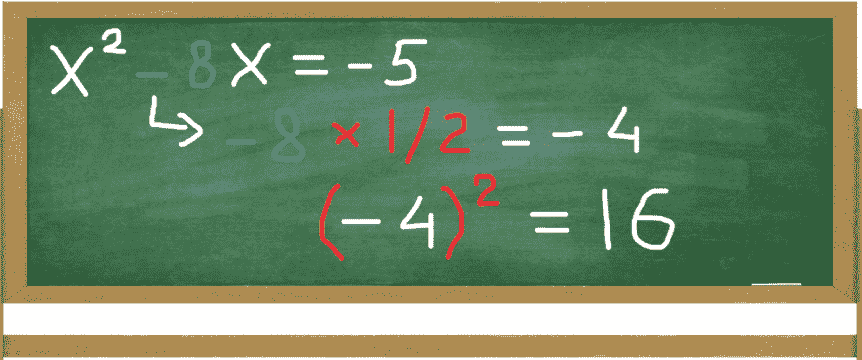

The coefficient of x is divided by 2 and squared: (-8 / 2)² = 16* 

*和前面的例子一样，我们找到了完全平方的常数项。系数 **x** ，等于 **-8** 除以 **2** 并平方，得到 **16** 。*

*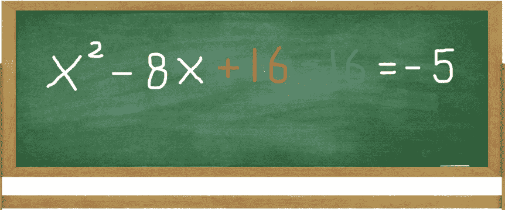

The resulting 16 is added and subtracted: x² - 8x + 16 - 16 = -5* 

*我们加减 **16** 可以看到 **x ² - 8x + 16** 给了我们一个完整的正方形。*

### *步骤 4:对表达式 X 的平方进行因子分解- 8X + 16*

*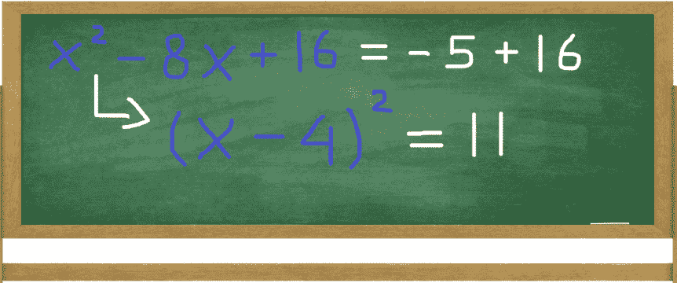

Factoring x² - 8x + 16 gives us (x - 4)²* 

*由于常数项 **-8** 是带负号的，所以我们用这个一般形式:**(x-a)²= x²-2ax+a²**。使用我们的数字我们得到:**x²-8x+16 = x²-2 *(4)* x+(4)²=(x-4)²**。*

### *第五步:求平方根*

*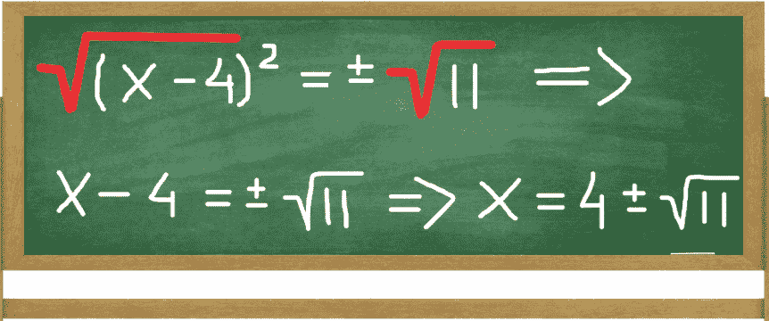

Taking the square root: ((x - 4)²)^(1/2) = (11)^(1/2). x = 4 + 11^(1/2) & x = 4 - 11^(1/2)* 

*最后，两边取平方根得到 **√(x - 4) ² = √11** 。或者干脆 **x - 4 = √11** 。我们通过求解***X***:**X[1]= 4+√11***和 **X [2] = 4 - √11** 得出结论**

**现在你知道了！**