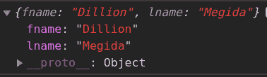
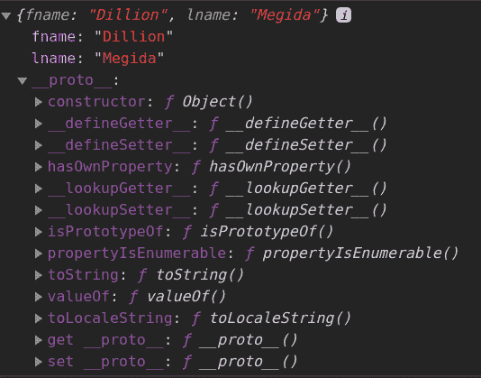
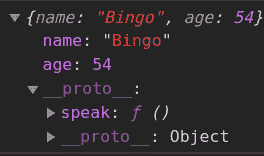
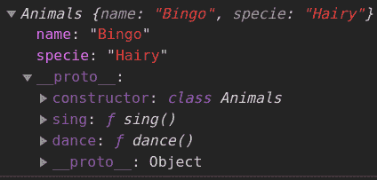
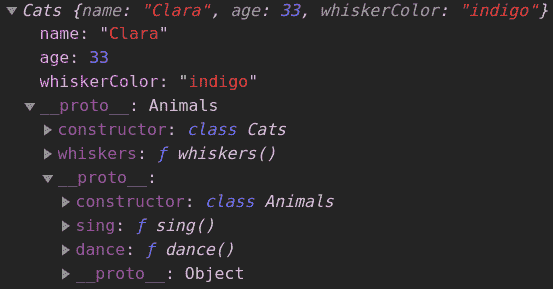

# JavaScript 中的面向对象编程——举例说明

> 原文：<https://www.freecodecamp.org/news/how-javascript-implements-oop/>

JavaScript 不是基于类的面向对象语言。但是它仍然有使用面向对象编程(OOP)的方法。

在本教程中，我将解释 OOP 并向您展示如何使用它。

根据[维基百科](https://en.m.wikipedia.org/wiki/Class-based_programming)的说法，基于类的编程是

> 面向对象编程(OOP)的一种风格，通过定义对象类来实现继承，而不是仅通过对象来实现继承

最流行的 OOP 模型是基于类的。

但是正如我提到的，JavaScript 不是基于类的语言——它是基于原型的语言。

根据 Mozilla 的文档:

> 基于原型的语言有一个原型对象的概念，一个用作模板的对象，从这个模板中可以获得新对象的初始属性。

看一下这段代码:

```
let names = {
    fname: "Dillion",
    lname: "Megida"
}
console.log(names.fname);
console.log(names.hasOwnProperty("mname"));
// Expected Output
// Dillion
// false 
```

对象变量`names`只有两个属性- `fname`和`lname`。一点方法都没有。

那么`hasOwnProperty`从何而来？

嗯，它来自于`Object`原型。

尝试将变量的内容记录到控制台:

```
console.log(names); 
```

当您在控制台中展开结果时，您会看到:



console.log(names)

注意最后一个属性——`__proto__`？尝试扩展它:



The __proto__ property of names

您将在`Object`构造函数下看到一组属性。所有这些属性都来自全局`Object`原型。如果你仔细看，你还会注意到我们隐藏的`hasOwnProperty`。

换句话说，所有对象都可以访问`Object`的原型。他们不拥有这些属性，但是被授权访问原型中的属性。

## `__proto__`属性

这指向用作原型的对象。

这是每个对象上的属性，它使对象能够访问`Object prototype`属性。

默认情况下，每个对象都有这个属性，它引用`Object Protoype`，除非另外配置(也就是说，当对象的`__proto__`指向另一个原型)。

### 修改`__proto__`属性

这个属性可以通过明确声明它应该引用另一个原型来修改。以下方法用于实现这一点:

### `Object.create()`

```
function DogObject(name, age) {
    let dog = Object.create(constructorObject);
    dog.name = name;
    dog.age = age;
    return dog;
}
let constructorObject = {
    speak: function(){
        return "I am a dog"
    }
}
let bingo = DogObject("Bingo", 54);
console.log(bingo); 
```

在控制台中，您会看到:



console.log(bingo)

注意到`__proto__`属性和`speak`方法了吗？

`Object.create`使用传递给它的参数成为原型。

### `new`关键字

```
function DogObject(name, age) {
    this.name = name;
    this.age = age;
}
DogObject.prototype.speak = function() {
    return "I am a dog";
}
let john = new DogObject("John", 45); 
```

`john`的`__proto__`属性指向`DogObject`的原型。但是请记住，`DogObject`的原型是一个对象(**键和值对**)，因此它还有一个引用全局`Object`原型的`__proto__`属性。

这种技术被称为**原型链接**。

**注意:**`new`关键字方法做的事情和`Object.create()`一样，但只是因为它自动为你做了一些事情而变得更简单。

### 因此...

默认情况下，Javascript 中的每个对象都可以访问`Object`的原型。如果配置成使用另一个原型，比如说`prototype2`，那么`prototype2`在默认情况下也可以访问对象的原型，依此类推。

### 对象+功能组合

您可能会对这样一个事实感到困惑，即`DogObject`是一个函数(`function DogObject(){}`)，并且它具有用**点符号**访问的属性。这被称为**功能对象组合**。

当函数被声明时，默认情况下，它们被赋予了许多属性。记住函数也是 JavaScript 数据类型中的对象。

## 现在，同学们

JavaScript 在 ECMAScript 2015 中引入了`class`关键字。这使得 JavaScript 看起来像一种面向对象的语言。但是它只是现有原型技术上的合成糖。它在后台继续其原型，但使外部主体看起来像 OOP。我们现在来看看这是如何实现的。

以下示例是 JavaScript 中`class`的一般用法:

```
class Animals {
    constructor(name, specie) {
        this.name = name;
        this.specie = specie;
    }
    sing() {
        return `${this.name} can sing`;
    }
    dance() {
        return `${this.name} can dance`;
    }
}
let bingo = new Animals("Bingo", "Hairy");
console.log(bingo); 
```

这是控制台中的结果:



console.log(bingo)

`__proto__`引用了`Animals`原型(后者又引用了`Object`原型)。

由此我们可以看出，构造函数定义了主要特性，而构造函数之外的一切(`sing()`和`dance()`)都是附加特性(**原型**)。

在后台，使用`new`关键字方法，上面的内容翻译成:

```
function Animals(name, specie) {
    this.name = name;
    this.specie = specie;
}
Animals.prototype.sing = function(){
    return `${this.name} can sing`;
}
Animals.prototype.dance = function() {
    return `${this.name} can dance`;
}
let Bingo = new Animals("Bingo", "Hairy"); 
```

## 子类

这是 OOP 中的一个特性，一个类继承了父类的特性，但是拥有父类没有的额外特性。

这里的想法是，例如，假设您想要创建一个 *cats* 类。你可以从父类 *animals* 继承这些属性，而不是从头开始创建这个类——声明*名字*、*年龄*和*物种*属性。

这个*猫*类可以有额外的属性，比如胡须的*颜色*。

我们来看看子类是怎么用`class`做的。

这里，我们需要子类继承的父类。检查以下代码:

```
class Animals {
    constructor(name, age) {
        this.name = name;
        this.age = age;
    }
    sing() {
        return `${this.name} can sing`;
    }
    dance() {
        return `${this.name} can dance`;
    }
} 
class Cats extends Animals {
    constructor(name, age, whiskerColor) {
        super(name, age);
        this.whiskerColor = whiskerColor;
    }
    whiskers() {
        return `I have ${this.whiskerColor} whiskers`;
    }
}
let clara = new Cats("Clara", 33, "indigo"); 
```

通过以上操作，我们得到以下输出:

```
console.log(clara.sing());
console.log(clara.whiskers());
// Expected Output
// "Clara can sing"
// "I have indigo whiskers" 
```

当您在控制台中注销 clara 的内容时，我们有:



console.log(clara)

你会注意到`clara`有一个`__proto__`属性，它引用了构造函数`Cats`并访问了`whiskers()`方法。这个`__proto__`属性还有一个`__proto__`属性，它引用构造函数`Animals`，从而访问`sing()`和`dance()`。`name`和`age`是存在于由此创建的每个对象上的属性。

使用`Object.create`方法，上述内容转化为:

```
function Animals(name, age) {
    let newAnimal = Object.create(animalConstructor);
    newAnimal.name = name;
    newAnimal.age = age;
    return newAnimal;
}
let animalConstructor = {
    sing: function() {
        return `${this.name} can sing`;
    },
    dance: function() {
        return `${this.name} can dance`;
    }
}
function Cats(name, age, whiskerColor) {
    let newCat = Animals(name, age);
    Object.setPrototypeOf(newCat, catConstructor);
    newCat.whiskerColor = whiskerColor;
    return newCat;
}
let catConstructor = {
    whiskers() {
        return `I have ${this.whiskerColor} whiskers`;
    }
}
Object.setPrototypeOf(catConstructor, animalConstructor);
const clara = Cats("Clara", 33, "purple");
clara.sing();
clara.whiskers();
// Expected Output
// "Clara can sing"
// "I have purple whiskers" 
```

`Object.setPrototypeOf`是一个接受两个参数的方法——对象(第一个参数)和期望的原型(第二个参数)。

从上面可以看出，`Animals`函数返回一个以`animalConstructor`为原型的对象。`Cats`函数返回一个以`catConstructor`为原型的对象。另一方面，`catConstructor`被赋予了`animalConstructor`的原型。

因此，普通动物只能进入`animalConstructor`，而猫可以进入`catConstructor`和`animalConstructor`。

## 包扎

JavaScript 利用其原型特性欢迎 OOP 开发者加入其生态系统。它还提供了创建原型和组织相关数据的简单方法。

真正的 OOP 语言不会在后台执行原型开发——请注意这一点。

非常感谢 [Will Sentance](https://frontendmasters.com/teachers/will-sentance/) 的前端大师课程- [JavaScript:面向对象 JavaScript](https://frontendmasters.com/courses/object-oriented-js/) 的难点。我从他的课程中学到了你在这篇文章中看到的一切(加上一点额外的研究)。你应该去看看。

如有任何问题或意见，您可以在 Twitter 上打电话给我，电话号码是[iamdillon](https://twitter.com/iamdillion)。

感谢阅读: )

### 有用的资源

*   [面向对象的 JavaScript 初学者](https://developer.mozilla.org/en-US/docs/Learn/JavaScript/Objects/Object-oriented_JS)
*   [JavaScript 面向对象编程简介](https://www.geeksforgeeks.org/introduction-object-oriented-programming-javascript/)