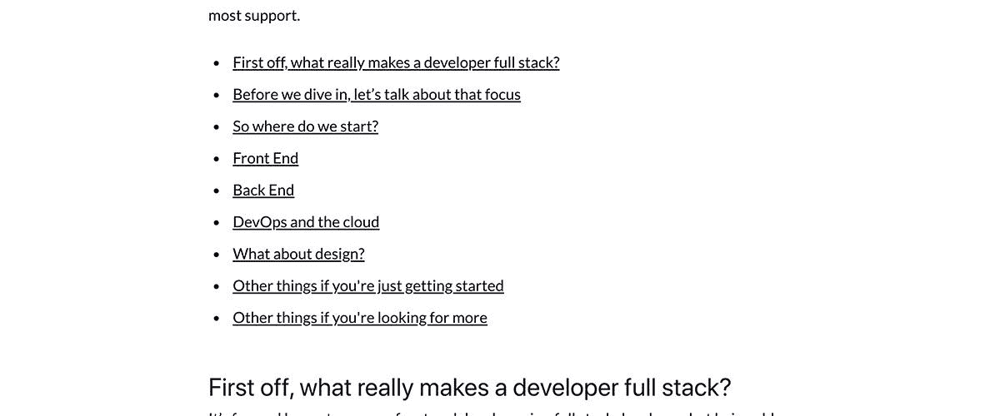
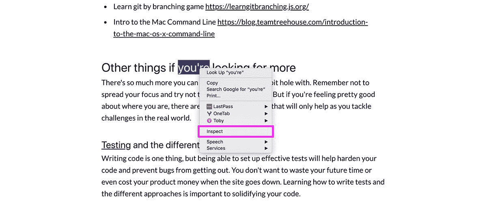
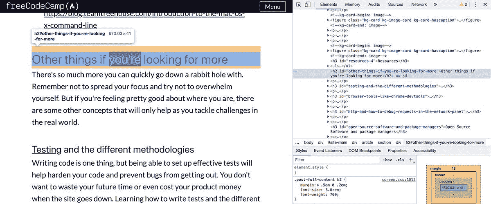
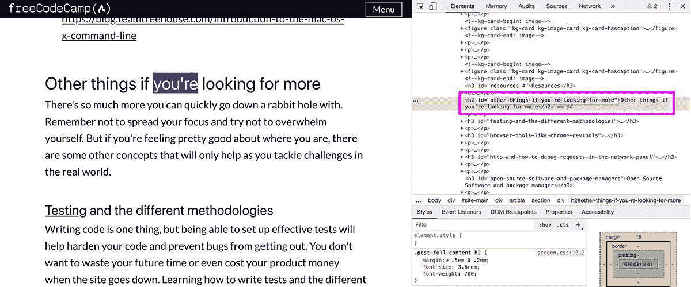
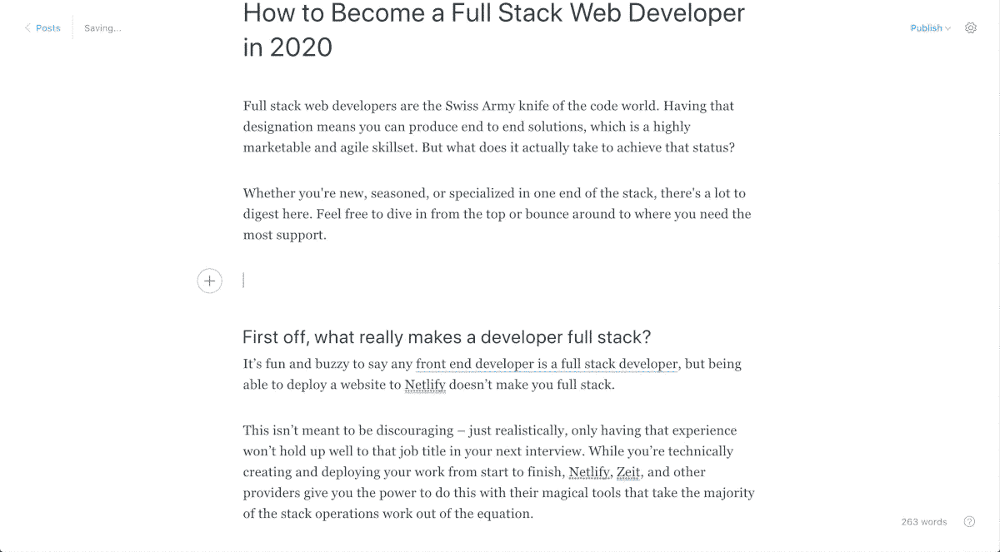
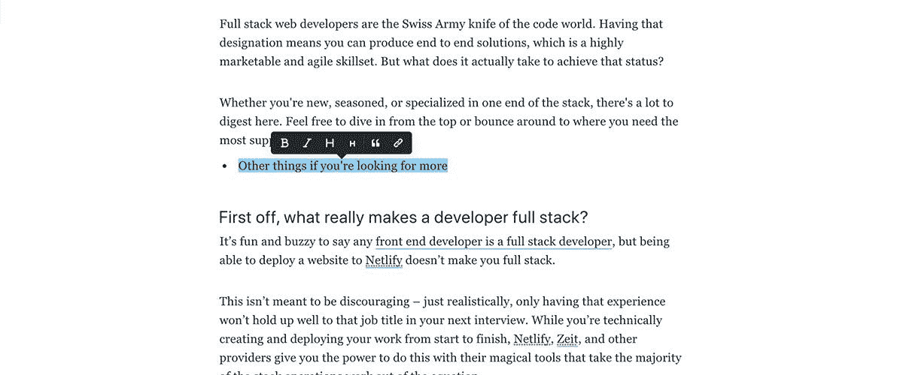
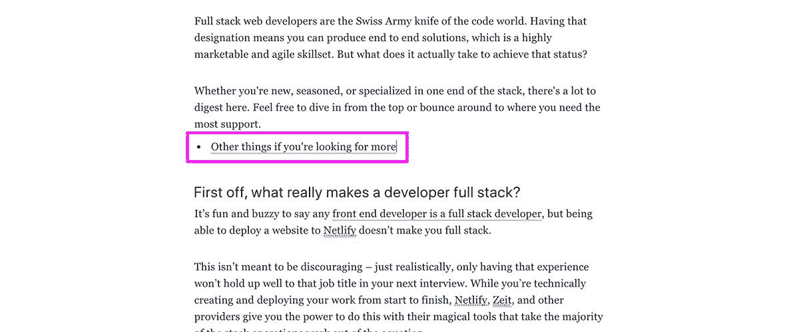
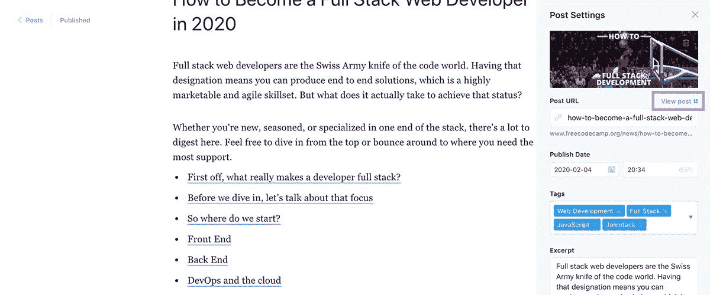
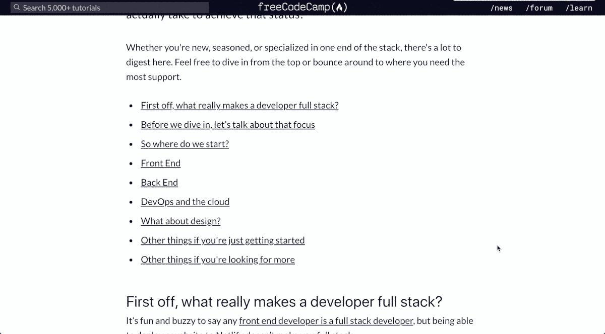

# 如何给你的博客文章或文章添加目录

> 原文：<https://www.freecodecamp.org/news/how-to-add-a-table-of-contents-to-your-blog-post-or-article/>

提供[目录](https://en.wikipedia.org/wiki/Table_of_contents)有助于在撰写较长文章时预览和优先排序内容。但并不是每个平台都很容易添加一个。当我们缺少一流的工具时，我们如何实现它呢？

想跳过“是什么”和“为什么”吗？[跳到“如何”](#how-can-we-add-a-table-of-contents)！

[https://www.youtube.com/embed/MsrNdjp0aKI?feature=oembed](https://www.youtube.com/embed/MsrNdjp0aKI?feature=oembed)

## 我们将要创造的



Blog post table of contents

出于本文的目的，我们将使用 freeCodeCamp.org 的内容管理器进行可视化和演示。freeCodeCamp/news 在写这篇文章的时候使用了博客平台 [Ghost](https://ghost.org/) ，但是这个方法真的可以适用于你写的任何文章。

## 为什么这很有帮助？

提供目录有助于提高人们阅读你的文章的体验。

### 它给读者一个文章的预览

投入到一篇文章中，至少是一篇很长的文章，可能是一个很大的时间承诺。没有人愿意早上花上 20 分钟才发现自己钻研的一篇文章并没有真正回答他们的问题。或者这是他们已经是专家的事情的翻版(尽管不同的观点仍然是有帮助的)。

通过提供这种预览，你可以帮助人们在开始阅读时对将要发生的事情有所了解。它允许他们优先考虑他们必须阅读的其他文章。

### 它提供了跳转到特定内容的锚点

类似于提供预览，也许有人想要阅读页面的特定部分。也许是因为他们可以跳过教程的前几个部分，或者他们来自同事在 [Slack](https://slack.com/) 中分享的链接。

关键是，人们可以使用目录跳到对他们更重要的部分。

### 额外收获:作为一名作者，这有助于你

出于许多实际原因，提供目录可能没有帮助，但它是一个额外的工具，可以让你优先考虑和理解你的帖子内容。这是一个高层次的大纲，你可以参考它来确定你的故事流程是否有意义。

## 它没有做什么

不幸的是，这是一个手动过程。这个目录不会在你修改内容的时候神奇地更新。因此，在编辑过程中一定要保持警惕，并在发布前更新任何断开的链接或添加和删除任何更改。

## 我们如何添加目录？

### 内容标题和锚链接

这个解决方案的关键是在构建文章页面时，利用应用于 HTML 中内容标题的内置`id`属性。使用这些属性，我们可以创建一个[锚链接](https://www.w3.org/TR/REC-html40/struct/links.html#h-12.2.3)，它将浏览器的滚动位置向下跳转到带有那个`id`的元素的位置。

HTML 的一个基本示例如下:

```
<ul>
  <li><a href=“#my-id”>Link to My ID</a></li>
</ul>
<article>
  <p>Super long content</p>
  <h2 id=“my-id”>Important Thing</h2>
  <p>Important content</p>
</article> 
```

在上面的内容中，我们可以看到我们的`article`包含一些基本内容(想象一下它比上面的内容长得多),后面还有一个`h2`跟随着我们的重要内容。

通过为我们的`h2`提供`id`属性，我们现在可以通过将`href`设置为`#[id]`的模式来创建一个链接，该模式将跳转到页面中的该元素。

现在，当在我们的博客平台中创建它时，我们不一定需要担心编写这个 HTML。但是我们确实需要了解如何找到`id`来创建我们的链接。

### 查找我们的标题 ID

我们可以使用浏览器的开发工具( [Chrome](https://developers.google.com/web/tools/chrome-devtools) ， [Firefox](https://developer.mozilla.org/en-US/docs/Tools) )很容易地找到我们宝贵的`id`属性来创建我们的链接。

使用您最喜欢的浏览器，找到您想要使用的标题，右键单击文本，然后从上下文菜单底部选择“检查”(或“检查元素”)。



Using Chrome to inspect a page's HTML

从那里，您会注意到一个面板从页面的底部或侧面弹出。这个面板的位置没有太大关系——它只是一个[用户设置](https://developers.google.com/web/tools/chrome-devtools/customize/placement)。但是我们现在可以看到页面的 HTML，其中突出显示了 header 元素。



Previewing a page's HTML using Chrome developer tools

在 HTML 中找到我们的头之后，找到`id`属性。双击它的内容，复制我们一会儿要用到的值。



Selecting the id attribute using Chrome developer tools

### 创建到我们标题的链接

因为我们要创建一个目录，让我们打开文章的编辑器页面，滚动到页面顶部。

我们要做的第一件事是创建一个列表，在开始一个新的内容部分时，我们可以通过键入一个星号`*`后跟一个空格来实现。



Adding a new list using Markdown in Ghost

接下来，写下你希望你的链接要表达的内容。在目录中，链接通常与标题本身是完全相同的文本。

在它说出您想要的内容后，高亮显示整行，一个小的上下文菜单将出现在您的选择上方。



Opening the rich text formatting menu

选择小链接图标，上下文菜单将变成一个文本字段。在文本字段中键入一个 hashtag `#`，后跟您在上面的标题中找到的`id`属性的内容。


Adding or editing a link

点击回车键并成功！我们有联系。



List with link

重复上述步骤，为您想要链接的每个顶级标题创建一个链接。

不过，不要觉得你需要走极端。通常你会看到博客文章只包括页面的顶层标题，所以不要觉得你需要包括每个子标题。最终——做你觉得舒服的事情。

## 测试和预览目录

一旦我们添加完所有链接，我们就可以预览或查看我们的帖子，并测试我们的链接是否有效。



Previewing or viewing post in Ghost on freecodecamp.org/news

打开预览或页面后，滚动到目录或链接并单击它进行测试。



Using a table of contents

成功！

## 更多创作工具

目录只是帮助读者享受你辛勤工作的一种方式。您还使用哪些对您的工作流程很重要的工具？有没有其他你见过但可能不确定如何自己实现的？

在 Twitter 上与我们分享，地址: [@colbyfayock](https://twitter.com/colbyfayock) 和 [@freecodecamp](https://twitter.com/freecodecamp) ！

[](https://twitter.com/colbyfayock)

*   [？在 Twitter 上关注我](https://twitter.com/colbyfayock)
*   [？️订阅我的 Youtube](https://youtube.com/colbyfayock)
*   [✉️注册我的简讯](https://www.colbyfayock.com/newsletter/)