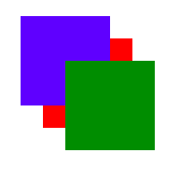

# CSS 中的 z 索引:它是什么和做什么

> 原文：<https://www.freecodecamp.org/news/z-index-in-css-what-it-is-and-what-it-does/>

## **什么是 Z 指数？**

Z Index ( `z-index`)是一个 CSS 属性，定义了 HTML 元素重叠的顺序。具有较高索引的元素将被放置在具有较低索引的元素之上。

****注意**** : Z index 只作用于已定位的元素(`position:absolute`、`position:relative`或`position:fixed`)。

#### **可能值**

```
/* Default value if not specified */
z-index: auto;

/* Integer values */
z-index: 1;
z-index: 100;
z-index: 9999;
z-index: -1;

/* Global values */
z-index: inherit;
z-index: initial;
z-index: unset;
```

## 如何使用 Z 索引

在这个例子中，您可以看到使用`z-index`以不同的顺序显示在彼此之上的三个框。

*HTML*

```
<div class="container">
  <div class="box" id="blue"></div>
  <div class="box" id="red"></div>
  <div class="box" id="green"></div>
</div>
```

*CSS*

```
#blue {
  background-color: blue;
}

#red {
  background-color: red;
}

#green {
  background-color: green;
}
```

由于没有定义`z-index`，它将有一个默认值`auto`。这是一个结果:


尝试使用`z-index`将 CSS 中的顺序更改为绿色、蓝色、红色。

```
#blue {
  background-color: blue;
  z-index: 2;
}

#red {
  background-color: red;
  z-index: 1;
}

#green {
  background-color: green;
  z-index: 3;
}
```

您的结果将是:



如果需要将背景元素放在容器下面，请使用 Z 索引。您可以很容易地将背景放在每个元素下，方法是给它一个负的 Z 索引，如下所示:

```
#background {
  z-index: -1;
}
```