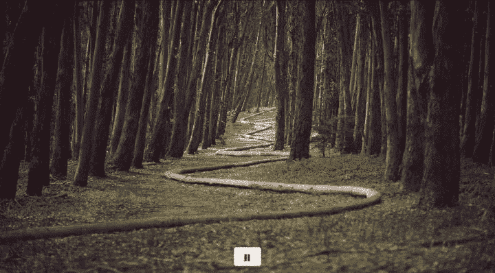

# 如何用 jQuery 构建图像滑块

> 原文：<https://www.freecodecamp.org/news/how-to-build-an-image-slider-with-jquery/>

本教程将带你使用 [jQuery](https://jquery.com/) 库构建一个图像滑块。



本教程将包含四个部分:

*   [HTML](https://guide.freecodecamp.org/miscellaneous/guide-to-build-a-sliding-image-gallery/#html)
*   [SCSS](https://guide.freecodecamp.org/miscellaneous/guide-to-build-a-sliding-image-gallery/#scss)
*   [JS](https://guide.freecodecamp.org/miscellaneous/guide-to-build-a-sliding-image-gallery/#js)
*   [参考文献](https://guide.freecodecamp.org/miscellaneous/guide-to-build-a-sliding-image-gallery/#references)

## **HTML**

在本教程中，我们将使用 [Bootstrap](http://getbootstrap.com/) 来保持事情看起来不错，而不会花费很多时间。

我们的结构如下:

```
<div class="container">

  <!-- The wrapper for our slider -->
  <div class="slider">
    <ul class="slides"><!-- Each image will be inside this unordered list --></ul>
  </div>

  <div class="buttons"><!-- Pause and play buttons will go in here --></div>

</div>
```

在我们的`ul`和`slides`的类中，我们将有如下内容:

```
<li class="slide"></li>
<li class="slide"></li>
<li class="slide"></li>
<li class="slide"></li>
<li class="slide"></li>
```

在我们的`.buttons`类中，您应该有以下内容:

```
<button type="button" class="btn btn-default pause">
	<span class="glyphicon glyphicon-pause"></span>
</button>
<button type="button" class="btn btn-default play">
	<span class="glyphicon glyphicon-play"></span>
</button>
```

这里有一个你的`html`应该是什么样子的例子:

注意:您应该用自己的内容替换 image `src`属性。

```
<div class="container">

  <div class="slider">
    <ul class="slides">
      <li class="slide"></li>
      <li class="slide"></li>
      <li class="slide"></li>
      <li class="slide"></li>
      <li class="slide"></li>
    </ul>
  </div>

  <div class="buttons">
    <button type="button" class="btn btn-default pause">
      <span class="glyphicon glyphicon-pause"></span>
    </button>
    <button type="button" class="btn btn-default play">
      <span class="glyphicon glyphicon-play"></span>
    </button>
  </div>

</div>
```

## **SCSS**

我们使用了 [Sass](http://sass-lang.com/) 和 SCSS 语法，因此我们可以嵌套和使用变量


我们可以使用以下 SCSS 来定义我们的风格:

```
// Variables
$width: 720px;

.slider {
  width: $width;
  height: 400px;
  overflow: hidden;
  margin: 0 auto;
  text-align: center;

  .slides {
    display: block;
    width: 6000px;
    height: 400px;
    margin: 0;
    padding: 0;
  }

  .slide {
    float: left;
    list-style-type: none;
    width: $width;
    height: 400px;

    img {
      width: 100%;
      height: 100%;
    }
  }
}

.buttons {
  margin: 0;
  width: $width;
  position: relative;
  top: -40px;
  margin: 0 auto;

  .play {
    display: none;
  }

  .btn {
    display: flex;
    margin: 0 auto;
    text-align: center;
  }
}
```

## **JS**

#### **变量**

在下面的代码片段中，我们定义了稍后在代码中使用的变量。

```
var animationSpeed = 1000; // How quickly the next slide animates.
var pause = 3000; // The pause between each slide.
```

我们将使用一个空白变量来调用`setInterval`方法:

```
var interval;
```

#### **动画我们将把滑块动画封装在一个函数中:**

```
function startSlider() {}
```

我们使用了`setInterval()`本地 JavaScript 方法来自动化基于时间的触发器的功能内容。

```
interval = setInterval(function() {}, pause);
```

我们使用`pause`变量来查看在再次调用函数之前要等待多少毫秒。在这里阅读更多关于本机`setInterval`方法的内容:[https://developer . Mozilla . org/en-US/docs/Web/API/window timers/setInterval](https://developer.mozilla.org/en-US/docs/Web/API/WindowTimers/setInterval)。在我们的函数中，我们将使用 jQuery 以 animationSpeed 变量的速度在幻灯片之间淡入淡出:

```
$('.slides > li:first')
  .fadeOut(animationSpeed)
  .next()
  .fadeIn(animationSpeed)
  .end()
  .appendTo('.slides');
```

我们使用`$('.slides > li:first')`瞄准第一张幻灯片。- `.fadeOut(animationSpeed)`将淡出第一张幻灯片，然后使用`.next()`，我们移动到下一张幻灯片。-一旦我们移到下一张幻灯片，我们将淡入:`.fadeIn(animationSpeed)`。——这个序列将一直持续到最后一张幻灯片(`.end()`)，然后我们停止动画。我们现在将调用`startSlider`函数来启动动画:

start slider()；

#### **播放和暂停*这个功能是可选的，但是很容易实现。*我们将隐藏播放按钮，这样我们就看不到播放和暂停按钮:**

```
$('.play').hide(); // Hiding the play button.
```

我们现在将创建暂停按钮(在页面加载时自动显示):

```
$('.pause').click(function() {
	clearInterval(interval);
	$(this).hide();
	$('.play').show();
});
```

我们将在每次使用 jQuery 点击暂停按钮时调用我们的函数。-我们将使用`clearInterval`方法删除间隔，并使用我们的`interval`变量作为参数，指示停止哪个间隔。-因为我们的滑块是暂停的，我们将使用`$(this).hide();`隐藏暂停按钮。注意:我们使用的是`this`，它指的是我们的父母正在调用的东西，即`.pause`。-然后我们将显示播放按钮，这样用户可以继续播放动画:`$('.play').show();`。以下代码设置了我们的播放按钮(在页面加载时自动隐藏):

$('.玩’)。click(function(){ start slider()；$(这个)。hide()；$('.暂停’)。show()；});

我们将在每次使用 jQuery 点击播放按钮时调用我们的函数。

*   我们将使用`startSlider`功能开始或重新开始间隔。
*   因为我们的滑块当前正在播放，我们将使用`$(this).hide();`隐藏播放按钮。注意:我们使用的是`this`，它指的是我们的父母正在调用的东西，即`.play`。
*   然后我们将显示暂停按钮，这样用户可以随意停止动画:`$('.pause').show();`。

## **参考文献**

*   在 [CodePen](https://codepen.io/atjonathan/pen/BKMxxq) 上查看本教程的源代码和示例。