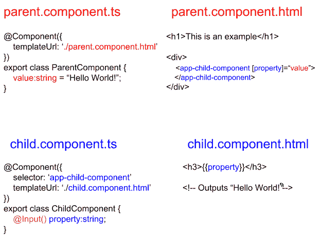
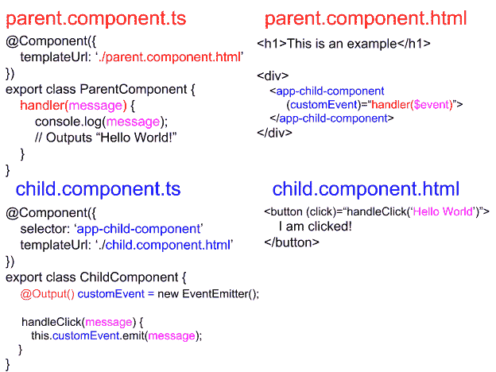

# 角度解释中的数据绑定

> 原文：<https://www.freecodecamp.org/news/data-binding-in-angular-explained/>

# **数据绑定**

### 动机

数据通常定义了应用程序的外观。将数据解释到用户界面中涉及到类逻辑(`.component.ts`)和模板视图(`.component.html`)。Angular 通过数据绑定将它们连接起来。将数据绑定视为组件交互的工具。

### 组件和模板

组件将大部分逻辑和数据存储在用`@Component`修饰的类中。这个装饰器用模板 HTML 将类定义为一个组件。组件的模板表示应用程序中的类。这里的重点需要放在组件的类和模板 HTML 之间。

这就是数据绑定发生的地方。元素属性和事件获得指定的值。这些由组件类定义的值有两种作用。一个是生成模板随后接收的数据。另一个处理模板元素发出的事件。


试着用这张图片作为下一部分的思维模型。

### 装订方向

数据绑定有两种方式:单向和双向。Angular 技术上只使用单向数据流。双向流动最终是单向的。它发生在单向流的两个应用中，每个方向一次。稍后会详细介绍。

单向流定义了单向交互。要么组件向模板发送数据，要么模板向组件逻辑发出事件。模板范围内的数据更改不会渗透到组件类。事件发出是从模板元素开始的单向事务。

双向构成两个方向。这意味着对类逻辑或模板 HTML 中的数据的更改会相互保持。变更的范围是组件的视图。视图包括组件的类和模板。

### 元素属性

为了识别数据绑定元素属性，Angular 使用了特殊的括号语法。

```
// my.component.ts
@Component({
  templateUrl: './my.component.html'
})

export class MyComponent {
  value:type = /* some value of type */;
}
```

```
<!-- my.component.html -->
<any-element [property]=“value”>innerHTML</any-element>
```

在这一点上容忍我。

`[property]`镜像域对象模型(DOM)元素的对象节点中的属性。不要混淆对象属性和 DOM 元素的属性。属性(Properties)和特性(attributes)通常共享相同的名称，做相同的事情。然而，有一个明显的区别。

记住`attr` (attributes)是底层 DOM 对象的单个属性。它在 DOM 实例化时被声明，属性值与元素的定义相匹配。之后保持不变。每个属性在 DOM 对象节点中都有自己的键值字段。这些属性是可变的后实例化。

知道属性和性质的区别。这将有助于更好地理解 Angular 如何将数据绑定到属性(属性绑定)。Angular 几乎不会将数据绑定到元素的属性。例外情况非常罕见。最后一次:Angular 将组件数据绑定到属性，而不是属性！

回头参考这个例子，元素的属性赋值中的`[ … ]`有特殊的含义。括号显示`property`被绑定到赋值右边的`“value”`。

`value`在括号的上下文中也有特殊含义。`value`本身就是一个字符串文字。Angular 读取它并将其值与组件类成员进行匹配。Angular 将替换匹配成员属性的值。这当然是指托管模板 HTML 的同一个组件类。

数据从组件到模板的单向流动已经完成。括号内的产权转让对应的成员提供`value`。请注意，对组件类中成员值的更改会渗透到模板中。那是 Angular 的变化检测在起作用。模板范围内的更改对组件类成员没有影响。

要点:组件类提供数据，而模板显示数据。

我没有提到数据值也可以显示在组件的`innerHTML`中。最后一个例子实现了双花括号。Angular 识别这些括号，并将匹配的组件类数据插入到`div`的`innerHTML`中。

```
<div>The value of the component class member ‘value’ is {{value}}.</div>
```

### 事件处理

如果组件提供数据，则模板提供事件。

```
// my.component.ts
@Component({
  templateUrl: './my.component.html'
})

export class MyComponent {
  handler(event):void {
      // function does stuff
  }
}
```

```
// my.component.html
<any-element (event)=“handler($event)”>innerHTML</any-element>
```

这类似于属性绑定。

`(event)`属于任何有效的事件类型。例如，最常见的事件类型之一是`click`。当你*点击鼠标*时，它就会发出声音。不管是哪种类型，示例中的`event`都会绑定到`“handler”`。事件处理程序通常是组件类的成员函数。

`( … )`是有棱角的特殊。圆括号告诉 Angular 一个事件被有界到右边赋值的`handler`。事件本身源于宿主元素。

当事件发出时，它以`$event`的形式传递事件对象。`handler`映射到组件类的同名`handler`函数。从事件绑定元素到组件类的单向交换已经完成。

从处理程序发出事件虽然可能，但不会影响模板元素。绑定毕竟是单向的。

### 双向绑定

输入表单提供了一个很好的例子来说明为什么双向绑定是必要的。双向数据绑定比事件或属性绑定开销更大。

双向数据绑定有自己的模块。在看这个之前，考虑下面的例子。

```
// my.component.ts
@Component({
  templateUrl: './my.component.html'
})
export class MyComponent {
  inputValue:string = "";

  handler(event) {
      this.inputValue = event.target.value;
  }
}
```

```
<!-- my.component.html -->
<input (input)=“handler($event)” [value]=“inputValue”>
```

是时候打破这个了。

这个例子结合了前面两个例子。这解释了为什么它更昂贵。按照这个逻辑，假设用户在 input 元素中输入了一些内容。元素向模板组件类的`handler`发出一个`input`事件。处理程序将类成员`inputValue`分配给发出的事件的值。事件处理/绑定到此结束。

现在讨论属性绑定。`inputValue`被赋予一个新值。由于`inputValue`被绑定到输入元素的`value`，它的数据变化渗透到输入元素的`value`属性中。输入元件的`value`与`inputValue`匹配。属性绑定到此结束。

这就是了。双向数据绑定发生在连续应用单向绑定的两个应用中。尽管语法有点混乱。

谢天谢地，Angular 提供了`NgModel`来简化语法。下例与上例同义。

```
// my.component.ts
@Component({
  templateUrl: ‘./my.component.html’
})

export class MyComponent {
  inputValue:string = "";
}
```

```
<!-- my.component.html -->
<input [(ngModel)]=“inputValue”>
```

是一个很好的便利。在使用 FormsModule 之前，必须将其导入到应用程序的根目录中。有了这些，双向数据绑定就变得更容易使用了。

为了巩固你所学的，看看这张来自官方[角度文档¹的图片。](https://angular.io/guide/architecture-components#data-binding)


你可以用这张图片直观地总结到目前为止的一切。Angular 的文档中还有很多其他值得一看的图片。考虑到本文的范围，这一条应该足够了。

### 组件到组件

要跨不同组件绑定数据和事件，必须使用@Input 和@Output 装饰器。角度组件是私有的。组件的任何成员都不能从其本机视图之外的任何地方访问。

@Input decorator 表示成员的值来自父函数。这需要可视化才能更好的理解。



注意父代的`value`成员传递到子代的`property`成员中。如果`property`没有@Input decorator，这是不可能的。Angular 编译器依赖于它。

另一个@Output 的例子展示了一个事件是如何从子节点传递到父节点的。请记住,@Output 几乎总是与自定义事件绑定相关。



如果您想要复制这些例子中的任何一个，请确保从`@angular/common`中导入`EventEmitter`、`@Input`和`@Output`。

## 结论

这是停下来的好地方。数据绑定跨越了广泛的用例。这个话题值得在 [Angular 的网站](https://angular.io/)上进一步探讨。这些并不是在 Angular 中操作数据的唯一方法。有关更多信息，请参见参考资料中的链接。