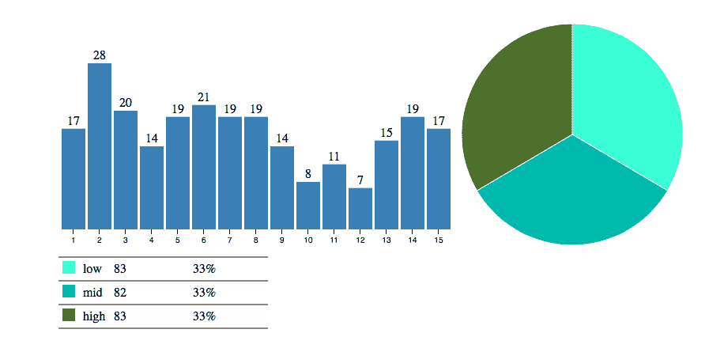
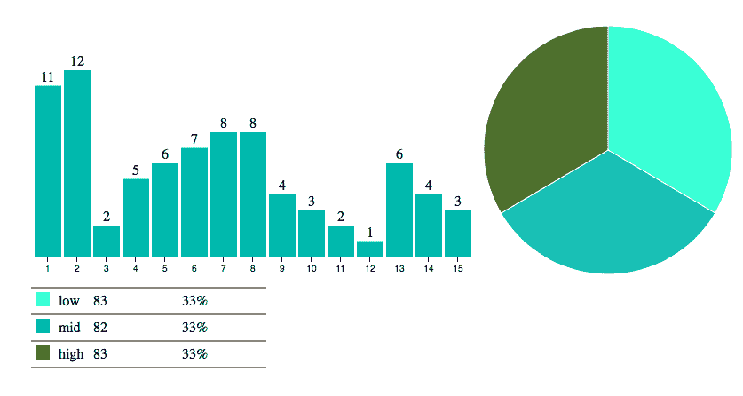
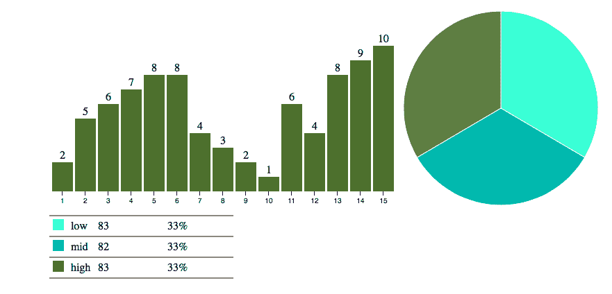
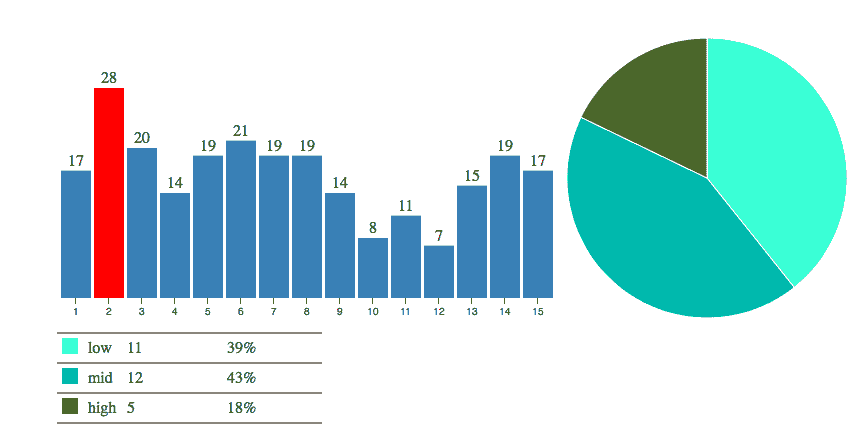

# 用 D3.js 学习基本的数据可视化

> 原文：<https://www.freecodecamp.org/news/learn-basic-data-visualization-with-d3-js/>

## **我们的目标是学习数据的基础知识**

通过这个项目，您将学习使用 D3 进行数据可视化的基础知识。

## **D3 . js 是什么？**

对于不熟悉 D3 的人来说，D3.js 是一个基于数据操作文档的 JavaScript 库。D3 帮助你使用 HTML、SVG 和 CSS 将数据变成现实。

D3.js 帮助您将数据附加到 DOM(文档对象模型)元素。然后，您可以使用 CSS3、HTML 和/或 SVG 展示这些数据。最后，您可以通过使用 D3.js 数据驱动的转换和转换来使数据具有交互性。

## **项目说明:**

### **场景:**

有一类在线学生与不同的主题进行互动，并就这些主题进行测验。

共有 15 个主题，每个主题都有许多学生参加了测验，他们的分数分为三类:低、中、高

### **例如(给定数据):**

题目:“1”，低:4，中:13，高:18

主题:“2”，低:11，中:12，高:6

题目:“3”，低:12，中:24，高:6 等等。

请注意，主题 1 有`4 + 13 + 8 = 35`名学生参加了测验，主题 2 有`11+12+6 = 29`名学生，主题 3 有 42 名学生，依此类推。

我们想制作交互式条形图和饼图。例如，鼠标悬停在其中一个条形上会相应地改变饼图，反之亦然。

通过条形图和饼图的交互组合，其中条形图显示了参与特定主题(参加测验)的学生人数，而饼图显示了该学生在“低、中、高”类别中的表现分类，我们可以可视化我们的数据并从中获得更多数据分析。

## **提示和资源:**

### **分步说明:**

[****D3 简介:****](https://d3js.org/) 在这里可以了解到 D3.js 中的选择、动态属性和转场

在主 javascript 函数中，编写一个函数来处理直方图(条形图)——直方图将显示参加了 15 个主题的测验(与该主题互动)的学生总数。

*   (这里是 [****教程****](https://bost.ocks.org/mike/bar/) ，在这里你可以学习如何使用 D3 JavaScript 库制作条形图。第一个教程教如何用 HTML 制作一个基本版本，然后用可缩放矢量图形(SVG)制作一个更完整的图表，最后是视图之间的动画转换。)
*   [为直方图创建 SVG](http://codepen.io/SundeepB/pen/CxveH)
*   为 x 轴映射创建函数，并将 x 轴添加到直方图 SVG
*   为 y 轴映射创建函数，并为直方图创建条形以包含矩形和主题标签。
*   创建矩形和主题标签
*   创建更新条形图的函数。这将由饼图使用

写一个函数来处理 pieChart。–饼图将有三个部分，分别代表得分的低、中、高。

*   [****教程****](http://zeroviscosity.com/d3-js-step-by-step/step-1-a-basic-pie-chart)
*   为饼图创建 svg。
*   创建函数来绘制饼图扇区的弧线-饼图扇区将是低、中和高
*   创建一个函数来计算饼图切片角度。
*   画饼图切片。
*   创建更新饼图的函数。这将由直方图使用。
*   计算所有主题的总频率。
*   按州计算所有区段的总频率。

## **数据分析的结果以及我们可以从可视化中推断出什么:**

*   初始饼图显示了所有学生在所有主题上的分数的总体分类，分为三类“低、中、高”
*   初始条形图显示就该特定主题进行互动的学生人数
*   从饼图中选择的任何类别都将更新条形图，显示在不同主题上进行互动的学生数量，这些主题的分数属于该特定类别。
*   下面的屏幕截图显示了鼠标分别悬停在饼图的“中间”部分和“高”部分，以及该特定部分的主题条形图和学生人数。

*   任何选定的条形图的酒吧将更新饼图显示分类的所有学生的分数在这一特定主题分为三个类别低，中，高。下面的屏幕截图显示鼠标悬停在主题 2 上，对于该特定主题，有多少学生属于低、中、高类别

