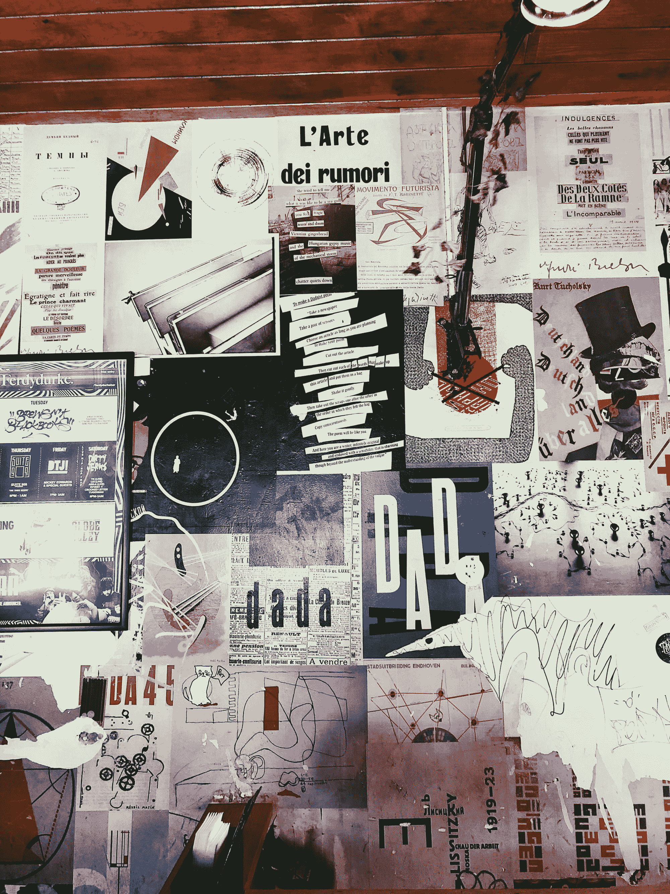
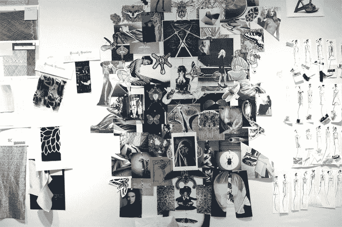

# 什么是情绪板？如何在 UX 设计中使用情绪板

> 原文：<https://www.freecodecamp.org/news/what-is-a-moodboard/>

## **什么是情绪板？**

情绪板是传达你对即将生产的产品的感受的一种方式。也是为了获得调色板和形状的灵感，以备后用。换句话说，情绪板[是作为参考点](http://www.creativebloq.com/graphic-design/mood-boards-812470)的与一个设计主题相关的纹理、图像和文本的集合。

创建一个情绪板真的很简单。有两种方式:手动或数字。

要创建手动情绪板，您需要:

*   你可以剪下不同的杂志、报纸、书籍和/或海报
*   纸
*   剪刀
*   胶

从寻找你认为能引起你未来产品共鸣的图像、形状、颜色和信息开始。把它们切掉。如果你已经剪下了所有你需要的东西，把它们放在纸上，然后粘起来。最终结果可能与此类似:

Photo by [Mace Hudson](https://unsplash.com/@macehudson?utm_source=ghost&utm_medium=referral&utm_campaign=api-credit) / [Unsplash](https://unsplash.com/?utm_source=ghost&utm_medium=referral&utm_campaign=api-credit)

另一个选择是创建数字情绪板。技巧是一样的，你需要:

*   互联网连接
*   复制和粘贴功能的基本知识
*   图像编辑软件

积极的一面是，你不必把你的情绪板局限于杂志上的图片。消极的一面是，可能很难找到合适的图片，因为你有整个互联网可以搜索。

寻找图像和创意的起点:

*   [谷歌](https://images.google.co.uk/)。谷歌图片可以根据颜色、形状或形式进行选择，所以如果你能搜索到它，那么你就有可能找到它。
*   [Pinterest](https://www.pinterest.dk/) 。和谷歌一样，但又不同。
*   免费图片。比如 [Pixabay](https://pixabay.com/) 、 [Pexels](https://www.pexels.com/) ，或者[免费图片](http://www.freeimages.com/)网站，你可以在一张图片中找到大量的灵感。
*   带着相机出去。也许你的心情板上会有合适的东西等着你去拍那张照片。

同样，当你有足够多的图片时，是时候把情绪板放在一起了。为此，你也有不同的可能性:

*   Gimp/Photoshop/Paint。在前两种情况下，你有更强的移动图像的能力，绘画和绘画一样好(足够了，但是不舒服)。
*   Inkscape/Illustrator。他们不适合这种工作，但能胜任。此外，你还可以在你的心情板上添加矢量艺术。
*   在线工具:用你最喜欢的搜索引擎搜索“情绪板”,你会发现很多网站都提供了竞争情绪板的模板。

注意:当创建情绪板时，尽量避免使用你要创建情绪板的东西的标题或图片。

例如，当创建哈利波特网站的心情板时，不要使用演员的照片，也不要写下标题。通常这不是最好的方法。取而代之的是，找到主题上的暗色、木头和石头的纹理、闪电的图片、另一个戴着圆眼镜的人(不是一个打扮的粉丝)、一摞摞的书、沸腾的大锅等等。开始的时候可能看起来很难，但是在制作的后期它会给你更多的灵感——那时你可能会需要这种灵感。

制作情绪板是制作过程中最有趣的部分之一，所以试着去享受它，发挥你的创造力吧！

情绪板可以传达配色方案、字体和特定的意象。他们也可以更抽象地探索语气和情绪。除了静态图像、照片和文本之外，公告板还可以包含视频或声音。

制作完美的情绪板有很多因素。根据你的观众，你可能想决定选择一个更大的图片，并围绕它建立情绪板。这张图片将成为你的灵感和整个董事会的核心。此外，你认为你应该创建一个物理或数字情绪板，哪一个可以更有效地描绘你的想法和灵感？

## 关于 UX/用户界面设计的更多信息:

*   [作为一名开发人员，如何提高你的 UX/用户界面设计技能](https://www.freecodecamp.org/news/how-to-improve-your-ui-ux-design-skills-as-a-developer-1fd96a49d807/)
*   [如何开始你的 UX 设计生涯](https://www.freecodecamp.org/news/how-to-become-a-ux-designer-8f5c8567aefd/)