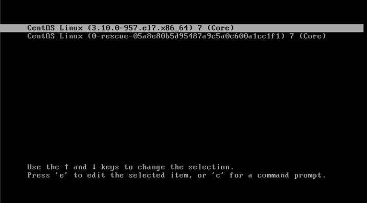
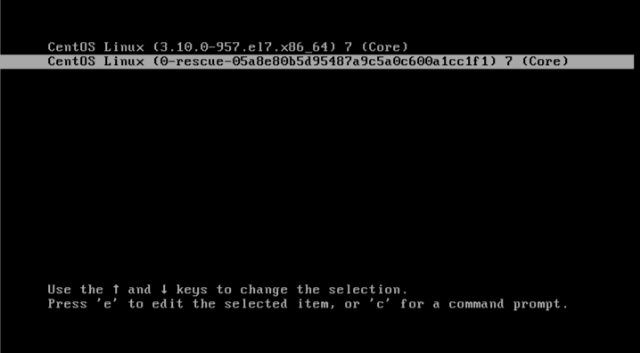
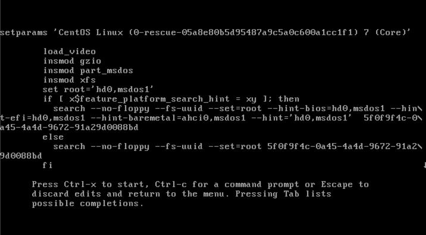
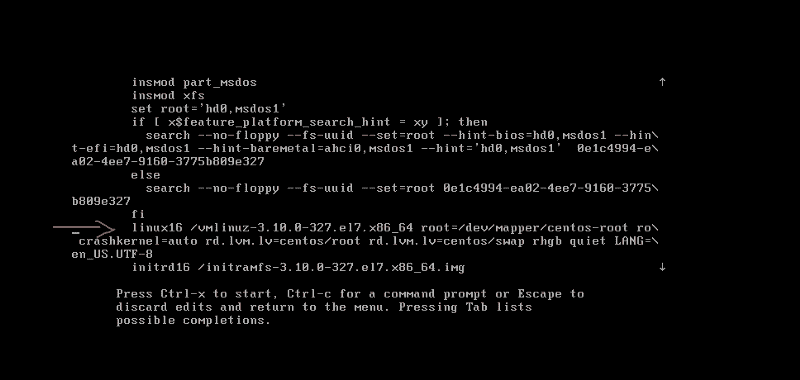
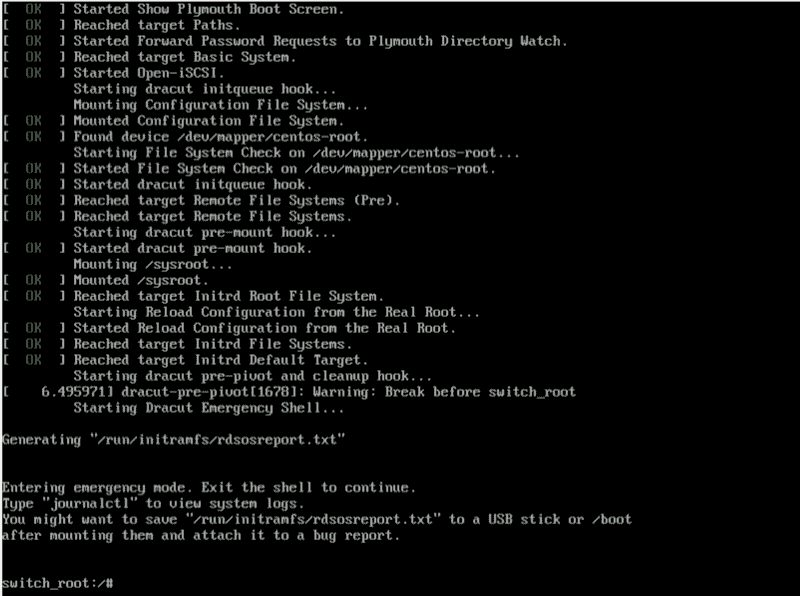
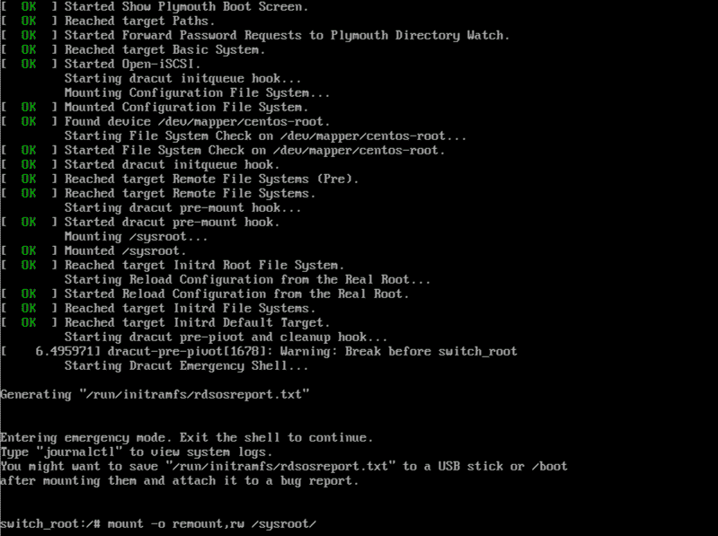
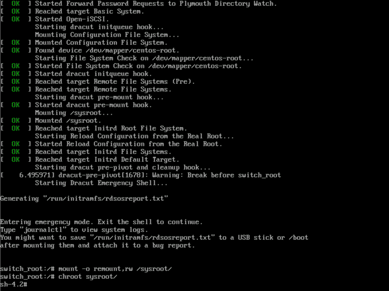
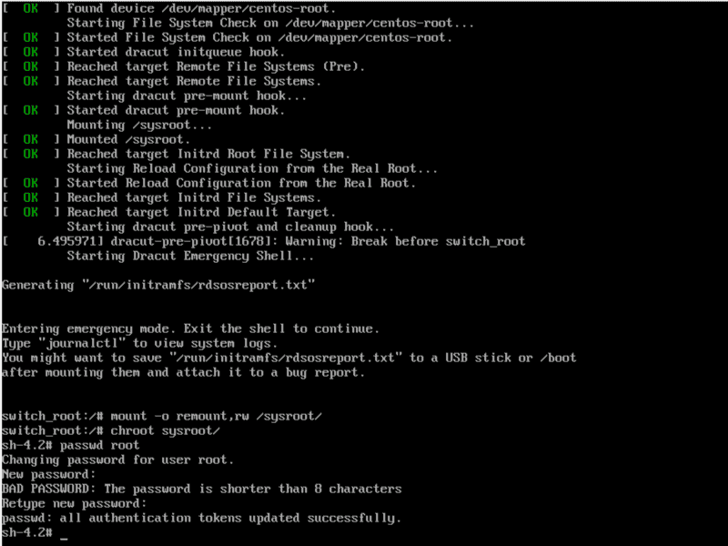
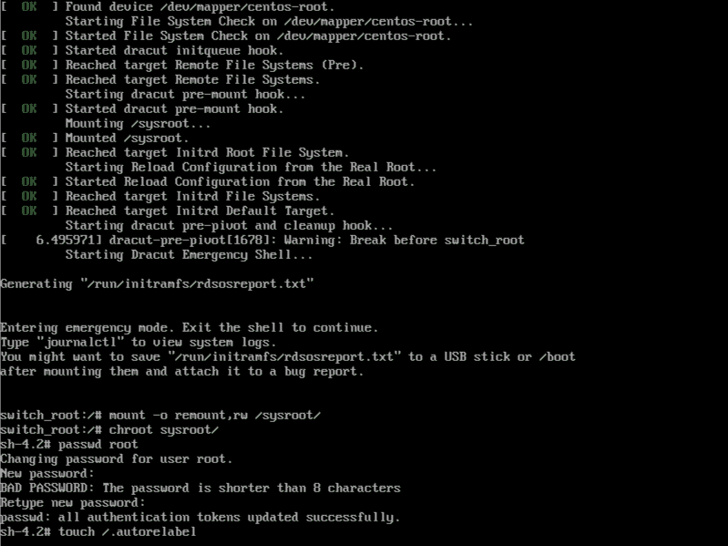
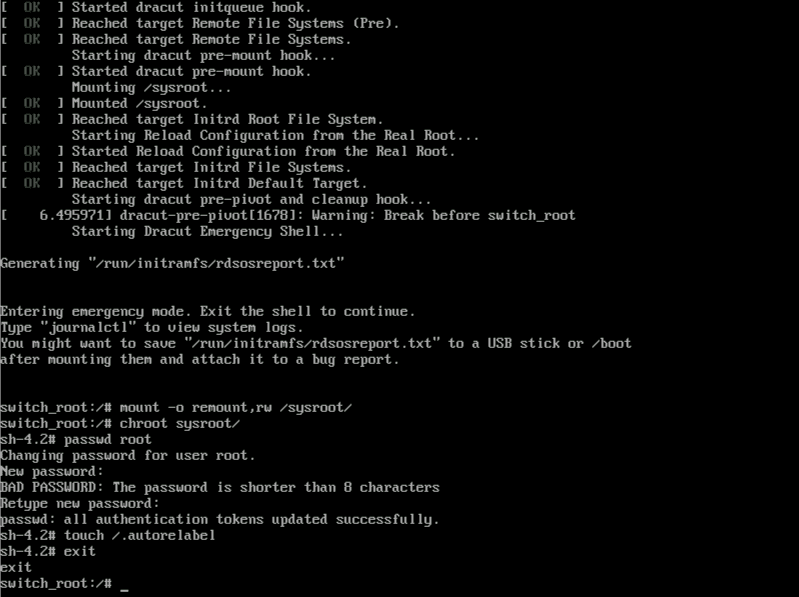

# 如何在 CentOS 中找回丢失的 root 密码

> 原文：<https://www.freecodecamp.org/news/how-to-recover-your-lost-root-password-in-centos/>

在 Linux 中，当您忘记您的帐户密码时，您可以使用 root 帐户轻松重置它。但是当你忘记了你的根帐户密码，那么你的情况就很糟糕了。

您不能使用常规用户帐户重设您的 root 帐户密码，因为用户帐户通常不能执行此类任务。

在本文中，我们将介绍如何恢复您的 CentOS root 密码。所以我们来看看怎么做。

## 如何恢复您的根密码-一步一步

在 CentOS 中，可以让从 initramfs 运行的脚本在某些时候调试 shell，提供一个根 shell，并在该 shell 存在时继续运行。

虽然这主要是为了调试，但也可以用来恢复丢失的 root 密码。

按照以下步骤恢复您丢失的 root 密码。

首先，重新启动系统。



按任意键中断引导加载程序倒计时。

将光标移动到需要引导的条目。



按“e”选择该条目。选择该条目后，将出现下面的内核命令。



在内核命令行中，将光标移动到以 linux16 开头的行。



按“结束”键将光标移动到它的末尾。键入“rd.break”(这将在控制权从 initramfs 移交给实际系统之前中断)。


然后按“Ctrl+x”保存这些更改。将出现 Initramfs 调试外壳。



接下来，我们必须通过键入以下命令向/sysroot 提供读写权限:

```
mount -o remount,rw /sysroot/
```



现在转到克鲁特监狱。

```
chroot /sysroot
```



在这里，/sysroot 被视为文件系统树的根。

接下来，您将设置一个新的 root 密码。

```
passwd root
```



并重新标记文件。

```
touch /.autorelabel
```



最后，键入“退出”两次。

第一个会从克鲁特监狱出来。



下一个将从 initramfs 调试 shell 中退出，并重新启动系统。


现在，您可以使用更新后的密码以 root 用户身份登录。

如果你有任何问题，请随时告诉我。你可以在 [Twitter](https://twitter.com/ThanoshanMV) 上联系我。

感谢您的阅读。

********快乐编码！********