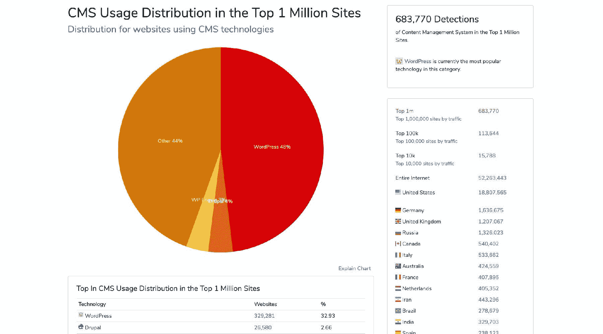
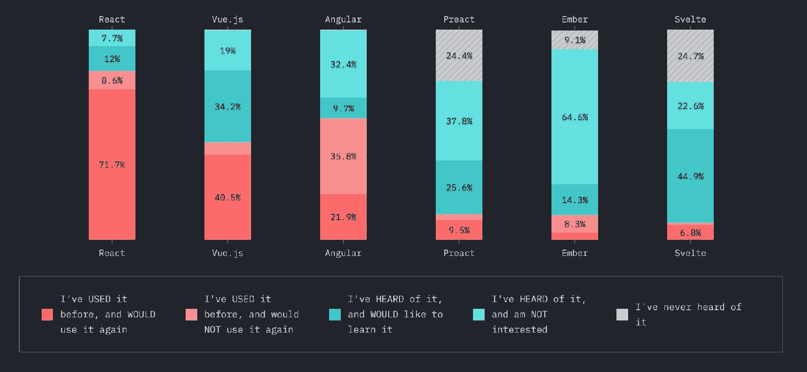
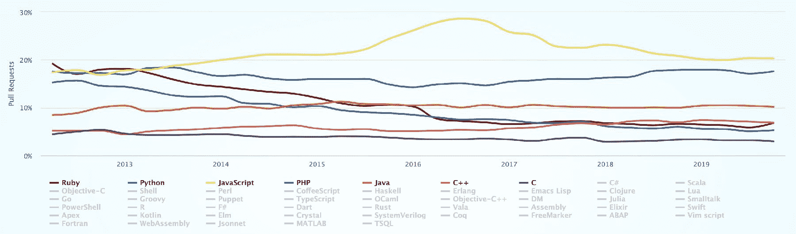
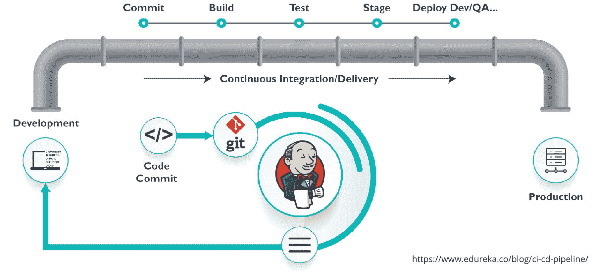
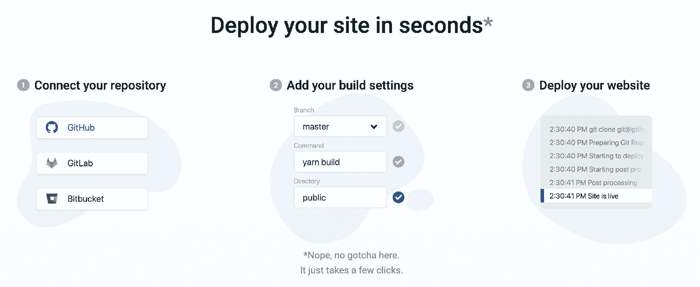

# 如何在 2020 年成为全栈 Web 开发者

> 原文：<https://www.freecodecamp.org/news/how-to-become-a-full-stack-web-developer-in-2020/>

全栈 web 开发人员是代码世界的瑞士军刀。拥有这一称号意味着您可以生产端到端的解决方案，这是一个非常适销对路和灵活的技能组合。但是，要达到那样的地位，到底需要什么呢？

无论您是新手、经验丰富的人员，还是某个领域的专家，这里都有很多东西需要消化。随意从顶部跳入水中，或者跳到你最需要支撑的地方。

*   [首先，什么才是真正的开发者？](#first-off-what-really-makes-a-developer-full-stack)
*   [在我们开始之前，让我们来谈谈这个焦点](#before-we-dive-in-let-s-talk-about-that-focus)
*   那么我们从哪里开始呢？
*   [前端](#front-end)
*   [后端](#back-end)
*   [DevOps 和云](#devops-and-the-cloud)
*   [设计呢？](#what-about-design)
*   [其他事情如果你刚刚开始](#other-things-if-you-re-just-getting-started)
*   [如果您想了解更多信息，请参考其他信息](#other-things-if-you-re-looking-for-more)

## 首先，什么才是真正的开发者？

说任何前端开发人员都是全栈开发人员很有趣，但是能够将一个网站部署到 T2 网络并不能让你成为全栈开发人员。

这并不意味着令人沮丧——只是现实地说，在你的下一次面试中，仅仅有这样的经历并不能很好地证明这个职位。当您从技术上从头到尾创建和部署您的工作时，Netlify、 [Zeit](https://zeit.co/) 和其他提供商通过他们的神奇工具为您提供了完成这项工作的能力，这些工具将大部分堆栈操作工作排除在外。

这并不影响我们作为前端开发人员现在能够完成的工作。编译和部署静态网站的趋势越来越强，这使得这个过程在栈的后半部分变得更加简单，带来了全面的好处。

此外，由于工具选项的灵活性，比如能够在服务器上运行 JS，我们的技能组合能够转移到比以往更多的用例中。

### 我们从哪里来

web 开发环境一直在快速变化。Wordpress 成为 CMS 之王已经有一段时间了，代表了超过三分之一使用 CMS 的网站，并帮助 PHP 获得了流行。但是其他人用的是自己开发的解决方案。

[https://trends.builtwith.com/cms](https://trends.builtwith.com/cms)

这些代表了更传统的网络堆栈，如 [LAMP](https://en.wikipedia.org/wiki/LAMP_(software_bundle)) 。在这些情况下，您的 web 服务器通常运行某种内容管理系统和服务器端语言(如 PHP ),它们将与数据库交互并生成最终交付给浏览器的代码。

最重要的是，你可以用 Javascript 制作一些交互特性，用 CSS 来管理页面的显示。现在，在某些情况下，对于某些网络主机来说，拥有一个托管的 Wordpress 服务器就足够了。但是其他更大的站点需要另一个团队来管理这些服务和部署管道，以便将代码发布到产品中。

### 我们在哪里，我们要去哪里

虽然 [Wordpress 还没有发展到任何地方](https://trends.builtwith.com/cms/WordPress)，但是[的无服务器](https://aws.amazon.com/serverless/)和[的 JAMstack](https://jamstack.org/) 架构正在形成势头。对于那些不熟悉的人来说，这个想法并不是真的没有服务器，而是更多地使用在云中为你管理的服务器。

像 AWS Lambda 这样的服务可以让你构建一个处理简单输入和输出的“函数”。将它连接到 [API 网关](https://aws.amazon.com/api-gateway/)上，您马上就有了一个可以与之交互的端点，而无需实际管理服务器。

其他的像 S3 让你把 HTML、CSS、JS、图片和任何其他静态资产转储到存储器中，并直接从那里为网站服务。服务器不处理任何东西，您只是将静态文件提供给客户端。

最棒的是开销少了很多，而且通常要便宜得多。在许多情况下，您还将获得巨大的性能提升，从 s3 服务一个站点将需要更少的处理来获得对浏览器的第一个[响应，这可以直接等同于改善用户体验。](https://developers.google.com/web/tools/lighthouse/audits/ttfb)

Thumbs up to a good user experience!

这并不是要把你推向 JAMstack，而是要表明全栈范式正在转变，这是值得关注的事情。对于工作中的差异，仍然有一种传统的感觉，但它变得有点不同了。

DevOps 团队现在管理云资源并进行部署。后端开发人员现在构建 API 和代码，使用 lambda 函数等工具与服务进行交互。前端开发人员主要从事 Javascript 构建 [React](https://reactjs.org/) 或 [Vue](https://vuejs.org/) 应用程序，这些应用程序延伸到后端开发人员创建的服务。可以说，这可能包括也可能不包括 CSS 之类的东西，但这是另一个关于作品“正式”归入什么标题的问题(剧透:取决于团队)。

尽管职责仍有分歧，但界限正在变得模糊，分散你的注意力变得更容易管理。

## 在我们开始之前，让我们来谈谈这个焦点

很容易让人想一头扎进去，涵盖一个全栈开发人员的全部领域，但是关于聚焦还是有一些要说的。这就是“[万事通，无所不能](https://en.wikipedia.org/wiki/Jack_of_all_trades,_master_of_none)”这句话的基础，在这句话中，你试图从全部筹码中的每一部分学到一点点，但永远不会真正掌握任何东西。

作为一名新的开发人员，当开始尝试建立自己的优势时，这可能是危险的。所以，试着评估你是哪种类型的学习者，把你的注意力放在重要的地方。如果你正在为一个分散的课程而努力，那可能不一定能帮你获得你想要的第一份工作或梦想工作的经验。

例如，一种新颖的方法可能是有一个单独的重点，但围绕该优势建立完整的堆栈技能。这可能是一个前端开发人员，他们可以部署自己的 web 应用程序，并继续在基础知识的基础上进行构建。

最重要的是，作为一个全栈开发人员，不一定能够说你知道 x、y 和 z 语言。理解代码和软件设计概念，并且能够处理手边的任何挑战，这是成为一名优秀开发人员的关键。

底线是，试着找出什么对你最好，不要让你的雄心壮志阻碍你掌握自己的旅程。

Mr. Miyagi approves

## 那么我们从哪里开始呢？

出于本文的目的，我们将继续使用传统的断点来分解堆栈(前端、后端等)。).虽然有些人说这不再是一件真正的事情，但实际上，全栈开发人员每天都有大量的工作，他们指的是传统的断点。“全栈开发者”肯定不会去任何地方。

就堆栈而言，我们将依赖无服务器/ JAMstack 架构，因为它将继续增长。如果你学会了它们，你只会因为周围涌现的大量工作而变得更有市场。

Boomshakalaka!

正如您将在下面注意到的，这并不意味着包含所有类型的数据库和所有类型的渲染解决方案。一个优秀的开发人员应该能够灵活地使用他们的工具，理解他们工作的概念，而不是一根筋，只能在一个框架中工作。

虽然你可能在 React 工作，并且对目前的工作感到满意(没关系！)，你的下一份工作可能会充满 Vue 或“惊喜！”你的团队领导想用[苗条](https://svelte.dev/)的方式重写应用程序。试着理解你为什么首先使用 UI 框架，以及它如何帮助你解决手头的问题。

现在让我们开始吧...

## 前端

网站或应用程序的前端通常是用户界面，用户可以与它进行交互。游戏中最大的语言玩家是 Javascript，其中你通常会依赖于诸如 React 或 Vue 之类的 UI 库来管理项目的组件。

使用这些 UI 框架将允许您创建“组件”，本质上是代码块，这些代码块最终将生成 HTML，能够与您的代码一起创建交互和动态状态。这变得非常强大，虽然开始时可能会有一点弯曲，但一旦掌握了窍门，工作起来会变得非常愉快。

无论是该领域的新手还是经验丰富的人，您最终都可能会遇到 jQuery。虽然它有自己的优点，并且很好地服务于社区，但是 Javascript 的原生特性确实增长了，并且对 jQuery 能够提供的功能产生了更少的需求。现在开发人员依赖 UI 框架和原生 Javascript。

所以理解 jQuery 是什么很好，但是我不建议在这一点上花时间去学习它。好的一面是，如果你找到了一份使用它的工作，你可以和 jQuery 一起编写原生 Javascript，所以学习普通 Javascript 本身就是正确的答案。

### 那么我应该学些什么呢？

如果你真的是初学者，花时间学习基本的 HTML 和 CSS。这可能没有深入研究 Javascript 有趣和有吸引力，但是[建立在网络的基础之上](https://www.freecodecamp.org/news/put-down-the-javascript-learn-html-css/)将是正确起步的关键。

接下来，学习 Javascript。在可预见的未来，它仍将是王者。Javascript 将为您构建的任何框架或库提供基础，因此了解语言本身是如何工作的将有助于推动您完成学习前端的旅程。

当您试图理解不同模式的一些复杂性以及您将使用的框架背后的[概念时，这也将使您的生活变得更加容易。](https://reactjs.org/docs/getting-started.html#javascript-resources)

说到框架，React 和 Vue 可能是最受欢迎的候选。React 是其中最受欢迎的，并将继续增长。它的团队一直在努力使框架成熟，并开发出有助于构建现代、快速的网络应用的 API。

[2019 State of JS Frameworks](https://2019.stateofjs.com/front-end-frameworks/#front_end_frameworks_section_overview)

开始使用 [Create React App](https://github.com/facebook/create-react-app) 或 [Gatsby](https://www.gatsbyjs.org/) 甚至可以帮助你轻松启动 React App，并立即进入可以修改代码的状态。

虽然调用 CSS 预处理器和 Sass 之类的工具会有好处，但是现在有大量的 CSS 解决方案，包括 [CSS-in-JS](https://cssinjs.org/) 。

虽然将 CSS 放在 JS 中有一些优点和缺点，但不一定值得指出使用什么作为特定的方向，因为这真的取决于团队。

理解 CSS 的基础和功能，以及如何以普通形式使用它，将有助于你为使用它做好准备，不管是什么框架。

### 资源

*   freecodecamp.org 响应式网页设计认证[https://www.freecodecamp.org/learn](https://www.freecodecamp.org/learn)
*   「放下 Javascript:先学 HTML & CSS」[https://www . freecodecamp . org/news/Put-Down-the-Javascript-Learn-HTML-CSS/](https://www.freecodecamp.org/news/put-down-the-javascript-learn-html-css/)
*   MDN Javascript 简介[https://developer . Mozilla . org/en-US/docs/Web/Javascript/A _ re-introduction _ to _ Javascript](https://developer.mozilla.org/en-US/docs/Web/JavaScript/A_re-introduction_to_JavaScript)
*   只是 Javascript 电子邮件课程[https://justjavascript.com/](https://justjavascript.com/)
*   JSRobot 学习游戏[https://lab.reaal.me/jsrobot/](https://lab.reaal.me/jsrobot/)
*   reactjs.org 介绍反应[https://reactjs.org/tutorial/tutorial.html](https://reactjs.org/tutorial/tutorial.html)
*   gatsbyjs.org 教程[https://www.gatsbyjs.org/tutorial/](https://www.gatsbyjs.org/tutorial/)

## 后端

在 JAMstack 世界中，后端通常指的是我们的前端通过与来自客户端的端点交互来创建动态体验的 API(就像那些在[CRUD](https://en.wikipedia.org/wiki/Create,_read,_update_and_delete)API 中的 API)。如果能够从客户端发出这些请求，就不需要在将页面提供给浏览器之前进行任何处理。

虽然您不应该觉得只能用一种语言编写代码，但是能够用 Javascript 编写代码在这里提供了一个很好的优势，因为您可以成长为用熟悉的语言处理后端事物的基础(反之亦然)。

[NodeJS](https://nodejs.org/en/) 是一个公共运行时，你可以在大多数云环境中找到它的选项，它会给你类似于你在浏览器中所期望的体验。主要的区别是你不能访问某些浏览器 API，也没有一个`window`对象和与之相关的 API。

也就是说，Python 也是另一种流行语言，并且正在增长，特别是考虑到它在数据科学和工程社区的流行。PHP 和 Ruby 虽然都是有效的，并且会在就业市场上给你提供选择，但它们似乎没有 Javascript 和 Python 那么受欢迎，总体上也没有 Javascript 和 Python 那么有上升趋势[。](https://madnight.github.io/githut/)

[Popular languages on Github](https://madnight.github.io/githut/#/pull_requests/2019/4)

使用您选择的语言，您的最佳选择将是学习如何创建您的应用程序可以与之交互的云服务。

无论是在 AWS、Netlify 还是任何其他云提供商中，创建一个简单的 lambda 供您使用，这将为您提供在现场工作时可能会遇到的良好体验。

即使你在工作中没有直接使用 lambda 进行开发，你也可以开始熟悉后端工作的基本概念。最终，您将使用这些函数来连接其他服务和数据库，以创建您自己的动态服务。

### 那么我应该学些什么呢？

如果你已经开始从前端学习 Javascript，那么继续使用 Javascript 作为后端。使用 [Netlify 函数](https://docs.netlify.com/functions/overview/)构建一个 lambda，其中你只需要关注代码，Netlify 会处理剩下的事情(比如实际构建和部署你的函数)。

使用您选择的语言和第一个函数，尝试开始使用代码中的其他服务，以获得使用第三方 API 的经验。

也许可以构建一个端点，它可以使用 [Twitter API](https://developer.twitter.com/en/docs) 发送一条 tweet (但不要滥用它)。学习如何创建一个数据库，并设置您的函数以 CRUD 模式与它交互，这将为您提供一个典型应用程序如何与后端交互的更真实的用例。

您的目标应该是创建服务，您的前端将通过端点与之交互，为使用您的应用程序的人执行操作。好消息是，考虑到云的发展势头，你将有大量的选项，以及[免费选项](https://aws.amazon.com/free/)或层，可以开始玩了。

### 资源

*   【超级简单开始到无服务器】[https://kentcdodds . com/blog/超级简单开始到无服务器](https://kentcdodds.com/blog/super-simple-start-to-serverless)
*   “使用 Netlify 函数构建无服务器 CRUD 应用程序& faun ADB”[https://www . Netlify . com/blog/2018/07/09/Building-server less-CRUD-apps-with-Netlify-Functions-faun ADB/](https://www.netlify.com/blog/2018/07/09/building-serverless-crud-apps-with-netlify-functions-faunadb/)

## DevOps 和云

DevOps 源于这样一种需求，即能够创建解决方案来平滑和加速从编写代码的人那里获取代码的过程，使其进入部署状态。

这项工作的职责范围从很多到很少，无论是为定制解决方案编写 bash 脚本，还是编写一个 [CloudFormation](https://aws.amazon.com/cloudformation/) 模板来创建应用程序运行所需的所有资源。

您通常会发现这是自动化构建和部署流程的 [CI/CD](https://en.wikipedia.org/wiki/CI/CD) 工作流的一部分。

CI / CD Pipeline

而且这是不断变化的！鉴于无服务器的繁荣，[无服务器框架](https://serverless.com/)出现了，它以一种更简单的方式为你管理这一切，这甚至导致 AWS 创建他们自己的解决方案 [SAM](https://aws.amazon.com/serverless/sam/) 。像 [Jenkins](https://jenkins.io/) 这样的工具已经出现了一段时间，但是现在你会看到 [Github](https://github.com/features/actions) 、 [Gitlab](https://about.gitlab.com/product/continuous-integration/) 以及其他源代码控制提供者提供了他们自己的解决方案和工具，比如 [CircleCI](https://circleci.com/) 可以直接与你的项目挂钩。

它也还不完善——编写 CloudFormation 模板令人望而生畏。编写自动化脚本也不是最有趣的，尽管当它工作的时候会非常有价值！

但这正在变得更好，这正是 Netlify 和 Zeit 这样的产品适合的地方。虽然它们更多地源于静态托管方面，即你编译你的应用程序并将其转储到存储中，但它们的产品越来越多，如 [Netlify 的功能](https://www.netlify.com/products/functions/)实际上只是 AWS Lambdas，更容易设置和部署到一个全功能的端点(这真的超级容易)。

### 那么我应该学些什么呢？

如果这是你第一次设置这种东西，从 Netlify 开始。在 Github 存储库中设置一个 React 应用程序，甚至只是一个简单的 HTML 文件，将它连接到一个新的 Netlify 帐户，然后观察它的部署。

Easy spinup with [Netlify](https://www.netlify.com/)

从那里，或者如果你已经有了一点经验，开始对幕后发生的事情感到好奇。Netlify 可能会获取您的代码，在虚拟环境中运行您设置的命令(如`yarn build`),像 S3 一样将内置文件转储到存储中，并像 CloudFront 一样在它的前面放置 CDN，以便从一个端点提供服务。

首先尝试在您的计算机上使用 AWS 控制台及其 CLI 手动完成，然后编写一个脚本来自动完成将 Circle CI 集成到您的 Github 项目中的整个过程，而不是使用 Netlify 来将它实际部署到 AWS。

更上一层楼的是，这将包括提升您的后端可能会与之交互的服务。您有服务使用的数据库吗？您可以使用 CloudFormation 或 bash 脚本自动运行数据库。

将您的基础设施视为具有可处置的、容易重新创建的资源的代码，将有助于您和您的项目变得更加灵活，并且在出现故障时具有更好的恢复能力。

这适用于任何云或 CI / CD 提供商，而不仅仅是 AWS 和 Circle CI。选择您最喜欢的云和工作流工具，并使用它运行。重点是，开始查看您的项目需求，并深入了解堆栈的自动化部分实际发生了什么。这将有助于您了解更多信息，并更好地满足项目需求。

### 资源

*   《逐步指南:在 netlify 上部署》[https://www . Netlify . com/blog/2016/09/29/A-逐步指南-在 Netlify 上部署/](https://www.netlify.com/blog/2016/09/29/a-step-by-step-guide-deploying-on-netlify/)
*   「设置静态网站」[https://docs . AWS . Amazon . com/Amazon S3/latest/dev/hosting websiteons 3 setup . html](https://docs.aws.amazon.com/AmazonS3/latest/dev/HostingWebsiteOnS3Setup.html)
*   《AWS 认证云从业者培训 2019-4 小时免费视频课程》[https://www . freecodecamp . org/news/AWS-Certified-Cloud-从业者-培训-2019-免费-视频-课程/](https://www.freecodecamp.org/news/aws-certified-cloud-practitioner-training-2019-free-video-course/)
*   参见上面前端的 Javascript 资源

## 设计呢？

是的，你应该了解设计基础。不，你不需要成为一名设计师。

作为一名开发人员，设计有很多方面可以提升你的能力。虽然我们都知道视觉和 UX 设计师创造奇迹，但有一个基本的理解可以防止你的应用程序成为一个巨大的失望。

Fictional Pied Piper's app tanked because of a bad user experience

开发过程中的每个人都在朝着一个目标努力，这个目标会以这样或那样的方式影响最终用户。能够理解您的工作试图解决什么需求，以及这如何影响用户，将有助于团队作为一个整体开发一个更全面的最终解决方案。

考虑一个后端开发人员创建一个 API，允许某人管理应用程序中的用户。API 的要求非常简单，只包括用户名。对于大多数人来说，提供一个“姓名”字段而不是“名字”和“姓氏”可能不是最直观的解决方案。但这可能是一个疏忽，使前端开发人员在 UI 中公开它的方式变得复杂，这将使开发人员很难显示它，或者使最终用户很难使用它。

最重要的是，设计可以直接影响转化率。如果你正在建设电子商务空间，拥有一个看起来不像按钮的按钮可以阻止人们将产品添加到他们的购物车中。当然，这将防止购买，这是收入损失。理解如何使 UI 人性化，即使是在基本的意义上，也可以让你的项目赚更多的钱，或者只是帮助别人更容易地使用它。

更重要的是，你希望你的网站是可访问的。许多人有不同的需求，无论他们看不到相同的颜色还是听不到你的应用程序发出的声音，你都希望认识到其他人的需求，并尝试以一种让每个人都可以使用你的应用程序的方式进行设计。

### 那么我应该学些什么呢？

虽然我不期望你为此修一门完整的课程，但是试着保持认知和好奇。也许下次不要跳过你在[免费代码营推特](https://twitter.com/freecodecamp)上看到的那篇[设计文章](https://www.freecodecamp.org/news/tag/design/)。

在创建解决方案时，试着想象你的作品会被如何使用。你团队中的其他开发人员需要从你的 API 中得到什么？使用你的应用程序的人会从你的界面中得到什么？

你也可以试着从别人在你空间里做的事情中获得灵感。当一个应用程序提供类似的功能时，你期望它是什么样子的？这不是复制或窃取的许可，但是您应该理解他们的解决方案正在解决的需求。考虑一下为什么他们的“添加到购物车”按钮如此之大，为什么他们给用户放大产品照片的能力，或者你如何让一个表格设计稍微更有用。

["table" product design on Dribbble](https://dribbble.com/search/shots/popular/product-design?q=table)

至于可访问性，尝试学习基础知识。有越来越多的资源可以帮助你了解他人的需求。尝试了解有哪些障碍，以及它们可能如何影响您的应用程序的使用。也许可以看看如何解决这些问题的一些常见模式。

通常情况下，合并并不太难，如果你从一开始就养成了这样做的习惯，你甚至不会在下次构建应用程序时考虑它。

### 资源

*   为开发者设计[https://thoughtbot.com/upcase/design-for-developers](https://thoughtbot.com/upcase/design-for-developers)
*   黑客设计[https://hackdesign.org](https://hackdesign.org)
*   为黑客设计[https://designforhackers.com/](https://designforhackers.com/)
*   网络无障碍简介[https://webaim.org/intro/](https://webaim.org/intro/)

## 其他事情，如果你刚刚开始

这篇文章的大部分假设你已经有了一些基础知识，比如理解什么是 [git](https://en.wikipedia.org/wiki/Git) 和源代码控制，或者简单地设置你的代码编辑器。如果你真的刚刚开始，你至少要对这些概念有一个简单的理解，因为没有它们会很快变得更有挑战性。

关于学习如何使用你的终端也有一些要说的。如果您是新手，不使用 GUI 可能会让人不知所措，但是一旦您开始使用，您会很快发现使用终端会更有效率，而且许多项目无论如何都需要使用终端。

### 那么我应该学些什么呢？

首先，设置好代码编辑器。Visual Studio 代码现在风靡一时，但是根据你的喜好，也有其他的可以很好地为你服务，比如 [Atom](https://atom.io/) 或者 [Sublime Text](https://www.sublimetext.com/) 。你甚至会发现像 [Repl.it](https://repl.it/) 这样的基于云的 ide，或者你可以通过在 [CodePen](https://codepen.io/) 或 [JSFiddle](https://jsfiddle.net/) 中玩一玩，以较低的门槛开始。

Visual Studio Code is so hot right now

无论哪种方式，一旦你准备好开始编码，你想要理解什么是源代码控制，git 现在是最大的玩家。Git 是一个强大的工具，可以让您跟踪代码的变更，并提高与其他开发人员的协作效率。

您将希望熟悉 git 的一些基本命令，比如添加新的更改，以及什么是分支以及如何使用它们。Git 是一个巨大的世界，你不需要马上掌握它，你会很快发现在你掌握 git 的过程中有无穷无尽的新东西要学。

对于你将要使用的许多工具，有像 [GitKraken](https://www.gitkraken.com/) 这样的图形用户界面，但是你能做的事情仍然会受到一些限制。了解你机器上的默认终端或下载其他选项，如 [iterm2](https://iterm2.com/) (我的偏好)或 [Xterm.js](https://xtermjs.org/) 将是你最好的选择。额外收获:每次使用它，你都会觉得自己像个电影黑客(还是只有我这样？).

Hugh Jackman hacking in Swordfish

### 资源

*   Visual Studio 代码入门[https://www.codecademy.com/articles/visual-studio-code](https://www.codecademy.com/articles/visual-studio-code)
*   Github 的 Git 资源[https://try.github.io/](https://try.github.io/)
*   通过分支游戏学习 git[https://learngitbranching.js.org/](https://learngitbranching.js.org/)
*   Mac 命令行简介[https://blog . teamtreehouse . com/Mac-OS-x 命令行简介](https://blog.teamtreehouse.com/introduction-to-the-mac-os-x-command-line)

## 其他东西，如果你想要更多

有这么多你可以快速进入兔子洞的东西。记住不要分散注意力，尽量不要压倒自己。但是，如果你对自己的现状感觉很好，有一些其他的概念只会在你应对现实世界中的挑战时有所帮助。

### [测试](https://en.wikipedia.org/wiki/Software_testing)和不同的方法

编写代码是一回事，但能够建立有效的测试将有助于强化您的代码，并防止错误出现。当网站关闭时，你不想浪费你未来的时间，甚至不想花费你产品的钱。学习如何编写测试和不同的方法对于巩固你的代码是很重要的。

### 浏览器工具，如 [Chrome DevTools](https://developers.google.com/web/tools/chrome-devtools)

在我看来，调试时最强大的工具之一就是能够在浏览器中调试应用程序。

无论是查看 DOM 是如何呈现的，[处理 CSS](https://developers.google.com/web/tools/chrome-devtools/inspect-styles/edit-styles) ，还是调试网络请求，您都将很快学会如何节省时间，并更容易地识别错误来自哪里。

### [HTTP](https://developers.google.com/web/fundamentals/performance/http2) 以及如何调试[网络面板中的请求](https://developers.google.com/web/tools/chrome-devtools/network)

鉴于 web 是基于 internet 的，您的应用程序最终会向其他服务器发出请求。当这种情况发生时，理解请求阻塞点或者简单地理解请求是如何产生的，可以帮助您理解为什么您的应用程序看起来滞后或者为什么您的保存按钮不起作用。

对请求如何工作以及如何可视化它们以进行调试有一个基本的理解将会对你的旅程有很大的帮助。

### 开源软件和软件包管理器

这与其说是一种需要学习的技能或工具，不如说是一种软件分发的方式。当你开始构建代码解决方案时，你会发现我们很多人都依赖开源包。如果你正在写 Javascript，大部分时间都是通过 [npm](https://www.npmjs.com/) 完成的，这有助于我们变得更有效率，而不必每次都重新发明轮子。

花一些时间去理解开源的概念，甚至考虑通过为你喜欢的项目做贡献来回报。伸出援手通常会非常受欢迎，会帮助你获得经验，你甚至可以在第一次批准的拉请求中获得一些[免费赠品！在那里要尊重，在请求的另一边也有一个真实的人。](https://www.gatsbyjs.org/contributing/contributor-swag/)

## 还有什么？

这个清单可以一直列下去，因为编码世界有太多的东西。在一个人成为开发大师的旅程中，你认为还有什么是重要的？如果你认为我错过了什么重要的东西，给我发一条 [tweet 或 DM](https://twitter.com/colbyfayock) ！

## 你着火了！齐心协力

鉴于你已经积累了上述所有的经验，你应该能够自己从头到尾创建一个完整的应用程序。你知道你拥有的力量吗？

Thanos squeezing the gauntlet

这就是乐趣的开始。尝试创建一个新的应用程序——不管是什么，只要做点什么就行。为了学习，你能做的最好的事情就是通过实践获得经验。不管它是你将找到的百万 todo 教程中的一个，还是通过建立像 Instagram 的[创建者那样的最大的社交网络之一来自学编码。](https://thenextweb.com/2012/04/10/instagrams-ceo-had-no-formal-programming-training-hes-a-marketer-who-learned-to-code-by-night/)

从这里，您应该能够创建:

*   在浏览器中运行的 web 应用程序前端
*   web 应用程序可以通过端点向其发出请求的后端服务
*   编写一个脚本，插入到 CI / CD 工具中，以自动化您的构建和部署过程
*   额外收获:对你的界面外观做出好的决定，这样人们才能真正使用它！

向前去建造吧！[使用#codejourney 标签在 Twitter 上与我们分享您的开发历程](https://twitter.com/intent/tweet?text=My%20%23codejourney%20started%20with...%0A%0AHow%20to%20Become%20a%20Full%20Stack%20Web%20Developer%20in%20a%20JAMstack%202020%0A@colbyfayock%20@freecodecamp%0Ahttps%3A%2F%2Fwww.freecodecamp.org%2Fnews%2Fhow-to-become-a-full-stack-web-developer-in-2020)。我们希望听到更多关于您去过哪些地方、建造了哪些建筑，或者您要去哪些地方、想要建造哪些建筑的信息。

*   [？在 Twitter 上关注我](https://twitter.com/colbyfayock)
*   [？️订阅我的 Youtube](https://youtube.com/colbyfayock)
*   [✉️注册我的简讯](https://www.colbyfayock.com/newsletter/)